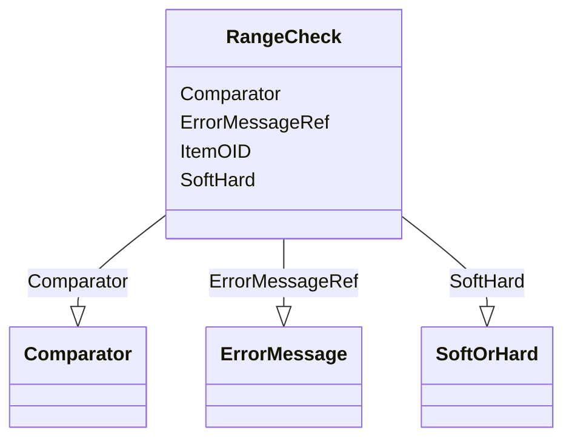

# Class: RangeCheck


URI: [odm:RangeCheck](http://www.cdisc.org/ns/odm/v2.0/RangeCheck)





<!-- no inheritance hierarchy -->


## Slots

| Name | Cardinality and Range | Description | Inheritance |
| ---  | --- | --- | --- |
| [Comparator](Comparator.md) | 0..1 <br/> [Comparator](Comparator.md) |  | direct |
| [SoftHard](SoftHard.md) | 0..1 <br/> [SoftOrHard](SoftOrHard.md) |  | direct |
| [ItemOID](ItemOID.md) | 0..1 <br/> [Oidref](Oidref.md) |  | direct |
| [ErrorMessageRef](ErrorMessageRef.md) | 0..1 <br/> [ErrorMessage](ErrorMessage.md) |  | direct |


## Usages

| used by | used in | type | used |
| ---  | --- | --- | --- |
| [WhereClauseDef](WhereClauseDef.md) | [RangeCheckRef](RangeCheckRef.md) | range | [RangeCheck](RangeCheck.md) |
| [ItemDef](ItemDef.md) | [RangeCheckRef](RangeCheckRef.md) | range | [RangeCheck](RangeCheck.md) |


## Identifier and Mapping Information


### Schema Source


* from schema: http://www.cdisc.org/ns/odm/v2.0


## Mappings

| Mapping Type | Mapped Value |
| ---  | ---  |
| self | odm:RangeCheck |
| native | odm:RangeCheck |


## LinkML Source

<!-- TODO: investigate https://stackoverflow.com/questions/37606292/how-to-create-tabbed-code-blocks-in-mkdocs-or-sphinx -->

### Direct

<details>
```yaml
name: RangeCheck
from_schema: http://www.cdisc.org/ns/odm/v2.0
slots:
- Comparator
- SoftHard
- ItemOID
- ErrorMessageRef
slot_usage:
  Comparator:
    name: Comparator
    domain_of:
    - RangeCheck
    range: Comparator
    required: false
  SoftHard:
    name: SoftHard
    domain_of:
    - RangeCheck
    range: SoftOrHard
    required: false
  ItemOID:
    name: ItemOID
    domain_of:
    - SourceItem
    - RangeCheck
    - ItemData
    - KeySet
    - ItemRef
    range: oidref
    required: false
  ErrorMessageRef:
    name: ErrorMessageRef
    domain_of:
    - RangeCheck
    range: ErrorMessage
    required: false
    minimum_cardinality: 0
    maximum_cardinality: 1
class_uri: odm:RangeCheck

```
</details>

### Induced

<details>
```yaml
name: RangeCheck
from_schema: http://www.cdisc.org/ns/odm/v2.0
slot_usage:
  Comparator:
    name: Comparator
    domain_of:
    - RangeCheck
    range: Comparator
    required: false
  SoftHard:
    name: SoftHard
    domain_of:
    - RangeCheck
    range: SoftOrHard
    required: false
  ItemOID:
    name: ItemOID
    domain_of:
    - SourceItem
    - RangeCheck
    - ItemData
    - KeySet
    - ItemRef
    range: oidref
    required: false
  ErrorMessageRef:
    name: ErrorMessageRef
    domain_of:
    - RangeCheck
    range: ErrorMessage
    required: false
    minimum_cardinality: 0
    maximum_cardinality: 1
attributes:
  Comparator:
    name: Comparator
    from_schema: http://www.cdisc.org/ns/odm/v2.0
    rank: 1000
    alias: Comparator
    owner: RangeCheck
    domain_of:
    - RangeCheck
    range: Comparator
    required: false
  SoftHard:
    name: SoftHard
    from_schema: http://www.cdisc.org/ns/odm/v2.0
    rank: 1000
    alias: SoftHard
    owner: RangeCheck
    domain_of:
    - RangeCheck
    range: SoftOrHard
    required: false
  ItemOID:
    name: ItemOID
    from_schema: http://www.cdisc.org/ns/odm/v2.0
    rank: 1000
    alias: ItemOID
    owner: RangeCheck
    domain_of:
    - SourceItem
    - RangeCheck
    - ItemData
    - KeySet
    - ItemRef
    range: oidref
    required: false
  ErrorMessageRef:
    name: ErrorMessageRef
    from_schema: http://www.cdisc.org/ns/odm/v2.0
    rank: 1000
    alias: ErrorMessageRef
    owner: RangeCheck
    domain_of:
    - RangeCheck
    range: ErrorMessage
    required: false
    minimum_cardinality: 0
    maximum_cardinality: 1
class_uri: odm:RangeCheck

```
</details>