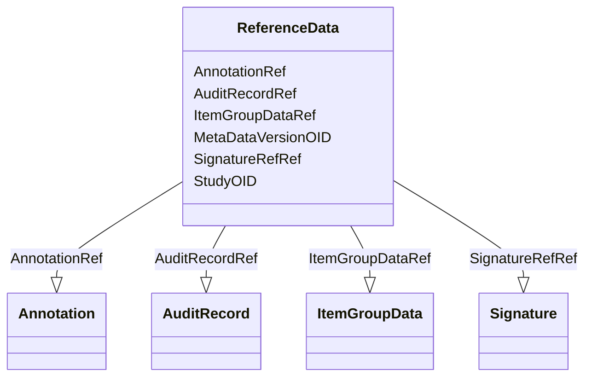

# Class: ReferenceData


_Reference data provides information on how to interpret clinical data. For example, reference data might include lab normal ranges. For a study that uses CDISC standards, reference data might include SDTM Trial Design datasets._


URI: [odm:ReferenceData](http://www.cdisc.org/ns/odm/v2.0/ReferenceData)





<!-- no inheritance hierarchy -->


## Slots

| Name | Cardinality and Range | Description | Inheritance |
| ---  | --- | --- | --- |
| [StudyOID](StudyOID.md) | 1..1 <br/> [Oidref](Oidref.md) | References the Study that defines the metadata for this reference data | direct |
| [MetaDataVersionOID](MetaDataVersionOID.md) | 1..1 <br/> [Oidref](Oidref.md) | References the MetaDataVersion (within the above Study) for this reference da... | direct |
| [ItemGroupDataRef](ItemGroupDataRef.md) | 0..* <br/> [ItemGroupData](ItemGroupData.md) |  | direct |
| [AuditRecordRef](AuditRecordRef.md) | 0..1 <br/> [AuditRecord](AuditRecord.md) |  | direct |
| [SignatureRefRef](SignatureRefRef.md) | 0..1 <br/> [Signature](Signature.md) |  | direct |
| [AnnotationRef](AnnotationRef.md) | 0..1 <br/> [Annotation](Annotation.md) |  | direct |


## Usages

| used by | used in | type | used |
| ---  | --- | --- | --- |
| [ODMFileMetadata](ODMFileMetadata.md) | [ReferenceDataRef](ReferenceDataRef.md) | range | [ReferenceData](ReferenceData.md) |


## See Also

* [https://wiki.cdisc.org/display/ODM2/ReferenceData](https://wiki.cdisc.org/display/ODM2/ReferenceData)

## Identifier and Mapping Information


### Schema Source


* from schema: http://www.cdisc.org/ns/odm/v2.0


## Mappings

| Mapping Type | Mapped Value |
| ---  | ---  |
| self | odm:ReferenceData |
| native | odm:ReferenceData |


## LinkML Source

<!-- TODO: investigate https://stackoverflow.com/questions/37606292/how-to-create-tabbed-code-blocks-in-mkdocs-or-sphinx -->

### Direct

<details>
```yaml
name: ReferenceData
description: Reference data provides information on how to interpret clinical data.
  For example, reference data might include lab normal ranges. For a study that uses
  CDISC standards, reference data might include SDTM Trial Design datasets.
from_schema: http://www.cdisc.org/ns/odm/v2.0
see_also:
- https://wiki.cdisc.org/display/ODM2/ReferenceData
slots:
- StudyOID
- MetaDataVersionOID
- ItemGroupDataRef
- AuditRecordRef
- SignatureRefRef
- AnnotationRef
slot_usage:
  StudyOID:
    name: StudyOID
    description: References the Study that defines the metadata for this reference
      data.
    comments:
    - 'Required

      range:oidref

      Must match the OID of a Study element with a MetaDataVersion OID attribute that
      matches the MetaDataVersionOID.'
    domain_of:
    - Include
    - SourceItem
    - AdminData
    - MetaDataVersionRef
    - ReferenceData
    - ClinicalData
    - Association
    - KeySet
    range: oidref
    required: true
  MetaDataVersionOID:
    name: MetaDataVersionOID
    description: References the MetaDataVersion (within the above Study) for this
      reference data. All metadata references (OIDs) occurring within this ReferenceData
      element refer to definitions within the selected metadata version. Signature
      elements nested within ReferenceData have no meaning, and should be ignored.
      The TransactionType attribute behaves the same within ReferenceData as it does
      within ClinicalData.
    comments:
    - 'Required

      range:oidref

      Must match the OID of a MetaDataVersion within a Study element with an OID attribute
      that matches the StudyOID.'
    domain_of:
    - Include
    - SourceItem
    - MetaDataVersionRef
    - ReferenceData
    - ClinicalData
    - Association
    - KeySet
    range: oidref
    required: true
  ItemGroupDataRef:
    name: ItemGroupDataRef
    multivalued: true
    domain_of:
    - ReferenceData
    - ClinicalData
    - StudyEventData
    - ItemGroupData
    range: ItemGroupData
    inlined: true
    inlined_as_list: true
  AuditRecordRef:
    name: AuditRecordRef
    domain_of:
    - ReferenceData
    - ClinicalData
    - SubjectData
    - StudyEventData
    - ItemGroupData
    - ItemData
    - Query
    range: AuditRecord
    maximum_cardinality: 1
  SignatureRefRef:
    name: SignatureRefRef
    domain_of:
    - ReferenceData
    - ClinicalData
    - SubjectData
    - StudyEventData
    - ItemGroupData
    - ItemData
    - Signature
    range: Signature
    maximum_cardinality: 1
  AnnotationRef:
    name: AnnotationRef
    domain_of:
    - ReferenceData
    - ClinicalData
    - SubjectData
    - StudyEventData
    - ItemGroupData
    - ItemData
    - Association
    range: Annotation
    maximum_cardinality: 1
class_uri: odm:ReferenceData

```
</details>

### Induced

<details>
```yaml
name: ReferenceData
description: Reference data provides information on how to interpret clinical data.
  For example, reference data might include lab normal ranges. For a study that uses
  CDISC standards, reference data might include SDTM Trial Design datasets.
from_schema: http://www.cdisc.org/ns/odm/v2.0
see_also:
- https://wiki.cdisc.org/display/ODM2/ReferenceData
slot_usage:
  StudyOID:
    name: StudyOID
    description: References the Study that defines the metadata for this reference
      data.
    comments:
    - 'Required

      range:oidref

      Must match the OID of a Study element with a MetaDataVersion OID attribute that
      matches the MetaDataVersionOID.'
    domain_of:
    - Include
    - SourceItem
    - AdminData
    - MetaDataVersionRef
    - ReferenceData
    - ClinicalData
    - Association
    - KeySet
    range: oidref
    required: true
  MetaDataVersionOID:
    name: MetaDataVersionOID
    description: References the MetaDataVersion (within the above Study) for this
      reference data. All metadata references (OIDs) occurring within this ReferenceData
      element refer to definitions within the selected metadata version. Signature
      elements nested within ReferenceData have no meaning, and should be ignored.
      The TransactionType attribute behaves the same within ReferenceData as it does
      within ClinicalData.
    comments:
    - 'Required

      range:oidref

      Must match the OID of a MetaDataVersion within a Study element with an OID attribute
      that matches the StudyOID.'
    domain_of:
    - Include
    - SourceItem
    - MetaDataVersionRef
    - ReferenceData
    - ClinicalData
    - Association
    - KeySet
    range: oidref
    required: true
  ItemGroupDataRef:
    name: ItemGroupDataRef
    multivalued: true
    domain_of:
    - ReferenceData
    - ClinicalData
    - StudyEventData
    - ItemGroupData
    range: ItemGroupData
    inlined: true
    inlined_as_list: true
  AuditRecordRef:
    name: AuditRecordRef
    domain_of:
    - ReferenceData
    - ClinicalData
    - SubjectData
    - StudyEventData
    - ItemGroupData
    - ItemData
    - Query
    range: AuditRecord
    maximum_cardinality: 1
  SignatureRefRef:
    name: SignatureRefRef
    domain_of:
    - ReferenceData
    - ClinicalData
    - SubjectData
    - StudyEventData
    - ItemGroupData
    - ItemData
    - Signature
    range: Signature
    maximum_cardinality: 1
  AnnotationRef:
    name: AnnotationRef
    domain_of:
    - ReferenceData
    - ClinicalData
    - SubjectData
    - StudyEventData
    - ItemGroupData
    - ItemData
    - Association
    range: Annotation
    maximum_cardinality: 1
attributes:
  StudyOID:
    name: StudyOID
    description: References the Study that defines the metadata for this reference
      data.
    comments:
    - 'Required

      range:oidref

      Must match the OID of a Study element with a MetaDataVersion OID attribute that
      matches the MetaDataVersionOID.'
    from_schema: http://www.cdisc.org/ns/odm/v2.0
    rank: 1000
    alias: StudyOID
    owner: ReferenceData
    domain_of:
    - Include
    - SourceItem
    - AdminData
    - MetaDataVersionRef
    - ReferenceData
    - ClinicalData
    - Association
    - KeySet
    range: oidref
    required: true
  MetaDataVersionOID:
    name: MetaDataVersionOID
    description: References the MetaDataVersion (within the above Study) for this
      reference data. All metadata references (OIDs) occurring within this ReferenceData
      element refer to definitions within the selected metadata version. Signature
      elements nested within ReferenceData have no meaning, and should be ignored.
      The TransactionType attribute behaves the same within ReferenceData as it does
      within ClinicalData.
    comments:
    - 'Required

      range:oidref

      Must match the OID of a MetaDataVersion within a Study element with an OID attribute
      that matches the StudyOID.'
    from_schema: http://www.cdisc.org/ns/odm/v2.0
    rank: 1000
    alias: MetaDataVersionOID
    owner: ReferenceData
    domain_of:
    - Include
    - SourceItem
    - MetaDataVersionRef
    - ReferenceData
    - ClinicalData
    - Association
    - KeySet
    range: oidref
    required: true
  ItemGroupDataRef:
    name: ItemGroupDataRef
    from_schema: http://www.cdisc.org/ns/odm/v2.0
    rank: 1000
    multivalued: true
    identifier: false
    alias: ItemGroupDataRef
    owner: ReferenceData
    domain_of:
    - ReferenceData
    - ClinicalData
    - StudyEventData
    - ItemGroupData
    range: ItemGroupData
    inlined: true
    inlined_as_list: true
  AuditRecordRef:
    name: AuditRecordRef
    from_schema: http://www.cdisc.org/ns/odm/v2.0
    rank: 1000
    identifier: false
    alias: AuditRecordRef
    owner: ReferenceData
    domain_of:
    - ReferenceData
    - ClinicalData
    - SubjectData
    - StudyEventData
    - ItemGroupData
    - ItemData
    - Query
    range: AuditRecord
    maximum_cardinality: 1
  SignatureRefRef:
    name: SignatureRefRef
    from_schema: http://www.cdisc.org/ns/odm/v2.0
    rank: 1000
    identifier: false
    alias: SignatureRefRef
    owner: ReferenceData
    domain_of:
    - ReferenceData
    - ClinicalData
    - SubjectData
    - StudyEventData
    - ItemGroupData
    - ItemData
    - Signature
    range: Signature
    maximum_cardinality: 1
  AnnotationRef:
    name: AnnotationRef
    from_schema: http://www.cdisc.org/ns/odm/v2.0
    rank: 1000
    identifier: false
    alias: AnnotationRef
    owner: ReferenceData
    domain_of:
    - ReferenceData
    - ClinicalData
    - SubjectData
    - StudyEventData
    - ItemGroupData
    - ItemData
    - Association
    range: Annotation
    maximum_cardinality: 1
class_uri: odm:ReferenceData

```
</details>