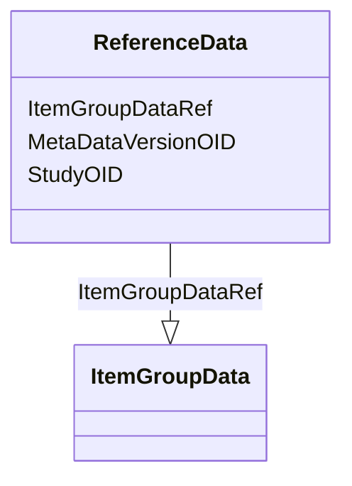

# Class: ReferenceData


URI: [odm:ReferenceData](http://www.cdisc.org/ns/odm/v2.0/ReferenceData)





<!-- no inheritance hierarchy -->


## Slots

| Name | Cardinality and Range | Description | Inheritance |
| ---  | --- | --- | --- |
| [StudyOID](StudyOID.md) | 1..1 <br/> [Oidref](Oidref.md) |  | direct |
| [MetaDataVersionOID](MetaDataVersionOID.md) | 1..1 <br/> [Oidref](Oidref.md) |  | direct |
| [ItemGroupDataRef](ItemGroupDataRef.md) | 0..* <br/> [ItemGroupData](ItemGroupData.md) |  | direct |


## Usages

| used by | used in | type | used |
| ---  | --- | --- | --- |
| [ODMFileMetadata](ODMFileMetadata.md) | [ReferenceDataRef](ReferenceDataRef.md) | range | [ReferenceData](ReferenceData.md) |


## Identifier and Mapping Information


### Schema Source


* from schema: http://www.cdisc.org/ns/odm/v2.0


## Mappings

| Mapping Type | Mapped Value |
| ---  | ---  |
| self | odm:ReferenceData |
| native | odm:ReferenceData |


## LinkML Source

<!-- TODO: investigate https://stackoverflow.com/questions/37606292/how-to-create-tabbed-code-blocks-in-mkdocs-or-sphinx -->

### Direct

<details>
```yaml
name: ReferenceData
from_schema: http://www.cdisc.org/ns/odm/v2.0
slots:
- StudyOID
- MetaDataVersionOID
- ItemGroupDataRef
slot_usage:
  StudyOID:
    name: StudyOID
    domain_of:
    - Include
    - SourceItem
    - AdminData
    - MetaDataVersionRef
    - ReferenceData
    - ClinicalData
    - Association
    - KeySet
    range: oidref
    required: true
  MetaDataVersionOID:
    name: MetaDataVersionOID
    domain_of:
    - Include
    - SourceItem
    - MetaDataVersionRef
    - ReferenceData
    - ClinicalData
    - Association
    - KeySet
    range: oidref
    required: true
  ItemGroupDataRef:
    name: ItemGroupDataRef
    multivalued: true
    domain_of:
    - ReferenceData
    - ClinicalData
    - StudyEventData
    range: ItemGroupData
    required: false
    minimum_cardinality: 0
class_uri: odm:ReferenceData

```
</details>

### Induced

<details>
```yaml
name: ReferenceData
from_schema: http://www.cdisc.org/ns/odm/v2.0
slot_usage:
  StudyOID:
    name: StudyOID
    domain_of:
    - Include
    - SourceItem
    - AdminData
    - MetaDataVersionRef
    - ReferenceData
    - ClinicalData
    - Association
    - KeySet
    range: oidref
    required: true
  MetaDataVersionOID:
    name: MetaDataVersionOID
    domain_of:
    - Include
    - SourceItem
    - MetaDataVersionRef
    - ReferenceData
    - ClinicalData
    - Association
    - KeySet
    range: oidref
    required: true
  ItemGroupDataRef:
    name: ItemGroupDataRef
    multivalued: true
    domain_of:
    - ReferenceData
    - ClinicalData
    - StudyEventData
    range: ItemGroupData
    required: false
    minimum_cardinality: 0
attributes:
  StudyOID:
    name: StudyOID
    from_schema: http://www.cdisc.org/ns/odm/v2.0
    rank: 1000
    alias: StudyOID
    owner: ReferenceData
    domain_of:
    - Include
    - SourceItem
    - AdminData
    - MetaDataVersionRef
    - ReferenceData
    - ClinicalData
    - Association
    - KeySet
    range: oidref
    required: true
  MetaDataVersionOID:
    name: MetaDataVersionOID
    from_schema: http://www.cdisc.org/ns/odm/v2.0
    rank: 1000
    alias: MetaDataVersionOID
    owner: ReferenceData
    domain_of:
    - Include
    - SourceItem
    - MetaDataVersionRef
    - ReferenceData
    - ClinicalData
    - Association
    - KeySet
    range: oidref
    required: true
  ItemGroupDataRef:
    name: ItemGroupDataRef
    from_schema: http://www.cdisc.org/ns/odm/v2.0
    rank: 1000
    multivalued: true
    alias: ItemGroupDataRef
    owner: ReferenceData
    domain_of:
    - ReferenceData
    - ClinicalData
    - StudyEventData
    range: ItemGroupData
    required: false
    minimum_cardinality: 0
class_uri: odm:ReferenceData

```
</details>