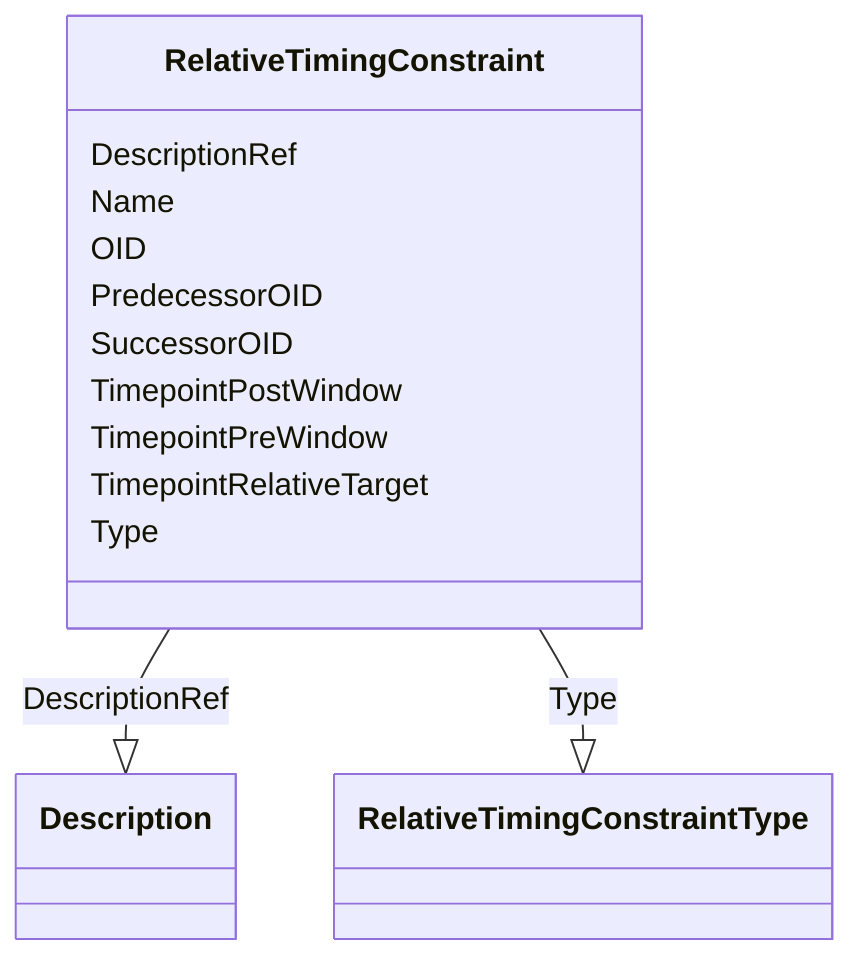

# Class: RelativeTimingConstraint


_The RelativeTimingConstraint element describes a relative timing constraint between 2 activities or groups of activities, represented by StudyEventGroups, StudyEvents, ItemGroups, or Items._


URI: [odm:RelativeTimingConstraint](http://www.cdisc.org/ns/odm/v2.0/RelativeTimingConstraint)





<!-- no inheritance hierarchy -->


## Slots

| Name | Cardinality and Range | Description | Inheritance |
| ---  | --- | --- | --- |
| [OID](OID.md) | 1..1 <br/> [Oid](Oid.md) | Unique identifier | direct |
| [Name](Name.md) | 1..1 <br/> [Name](Name.md) | Human readable name | direct |
| [PredecessorOID](PredecessorOID.md) | 0..1 <br/> [Oidref](Oidref.md) | Identifies a StudyEventGroup, StudyEvent, ItemGroup or Item that occurs immed... | direct |
| [SuccessorOID](SuccessorOID.md) | 0..1 <br/> [Oidref](Oidref.md) | Identifies a StudyEventGroup, StudyEvent, ItemGroup or Item tha occurs immedi... | direct |
| [Type](Type.md) | 0..1 <br/> [RelativeTimingConstraintType](RelativeTimingConstraintType.md) | Defines how the timing is to be defined between the two activities, starting ... | direct |
| [TimepointRelativeTarget](TimepointRelativeTarget.md) | 1..1 <br/> [DurationDatetime](DurationDatetime.md) | The relative timing between two activities or groups of activities | direct |
| [TimepointPreWindow](TimepointPreWindow.md) | 0..1 <br/> [DurationDatetime](DurationDatetime.md) | Adds a lower bound to a time window for the RelativeTimepointTarget | direct |
| [TimepointPostWindow](TimepointPostWindow.md) | 0..1 <br/> [DurationDatetime](DurationDatetime.md) | Adds an upper bound to a time window for the RelativeTimepointTarget | direct |
| [DescriptionRef](DescriptionRef.md) | 0..1 <br/> [Description](Description.md) |  | direct |


## Usages

| used by | used in | type | used |
| ---  | --- | --- | --- |
| [StudyTiming](StudyTiming.md) | [RelativeTimingConstraintRef](RelativeTimingConstraintRef.md) | range | [RelativeTimingConstraint](RelativeTimingConstraint.md) |


## See Also

* [https://wiki.cdisc.org/display/ODM2/RelativeTimingConstraint](https://wiki.cdisc.org/display/ODM2/RelativeTimingConstraint)

## Identifier and Mapping Information


### Schema Source


* from schema: http://www.cdisc.org/ns/odm/v2.0


## Mappings

| Mapping Type | Mapped Value |
| ---  | ---  |
| self | odm:RelativeTimingConstraint |
| native | odm:RelativeTimingConstraint |


## LinkML Source

<!-- TODO: investigate https://stackoverflow.com/questions/37606292/how-to-create-tabbed-code-blocks-in-mkdocs-or-sphinx -->

### Direct

<details>
```yaml
name: RelativeTimingConstraint
description: The RelativeTimingConstraint element describes a relative timing constraint
  between 2 activities or groups of activities, represented by StudyEventGroups, StudyEvents,
  ItemGroups, or Items.
from_schema: http://www.cdisc.org/ns/odm/v2.0
see_also:
- https://wiki.cdisc.org/display/ODM2/RelativeTimingConstraint
slots:
- OID
- Name
- PredecessorOID
- SuccessorOID
- Type
- TimepointRelativeTarget
- TimepointPreWindow
- TimepointPostWindow
- DescriptionRef
slot_usage:
  OID:
    name: OID
    description: Unique identifier.
    comments:
    - Required
    domain_of:
    - Study
    - MetaDataVersion
    - Standard
    - ValueListDef
    - WhereClauseDef
    - StudyEventGroupDef
    - StudyEventDef
    - ItemGroupDef
    - ItemDef
    - CodeList
    - MethodDef
    - ConditionDef
    - CommentDef
    - StudyIndication
    - StudyIntervention
    - StudyObjective
    - StudyEndPoint
    - StudyTargetPopulation
    - StudyEstimand
    - Arm
    - Epoch
    - StudyParameter
    - StudyTiming
    - TransitionTimingConstraint
    - AbsoluteTimingConstraint
    - RelativeTimingConstraint
    - DurationTimingConstraint
    - WorkflowDef
    - Transition
    - Branching
    - Criterion
    - ExceptionEvent
    - User
    - Organization
    - Location
    - SignatureDef
    - Query
    range: oid
    required: true
  Name:
    name: Name
    description: Human readable name.
    comments:
    - Required
    domain_of:
    - Alias
    - MetaDataVersion
    - Standard
    - StudyEventGroupDef
    - StudyEventDef
    - ItemGroupDef
    - Class
    - SubClass
    - SourceItem
    - Resource
    - ItemDef
    - CodeList
    - MethodDef
    - Parameter
    - ReturnValue
    - ConditionDef
    - StudyObjective
    - StudyEndPoint
    - StudyTargetPopulation
    - StudyEstimand
    - Arm
    - Epoch
    - StudyTiming
    - TransitionTimingConstraint
    - AbsoluteTimingConstraint
    - RelativeTimingConstraint
    - DurationTimingConstraint
    - WorkflowDef
    - Transition
    - Branching
    - Criterion
    - ExceptionEvent
    - Organization
    - Location
    - Query
    range: name
    required: true
  PredecessorOID:
    name: PredecessorOID
    description: Identifies a StudyEventGroup, StudyEvent, ItemGroup or Item that
      occurs immediately before the RelativeTimepointTarget.
    comments:
    - Required
    domain_of:
    - RelativeTimingConstraint
    range: oidref
  SuccessorOID:
    name: SuccessorOID
    description: Identifies a StudyEventGroup, StudyEvent, ItemGroup or Item tha occurs
      immediately after the RelativeTimepointTarget.
    comments:
    - Required
    domain_of:
    - RelativeTimingConstraint
    range: oidref
  Type:
    name: Type
    description: Defines how the timing is to be defined between the two activities,
      starting from the start or the end of the source activity, and ending at the
      start or the end of the target activity.
    comments:
    - Optional
    domain_of:
    - TranslatedText
    - PDFPageRef
    - Standard
    - StudyEventDef
    - ItemGroupDef
    - Origin
    - Resource
    - MethodDef
    - StudyEndPoint
    - TransitionTimingConstraint
    - RelativeTimingConstraint
    - Branching
    - Organization
    - Query
    range: RelativeTimingConstraintType
  TimepointRelativeTarget:
    name: TimepointRelativeTarget
    description: The relative timing between two activities or groups of activities.
    comments:
    - Required
    domain_of:
    - RelativeTimingConstraint
    range: durationDatetime
    required: true
  TimepointPreWindow:
    name: TimepointPreWindow
    description: Adds a lower bound to a time window for the RelativeTimepointTarget.
    comments:
    - Optional
    domain_of:
    - TransitionTimingConstraint
    - AbsoluteTimingConstraint
    - RelativeTimingConstraint
    range: durationDatetime
  TimepointPostWindow:
    name: TimepointPostWindow
    description: Adds an upper bound to a time window for the RelativeTimepointTarget.
    comments:
    - Optional
    domain_of:
    - TransitionTimingConstraint
    - AbsoluteTimingConstraint
    - RelativeTimingConstraint
    range: durationDatetime
  DescriptionRef:
    name: DescriptionRef
    domain_of:
    - Study
    - MetaDataVersion
    - ValueListDef
    - StudyEventGroupRef
    - StudyEventGroupDef
    - StudyEventDef
    - ItemGroupDef
    - Origin
    - ItemDef
    - CodeList
    - CodeListItem
    - MethodDef
    - ConditionDef
    - CommentDef
    - Protocol
    - StudyStructure
    - TrialPhase
    - StudyIndication
    - StudyIntervention
    - StudyObjective
    - StudyEndPoint
    - StudyTargetPopulation
    - StudyEstimand
    - IntercurrentEvent
    - SummaryMeasure
    - Arm
    - Epoch
    - TransitionTimingConstraint
    - AbsoluteTimingConstraint
    - RelativeTimingConstraint
    - DurationTimingConstraint
    - WorkflowDef
    - Criterion
    - ExceptionEvent
    - Organization
    - Location
    - ODMFileMetadata
    range: Description
    maximum_cardinality: 1
class_uri: odm:RelativeTimingConstraint

```
</details>

### Induced

<details>
```yaml
name: RelativeTimingConstraint
description: The RelativeTimingConstraint element describes a relative timing constraint
  between 2 activities or groups of activities, represented by StudyEventGroups, StudyEvents,
  ItemGroups, or Items.
from_schema: http://www.cdisc.org/ns/odm/v2.0
see_also:
- https://wiki.cdisc.org/display/ODM2/RelativeTimingConstraint
slot_usage:
  OID:
    name: OID
    description: Unique identifier.
    comments:
    - Required
    domain_of:
    - Study
    - MetaDataVersion
    - Standard
    - ValueListDef
    - WhereClauseDef
    - StudyEventGroupDef
    - StudyEventDef
    - ItemGroupDef
    - ItemDef
    - CodeList
    - MethodDef
    - ConditionDef
    - CommentDef
    - StudyIndication
    - StudyIntervention
    - StudyObjective
    - StudyEndPoint
    - StudyTargetPopulation
    - StudyEstimand
    - Arm
    - Epoch
    - StudyParameter
    - StudyTiming
    - TransitionTimingConstraint
    - AbsoluteTimingConstraint
    - RelativeTimingConstraint
    - DurationTimingConstraint
    - WorkflowDef
    - Transition
    - Branching
    - Criterion
    - ExceptionEvent
    - User
    - Organization
    - Location
    - SignatureDef
    - Query
    range: oid
    required: true
  Name:
    name: Name
    description: Human readable name.
    comments:
    - Required
    domain_of:
    - Alias
    - MetaDataVersion
    - Standard
    - StudyEventGroupDef
    - StudyEventDef
    - ItemGroupDef
    - Class
    - SubClass
    - SourceItem
    - Resource
    - ItemDef
    - CodeList
    - MethodDef
    - Parameter
    - ReturnValue
    - ConditionDef
    - StudyObjective
    - StudyEndPoint
    - StudyTargetPopulation
    - StudyEstimand
    - Arm
    - Epoch
    - StudyTiming
    - TransitionTimingConstraint
    - AbsoluteTimingConstraint
    - RelativeTimingConstraint
    - DurationTimingConstraint
    - WorkflowDef
    - Transition
    - Branching
    - Criterion
    - ExceptionEvent
    - Organization
    - Location
    - Query
    range: name
    required: true
  PredecessorOID:
    name: PredecessorOID
    description: Identifies a StudyEventGroup, StudyEvent, ItemGroup or Item that
      occurs immediately before the RelativeTimepointTarget.
    comments:
    - Required
    domain_of:
    - RelativeTimingConstraint
    range: oidref
  SuccessorOID:
    name: SuccessorOID
    description: Identifies a StudyEventGroup, StudyEvent, ItemGroup or Item tha occurs
      immediately after the RelativeTimepointTarget.
    comments:
    - Required
    domain_of:
    - RelativeTimingConstraint
    range: oidref
  Type:
    name: Type
    description: Defines how the timing is to be defined between the two activities,
      starting from the start or the end of the source activity, and ending at the
      start or the end of the target activity.
    comments:
    - Optional
    domain_of:
    - TranslatedText
    - PDFPageRef
    - Standard
    - StudyEventDef
    - ItemGroupDef
    - Origin
    - Resource
    - MethodDef
    - StudyEndPoint
    - TransitionTimingConstraint
    - RelativeTimingConstraint
    - Branching
    - Organization
    - Query
    range: RelativeTimingConstraintType
  TimepointRelativeTarget:
    name: TimepointRelativeTarget
    description: The relative timing between two activities or groups of activities.
    comments:
    - Required
    domain_of:
    - RelativeTimingConstraint
    range: durationDatetime
    required: true
  TimepointPreWindow:
    name: TimepointPreWindow
    description: Adds a lower bound to a time window for the RelativeTimepointTarget.
    comments:
    - Optional
    domain_of:
    - TransitionTimingConstraint
    - AbsoluteTimingConstraint
    - RelativeTimingConstraint
    range: durationDatetime
  TimepointPostWindow:
    name: TimepointPostWindow
    description: Adds an upper bound to a time window for the RelativeTimepointTarget.
    comments:
    - Optional
    domain_of:
    - TransitionTimingConstraint
    - AbsoluteTimingConstraint
    - RelativeTimingConstraint
    range: durationDatetime
  DescriptionRef:
    name: DescriptionRef
    domain_of:
    - Study
    - MetaDataVersion
    - ValueListDef
    - StudyEventGroupRef
    - StudyEventGroupDef
    - StudyEventDef
    - ItemGroupDef
    - Origin
    - ItemDef
    - CodeList
    - CodeListItem
    - MethodDef
    - ConditionDef
    - CommentDef
    - Protocol
    - StudyStructure
    - TrialPhase
    - StudyIndication
    - StudyIntervention
    - StudyObjective
    - StudyEndPoint
    - StudyTargetPopulation
    - StudyEstimand
    - IntercurrentEvent
    - SummaryMeasure
    - Arm
    - Epoch
    - TransitionTimingConstraint
    - AbsoluteTimingConstraint
    - RelativeTimingConstraint
    - DurationTimingConstraint
    - WorkflowDef
    - Criterion
    - ExceptionEvent
    - Organization
    - Location
    - ODMFileMetadata
    range: Description
    maximum_cardinality: 1
attributes:
  OID:
    name: OID
    description: Unique identifier.
    comments:
    - Required
    from_schema: http://www.cdisc.org/ns/odm/v2.0
    rank: 1000
    identifier: true
    alias: OID
    owner: RelativeTimingConstraint
    domain_of:
    - Study
    - MetaDataVersion
    - Standard
    - ValueListDef
    - WhereClauseDef
    - StudyEventGroupDef
    - StudyEventDef
    - ItemGroupDef
    - ItemDef
    - CodeList
    - MethodDef
    - ConditionDef
    - CommentDef
    - StudyIndication
    - StudyIntervention
    - StudyObjective
    - StudyEndPoint
    - StudyTargetPopulation
    - StudyEstimand
    - Arm
    - Epoch
    - StudyParameter
    - StudyTiming
    - TransitionTimingConstraint
    - AbsoluteTimingConstraint
    - RelativeTimingConstraint
    - DurationTimingConstraint
    - WorkflowDef
    - Transition
    - Branching
    - Criterion
    - ExceptionEvent
    - User
    - Organization
    - Location
    - SignatureDef
    - Query
    range: oid
    required: true
  Name:
    name: Name
    description: Human readable name.
    comments:
    - Required
    from_schema: http://www.cdisc.org/ns/odm/v2.0
    rank: 1000
    alias: Name
    owner: RelativeTimingConstraint
    domain_of:
    - Alias
    - MetaDataVersion
    - Standard
    - StudyEventGroupDef
    - StudyEventDef
    - ItemGroupDef
    - Class
    - SubClass
    - SourceItem
    - Resource
    - ItemDef
    - CodeList
    - MethodDef
    - Parameter
    - ReturnValue
    - ConditionDef
    - StudyObjective
    - StudyEndPoint
    - StudyTargetPopulation
    - StudyEstimand
    - Arm
    - Epoch
    - StudyTiming
    - TransitionTimingConstraint
    - AbsoluteTimingConstraint
    - RelativeTimingConstraint
    - DurationTimingConstraint
    - WorkflowDef
    - Transition
    - Branching
    - Criterion
    - ExceptionEvent
    - Organization
    - Location
    - Query
    range: name
    required: true
  PredecessorOID:
    name: PredecessorOID
    description: Identifies a StudyEventGroup, StudyEvent, ItemGroup or Item that
      occurs immediately before the RelativeTimepointTarget.
    comments:
    - Required
    from_schema: http://www.cdisc.org/ns/odm/v2.0
    rank: 1000
    alias: PredecessorOID
    owner: RelativeTimingConstraint
    domain_of:
    - RelativeTimingConstraint
    range: oidref
  SuccessorOID:
    name: SuccessorOID
    description: Identifies a StudyEventGroup, StudyEvent, ItemGroup or Item tha occurs
      immediately after the RelativeTimepointTarget.
    comments:
    - Required
    from_schema: http://www.cdisc.org/ns/odm/v2.0
    rank: 1000
    alias: SuccessorOID
    owner: RelativeTimingConstraint
    domain_of:
    - RelativeTimingConstraint
    range: oidref
  Type:
    name: Type
    description: Defines how the timing is to be defined between the two activities,
      starting from the start or the end of the source activity, and ending at the
      start or the end of the target activity.
    comments:
    - Optional
    from_schema: http://www.cdisc.org/ns/odm/v2.0
    rank: 1000
    alias: Type
    owner: RelativeTimingConstraint
    domain_of:
    - TranslatedText
    - PDFPageRef
    - Standard
    - StudyEventDef
    - ItemGroupDef
    - Origin
    - Resource
    - MethodDef
    - StudyEndPoint
    - TransitionTimingConstraint
    - RelativeTimingConstraint
    - Branching
    - Organization
    - Query
    range: RelativeTimingConstraintType
  TimepointRelativeTarget:
    name: TimepointRelativeTarget
    description: The relative timing between two activities or groups of activities.
    comments:
    - Required
    from_schema: http://www.cdisc.org/ns/odm/v2.0
    rank: 1000
    alias: TimepointRelativeTarget
    owner: RelativeTimingConstraint
    domain_of:
    - RelativeTimingConstraint
    range: durationDatetime
    required: true
  TimepointPreWindow:
    name: TimepointPreWindow
    description: Adds a lower bound to a time window for the RelativeTimepointTarget.
    comments:
    - Optional
    from_schema: http://www.cdisc.org/ns/odm/v2.0
    rank: 1000
    alias: TimepointPreWindow
    owner: RelativeTimingConstraint
    domain_of:
    - TransitionTimingConstraint
    - AbsoluteTimingConstraint
    - RelativeTimingConstraint
    range: durationDatetime
  TimepointPostWindow:
    name: TimepointPostWindow
    description: Adds an upper bound to a time window for the RelativeTimepointTarget.
    comments:
    - Optional
    from_schema: http://www.cdisc.org/ns/odm/v2.0
    rank: 1000
    alias: TimepointPostWindow
    owner: RelativeTimingConstraint
    domain_of:
    - TransitionTimingConstraint
    - AbsoluteTimingConstraint
    - RelativeTimingConstraint
    range: durationDatetime
  DescriptionRef:
    name: DescriptionRef
    from_schema: http://www.cdisc.org/ns/odm/v2.0
    rank: 1000
    identifier: false
    alias: DescriptionRef
    owner: RelativeTimingConstraint
    domain_of:
    - Study
    - MetaDataVersion
    - ValueListDef
    - StudyEventGroupRef
    - StudyEventGroupDef
    - StudyEventDef
    - ItemGroupDef
    - Origin
    - ItemDef
    - CodeList
    - CodeListItem
    - MethodDef
    - ConditionDef
    - CommentDef
    - Protocol
    - StudyStructure
    - TrialPhase
    - StudyIndication
    - StudyIntervention
    - StudyObjective
    - StudyEndPoint
    - StudyTargetPopulation
    - StudyEstimand
    - IntercurrentEvent
    - SummaryMeasure
    - Arm
    - Epoch
    - TransitionTimingConstraint
    - AbsoluteTimingConstraint
    - RelativeTimingConstraint
    - DurationTimingConstraint
    - WorkflowDef
    - Criterion
    - ExceptionEvent
    - Organization
    - Location
    - ODMFileMetadata
    range: Description
    maximum_cardinality: 1
class_uri: odm:RelativeTimingConstraint

```
</details>