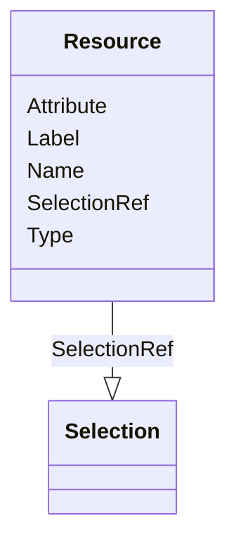

# Class: Resource


URI: [odm:Resource](http://www.cdisc.org/ns/odm/v2.0/Resource)





<!-- no inheritance hierarchy -->


## Slots

| Name | Cardinality and Range | Description | Inheritance |
| ---  | --- | --- | --- |
| [Type](Type.md) | 1..1 <br/> [Text](Text.md) | Type of page for page references indicated in the PageRefs attribute | direct |
| [Name](Name.md) | 1..1 <br/> [Name](Name.md) | General observation Sub Class | direct |
| [Attribute](Attribute.md) | 0..1 <br/> [Text](Text.md) |  | direct |
| [Label](Label.md) | 0..1 <br/> [Text](Text.md) |  | direct |
| [SelectionRef](SelectionRef.md) | 0..* <br/> [Selection](Selection.md) |  | direct |


## Usages

| used by | used in | type | used |
| ---  | --- | --- | --- |
| [SourceItem](SourceItem.md) | [ResourceRef](ResourceRef.md) | range | [Resource](Resource.md) |


## Identifier and Mapping Information


### Schema Source


* from schema: http://www.cdisc.org/ns/odm/v2.0


## Mappings

| Mapping Type | Mapped Value |
| ---  | ---  |
| self | odm:Resource |
| native | odm:Resource |


## LinkML Source

<!-- TODO: investigate https://stackoverflow.com/questions/37606292/how-to-create-tabbed-code-blocks-in-mkdocs-or-sphinx -->

### Direct

<details>
```yaml
name: Resource
from_schema: http://www.cdisc.org/ns/odm/v2.0
slots:
- Type
- Name
- Attribute
- Label
- SelectionRef
slot_usage:
  Type:
    name: Type
    domain_of:
    - PDFPageRef
    - Origin
    - Resource
    - StudyObjective
    - StudyEndPoint
    - TransitionTimingConstraint
    - RelativeTimingConstraint
    - Branching
    - Organization
    - Query
    - StudyEventDef
    - ItemGroupDef
    - MethodDef
    - Standard
    range: text
    required: true
  Name:
    name: Name
    domain_of:
    - StudyEventGroupDef
    - Class
    - SubClass
    - SourceItem
    - Resource
    - Parameter
    - ReturnValue
    - StudyObjective
    - StudyEndPoint
    - StudyTargetPopulation
    - StudyEstimand
    - Arm
    - Epoch
    - StudyTiming
    - TransitionTimingConstraint
    - AbsoluteTimingConstraint
    - RelativeTimingConstraint
    - DurationTimingConstraint
    - WorkflowDef
    - Transition
    - Branching
    - Criterion
    - ExceptionEvent
    - Organization
    - Query
    - MetaDataVersion
    - StudyEventDef
    - ItemGroupDef
    - ItemDef
    - CodeList
    - ConditionDef
    - MethodDef
    - Standard
    - Alias
    - Location
    range: name
    required: true
  Attribute:
    name: Attribute
    domain_of:
    - Resource
    range: text
    required: false
  Label:
    name: Label
    domain_of:
    - Resource
    - Coding
    range: text
    required: false
  SelectionRef:
    name: SelectionRef
    multivalued: true
    domain_of:
    - Resource
    range: Selection
    required: false
    minimum_cardinality: 0
class_uri: odm:Resource

```
</details>

### Induced

<details>
```yaml
name: Resource
from_schema: http://www.cdisc.org/ns/odm/v2.0
slot_usage:
  Type:
    name: Type
    domain_of:
    - PDFPageRef
    - Origin
    - Resource
    - StudyObjective
    - StudyEndPoint
    - TransitionTimingConstraint
    - RelativeTimingConstraint
    - Branching
    - Organization
    - Query
    - StudyEventDef
    - ItemGroupDef
    - MethodDef
    - Standard
    range: text
    required: true
  Name:
    name: Name
    domain_of:
    - StudyEventGroupDef
    - Class
    - SubClass
    - SourceItem
    - Resource
    - Parameter
    - ReturnValue
    - StudyObjective
    - StudyEndPoint
    - StudyTargetPopulation
    - StudyEstimand
    - Arm
    - Epoch
    - StudyTiming
    - TransitionTimingConstraint
    - AbsoluteTimingConstraint
    - RelativeTimingConstraint
    - DurationTimingConstraint
    - WorkflowDef
    - Transition
    - Branching
    - Criterion
    - ExceptionEvent
    - Organization
    - Query
    - MetaDataVersion
    - StudyEventDef
    - ItemGroupDef
    - ItemDef
    - CodeList
    - ConditionDef
    - MethodDef
    - Standard
    - Alias
    - Location
    range: name
    required: true
  Attribute:
    name: Attribute
    domain_of:
    - Resource
    range: text
    required: false
  Label:
    name: Label
    domain_of:
    - Resource
    - Coding
    range: text
    required: false
  SelectionRef:
    name: SelectionRef
    multivalued: true
    domain_of:
    - Resource
    range: Selection
    required: false
    minimum_cardinality: 0
attributes:
  Type:
    name: Type
    description: Type of page for page references indicated in the PageRefs attribute.
    from_schema: http://www.cdisc.org/ns/odm/v2.0
    rank: 1000
    alias: Type
    owner: Resource
    domain_of:
    - PDFPageRef
    - Origin
    - Resource
    - StudyObjective
    - StudyEndPoint
    - TransitionTimingConstraint
    - RelativeTimingConstraint
    - Branching
    - Organization
    - Query
    - StudyEventDef
    - ItemGroupDef
    - MethodDef
    - Standard
    range: text
    required: true
  Name:
    name: Name
    description: General observation Sub Class.
    from_schema: http://www.cdisc.org/ns/odm/v2.0
    rank: 1000
    alias: Name
    owner: Resource
    domain_of:
    - StudyEventGroupDef
    - Class
    - SubClass
    - SourceItem
    - Resource
    - Parameter
    - ReturnValue
    - StudyObjective
    - StudyEndPoint
    - StudyTargetPopulation
    - StudyEstimand
    - Arm
    - Epoch
    - StudyTiming
    - TransitionTimingConstraint
    - AbsoluteTimingConstraint
    - RelativeTimingConstraint
    - DurationTimingConstraint
    - WorkflowDef
    - Transition
    - Branching
    - Criterion
    - ExceptionEvent
    - Organization
    - Query
    - MetaDataVersion
    - StudyEventDef
    - ItemGroupDef
    - ItemDef
    - CodeList
    - ConditionDef
    - MethodDef
    - Standard
    - Alias
    - Location
    range: name
    required: true
  Attribute:
    name: Attribute
    from_schema: http://www.cdisc.org/ns/odm/v2.0
    rank: 1000
    alias: Attribute
    owner: Resource
    domain_of:
    - Resource
    range: text
    required: false
  Label:
    name: Label
    from_schema: http://www.cdisc.org/ns/odm/v2.0
    rank: 1000
    alias: Label
    owner: Resource
    domain_of:
    - Resource
    - Coding
    range: text
    required: false
  SelectionRef:
    name: SelectionRef
    from_schema: http://www.cdisc.org/ns/odm/v2.0
    rank: 1000
    multivalued: true
    alias: SelectionRef
    owner: Resource
    domain_of:
    - Resource
    range: Selection
    required: false
    minimum_cardinality: 0
class_uri: odm:Resource

```
</details>