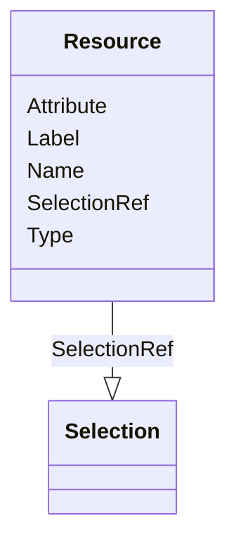

# Class: Resource


_Describes an external resource used as the source for the parent ItemGroup or Item. _


URI: [odm:Resource](http://www.cdisc.org/ns/odm/v2.0/Resource)





<!-- no inheritance hierarchy -->


## Slots

| Name | Cardinality and Range | Description | Inheritance |
| ---  | --- | --- | --- |
| [Type](Type.md) | 1..1 <br/> [Text](Text.md) | Categorization of external resources | direct |
| [Name](Name.md) | 1..1 <br/> [Name](Name.md) | The human readable identifier of the element or field in the external resourc... | direct |
| [Attribute](Attribute.md) | 0..1 <br/> [Text](Text.md) | Field provided by the Name attribute where the data or information can be obt... | direct |
| [Label](Label.md) | 0..1 <br/> [Text](Text.md) | Used to link the value to a named MethodDef parameter | direct |
| [SelectionRef](SelectionRef.md) | 0..* <br/> [Selection](Selection.md) |  | direct |


## Usages

| used by | used in | type | used |
| ---  | --- | --- | --- |
| [SourceItem](SourceItem.md) | [ResourceRef](ResourceRef.md) | range | [Resource](Resource.md) |


## See Also

* [https://wiki.cdisc.org/display/ODM2/Resource](https://wiki.cdisc.org/display/ODM2/Resource)

## Identifier and Mapping Information


### Schema Source


* from schema: http://www.cdisc.org/ns/odm/v2.0


## Mappings

| Mapping Type | Mapped Value |
| ---  | ---  |
| self | odm:Resource |
| native | odm:Resource |


## LinkML Source

<!-- TODO: investigate https://stackoverflow.com/questions/37606292/how-to-create-tabbed-code-blocks-in-mkdocs-or-sphinx -->

### Direct

<details>
```yaml
name: Resource
description: 'Describes an external resource used as the source for the parent ItemGroup
  or Item. '
from_schema: http://www.cdisc.org/ns/odm/v2.0
see_also:
- https://wiki.cdisc.org/display/ODM2/Resource
slots:
- Type
- Name
- Attribute
- Label
- SelectionRef
slot_usage:
  Type:
    name: Type
    description: 'Categorization of external resources. Examples include: "ODM", "HL7-FHIR",
      "HL7-CDA", "HL7-v2", "OpenEHR-extract". Note: Extensible controlled terminology
      may be developed and published in the future.'
    comments:
    - 'Required

      range:text'
    domain_of:
    - TranslatedText
    - PDFPageRef
    - Standard
    - StudyEventDef
    - ItemGroupDef
    - Origin
    - Resource
    - MethodDef
    - StudyEndPoint
    - TransitionTimingConstraint
    - RelativeTimingConstraint
    - Branching
    - Organization
    - Query
    range: text
    required: true
  Name:
    name: Name
    description: 'The human readable identifier of the element or field in the external
      resource. Examples include : "ItemGroupDef" (for Type="ODM"), "Observation"
      (for Type="HL7-FHIR"), "substanceAdministration.doseQuantity" (for Type="HL7-CDA"),
      "OBX-5" (for field 5 ("Observation Result") for Type="HL7-v2").'
    comments:
    - 'Required

      range:name

      The value must be an existing element name or field name for the specific document
      or message type provided in the Type attribute.'
    domain_of:
    - Alias
    - MetaDataVersion
    - Standard
    - StudyEventGroupDef
    - StudyEventDef
    - ItemGroupDef
    - Class
    - SubClass
    - SourceItem
    - Resource
    - ItemDef
    - CodeList
    - MethodDef
    - Parameter
    - ReturnValue
    - ConditionDef
    - StudyObjective
    - StudyEndPoint
    - StudyTargetPopulation
    - StudyEstimand
    - Arm
    - Epoch
    - StudyTiming
    - TransitionTimingConstraint
    - AbsoluteTimingConstraint
    - RelativeTimingConstraint
    - DurationTimingConstraint
    - WorkflowDef
    - Transition
    - Branching
    - Criterion
    - ExceptionEvent
    - Organization
    - Location
    - Query
    range: name
    required: true
  Attribute:
    name: Attribute
    description: Field provided by the Name attribute where the data or information
      can be obtained. Examples are "valueQuantity.value" or "valueQuantity.unit"
      for the case of an HL7-FHIR "Observation", "Repeating" for the case of an ODM
      ItemGroupDef element, "unit" for the case of an HL7-CDA doseQuantity, "Code"
      or "Name" for the case of field 5 (which is composite) of an HL7-v2 OBX message.
      The Name and Attribute attributes are meant to provide traceability documentation.
    comments:
    - 'Optional

      range:name

      The Selection child element must correspond to machine-executable instructions
      for extracting the information from the resource. '
    domain_of:
    - Resource
    range: text
  Label:
    name: Label
    description: Used to link the value to a named MethodDef parameter.
    comments:
    - 'Optional

      range:text'
    domain_of:
    - Resource
    - Coding
    range: text
  SelectionRef:
    name: SelectionRef
    multivalued: true
    domain_of:
    - Resource
    range: Selection
    inlined: true
    inlined_as_list: true
class_uri: odm:Resource

```
</details>

### Induced

<details>
```yaml
name: Resource
description: 'Describes an external resource used as the source for the parent ItemGroup
  or Item. '
from_schema: http://www.cdisc.org/ns/odm/v2.0
see_also:
- https://wiki.cdisc.org/display/ODM2/Resource
slot_usage:
  Type:
    name: Type
    description: 'Categorization of external resources. Examples include: "ODM", "HL7-FHIR",
      "HL7-CDA", "HL7-v2", "OpenEHR-extract". Note: Extensible controlled terminology
      may be developed and published in the future.'
    comments:
    - 'Required

      range:text'
    domain_of:
    - TranslatedText
    - PDFPageRef
    - Standard
    - StudyEventDef
    - ItemGroupDef
    - Origin
    - Resource
    - MethodDef
    - StudyEndPoint
    - TransitionTimingConstraint
    - RelativeTimingConstraint
    - Branching
    - Organization
    - Query
    range: text
    required: true
  Name:
    name: Name
    description: 'The human readable identifier of the element or field in the external
      resource. Examples include : "ItemGroupDef" (for Type="ODM"), "Observation"
      (for Type="HL7-FHIR"), "substanceAdministration.doseQuantity" (for Type="HL7-CDA"),
      "OBX-5" (for field 5 ("Observation Result") for Type="HL7-v2").'
    comments:
    - 'Required

      range:name

      The value must be an existing element name or field name for the specific document
      or message type provided in the Type attribute.'
    domain_of:
    - Alias
    - MetaDataVersion
    - Standard
    - StudyEventGroupDef
    - StudyEventDef
    - ItemGroupDef
    - Class
    - SubClass
    - SourceItem
    - Resource
    - ItemDef
    - CodeList
    - MethodDef
    - Parameter
    - ReturnValue
    - ConditionDef
    - StudyObjective
    - StudyEndPoint
    - StudyTargetPopulation
    - StudyEstimand
    - Arm
    - Epoch
    - StudyTiming
    - TransitionTimingConstraint
    - AbsoluteTimingConstraint
    - RelativeTimingConstraint
    - DurationTimingConstraint
    - WorkflowDef
    - Transition
    - Branching
    - Criterion
    - ExceptionEvent
    - Organization
    - Location
    - Query
    range: name
    required: true
  Attribute:
    name: Attribute
    description: Field provided by the Name attribute where the data or information
      can be obtained. Examples are "valueQuantity.value" or "valueQuantity.unit"
      for the case of an HL7-FHIR "Observation", "Repeating" for the case of an ODM
      ItemGroupDef element, "unit" for the case of an HL7-CDA doseQuantity, "Code"
      or "Name" for the case of field 5 (which is composite) of an HL7-v2 OBX message.
      The Name and Attribute attributes are meant to provide traceability documentation.
    comments:
    - 'Optional

      range:name

      The Selection child element must correspond to machine-executable instructions
      for extracting the information from the resource. '
    domain_of:
    - Resource
    range: text
  Label:
    name: Label
    description: Used to link the value to a named MethodDef parameter.
    comments:
    - 'Optional

      range:text'
    domain_of:
    - Resource
    - Coding
    range: text
  SelectionRef:
    name: SelectionRef
    multivalued: true
    domain_of:
    - Resource
    range: Selection
    inlined: true
    inlined_as_list: true
attributes:
  Type:
    name: Type
    description: 'Categorization of external resources. Examples include: "ODM", "HL7-FHIR",
      "HL7-CDA", "HL7-v2", "OpenEHR-extract". Note: Extensible controlled terminology
      may be developed and published in the future.'
    comments:
    - 'Required

      range:text'
    from_schema: http://www.cdisc.org/ns/odm/v2.0
    rank: 1000
    alias: Type
    owner: Resource
    domain_of:
    - TranslatedText
    - PDFPageRef
    - Standard
    - StudyEventDef
    - ItemGroupDef
    - Origin
    - Resource
    - MethodDef
    - StudyEndPoint
    - TransitionTimingConstraint
    - RelativeTimingConstraint
    - Branching
    - Organization
    - Query
    range: text
    required: true
  Name:
    name: Name
    description: 'The human readable identifier of the element or field in the external
      resource. Examples include : "ItemGroupDef" (for Type="ODM"), "Observation"
      (for Type="HL7-FHIR"), "substanceAdministration.doseQuantity" (for Type="HL7-CDA"),
      "OBX-5" (for field 5 ("Observation Result") for Type="HL7-v2").'
    comments:
    - 'Required

      range:name

      The value must be an existing element name or field name for the specific document
      or message type provided in the Type attribute.'
    from_schema: http://www.cdisc.org/ns/odm/v2.0
    rank: 1000
    alias: Name
    owner: Resource
    domain_of:
    - Alias
    - MetaDataVersion
    - Standard
    - StudyEventGroupDef
    - StudyEventDef
    - ItemGroupDef
    - Class
    - SubClass
    - SourceItem
    - Resource
    - ItemDef
    - CodeList
    - MethodDef
    - Parameter
    - ReturnValue
    - ConditionDef
    - StudyObjective
    - StudyEndPoint
    - StudyTargetPopulation
    - StudyEstimand
    - Arm
    - Epoch
    - StudyTiming
    - TransitionTimingConstraint
    - AbsoluteTimingConstraint
    - RelativeTimingConstraint
    - DurationTimingConstraint
    - WorkflowDef
    - Transition
    - Branching
    - Criterion
    - ExceptionEvent
    - Organization
    - Location
    - Query
    range: name
    required: true
  Attribute:
    name: Attribute
    description: Field provided by the Name attribute where the data or information
      can be obtained. Examples are "valueQuantity.value" or "valueQuantity.unit"
      for the case of an HL7-FHIR "Observation", "Repeating" for the case of an ODM
      ItemGroupDef element, "unit" for the case of an HL7-CDA doseQuantity, "Code"
      or "Name" for the case of field 5 (which is composite) of an HL7-v2 OBX message.
      The Name and Attribute attributes are meant to provide traceability documentation.
    comments:
    - 'Optional

      range:name

      The Selection child element must correspond to machine-executable instructions
      for extracting the information from the resource. '
    from_schema: http://www.cdisc.org/ns/odm/v2.0
    rank: 1000
    alias: Attribute
    owner: Resource
    domain_of:
    - Resource
    range: text
  Label:
    name: Label
    description: Used to link the value to a named MethodDef parameter.
    comments:
    - 'Optional

      range:text'
    from_schema: http://www.cdisc.org/ns/odm/v2.0
    rank: 1000
    alias: Label
    owner: Resource
    domain_of:
    - Resource
    - Coding
    range: text
  SelectionRef:
    name: SelectionRef
    from_schema: http://www.cdisc.org/ns/odm/v2.0
    rank: 1000
    multivalued: true
    identifier: false
    alias: SelectionRef
    owner: Resource
    domain_of:
    - Resource
    range: Selection
    inlined: true
    inlined_as_list: true
class_uri: odm:Resource

```
</details>