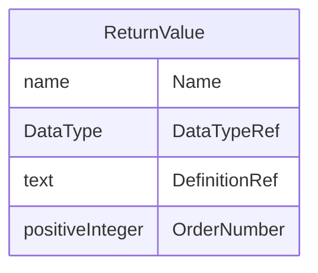

# Class: ReturnValue

_The ReturnValue element represents a return value used as part of a MethodSignature in MethodDef, ConditionDef, or RangeCheck. A return value identifies values passed from the Method to the calling element. A ReturnValue may be computed by a FormalExpression._


URI: [odm:ReturnValue](http://www.cdisc.org/ns/odm/v2.0/ReturnValue)





<!-- no inheritance hierarchy -->


## Slots

| Name | Cardinality* and Range | Description | Inheritance |
| ---  | --- | --- | --- |
| [Name](Name.md) | 1..1 <br/> [name](name.md) | The return value name. | direct |
| [DataTypeRef](DataTypeRef.md) | 1..1 <br/> [DataType](DataType.md) | Return value datatype | direct |
| [DefinitionRef](DefinitionRef.md) | 0..1 <br/> [text](text.md) | A free-text definition of the return value | direct |
| [OrderNumber](OrderNumber.md) | 0..1 <br/> [positiveInteger](positiveInteger.md) | Position of the ReturnValue | direct |

_* See [LinkML documentation](https://linkml.io/linkml/schemas/slots.html#slot-cardinality) for cardinality definitions._


## Usages

| used by | used in | type | used |
| ---  | --- | --- | --- |
| [MethodSignature](MethodSignature.md) | [ReturnValueRef](ReturnValueRef.md) | range | [ReturnValue](ReturnValue.md) |


## See Also

* [https://wiki.cdisc.org/display/ODM2/ReturnValue](https://wiki.cdisc.org/display/ODM2/ReturnValue)

## Identifier and Mapping Information


### Schema Source


* from schema: http://www.cdisc.org/ns/odm/v2.0


## Mappings

| Mapping Type | Mapped Value |
| ---  | ---  |
| self | odm:ReturnValue |
| native | odm:ReturnValue |


## LinkML Source

<!-- TODO: investigate https://stackoverflow.com/questions/37606292/how-to-create-tabbed-code-blocks-in-mkdocs-or-sphinx -->

### Direct

<details>
```yaml
name: ReturnValue
description: The ReturnValue element represents a return value used as part of a MethodSignature
  in MethodDef, ConditionDef, or RangeCheck. A return value identifies values passed
  from the Method to the calling element. A ReturnValue may be computed by a FormalExpression.
from_schema: http://www.cdisc.org/ns/odm/v2.0
see_also:
- https://wiki.cdisc.org/display/ODM2/ReturnValue
rank: 1000
slots:
- Name
- DataTypeRef
- DefinitionRef
- OrderNumber
slot_usage:
  Name:
    name: Name
    description: The return value name.
    comments:
    - 'Required

      range: name'
    domain_of:
    - Alias
    - MetaDataVersion
    - Standard
    - StudyEventGroupDef
    - StudyEventDef
    - ItemGroupDef
    - Class
    - SubClass
    - SourceItem
    - Resource
    - ItemDef
    - CodeList
    - MethodDef
    - Parameter
    - ReturnValue
    - ConditionDef
    - StudyObjective
    - StudyEndPoint
    - StudyTargetPopulation
    - StudyEstimand
    - Arm
    - Epoch
    - StudyTiming
    - TransitionTimingConstraint
    - AbsoluteTimingConstraint
    - RelativeTimingConstraint
    - DurationTimingConstraint
    - WorkflowDef
    - Transition
    - Branching
    - Criterion
    - Organization
    - Location
    - Query
    range: name
    required: true
  DataTypeRef:
    name: DataTypeRef
    description: Return value datatype
    comments:
    - 'Required

      enum values: (text | integer | decimal | float | double | date | time | datetime
      | string | boolean | double | hexBinary | base64Binary | hexFloat | base64Float
      | partialDate | partialTime | partialDatetime | durationDatetime | intervalDatetime
      | incompleteDatetime | incompleteDate | incompleteTime | URI )'
    domain_of:
    - ItemDef
    - CodeList
    - Parameter
    - ReturnValue
    range: DataType
    required: true
  DefinitionRef:
    name: DefinitionRef
    description: A free-text definition of the return value
    comments:
    - 'Optional

      range: text'
    domain_of:
    - ItemDef
    - Parameter
    - ReturnValue
    range: text
  OrderNumber:
    name: OrderNumber
    description: Position of the ReturnValue
    comments:
    - 'Optional

      range: positiveInteger'
    domain_of:
    - StudyEventGroupRef
    - StudyEventRef
    - ItemGroupRef
    - ItemRef
    - CodeListItem
    - Parameter
    - ReturnValue
    - StudyEndPointRef
    range: positiveInteger
class_uri: odm:ReturnValue

```
</details>

### Induced

<details>
```yaml
name: ReturnValue
description: The ReturnValue element represents a return value used as part of a MethodSignature
  in MethodDef, ConditionDef, or RangeCheck. A return value identifies values passed
  from the Method to the calling element. A ReturnValue may be computed by a FormalExpression.
from_schema: http://www.cdisc.org/ns/odm/v2.0
see_also:
- https://wiki.cdisc.org/display/ODM2/ReturnValue
rank: 1000
slot_usage:
  Name:
    name: Name
    description: The return value name.
    comments:
    - 'Required

      range: name'
    domain_of:
    - Alias
    - MetaDataVersion
    - Standard
    - StudyEventGroupDef
    - StudyEventDef
    - ItemGroupDef
    - Class
    - SubClass
    - SourceItem
    - Resource
    - ItemDef
    - CodeList
    - MethodDef
    - Parameter
    - ReturnValue
    - ConditionDef
    - StudyObjective
    - StudyEndPoint
    - StudyTargetPopulation
    - StudyEstimand
    - Arm
    - Epoch
    - StudyTiming
    - TransitionTimingConstraint
    - AbsoluteTimingConstraint
    - RelativeTimingConstraint
    - DurationTimingConstraint
    - WorkflowDef
    - Transition
    - Branching
    - Criterion
    - Organization
    - Location
    - Query
    range: name
    required: true
  DataTypeRef:
    name: DataTypeRef
    description: Return value datatype
    comments:
    - 'Required

      enum values: (text | integer | decimal | float | double | date | time | datetime
      | string | boolean | double | hexBinary | base64Binary | hexFloat | base64Float
      | partialDate | partialTime | partialDatetime | durationDatetime | intervalDatetime
      | incompleteDatetime | incompleteDate | incompleteTime | URI )'
    domain_of:
    - ItemDef
    - CodeList
    - Parameter
    - ReturnValue
    range: DataType
    required: true
  DefinitionRef:
    name: DefinitionRef
    description: A free-text definition of the return value
    comments:
    - 'Optional

      range: text'
    domain_of:
    - ItemDef
    - Parameter
    - ReturnValue
    range: text
  OrderNumber:
    name: OrderNumber
    description: Position of the ReturnValue
    comments:
    - 'Optional

      range: positiveInteger'
    domain_of:
    - StudyEventGroupRef
    - StudyEventRef
    - ItemGroupRef
    - ItemRef
    - CodeListItem
    - Parameter
    - ReturnValue
    - StudyEndPointRef
    range: positiveInteger
attributes:
  Name:
    name: Name
    description: The return value name.
    comments:
    - 'Required

      range: name'
    from_schema: http://www.cdisc.org/ns/odm/v2.0
    rank: 1000
    alias: Name
    owner: ReturnValue
    domain_of:
    - Alias
    - MetaDataVersion
    - Standard
    - StudyEventGroupDef
    - StudyEventDef
    - ItemGroupDef
    - Class
    - SubClass
    - SourceItem
    - Resource
    - ItemDef
    - CodeList
    - MethodDef
    - Parameter
    - ReturnValue
    - ConditionDef
    - StudyObjective
    - StudyEndPoint
    - StudyTargetPopulation
    - StudyEstimand
    - Arm
    - Epoch
    - StudyTiming
    - TransitionTimingConstraint
    - AbsoluteTimingConstraint
    - RelativeTimingConstraint
    - DurationTimingConstraint
    - WorkflowDef
    - Transition
    - Branching
    - Criterion
    - Organization
    - Location
    - Query
    range: name
    required: true
  DataTypeRef:
    name: DataTypeRef
    description: Return value datatype
    comments:
    - 'Required

      enum values: (text | integer | decimal | float | double | date | time | datetime
      | string | boolean | double | hexBinary | base64Binary | hexFloat | base64Float
      | partialDate | partialTime | partialDatetime | durationDatetime | intervalDatetime
      | incompleteDatetime | incompleteDate | incompleteTime | URI )'
    from_schema: http://www.cdisc.org/ns/odm/v2.0
    rank: 1000
    alias: DataTypeRef
    owner: ReturnValue
    domain_of:
    - ItemDef
    - CodeList
    - Parameter
    - ReturnValue
    range: DataType
    required: true
  DefinitionRef:
    name: DefinitionRef
    description: A free-text definition of the return value
    comments:
    - 'Optional

      range: text'
    from_schema: http://www.cdisc.org/ns/odm/v2.0
    rank: 1000
    identifier: false
    alias: DefinitionRef
    owner: ReturnValue
    domain_of:
    - ItemDef
    - Parameter
    - ReturnValue
    range: text
  OrderNumber:
    name: OrderNumber
    description: Position of the ReturnValue
    comments:
    - 'Optional

      range: positiveInteger'
    from_schema: http://www.cdisc.org/ns/odm/v2.0
    rank: 1000
    alias: OrderNumber
    owner: ReturnValue
    domain_of:
    - StudyEventGroupRef
    - StudyEventRef
    - ItemGroupRef
    - ItemRef
    - CodeListItem
    - Parameter
    - ReturnValue
    - StudyEndPointRef
    range: positiveInteger
class_uri: odm:ReturnValue

```
</details>