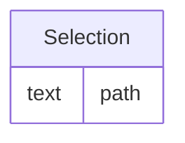

# Class: Selection

_Template for machine-readable/executable expression for retrieving the data or information from an external resource._


URI: [odm:Selection](http://www.cdisc.org/ns/odm/v2.0/Selection)





<!-- no inheritance hierarchy -->


## Slots

| Name | Cardinality* and Range | Description | Inheritance |
| ---  | --- | --- | --- |
| [path](path.md) | 1..1 <br/> [text](text.md) | Provides the machine-executable instruction or template for it to obtain the ... | direct |

_* See [LinkML documentation](https://linkml.io/linkml/schemas/slots.html#slot-cardinality) for cardinality definitions._


## Usages

| used by | used in | type | used |
| ---  | --- | --- | --- |
| [Resource](Resource.md) | [selection](selection.md) | range | [Selection](Selection.md) |


## See Also

* [https://wiki.cdisc.org/display/PUB/Selection](https://wiki.cdisc.org/display/PUB/Selection)

## Identifier and Mapping Information


### Schema Source


* from schema: http://www.cdisc.org/ns/odm/v2.0


## Mappings

| Mapping Type | Mapped Value |
| ---  | ---  |
| self | odm:Selection |
| native | odm:Selection |


## LinkML Source

<!-- TODO: investigate https://stackoverflow.com/questions/37606292/how-to-create-tabbed-code-blocks-in-mkdocs-or-sphinx -->

### Direct

<details>
```yaml
name: Selection
description: Template for machine-readable/executable expression for retrieving the
  data or information from an external resource.
from_schema: http://www.cdisc.org/ns/odm/v2.0
see_also:
- https://wiki.cdisc.org/display/PUB/Selection
rank: 1000
slots:
- path
slot_usage:
  path:
    name: path
    description: Provides the machine-executable instruction or template for it to
      obtain the data or information from the resource. The value of the Path attribute
      can either be an absolute path, or a relative path starting from the information
      in the "Name" and "Attribute" attributes of the parent Resource element.
    comments:
    - 'Required

      range: text'
    domain_of:
    - Selection
    range: text
    required: true
class_uri: odm:Selection

```
</details>

### Induced

<details>
```yaml
name: Selection
description: Template for machine-readable/executable expression for retrieving the
  data or information from an external resource.
from_schema: http://www.cdisc.org/ns/odm/v2.0
see_also:
- https://wiki.cdisc.org/display/PUB/Selection
rank: 1000
slot_usage:
  path:
    name: path
    description: Provides the machine-executable instruction or template for it to
      obtain the data or information from the resource. The value of the Path attribute
      can either be an absolute path, or a relative path starting from the information
      in the "Name" and "Attribute" attributes of the parent Resource element.
    comments:
    - 'Required

      range: text'
    domain_of:
    - Selection
    range: text
    required: true
attributes:
  path:
    name: path
    description: Provides the machine-executable instruction or template for it to
      obtain the data or information from the resource. The value of the Path attribute
      can either be an absolute path, or a relative path starting from the information
      in the "Name" and "Attribute" attributes of the parent Resource element.
    comments:
    - 'Required

      range: text'
    from_schema: http://www.cdisc.org/ns/odm/v2.0
    rank: 1000
    alias: path
    owner: Selection
    domain_of:
    - Selection
    range: text
    required: true
class_uri: odm:Selection

```
</details>