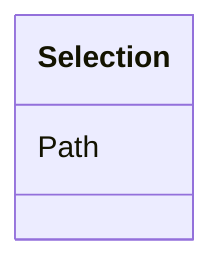

# Class: Selection


URI: [odm:Selection](http://www.cdisc.org/ns/odm/v2.0/Selection)





<!-- no inheritance hierarchy -->


## Slots

| Name | Cardinality and Range | Description | Inheritance |
| ---  | --- | --- | --- |
| [Path](Path.md) | 1..1 <br/> [Text](Text.md) |  | direct |


## Usages

| used by | used in | type | used |
| ---  | --- | --- | --- |
| [Resource](Resource.md) | [SelectionRef](SelectionRef.md) | range | [Selection](Selection.md) |


## See Also

* [https://wiki.cdisc.org/display/ODM2/Selection](https://wiki.cdisc.org/display/ODM2/Selection)

## Identifier and Mapping Information


### Schema Source


* from schema: http://www.cdisc.org/ns/odm/v2.0


## Mappings

| Mapping Type | Mapped Value |
| ---  | ---  |
| self | odm:Selection |
| native | odm:Selection |


## LinkML Source

<!-- TODO: investigate https://stackoverflow.com/questions/37606292/how-to-create-tabbed-code-blocks-in-mkdocs-or-sphinx -->

### Direct

<details>
```yaml
name: Selection
from_schema: http://www.cdisc.org/ns/odm/v2.0
see_also:
- https://wiki.cdisc.org/display/ODM2/Selection
slots:
- Path
slot_usage:
  Path:
    name: Path
    domain_of:
    - Selection
    range: text
    required: true
class_uri: odm:Selection

```
</details>

### Induced

<details>
```yaml
name: Selection
from_schema: http://www.cdisc.org/ns/odm/v2.0
see_also:
- https://wiki.cdisc.org/display/ODM2/Selection
slot_usage:
  Path:
    name: Path
    domain_of:
    - Selection
    range: text
    required: true
attributes:
  Path:
    name: Path
    from_schema: http://www.cdisc.org/ns/odm/v2.0
    rank: 1000
    alias: Path
    owner: Selection
    domain_of:
    - Selection
    range: text
    required: true
class_uri: odm:Selection

```
</details>