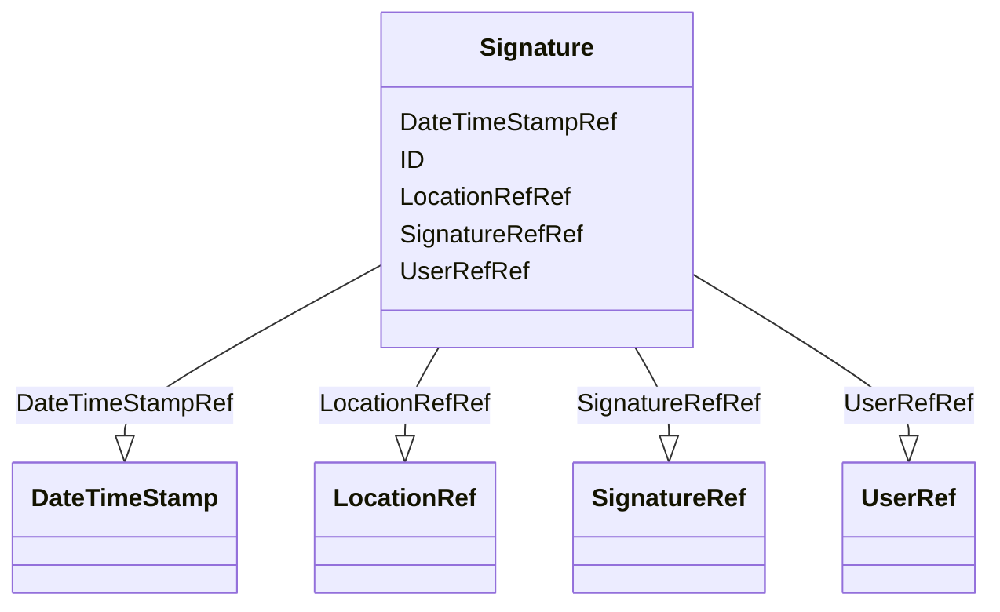

# Class: Signature


URI: [odm:Signature](http://www.cdisc.org/ns/odm/v2.0/Signature)





<!-- no inheritance hierarchy -->


## Slots

| Name | Cardinality and Range | Description | Inheritance |
| ---  | --- | --- | --- |
| [ID](ID.md) | 1..1 <br/> [Oid](Oid.md) | Unique identifier for the leaf that is referenced | direct |
| [UserRefRef](UserRefRef.md) | 1..1 <br/> [UserRef](UserRef.md) |  | direct |
| [LocationRefRef](LocationRefRef.md) | 1..1 <br/> [LocationRef](LocationRef.md) |  | direct |
| [SignatureRefRef](SignatureRefRef.md) | 1..1 <br/> [SignatureRef](SignatureRef.md) |  | direct |
| [DateTimeStampRef](DateTimeStampRef.md) | 1..1 <br/> [DateTimeStamp](DateTimeStamp.md) |  | direct |


## Usages

| used by | used in | type | used |
| ---  | --- | --- | --- |
| [ReferenceData](ReferenceData.md) | [SignatureRefRef](SignatureRefRef.md) | range | [Signature](Signature.md) |
| [ClinicalData](ClinicalData.md) | [SignatureRefRef](SignatureRefRef.md) | range | [Signature](Signature.md) |
| [SubjectData](SubjectData.md) | [SignatureRefRef](SignatureRefRef.md) | range | [Signature](Signature.md) |
| [StudyEventData](StudyEventData.md) | [SignatureRefRef](SignatureRefRef.md) | range | [Signature](Signature.md) |
| [ItemGroupData](ItemGroupData.md) | [SignatureRefRef](SignatureRefRef.md) | range | [Signature](Signature.md) |
| [ItemData](ItemData.md) | [SignatureRefRef](SignatureRefRef.md) | range | [Signature](Signature.md) |


## See Also

* [https://wiki.cdisc.org/display/ODM2/Signature](https://wiki.cdisc.org/display/ODM2/Signature)

## Identifier and Mapping Information


### Schema Source


* from schema: http://www.cdisc.org/ns/odm/v2.0


## Mappings

| Mapping Type | Mapped Value |
| ---  | ---  |
| self | odm:Signature |
| native | odm:Signature |


## LinkML Source

<!-- TODO: investigate https://stackoverflow.com/questions/37606292/how-to-create-tabbed-code-blocks-in-mkdocs-or-sphinx -->

### Direct

<details>
```yaml
name: Signature
from_schema: http://www.cdisc.org/ns/odm/v2.0
see_also:
- https://wiki.cdisc.org/display/ODM2/Signature
slots:
- ID
- UserRefRef
- LocationRefRef
- SignatureRefRef
- DateTimeStampRef
slot_usage:
  ID:
    name: ID
    domain_of:
    - leaf
    - Signature
    - Annotation
    range: oid
  UserRefRef:
    name: UserRefRef
    domain_of:
    - AdminData
    - AuditRecord
    - Signature
    range: UserRef
    required: true
    minimum_cardinality: 1
    maximum_cardinality: 1
  LocationRefRef:
    name: LocationRefRef
    domain_of:
    - AdminData
    - AuditRecord
    - Signature
    range: LocationRef
    required: true
    minimum_cardinality: 1
    maximum_cardinality: 1
  SignatureRefRef:
    name: SignatureRefRef
    domain_of:
    - ReferenceData
    - ClinicalData
    - SubjectData
    - StudyEventData
    - ItemGroupData
    - ItemData
    - Signature
    range: SignatureRef
    required: true
    minimum_cardinality: 1
    maximum_cardinality: 1
  DateTimeStampRef:
    name: DateTimeStampRef
    domain_of:
    - AuditRecord
    - Signature
    range: DateTimeStamp
    required: true
    minimum_cardinality: 1
    maximum_cardinality: 1
class_uri: odm:Signature

```
</details>

### Induced

<details>
```yaml
name: Signature
from_schema: http://www.cdisc.org/ns/odm/v2.0
see_also:
- https://wiki.cdisc.org/display/ODM2/Signature
slot_usage:
  ID:
    name: ID
    domain_of:
    - leaf
    - Signature
    - Annotation
    range: oid
  UserRefRef:
    name: UserRefRef
    domain_of:
    - AdminData
    - AuditRecord
    - Signature
    range: UserRef
    required: true
    minimum_cardinality: 1
    maximum_cardinality: 1
  LocationRefRef:
    name: LocationRefRef
    domain_of:
    - AdminData
    - AuditRecord
    - Signature
    range: LocationRef
    required: true
    minimum_cardinality: 1
    maximum_cardinality: 1
  SignatureRefRef:
    name: SignatureRefRef
    domain_of:
    - ReferenceData
    - ClinicalData
    - SubjectData
    - StudyEventData
    - ItemGroupData
    - ItemData
    - Signature
    range: SignatureRef
    required: true
    minimum_cardinality: 1
    maximum_cardinality: 1
  DateTimeStampRef:
    name: DateTimeStampRef
    domain_of:
    - AuditRecord
    - Signature
    range: DateTimeStamp
    required: true
    minimum_cardinality: 1
    maximum_cardinality: 1
attributes:
  ID:
    name: ID
    description: Unique identifier for the leaf that is referenced.
    from_schema: http://www.cdisc.org/ns/odm/v2.0
    rank: 1000
    identifier: true
    alias: ID
    owner: Signature
    domain_of:
    - leaf
    - Signature
    - Annotation
    range: oid
    required: true
  UserRefRef:
    name: UserRefRef
    from_schema: http://www.cdisc.org/ns/odm/v2.0
    rank: 1000
    alias: UserRefRef
    owner: Signature
    domain_of:
    - AdminData
    - AuditRecord
    - Signature
    range: UserRef
    required: true
    minimum_cardinality: 1
    maximum_cardinality: 1
  LocationRefRef:
    name: LocationRefRef
    from_schema: http://www.cdisc.org/ns/odm/v2.0
    rank: 1000
    alias: LocationRefRef
    owner: Signature
    domain_of:
    - AdminData
    - AuditRecord
    - Signature
    range: LocationRef
    required: true
    minimum_cardinality: 1
    maximum_cardinality: 1
  SignatureRefRef:
    name: SignatureRefRef
    from_schema: http://www.cdisc.org/ns/odm/v2.0
    rank: 1000
    alias: SignatureRefRef
    owner: Signature
    domain_of:
    - ReferenceData
    - ClinicalData
    - SubjectData
    - StudyEventData
    - ItemGroupData
    - ItemData
    - Signature
    range: SignatureRef
    required: true
    minimum_cardinality: 1
    maximum_cardinality: 1
  DateTimeStampRef:
    name: DateTimeStampRef
    from_schema: http://www.cdisc.org/ns/odm/v2.0
    rank: 1000
    alias: DateTimeStampRef
    owner: Signature
    domain_of:
    - AuditRecord
    - Signature
    range: DateTimeStamp
    required: true
    minimum_cardinality: 1
    maximum_cardinality: 1
class_uri: odm:Signature

```
</details>