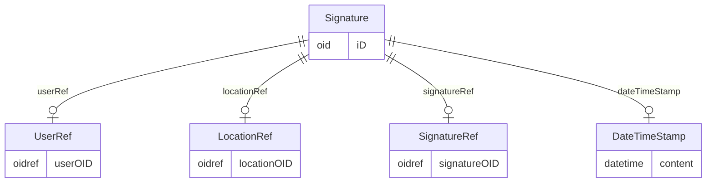

# Class: Signature

_An electronic signature applies to a collection of clinical data. This indicates that some user accepts legal responsibility for that data. See 21 CFR Part 11. The signature identifies the person signing, the location of signing, the signature meaning (via the referenced SignatureDef), the date and time of signing, and (in the case of a digital signature) an encrypted hash of the included data._


URI: [odm:Signature](http://www.cdisc.org/ns/odm/v2.0/Signature)





<!-- no inheritance hierarchy -->


## Slots

| Name | Cardinality* and Range | Description | Inheritance |
| ---  | --- | --- | --- |
| [iD](iD.md) | 1..1 <br/> [oid](oid.md) | Unique identifier for the leaf that is referenced. | direct |
| [userRef](userRef.md) | 0..1 <br/> [UserRef](UserRef.md) | UserRef reference: A reference to information about a specific user of a clin... | direct |
| [locationRef](locationRef.md) | 0..1 <br/> [LocationRef](LocationRef.md) | LocationRef reference: A reference to the user's physical location. | direct |
| [signatureRef](signatureRef.md) | 0..1 <br/> [SignatureRef](SignatureRef.md) | SignatureRef reference: A reference to the signature meaning. | direct |
| [dateTimeStamp](dateTimeStamp.md) | 0..1 <br/> [DateTimeStamp](DateTimeStamp.md) | DateTimeStamp reference: Date and time when an action was performed. | direct |

_* See [LinkML documentation](https://linkml.io/linkml/schemas/slots.html#slot-cardinality) for cardinality definitions._


## Usages

| used by | used in | type | used |
| ---  | --- | --- | --- |
| [ReferenceData](ReferenceData.md) | [signature](signature.md) | range | [Signature](Signature.md) |
| [ClinicalData](ClinicalData.md) | [signature](signature.md) | range | [Signature](Signature.md) |
| [SubjectData](SubjectData.md) | [signature](signature.md) | range | [Signature](Signature.md) |
| [StudyEventData](StudyEventData.md) | [signature](signature.md) | range | [Signature](Signature.md) |
| [ItemGroupData](ItemGroupData.md) | [signature](signature.md) | range | [Signature](Signature.md) |
| [ItemData](ItemData.md) | [signature](signature.md) | range | [Signature](Signature.md) |


## See Also

* [https://wiki.cdisc.org/display/PUB/Signature](https://wiki.cdisc.org/display/PUB/Signature)

## Identifier and Mapping Information


### Schema Source


* from schema: http://www.cdisc.org/ns/odm/v2.0


## Mappings

| Mapping Type | Mapped Value |
| ---  | ---  |
| self | odm:Signature |
| native | odm:Signature |


## LinkML Source

<!-- TODO: investigate https://stackoverflow.com/questions/37606292/how-to-create-tabbed-code-blocks-in-mkdocs-or-sphinx -->

### Direct

<details>
```yaml
name: Signature
description: An electronic signature applies to a collection of clinical data. This
  indicates that some user accepts legal responsibility for that data. See 21 CFR
  Part 11. The signature identifies the person signing, the location of signing, the
  signature meaning (via the referenced SignatureDef), the date and time of signing,
  and (in the case of a digital signature) an encrypted hash of the included data.
from_schema: http://www.cdisc.org/ns/odm/v2.0
see_also:
- https://wiki.cdisc.org/display/PUB/Signature
rank: 1000
slots:
- iD
- userRef
- locationRef
- signatureRef
- dateTimeStamp
slot_usage:
  iD:
    name: iD
    domain_of:
    - Leaf
    - Signature
    - Annotation
    range: oid
  userRef:
    name: userRef
    domain_of:
    - AuditRecord
    - Signature
    range: UserRef
    maximum_cardinality: 1
  locationRef:
    name: locationRef
    domain_of:
    - AuditRecord
    - Signature
    range: LocationRef
    maximum_cardinality: 1
  signatureRef:
    name: signatureRef
    domain_of:
    - Signature
    range: SignatureRef
    maximum_cardinality: 1
  dateTimeStamp:
    name: dateTimeStamp
    domain_of:
    - AuditRecord
    - Signature
    range: DateTimeStamp
    maximum_cardinality: 1
class_uri: odm:Signature

```
</details>

### Induced

<details>
```yaml
name: Signature
description: An electronic signature applies to a collection of clinical data. This
  indicates that some user accepts legal responsibility for that data. See 21 CFR
  Part 11. The signature identifies the person signing, the location of signing, the
  signature meaning (via the referenced SignatureDef), the date and time of signing,
  and (in the case of a digital signature) an encrypted hash of the included data.
from_schema: http://www.cdisc.org/ns/odm/v2.0
see_also:
- https://wiki.cdisc.org/display/PUB/Signature
rank: 1000
slot_usage:
  iD:
    name: iD
    domain_of:
    - Leaf
    - Signature
    - Annotation
    range: oid
  userRef:
    name: userRef
    domain_of:
    - AuditRecord
    - Signature
    range: UserRef
    maximum_cardinality: 1
  locationRef:
    name: locationRef
    domain_of:
    - AuditRecord
    - Signature
    range: LocationRef
    maximum_cardinality: 1
  signatureRef:
    name: signatureRef
    domain_of:
    - Signature
    range: SignatureRef
    maximum_cardinality: 1
  dateTimeStamp:
    name: dateTimeStamp
    domain_of:
    - AuditRecord
    - Signature
    range: DateTimeStamp
    maximum_cardinality: 1
attributes:
  iD:
    name: iD
    description: Unique identifier for the leaf that is referenced.
    from_schema: http://www.cdisc.org/ns/odm/v2.0
    rank: 1000
    identifier: true
    alias: iD
    owner: Signature
    domain_of:
    - Leaf
    - Signature
    - Annotation
    range: oid
    required: true
  userRef:
    name: userRef
    description: 'UserRef reference: A reference to information about a specific user
      of a clinical data collection or data management system.'
    from_schema: http://www.cdisc.org/ns/odm/v2.0
    rank: 1000
    identifier: false
    alias: userRef
    owner: Signature
    domain_of:
    - AuditRecord
    - Signature
    range: UserRef
    maximum_cardinality: 1
  locationRef:
    name: locationRef
    description: 'LocationRef reference: A reference to the user''s physical location.'
    from_schema: http://www.cdisc.org/ns/odm/v2.0
    rank: 1000
    identifier: false
    alias: locationRef
    owner: Signature
    domain_of:
    - AuditRecord
    - Signature
    range: LocationRef
    maximum_cardinality: 1
  signatureRef:
    name: signatureRef
    description: 'SignatureRef reference: A reference to the signature meaning.'
    from_schema: http://www.cdisc.org/ns/odm/v2.0
    rank: 1000
    identifier: false
    alias: signatureRef
    owner: Signature
    domain_of:
    - Signature
    range: SignatureRef
    maximum_cardinality: 1
  dateTimeStamp:
    name: dateTimeStamp
    description: 'DateTimeStamp reference: Date and time when an action was performed.'
    from_schema: http://www.cdisc.org/ns/odm/v2.0
    rank: 1000
    identifier: false
    alias: dateTimeStamp
    owner: Signature
    domain_of:
    - AuditRecord
    - Signature
    range: DateTimeStamp
    maximum_cardinality: 1
class_uri: odm:Signature

```
</details>