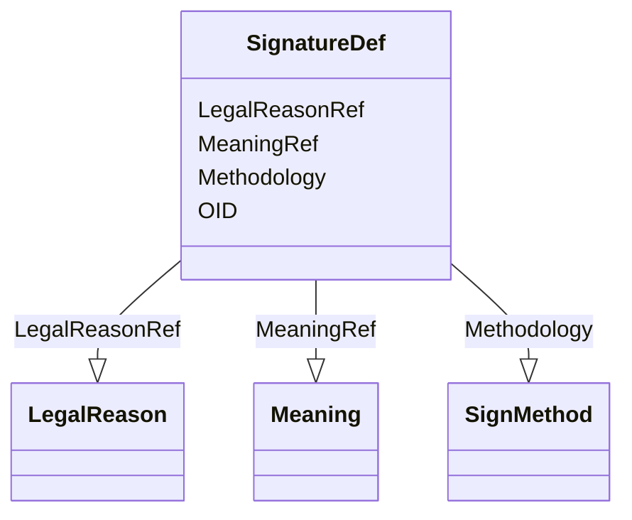

# Class: SignatureDef


URI: [odm:SignatureDef](http://www.cdisc.org/ns/odm/v2.0/SignatureDef)





<!-- no inheritance hierarchy -->


## Slots

| Name | Cardinality and Range | Description | Inheritance |
| ---  | --- | --- | --- |
| [OID](OID.md) | 1..1 <br/> [Oid](Oid.md) | Unique identifier of the version within the XML document | direct |
| [Methodology](Methodology.md) | 0..1 <br/> [SignMethod](SignMethod.md) |  | direct |
| [MeaningRef](MeaningRef.md) | 1..1 <br/> [Meaning](Meaning.md) |  | direct |
| [LegalReasonRef](LegalReasonRef.md) | 1..1 <br/> [LegalReason](LegalReason.md) |  | direct |


## Usages

| used by | used in | type | used |
| ---  | --- | --- | --- |
| [AdminData](AdminData.md) | [SignatureDefRef](SignatureDefRef.md) | range | [SignatureDef](SignatureDef.md) |


## Identifier and Mapping Information


### Schema Source


* from schema: http://www.cdisc.org/ns/odm/v2.0


## Mappings

| Mapping Type | Mapped Value |
| ---  | ---  |
| self | odm:SignatureDef |
| native | odm:SignatureDef |


## LinkML Source

<!-- TODO: investigate https://stackoverflow.com/questions/37606292/how-to-create-tabbed-code-blocks-in-mkdocs-or-sphinx -->

### Direct

<details>
```yaml
name: SignatureDef
from_schema: http://www.cdisc.org/ns/odm/v2.0
slots:
- OID
- Methodology
- MeaningRef
- LegalReasonRef
slot_usage:
  OID:
    name: OID
    domain_of:
    - ValueListDef
    - WhereClauseDef
    - StudyEventGroupDef
    - CommentDef
    - StudyIndication
    - StudyIntervention
    - StudyObjective
    - StudyEndPoint
    - StudyTargetPopulation
    - StudyEstimand
    - Arm
    - Epoch
    - StudyParameter
    - StudyTiming
    - TransitionTimingConstraint
    - AbsoluteTimingConstraint
    - RelativeTimingConstraint
    - DurationTimingConstraint
    - WorkflowDef
    - Transition
    - Branching
    - Criterion
    - ExceptionEvent
    - Organization
    - Query
    - MetaDataVersion
    - StudyEventDef
    - ItemGroupDef
    - ItemDef
    - CodeList
    - ConditionDef
    - MethodDef
    - Standard
    - User
    - Location
    - SignatureDef
    - Study
    range: oid
    required: true
  Methodology:
    name: Methodology
    domain_of:
    - SignatureDef
    range: SignMethod
    required: false
  MeaningRef:
    name: MeaningRef
    domain_of:
    - SignatureDef
    range: Meaning
    required: true
    minimum_cardinality: 1
    maximum_cardinality: 1
  LegalReasonRef:
    name: LegalReasonRef
    domain_of:
    - SignatureDef
    range: LegalReason
    required: true
    minimum_cardinality: 1
    maximum_cardinality: 1
class_uri: odm:SignatureDef
unique_keys:
  UC-AD-3:
    unique_key_name: UC-AD-3
    unique_key_slots:
    - OID

```
</details>

### Induced

<details>
```yaml
name: SignatureDef
from_schema: http://www.cdisc.org/ns/odm/v2.0
slot_usage:
  OID:
    name: OID
    domain_of:
    - ValueListDef
    - WhereClauseDef
    - StudyEventGroupDef
    - CommentDef
    - StudyIndication
    - StudyIntervention
    - StudyObjective
    - StudyEndPoint
    - StudyTargetPopulation
    - StudyEstimand
    - Arm
    - Epoch
    - StudyParameter
    - StudyTiming
    - TransitionTimingConstraint
    - AbsoluteTimingConstraint
    - RelativeTimingConstraint
    - DurationTimingConstraint
    - WorkflowDef
    - Transition
    - Branching
    - Criterion
    - ExceptionEvent
    - Organization
    - Query
    - MetaDataVersion
    - StudyEventDef
    - ItemGroupDef
    - ItemDef
    - CodeList
    - ConditionDef
    - MethodDef
    - Standard
    - User
    - Location
    - SignatureDef
    - Study
    range: oid
    required: true
  Methodology:
    name: Methodology
    domain_of:
    - SignatureDef
    range: SignMethod
    required: false
  MeaningRef:
    name: MeaningRef
    domain_of:
    - SignatureDef
    range: Meaning
    required: true
    minimum_cardinality: 1
    maximum_cardinality: 1
  LegalReasonRef:
    name: LegalReasonRef
    domain_of:
    - SignatureDef
    range: LegalReason
    required: true
    minimum_cardinality: 1
    maximum_cardinality: 1
attributes:
  OID:
    name: OID
    description: Unique identifier of the version within the XML document.
    from_schema: http://www.cdisc.org/ns/odm/v2.0
    rank: 1000
    alias: OID
    owner: SignatureDef
    domain_of:
    - ValueListDef
    - WhereClauseDef
    - StudyEventGroupDef
    - CommentDef
    - StudyIndication
    - StudyIntervention
    - StudyObjective
    - StudyEndPoint
    - StudyTargetPopulation
    - StudyEstimand
    - Arm
    - Epoch
    - StudyParameter
    - StudyTiming
    - TransitionTimingConstraint
    - AbsoluteTimingConstraint
    - RelativeTimingConstraint
    - DurationTimingConstraint
    - WorkflowDef
    - Transition
    - Branching
    - Criterion
    - ExceptionEvent
    - Organization
    - Query
    - MetaDataVersion
    - StudyEventDef
    - ItemGroupDef
    - ItemDef
    - CodeList
    - ConditionDef
    - MethodDef
    - Standard
    - User
    - Location
    - SignatureDef
    - Study
    range: oid
    required: true
  Methodology:
    name: Methodology
    from_schema: http://www.cdisc.org/ns/odm/v2.0
    rank: 1000
    alias: Methodology
    owner: SignatureDef
    domain_of:
    - SignatureDef
    range: SignMethod
    required: false
  MeaningRef:
    name: MeaningRef
    from_schema: http://www.cdisc.org/ns/odm/v2.0
    rank: 1000
    alias: MeaningRef
    owner: SignatureDef
    domain_of:
    - SignatureDef
    range: Meaning
    required: true
    minimum_cardinality: 1
    maximum_cardinality: 1
  LegalReasonRef:
    name: LegalReasonRef
    from_schema: http://www.cdisc.org/ns/odm/v2.0
    rank: 1000
    alias: LegalReasonRef
    owner: SignatureDef
    domain_of:
    - SignatureDef
    range: LegalReason
    required: true
    minimum_cardinality: 1
    maximum_cardinality: 1
class_uri: odm:SignatureDef
unique_keys:
  UC-AD-3:
    unique_key_name: UC-AD-3
    unique_key_slots:
    - OID

```
</details>