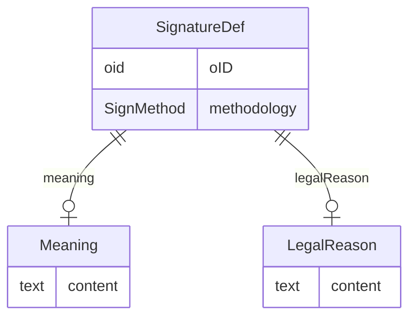

# Class: SignatureDef

_Provides Metadata for signatures included in the /ODM/ClinicalData._


URI: [odm:SignatureDef](http://www.cdisc.org/ns/odm/v2.0/SignatureDef)





<!-- no inheritance hierarchy -->


## Slots

| Name | Cardinality* and Range | Description | Inheritance |
| ---  | --- | --- | --- |
| [oID](oID.md) | 1..1 <br/> [oid](oid.md) | Unique identifier. | direct |
| [methodology](methodology.md) | 0..1 <br/> [SignMethod](SignMethod.md) | Defines the type of electronic signature, including the meaning as required b... | direct |
| [meaning](meaning.md) | 0..1 <br/> [Meaning](Meaning.md) | Meaning reference: A short name or description for this signature. It should ... | direct |
| [legalReason](legalReason.md) | 0..1 <br/> [LegalReason](LegalReason.md) | LegalReason reference: The responsibility statement associated with a signatu... | direct |

_* See [LinkML documentation](https://linkml.io/linkml/schemas/slots.html#slot-cardinality) for cardinality definitions._


## Usages

| used by | used in | type | used |
| ---  | --- | --- | --- |
| [AdminData](AdminData.md) | [signatureDef](signatureDef.md) | range | [SignatureDef](SignatureDef.md) |


## See Also

* [https://wiki.cdisc.org/display/PUB/SignatureDef](https://wiki.cdisc.org/display/PUB/SignatureDef)

## Identifier and Mapping Information


### Schema Source


* from schema: http://www.cdisc.org/ns/odm/v2.0


## Mappings

| Mapping Type | Mapped Value |
| ---  | ---  |
| self | odm:SignatureDef |
| native | odm:SignatureDef |


## LinkML Source

<!-- TODO: investigate https://stackoverflow.com/questions/37606292/how-to-create-tabbed-code-blocks-in-mkdocs-or-sphinx -->

### Direct

<details>
```yaml
name: SignatureDef
description: Provides Metadata for signatures included in the /ODM/ClinicalData.
from_schema: http://www.cdisc.org/ns/odm/v2.0
see_also:
- https://wiki.cdisc.org/display/PUB/SignatureDef
rank: 1000
slots:
- oID
- methodology
- meaning
- legalReason
slot_usage:
  oID:
    name: oID
    description: Unique identifier.
    comments:
    - 'Required

      range: oid

      Must be unique within a study.'
    domain_of:
    - Study
    - MetaDataVersion
    - Standard
    - ValueListDef
    - WhereClauseDef
    - StudyEventGroupDef
    - StudyEventDef
    - ItemGroupDef
    - ItemDef
    - CodeList
    - MethodDef
    - ConditionDef
    - CommentDef
    - StudyIndication
    - StudyIntervention
    - StudyObjective
    - StudyEndPoint
    - StudyTargetPopulation
    - StudyEstimand
    - Arm
    - Epoch
    - StudyParameter
    - StudyTiming
    - TransitionTimingConstraint
    - AbsoluteTimingConstraint
    - RelativeTimingConstraint
    - DurationTimingConstraint
    - WorkflowDef
    - Transition
    - Branching
    - Criterion
    - User
    - Organization
    - Location
    - SignatureDef
    - Query
    range: oid
    required: true
  methodology:
    name: methodology
    description: Defines the type of electronic signature, including the meaning as
      required by 21 CFR Part 11 .
    comments:
    - 'Optional

      enum values: (Digital | Electronic)

      If the signature is digital, it is based on cryptography. Otherwise the signature
      is electronic.'
    domain_of:
    - SignatureDef
    range: SignMethod
  meaning:
    name: meaning
    domain_of:
    - SignatureDef
    range: Meaning
    maximum_cardinality: 1
  legalReason:
    name: legalReason
    domain_of:
    - SignatureDef
    range: LegalReason
    maximum_cardinality: 1
class_uri: odm:SignatureDef

```
</details>

### Induced

<details>
```yaml
name: SignatureDef
description: Provides Metadata for signatures included in the /ODM/ClinicalData.
from_schema: http://www.cdisc.org/ns/odm/v2.0
see_also:
- https://wiki.cdisc.org/display/PUB/SignatureDef
rank: 1000
slot_usage:
  oID:
    name: oID
    description: Unique identifier.
    comments:
    - 'Required

      range: oid

      Must be unique within a study.'
    domain_of:
    - Study
    - MetaDataVersion
    - Standard
    - ValueListDef
    - WhereClauseDef
    - StudyEventGroupDef
    - StudyEventDef
    - ItemGroupDef
    - ItemDef
    - CodeList
    - MethodDef
    - ConditionDef
    - CommentDef
    - StudyIndication
    - StudyIntervention
    - StudyObjective
    - StudyEndPoint
    - StudyTargetPopulation
    - StudyEstimand
    - Arm
    - Epoch
    - StudyParameter
    - StudyTiming
    - TransitionTimingConstraint
    - AbsoluteTimingConstraint
    - RelativeTimingConstraint
    - DurationTimingConstraint
    - WorkflowDef
    - Transition
    - Branching
    - Criterion
    - User
    - Organization
    - Location
    - SignatureDef
    - Query
    range: oid
    required: true
  methodology:
    name: methodology
    description: Defines the type of electronic signature, including the meaning as
      required by 21 CFR Part 11 .
    comments:
    - 'Optional

      enum values: (Digital | Electronic)

      If the signature is digital, it is based on cryptography. Otherwise the signature
      is electronic.'
    domain_of:
    - SignatureDef
    range: SignMethod
  meaning:
    name: meaning
    domain_of:
    - SignatureDef
    range: Meaning
    maximum_cardinality: 1
  legalReason:
    name: legalReason
    domain_of:
    - SignatureDef
    range: LegalReason
    maximum_cardinality: 1
attributes:
  oID:
    name: oID
    description: Unique identifier.
    comments:
    - 'Required

      range: oid

      Must be unique within a study.'
    from_schema: http://www.cdisc.org/ns/odm/v2.0
    rank: 1000
    identifier: true
    alias: oID
    owner: SignatureDef
    domain_of:
    - Study
    - MetaDataVersion
    - Standard
    - ValueListDef
    - WhereClauseDef
    - StudyEventGroupDef
    - StudyEventDef
    - ItemGroupDef
    - ItemDef
    - CodeList
    - MethodDef
    - ConditionDef
    - CommentDef
    - StudyIndication
    - StudyIntervention
    - StudyObjective
    - StudyEndPoint
    - StudyTargetPopulation
    - StudyEstimand
    - Arm
    - Epoch
    - StudyParameter
    - StudyTiming
    - TransitionTimingConstraint
    - AbsoluteTimingConstraint
    - RelativeTimingConstraint
    - DurationTimingConstraint
    - WorkflowDef
    - Transition
    - Branching
    - Criterion
    - User
    - Organization
    - Location
    - SignatureDef
    - Query
    range: oid
    required: true
  methodology:
    name: methodology
    description: Defines the type of electronic signature, including the meaning as
      required by 21 CFR Part 11 .
    comments:
    - 'Optional

      enum values: (Digital | Electronic)

      If the signature is digital, it is based on cryptography. Otherwise the signature
      is electronic.'
    from_schema: http://www.cdisc.org/ns/odm/v2.0
    rank: 1000
    alias: methodology
    owner: SignatureDef
    domain_of:
    - SignatureDef
    range: SignMethod
  meaning:
    name: meaning
    description: 'Meaning reference: A short name or description for this signature.
      It should reflect the context of the signature and/or the text that appears
      when the signature is applied in the user interface.'
    from_schema: http://www.cdisc.org/ns/odm/v2.0
    rank: 1000
    identifier: false
    alias: meaning
    owner: SignatureDef
    domain_of:
    - SignatureDef
    range: Meaning
    maximum_cardinality: 1
  legalReason:
    name: legalReason
    description: 'LegalReason reference: The responsibility statement associated with
      a signature (e.g., "The signer accepts responsibility for the accuracy of this
      data.").'
    from_schema: http://www.cdisc.org/ns/odm/v2.0
    rank: 1000
    identifier: false
    alias: legalReason
    owner: SignatureDef
    domain_of:
    - SignatureDef
    range: LegalReason
    maximum_cardinality: 1
class_uri: odm:SignatureDef

```
</details>