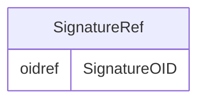

# Class: SignatureRef

_A reference to the signature meaning._


URI: [odm:SignatureRef](http://www.cdisc.org/ns/odm/v2.0/SignatureRef)





<!-- no inheritance hierarchy -->


## Slots

| Name | Cardinality* and Range | Description | Inheritance |
| ---  | --- | --- | --- |
| [SignatureOID](SignatureOID.md) | 1..1 <br/> [oidref](oidref.md) | Reference to the SignatureDef . | direct |

_* See [LinkML documentation](https://linkml.io/linkml/schemas/slots.html#slot-cardinality) for cardinality definitions._


## Usages

| used by | used in | type | used |
| ---  | --- | --- | --- |
| [Signature](Signature.md) | [SignatureRefRef](SignatureRefRef.md) | range | [SignatureRef](SignatureRef.md) |


## See Also

* [https://wiki.cdisc.org/display/PUB/SignatureRef](https://wiki.cdisc.org/display/PUB/SignatureRef)

## Identifier and Mapping Information


### Schema Source


* from schema: http://www.cdisc.org/ns/odm/v2.0


## Mappings

| Mapping Type | Mapped Value |
| ---  | ---  |
| self | odm:SignatureRef |
| native | odm:SignatureRef |


## LinkML Source

<!-- TODO: investigate https://stackoverflow.com/questions/37606292/how-to-create-tabbed-code-blocks-in-mkdocs-or-sphinx -->

### Direct

<details>
```yaml
name: SignatureRef
description: A reference to the signature meaning.
from_schema: http://www.cdisc.org/ns/odm/v2.0
see_also:
- https://wiki.cdisc.org/display/PUB/SignatureRef
rank: 1000
slots:
- SignatureOID
slot_usage:
  SignatureOID:
    name: SignatureOID
    description: Reference to the SignatureDef .
    comments:
    - 'Required

      range: oidref'
    domain_of:
    - SignatureRef
    range: oidref
    required: true
class_uri: odm:SignatureRef

```
</details>

### Induced

<details>
```yaml
name: SignatureRef
description: A reference to the signature meaning.
from_schema: http://www.cdisc.org/ns/odm/v2.0
see_also:
- https://wiki.cdisc.org/display/PUB/SignatureRef
rank: 1000
slot_usage:
  SignatureOID:
    name: SignatureOID
    description: Reference to the SignatureDef .
    comments:
    - 'Required

      range: oidref'
    domain_of:
    - SignatureRef
    range: oidref
    required: true
attributes:
  SignatureOID:
    name: SignatureOID
    description: Reference to the SignatureDef .
    comments:
    - 'Required

      range: oidref'
    from_schema: http://www.cdisc.org/ns/odm/v2.0
    rank: 1000
    alias: SignatureOID
    owner: SignatureRef
    domain_of:
    - SignatureRef
    range: oidref
    required: true
class_uri: odm:SignatureRef

```
</details>