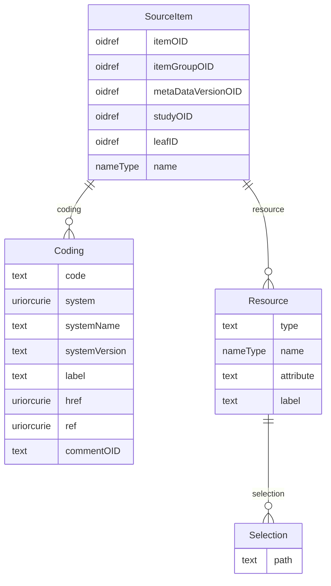

# Class: SourceItem

_Provides the information needed to identify the source metadata._


URI: [odm:SourceItem](http://www.cdisc.org/ns/odm/v2.0/SourceItem)





<!-- no inheritance hierarchy -->


## Slots

| Name | Cardinality* and Range | Description | Inheritance |
| ---  | --- | --- | --- |
| [itemOID](itemOID.md) | 0..1 <br/> [oidref](oidref.md) | References the ItemDef that provides the variable metadata. | direct |
| [itemGroupOID](itemGroupOID.md) | 0..1 <br/> [oidref](oidref.md) | References the ItemGroupDef that provides the ItemGroup or dataset metadata. | direct |
| [metaDataVersionOID](metaDataVersionOID.md) | 0..1 <br/> [oidref](oidref.md) | References the MetaDataVersion that provides the metadata when referencing an... | direct |
| [studyOID](studyOID.md) | 0..1 <br/> [oidref](oidref.md) | References the Study that provides the metadata when referencing another ODM ... | direct |
| [leafID](leafID.md) | 0..1 <br/> [oidref](oidref.md) | References a leaf element that provides a reference to another ODM document. ... | direct |
| [name](name.md) | 0..1 <br/> [nameType](nameType.md) | Provides a way to connect an argument to a parameter when SourceItems are inp... | direct |
| [resource](resource.md) | 0..* <br/> [Resource](Resource.md) | Resource reference: Describes an external resource used as the source for the... | direct |
| [coding](coding.md) | 0..* <br/> [Coding](Coding.md) | Coding reference: Coding references a symbol from a defined code system. It u... | direct |

_* See [LinkML documentation](https://linkml.io/linkml/schemas/slots.html#slot-cardinality) for cardinality definitions._


## Usages

| used by | used in | type | used |
| ---  | --- | --- | --- |
| [SourceItems](SourceItems.md) | [sourceItem](sourceItem.md) | range | [SourceItem](SourceItem.md) |


## See Also

* [https://wiki.cdisc.org/display/PUB/SourceItem](https://wiki.cdisc.org/display/PUB/SourceItem)

## Identifier and Mapping Information


### Schema Source


* from schema: http://www.cdisc.org/ns/odm/v2.0


## Mappings

| Mapping Type | Mapped Value |
| ---  | ---  |
| self | odm:SourceItem |
| native | odm:SourceItem |


## LinkML Source

<!-- TODO: investigate https://stackoverflow.com/questions/37606292/how-to-create-tabbed-code-blocks-in-mkdocs-or-sphinx -->

### Direct

<details>
```yaml
name: SourceItem
description: Provides the information needed to identify the source metadata.
from_schema: http://www.cdisc.org/ns/odm/v2.0
see_also:
- https://wiki.cdisc.org/display/PUB/SourceItem
rank: 1000
slots:
- itemOID
- itemGroupOID
- metaDataVersionOID
- studyOID
- leafID
- name
- resource
- coding
slot_usage:
  itemOID:
    name: itemOID
    description: References the ItemDef that provides the variable metadata.
    comments:
    - 'Optional

      range: oidref

      Must match the OID for an ItemDef element. The referenced ItemDef element can
      be in the same ODM document or another ODM document.'
    domain_of:
    - ItemRef
    - SourceItem
    - RangeCheck
    - ItemData
    - KeySet
    range: oidref
  itemGroupOID:
    name: itemGroupOID
    description: References the ItemGroupDef that provides the ItemGroup or dataset
      metadata.
    comments:
    - 'Optional

      range: oidref

      Must match the OID for an ItemGroupDef element. The referenced ItemGroupDef
      element can be in the same ODM document or another ODM document.'
    domain_of:
    - ItemGroupRef
    - SourceItem
    - ItemGroupData
    - KeySet
    range: oidref
  metaDataVersionOID:
    name: metaDataVersionOID
    description: References the MetaDataVersion that provides the metadata when referencing
      another ODM document.
    comments:
    - 'Optional

      range: oidref

      Must match the OID of a MetaDataVersion element. The referenced MetaDataVersion
      element can be in the same ODM document or another ODM document. Must be provided
      if the reference is not to an object within the same MetaDataVersion element.'
    domain_of:
    - Include
    - SourceItem
    - MetaDataVersionRef
    - ReferenceData
    - ClinicalData
    - Association
    - KeySet
    range: oidref
  studyOID:
    name: studyOID
    description: References the Study that provides the metadata when referencing
      another ODM document.
    comments:
    - 'Optional

      range: oidref

      Must match the OID for an Study element. The referenced Study element can be
      in the same ODM document or another ODM document. Must be provided if the reference
      is not to an object within the same Study element.'
    domain_of:
    - Include
    - SourceItem
    - AdminData
    - MetaDataVersionRef
    - ReferenceData
    - ClinicalData
    - Association
    - KeySet
    range: oidref
  leafID:
    name: leafID
    description: References a leaf element that provides a reference to another ODM
      document. This is necessary when the source ItemOID references an ItemDef contained
      in a different ODM document.
    comments:
    - 'Optional

      range: IDREF

      When referencing another ODM document it is necessary to have values for the
      MetaDataVersionOID and StudyOID attributes.'
    domain_of:
    - DocumentRef
    - SourceItem
    range: oidref
  name:
    name: name
    description: Provides a way to connect an argument to a parameter when SourceItems
      are inputs to methods. It allows the name used in the programming code in the
      method description to make it easier to trace the use of the value.
    comments:
    - 'Optional

      range: name'
    domain_of:
    - Alias
    - MetaDataVersion
    - Standard
    - StudyEventGroupDef
    - StudyEventDef
    - ItemGroupDef
    - Class
    - SubClass
    - SourceItem
    - Resource
    - ItemDef
    - CodeList
    - MethodDef
    - Parameter
    - ReturnValue
    - ConditionDef
    - StudyObjective
    - StudyEndPoint
    - StudyTargetPopulation
    - StudyEstimand
    - Arm
    - Epoch
    - StudyTiming
    - TransitionTimingConstraint
    - AbsoluteTimingConstraint
    - RelativeTimingConstraint
    - DurationTimingConstraint
    - WorkflowDef
    - Transition
    - Branching
    - Criterion
    - Organization
    - Location
    - Query
    range: nameType
  resource:
    name: resource
    multivalued: true
    domain_of:
    - SourceItem
    range: Resource
    inlined: true
    inlined_as_list: true
  coding:
    name: coding
    multivalued: true
    domain_of:
    - StudyEventGroupDef
    - StudyEventDef
    - ItemGroupDef
    - Origin
    - SourceItems
    - SourceItem
    - ItemDef
    - CodeList
    - CodeListItem
    - StudyIndication
    - StudyIntervention
    - StudyTargetPopulation
    - StudyParameter
    - ParameterValue
    - Criterion
    - Annotation
    range: Coding
    inlined: true
    inlined_as_list: true
class_uri: odm:SourceItem

```
</details>

### Induced

<details>
```yaml
name: SourceItem
description: Provides the information needed to identify the source metadata.
from_schema: http://www.cdisc.org/ns/odm/v2.0
see_also:
- https://wiki.cdisc.org/display/PUB/SourceItem
rank: 1000
slot_usage:
  itemOID:
    name: itemOID
    description: References the ItemDef that provides the variable metadata.
    comments:
    - 'Optional

      range: oidref

      Must match the OID for an ItemDef element. The referenced ItemDef element can
      be in the same ODM document or another ODM document.'
    domain_of:
    - ItemRef
    - SourceItem
    - RangeCheck
    - ItemData
    - KeySet
    range: oidref
  itemGroupOID:
    name: itemGroupOID
    description: References the ItemGroupDef that provides the ItemGroup or dataset
      metadata.
    comments:
    - 'Optional

      range: oidref

      Must match the OID for an ItemGroupDef element. The referenced ItemGroupDef
      element can be in the same ODM document or another ODM document.'
    domain_of:
    - ItemGroupRef
    - SourceItem
    - ItemGroupData
    - KeySet
    range: oidref
  metaDataVersionOID:
    name: metaDataVersionOID
    description: References the MetaDataVersion that provides the metadata when referencing
      another ODM document.
    comments:
    - 'Optional

      range: oidref

      Must match the OID of a MetaDataVersion element. The referenced MetaDataVersion
      element can be in the same ODM document or another ODM document. Must be provided
      if the reference is not to an object within the same MetaDataVersion element.'
    domain_of:
    - Include
    - SourceItem
    - MetaDataVersionRef
    - ReferenceData
    - ClinicalData
    - Association
    - KeySet
    range: oidref
  studyOID:
    name: studyOID
    description: References the Study that provides the metadata when referencing
      another ODM document.
    comments:
    - 'Optional

      range: oidref

      Must match the OID for an Study element. The referenced Study element can be
      in the same ODM document or another ODM document. Must be provided if the reference
      is not to an object within the same Study element.'
    domain_of:
    - Include
    - SourceItem
    - AdminData
    - MetaDataVersionRef
    - ReferenceData
    - ClinicalData
    - Association
    - KeySet
    range: oidref
  leafID:
    name: leafID
    description: References a leaf element that provides a reference to another ODM
      document. This is necessary when the source ItemOID references an ItemDef contained
      in a different ODM document.
    comments:
    - 'Optional

      range: IDREF

      When referencing another ODM document it is necessary to have values for the
      MetaDataVersionOID and StudyOID attributes.'
    domain_of:
    - DocumentRef
    - SourceItem
    range: oidref
  name:
    name: name
    description: Provides a way to connect an argument to a parameter when SourceItems
      are inputs to methods. It allows the name used in the programming code in the
      method description to make it easier to trace the use of the value.
    comments:
    - 'Optional

      range: name'
    domain_of:
    - Alias
    - MetaDataVersion
    - Standard
    - StudyEventGroupDef
    - StudyEventDef
    - ItemGroupDef
    - Class
    - SubClass
    - SourceItem
    - Resource
    - ItemDef
    - CodeList
    - MethodDef
    - Parameter
    - ReturnValue
    - ConditionDef
    - StudyObjective
    - StudyEndPoint
    - StudyTargetPopulation
    - StudyEstimand
    - Arm
    - Epoch
    - StudyTiming
    - TransitionTimingConstraint
    - AbsoluteTimingConstraint
    - RelativeTimingConstraint
    - DurationTimingConstraint
    - WorkflowDef
    - Transition
    - Branching
    - Criterion
    - Organization
    - Location
    - Query
    range: nameType
  resource:
    name: resource
    multivalued: true
    domain_of:
    - SourceItem
    range: Resource
    inlined: true
    inlined_as_list: true
  coding:
    name: coding
    multivalued: true
    domain_of:
    - StudyEventGroupDef
    - StudyEventDef
    - ItemGroupDef
    - Origin
    - SourceItems
    - SourceItem
    - ItemDef
    - CodeList
    - CodeListItem
    - StudyIndication
    - StudyIntervention
    - StudyTargetPopulation
    - StudyParameter
    - ParameterValue
    - Criterion
    - Annotation
    range: Coding
    inlined: true
    inlined_as_list: true
attributes:
  itemOID:
    name: itemOID
    description: References the ItemDef that provides the variable metadata.
    comments:
    - 'Optional

      range: oidref

      Must match the OID for an ItemDef element. The referenced ItemDef element can
      be in the same ODM document or another ODM document.'
    from_schema: http://www.cdisc.org/ns/odm/v2.0
    rank: 1000
    alias: itemOID
    owner: SourceItem
    domain_of:
    - ItemRef
    - SourceItem
    - RangeCheck
    - ItemData
    - KeySet
    range: oidref
  itemGroupOID:
    name: itemGroupOID
    description: References the ItemGroupDef that provides the ItemGroup or dataset
      metadata.
    comments:
    - 'Optional

      range: oidref

      Must match the OID for an ItemGroupDef element. The referenced ItemGroupDef
      element can be in the same ODM document or another ODM document.'
    from_schema: http://www.cdisc.org/ns/odm/v2.0
    rank: 1000
    alias: itemGroupOID
    owner: SourceItem
    domain_of:
    - ItemGroupRef
    - SourceItem
    - ItemGroupData
    - KeySet
    range: oidref
  metaDataVersionOID:
    name: metaDataVersionOID
    description: References the MetaDataVersion that provides the metadata when referencing
      another ODM document.
    comments:
    - 'Optional

      range: oidref

      Must match the OID of a MetaDataVersion element. The referenced MetaDataVersion
      element can be in the same ODM document or another ODM document. Must be provided
      if the reference is not to an object within the same MetaDataVersion element.'
    from_schema: http://www.cdisc.org/ns/odm/v2.0
    rank: 1000
    alias: metaDataVersionOID
    owner: SourceItem
    domain_of:
    - Include
    - SourceItem
    - MetaDataVersionRef
    - ReferenceData
    - ClinicalData
    - Association
    - KeySet
    range: oidref
  studyOID:
    name: studyOID
    description: References the Study that provides the metadata when referencing
      another ODM document.
    comments:
    - 'Optional

      range: oidref

      Must match the OID for an Study element. The referenced Study element can be
      in the same ODM document or another ODM document. Must be provided if the reference
      is not to an object within the same Study element.'
    from_schema: http://www.cdisc.org/ns/odm/v2.0
    rank: 1000
    alias: studyOID
    owner: SourceItem
    domain_of:
    - Include
    - SourceItem
    - AdminData
    - MetaDataVersionRef
    - ReferenceData
    - ClinicalData
    - Association
    - KeySet
    range: oidref
  leafID:
    name: leafID
    description: References a leaf element that provides a reference to another ODM
      document. This is necessary when the source ItemOID references an ItemDef contained
      in a different ODM document.
    comments:
    - 'Optional

      range: IDREF

      When referencing another ODM document it is necessary to have values for the
      MetaDataVersionOID and StudyOID attributes.'
    from_schema: http://www.cdisc.org/ns/odm/v2.0
    rank: 1000
    alias: leafID
    owner: SourceItem
    domain_of:
    - DocumentRef
    - SourceItem
    range: oidref
  name:
    name: name
    description: Provides a way to connect an argument to a parameter when SourceItems
      are inputs to methods. It allows the name used in the programming code in the
      method description to make it easier to trace the use of the value.
    comments:
    - 'Optional

      range: name'
    from_schema: http://www.cdisc.org/ns/odm/v2.0
    rank: 1000
    alias: name
    owner: SourceItem
    domain_of:
    - Alias
    - MetaDataVersion
    - Standard
    - StudyEventGroupDef
    - StudyEventDef
    - ItemGroupDef
    - Class
    - SubClass
    - SourceItem
    - Resource
    - ItemDef
    - CodeList
    - MethodDef
    - Parameter
    - ReturnValue
    - ConditionDef
    - StudyObjective
    - StudyEndPoint
    - StudyTargetPopulation
    - StudyEstimand
    - Arm
    - Epoch
    - StudyTiming
    - TransitionTimingConstraint
    - AbsoluteTimingConstraint
    - RelativeTimingConstraint
    - DurationTimingConstraint
    - WorkflowDef
    - Transition
    - Branching
    - Criterion
    - Organization
    - Location
    - Query
    range: nameType
  resource:
    name: resource
    description: 'Resource reference: Describes an external resource used as the source
      for the parent ItemGroup or Item.'
    from_schema: http://www.cdisc.org/ns/odm/v2.0
    rank: 1000
    multivalued: true
    identifier: false
    alias: resource
    owner: SourceItem
    domain_of:
    - SourceItem
    range: Resource
    inlined: true
    inlined_as_list: true
  coding:
    name: coding
    description: 'Coding reference: Coding references a symbol from a defined code
      system. It uses a code defined in a terminology system to associate semantics
      with a given term, codelist, variable, or group of variables. The presence of
      a Coding element associates a meaning to its parent element. Including multiple
      Coding elements for a given parent indicates synonymous meanings provided by
      different code systems or code system versions.'
    from_schema: http://www.cdisc.org/ns/odm/v2.0
    rank: 1000
    multivalued: true
    identifier: false
    alias: coding
    owner: SourceItem
    domain_of:
    - StudyEventGroupDef
    - StudyEventDef
    - ItemGroupDef
    - Origin
    - SourceItems
    - SourceItem
    - ItemDef
    - CodeList
    - CodeListItem
    - StudyIndication
    - StudyIntervention
    - StudyTargetPopulation
    - StudyParameter
    - ParameterValue
    - Criterion
    - Annotation
    range: Coding
    inlined: true
    inlined_as_list: true
class_uri: odm:SourceItem

```
</details>