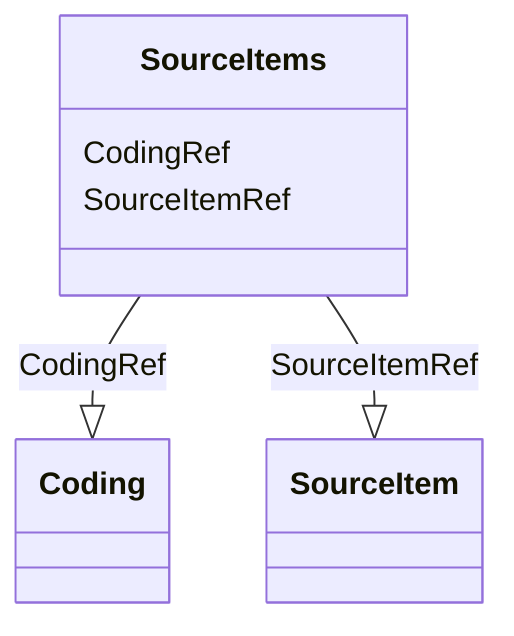

# Class: SourceItems


_Identifies source items as needed to support automated data capture and end-to-end traceability._


URI: [odm:SourceItems](http://www.cdisc.org/ns/odm/v2.0/SourceItems)





<!-- no inheritance hierarchy -->


## Slots

| Name | Cardinality and Range | Description | Inheritance |
| ---  | --- | --- | --- |
| [SourceItemRef](SourceItemRef.md) | 0..* <br/> [SourceItem](SourceItem.md) | SourceItem reference: Provides the information needed to identify the source ... | direct |
| [CodingRef](CodingRef.md) | 0..* <br/> [Coding](Coding.md) | Coding reference: Coding references a symbol from a defined code system. It u... | direct |


## Usages

| used by | used in | type | used |
| ---  | --- | --- | --- |
| [Origin](Origin.md) | [SourceItemsRef](SourceItemsRef.md) | range | [SourceItems](SourceItems.md) |


## See Also

* [https://wiki.cdisc.org/display/ODM2/SourceItems](https://wiki.cdisc.org/display/ODM2/SourceItems)

## Identifier and Mapping Information


### Schema Source


* from schema: http://www.cdisc.org/ns/odm/v2.0


## Mappings

| Mapping Type | Mapped Value |
| ---  | ---  |
| self | odm:SourceItems |
| native | odm:SourceItems |


## LinkML Source

<!-- TODO: investigate https://stackoverflow.com/questions/37606292/how-to-create-tabbed-code-blocks-in-mkdocs-or-sphinx -->

### Direct

<details>
```yaml
name: SourceItems
description: Identifies source items as needed to support automated data capture and
  end-to-end traceability.
from_schema: http://www.cdisc.org/ns/odm/v2.0
see_also:
- https://wiki.cdisc.org/display/ODM2/SourceItems
slots:
- SourceItemRef
- CodingRef
slot_usage:
  SourceItemRef:
    name: SourceItemRef
    multivalued: true
    domain_of:
    - SourceItems
    range: SourceItem
    inlined: true
    inlined_as_list: true
  CodingRef:
    name: CodingRef
    multivalued: true
    domain_of:
    - StudyEventGroupDef
    - StudyEventDef
    - ItemGroupDef
    - Origin
    - SourceItems
    - SourceItem
    - ItemDef
    - CodeList
    - CodeListItem
    - StudyIndication
    - StudyIntervention
    - StudyTargetPopulation
    - StudyParameter
    - ParameterValue
    - Criterion
    - Annotation
    range: Coding
    inlined: true
    inlined_as_list: true
class_uri: odm:SourceItems

```
</details>

### Induced

<details>
```yaml
name: SourceItems
description: Identifies source items as needed to support automated data capture and
  end-to-end traceability.
from_schema: http://www.cdisc.org/ns/odm/v2.0
see_also:
- https://wiki.cdisc.org/display/ODM2/SourceItems
slot_usage:
  SourceItemRef:
    name: SourceItemRef
    multivalued: true
    domain_of:
    - SourceItems
    range: SourceItem
    inlined: true
    inlined_as_list: true
  CodingRef:
    name: CodingRef
    multivalued: true
    domain_of:
    - StudyEventGroupDef
    - StudyEventDef
    - ItemGroupDef
    - Origin
    - SourceItems
    - SourceItem
    - ItemDef
    - CodeList
    - CodeListItem
    - StudyIndication
    - StudyIntervention
    - StudyTargetPopulation
    - StudyParameter
    - ParameterValue
    - Criterion
    - Annotation
    range: Coding
    inlined: true
    inlined_as_list: true
attributes:
  SourceItemRef:
    name: SourceItemRef
    description: 'SourceItem reference: Provides the information needed to identify
      the source metadata.'
    from_schema: http://www.cdisc.org/ns/odm/v2.0
    rank: 1000
    multivalued: true
    identifier: false
    alias: SourceItemRef
    owner: SourceItems
    domain_of:
    - SourceItems
    range: SourceItem
    inlined: true
    inlined_as_list: true
  CodingRef:
    name: CodingRef
    description: 'Coding reference: Coding references a symbol from a defined code
      system. It uses a code defined in a terminology system to associate semantics
      with a given term, codelist, variable, or group of variables. The presence of
      a Coding element associates a meaning to its parent element. Including multiple
      Coding elements for a given parent indicates synonymous meanings provided by
      different code systems or code system versions.'
    from_schema: http://www.cdisc.org/ns/odm/v2.0
    rank: 1000
    multivalued: true
    identifier: false
    alias: CodingRef
    owner: SourceItems
    domain_of:
    - StudyEventGroupDef
    - StudyEventDef
    - ItemGroupDef
    - Origin
    - SourceItems
    - SourceItem
    - ItemDef
    - CodeList
    - CodeListItem
    - StudyIndication
    - StudyIntervention
    - StudyTargetPopulation
    - StudyParameter
    - ParameterValue
    - Criterion
    - Annotation
    range: Coding
    inlined: true
    inlined_as_list: true
class_uri: odm:SourceItems

```
</details>