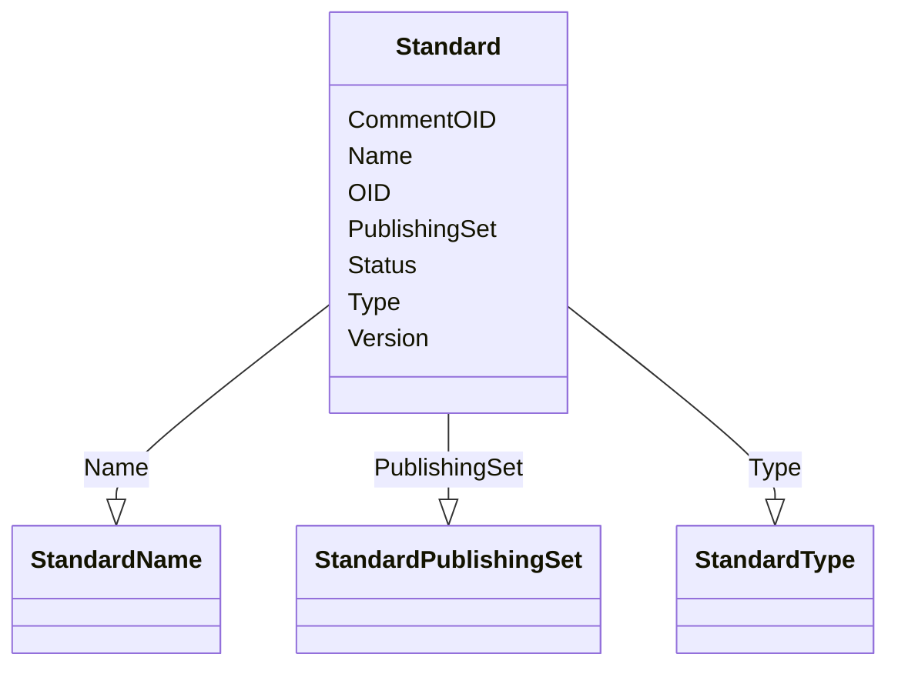

# Class: Standard


_The Standard element describes each standard used within the MetaDataVersion element._


URI: [odm:Standard](http://www.cdisc.org/ns/odm/v2.0/Standard)





<!-- no inheritance hierarchy -->


## Slots

| Name | Cardinality and Range | Description | Inheritance |
| ---  | --- | --- | --- |
| [OID](OID.md) | 1..1 <br/> [oid](oid.md) | Unique identifier for the standard. | direct |
| [Name](Name.md) | 1..1 <br/> [StandardName](StandardName.md) | Name of the external standard to which the data conforms. | direct |
| [Type](Type.md) | 1..1 <br/> [StandardType](StandardType.md) | The type of standard. | direct |
| [PublishingSet](PublishingSet.md) | 0..1 <br/> [StandardPublishingSet](StandardPublishingSet.md) | The name of the publishing set that contains the published standard. | direct |
| [Version](Version.md) | 1..1 <br/> [text](text.md) | Version of the external standard to which the data conforms. | direct |
| [Status](Status.md) | 1..1 <br/> [StandardStatus](StandardStatus.md) | Publishing status of the standard. | direct |
| [CommentOID](CommentOID.md) | 0..1 <br/> [oidref](oidref.md) | Reference to the unique ID of a CommentDef element that contains the comment ... | direct |


## Usages

| used by | used in | type | used |
| ---  | --- | --- | --- |
| [Standards](Standards.md) | [StandardRef](StandardRef.md) | range | [Standard](Standard.md) |


## See Also

* [https://wiki.cdisc.org/display/ODM2/Standard](https://wiki.cdisc.org/display/ODM2/Standard)

## Identifier and Mapping Information


### Schema Source


* from schema: http://www.cdisc.org/ns/odm/v2.0


## Mappings

| Mapping Type | Mapped Value |
| ---  | ---  |
| self | odm:Standard |
| native | odm:Standard |


## LinkML Source

<!-- TODO: investigate https://stackoverflow.com/questions/37606292/how-to-create-tabbed-code-blocks-in-mkdocs-or-sphinx -->

### Direct

<details>
```yaml
name: Standard
description: The Standard element describes each standard used within the MetaDataVersion
  element.
from_schema: http://www.cdisc.org/ns/odm/v2.0
see_also:
- https://wiki.cdisc.org/display/ODM2/Standard
slots:
- OID
- Name
- Type
- PublishingSet
- Version
- Status
- CommentOID
slot_usage:
  OID:
    name: OID
    description: Unique identifier for the standard.
    comments:
    - 'Required

      range: oid'
    domain_of:
    - Study
    - MetaDataVersion
    - Standard
    - ValueListDef
    - WhereClauseDef
    - StudyEventGroupDef
    - StudyEventDef
    - ItemGroupDef
    - ItemDef
    - CodeList
    - MethodDef
    - ConditionDef
    - CommentDef
    - StudyIndication
    - StudyIntervention
    - StudyObjective
    - StudyEndPoint
    - StudyTargetPopulation
    - StudyEstimand
    - Arm
    - Epoch
    - StudyParameter
    - StudyTiming
    - TransitionTimingConstraint
    - AbsoluteTimingConstraint
    - RelativeTimingConstraint
    - DurationTimingConstraint
    - WorkflowDef
    - Transition
    - Branching
    - Criterion
    - User
    - Organization
    - Location
    - SignatureDef
    - Query
    range: oid
    required: true
  Name:
    name: Name
    description: Name of the external standard to which the data conforms.
    comments:
    - 'Required

      range: text

      The list of values is conditional to each value of the Standard/@Type attribute.
      The list of allowable values for each Standard/@Type value is provided by an
      extensible codelist in the CDISC Controlled Terminology. Users are encouraged
      to refer to the most recent version of the CDISC Controlled Terminology ( https://www.cdisc.org/standards/terminology/controlled-terminology
      ).'
    domain_of:
    - Alias
    - MetaDataVersion
    - Standard
    - StudyEventGroupDef
    - StudyEventDef
    - ItemGroupDef
    - Class
    - SubClass
    - SourceItem
    - Resource
    - ItemDef
    - CodeList
    - MethodDef
    - Parameter
    - ReturnValue
    - ConditionDef
    - StudyObjective
    - StudyEndPoint
    - StudyTargetPopulation
    - StudyEstimand
    - Arm
    - Epoch
    - StudyTiming
    - TransitionTimingConstraint
    - AbsoluteTimingConstraint
    - RelativeTimingConstraint
    - DurationTimingConstraint
    - WorkflowDef
    - Transition
    - Branching
    - Criterion
    - Organization
    - Location
    - Query
    range: StandardName
    required: true
  Type:
    name: Type
    description: The type of standard.
    comments:
    - 'Required

      range: text

      The list of allowable values is provided by a codelist in the CDISC Controlled
      Terminology and is extensible. Users are encouraged to refer to the most recent
      version of the CDISC Controlled Terminology ( https://www.cdisc.org/standards/terminology/controlled-terminology
      ).'
    domain_of:
    - TranslatedText
    - PDFPageRef
    - Standard
    - StudyEventDef
    - ItemGroupDef
    - Origin
    - Resource
    - MethodDef
    - StudyEndPoint
    - TransitionTimingConstraint
    - RelativeTimingConstraint
    - Branching
    - Organization
    - Query
    range: StandardType
    required: true
  PublishingSet:
    name: PublishingSet
    description: The name of the publishing set that contains the published standard.
    comments:
    - 'Conditional Required when Type="CT" Not applicable for other standard types

      range: text

      The list of allowable values is provided by a codelist in the CDISC Controlled
      Terminology and is extensible. Users are encouraged to refer to the most recent
      version of the CDISC Controlled Terminology ( https://www.cdisc.org/standards/terminology/controlled-terminology
      ).'
    domain_of:
    - Standard
    range: StandardPublishingSet
  Version:
    name: Version
    description: Version of the external standard to which the data conforms.
    comments:
    - 'Required

      range: text

      The version identifier must match the version identifier used in the standard
      publication.'
    domain_of:
    - Standard
    - ExternalCodeLib
    range: text
    required: true
  Status:
    name: Status
    description: Publishing status of the standard.
    comments:
    - 'Optional

      range: text

      The list of allowable values is provided by a codelist in the CDISC Controlled
      Terminology and is not extensible. Users are encouraged to refer to the most
      recent version of the CDISC Controlled Terminology ( https://www.cdisc.org/standards/terminology/controlled-terminology
      ). If no value is provided, the assumption is that the publishing status is
      Final.'
    domain_of:
    - Study
    - Standard
    range: StandardStatus
    required: true
  CommentOID:
    name: CommentOID
    description: 'Reference to the unique ID of a CommentDef element that contains
      the comment for the Standard element Business Rule: Must match the OID of a
      CommentDef in the same MetaDataVersion'
    comments:
    - 'Optional

      range: text

      Must match the OID of a CommentDef in the same MetaDataVersion'
    domain_of:
    - MetaDataVersion
    - Standard
    - WhereClauseDef
    - StudyEventGroupDef
    - StudyEventDef
    - ItemGroupDef
    - ItemDef
    - CodeList
    - CodeListItem
    - MethodDef
    - ConditionDef
    - Coding
    range: oidref
class_uri: odm:Standard

```
</details>

### Induced

<details>
```yaml
name: Standard
description: The Standard element describes each standard used within the MetaDataVersion
  element.
from_schema: http://www.cdisc.org/ns/odm/v2.0
see_also:
- https://wiki.cdisc.org/display/ODM2/Standard
slot_usage:
  OID:
    name: OID
    description: Unique identifier for the standard.
    comments:
    - 'Required

      range: oid'
    domain_of:
    - Study
    - MetaDataVersion
    - Standard
    - ValueListDef
    - WhereClauseDef
    - StudyEventGroupDef
    - StudyEventDef
    - ItemGroupDef
    - ItemDef
    - CodeList
    - MethodDef
    - ConditionDef
    - CommentDef
    - StudyIndication
    - StudyIntervention
    - StudyObjective
    - StudyEndPoint
    - StudyTargetPopulation
    - StudyEstimand
    - Arm
    - Epoch
    - StudyParameter
    - StudyTiming
    - TransitionTimingConstraint
    - AbsoluteTimingConstraint
    - RelativeTimingConstraint
    - DurationTimingConstraint
    - WorkflowDef
    - Transition
    - Branching
    - Criterion
    - User
    - Organization
    - Location
    - SignatureDef
    - Query
    range: oid
    required: true
  Name:
    name: Name
    description: Name of the external standard to which the data conforms.
    comments:
    - 'Required

      range: text

      The list of values is conditional to each value of the Standard/@Type attribute.
      The list of allowable values for each Standard/@Type value is provided by an
      extensible codelist in the CDISC Controlled Terminology. Users are encouraged
      to refer to the most recent version of the CDISC Controlled Terminology ( https://www.cdisc.org/standards/terminology/controlled-terminology
      ).'
    domain_of:
    - Alias
    - MetaDataVersion
    - Standard
    - StudyEventGroupDef
    - StudyEventDef
    - ItemGroupDef
    - Class
    - SubClass
    - SourceItem
    - Resource
    - ItemDef
    - CodeList
    - MethodDef
    - Parameter
    - ReturnValue
    - ConditionDef
    - StudyObjective
    - StudyEndPoint
    - StudyTargetPopulation
    - StudyEstimand
    - Arm
    - Epoch
    - StudyTiming
    - TransitionTimingConstraint
    - AbsoluteTimingConstraint
    - RelativeTimingConstraint
    - DurationTimingConstraint
    - WorkflowDef
    - Transition
    - Branching
    - Criterion
    - Organization
    - Location
    - Query
    range: StandardName
    required: true
  Type:
    name: Type
    description: The type of standard.
    comments:
    - 'Required

      range: text

      The list of allowable values is provided by a codelist in the CDISC Controlled
      Terminology and is extensible. Users are encouraged to refer to the most recent
      version of the CDISC Controlled Terminology ( https://www.cdisc.org/standards/terminology/controlled-terminology
      ).'
    domain_of:
    - TranslatedText
    - PDFPageRef
    - Standard
    - StudyEventDef
    - ItemGroupDef
    - Origin
    - Resource
    - MethodDef
    - StudyEndPoint
    - TransitionTimingConstraint
    - RelativeTimingConstraint
    - Branching
    - Organization
    - Query
    range: StandardType
    required: true
  PublishingSet:
    name: PublishingSet
    description: The name of the publishing set that contains the published standard.
    comments:
    - 'Conditional Required when Type="CT" Not applicable for other standard types

      range: text

      The list of allowable values is provided by a codelist in the CDISC Controlled
      Terminology and is extensible. Users are encouraged to refer to the most recent
      version of the CDISC Controlled Terminology ( https://www.cdisc.org/standards/terminology/controlled-terminology
      ).'
    domain_of:
    - Standard
    range: StandardPublishingSet
  Version:
    name: Version
    description: Version of the external standard to which the data conforms.
    comments:
    - 'Required

      range: text

      The version identifier must match the version identifier used in the standard
      publication.'
    domain_of:
    - Standard
    - ExternalCodeLib
    range: text
    required: true
  Status:
    name: Status
    description: Publishing status of the standard.
    comments:
    - 'Optional

      range: text

      The list of allowable values is provided by a codelist in the CDISC Controlled
      Terminology and is not extensible. Users are encouraged to refer to the most
      recent version of the CDISC Controlled Terminology ( https://www.cdisc.org/standards/terminology/controlled-terminology
      ). If no value is provided, the assumption is that the publishing status is
      Final.'
    domain_of:
    - Study
    - Standard
    range: StandardStatus
    required: true
  CommentOID:
    name: CommentOID
    description: 'Reference to the unique ID of a CommentDef element that contains
      the comment for the Standard element Business Rule: Must match the OID of a
      CommentDef in the same MetaDataVersion'
    comments:
    - 'Optional

      range: text

      Must match the OID of a CommentDef in the same MetaDataVersion'
    domain_of:
    - MetaDataVersion
    - Standard
    - WhereClauseDef
    - StudyEventGroupDef
    - StudyEventDef
    - ItemGroupDef
    - ItemDef
    - CodeList
    - CodeListItem
    - MethodDef
    - ConditionDef
    - Coding
    range: oidref
attributes:
  OID:
    name: OID
    description: Unique identifier for the standard.
    comments:
    - 'Required

      range: oid'
    from_schema: http://www.cdisc.org/ns/odm/v2.0
    rank: 1000
    identifier: true
    alias: OID
    owner: Standard
    domain_of:
    - Study
    - MetaDataVersion
    - Standard
    - ValueListDef
    - WhereClauseDef
    - StudyEventGroupDef
    - StudyEventDef
    - ItemGroupDef
    - ItemDef
    - CodeList
    - MethodDef
    - ConditionDef
    - CommentDef
    - StudyIndication
    - StudyIntervention
    - StudyObjective
    - StudyEndPoint
    - StudyTargetPopulation
    - StudyEstimand
    - Arm
    - Epoch
    - StudyParameter
    - StudyTiming
    - TransitionTimingConstraint
    - AbsoluteTimingConstraint
    - RelativeTimingConstraint
    - DurationTimingConstraint
    - WorkflowDef
    - Transition
    - Branching
    - Criterion
    - User
    - Organization
    - Location
    - SignatureDef
    - Query
    range: oid
    required: true
  Name:
    name: Name
    description: Name of the external standard to which the data conforms.
    comments:
    - 'Required

      range: text

      The list of values is conditional to each value of the Standard/@Type attribute.
      The list of allowable values for each Standard/@Type value is provided by an
      extensible codelist in the CDISC Controlled Terminology. Users are encouraged
      to refer to the most recent version of the CDISC Controlled Terminology ( https://www.cdisc.org/standards/terminology/controlled-terminology
      ).'
    from_schema: http://www.cdisc.org/ns/odm/v2.0
    rank: 1000
    alias: Name
    owner: Standard
    domain_of:
    - Alias
    - MetaDataVersion
    - Standard
    - StudyEventGroupDef
    - StudyEventDef
    - ItemGroupDef
    - Class
    - SubClass
    - SourceItem
    - Resource
    - ItemDef
    - CodeList
    - MethodDef
    - Parameter
    - ReturnValue
    - ConditionDef
    - StudyObjective
    - StudyEndPoint
    - StudyTargetPopulation
    - StudyEstimand
    - Arm
    - Epoch
    - StudyTiming
    - TransitionTimingConstraint
    - AbsoluteTimingConstraint
    - RelativeTimingConstraint
    - DurationTimingConstraint
    - WorkflowDef
    - Transition
    - Branching
    - Criterion
    - Organization
    - Location
    - Query
    range: StandardName
    required: true
  Type:
    name: Type
    description: The type of standard.
    comments:
    - 'Required

      range: text

      The list of allowable values is provided by a codelist in the CDISC Controlled
      Terminology and is extensible. Users are encouraged to refer to the most recent
      version of the CDISC Controlled Terminology ( https://www.cdisc.org/standards/terminology/controlled-terminology
      ).'
    from_schema: http://www.cdisc.org/ns/odm/v2.0
    rank: 1000
    alias: Type
    owner: Standard
    domain_of:
    - TranslatedText
    - PDFPageRef
    - Standard
    - StudyEventDef
    - ItemGroupDef
    - Origin
    - Resource
    - MethodDef
    - StudyEndPoint
    - TransitionTimingConstraint
    - RelativeTimingConstraint
    - Branching
    - Organization
    - Query
    range: StandardType
    required: true
  PublishingSet:
    name: PublishingSet
    description: The name of the publishing set that contains the published standard.
    comments:
    - 'Conditional Required when Type="CT" Not applicable for other standard types

      range: text

      The list of allowable values is provided by a codelist in the CDISC Controlled
      Terminology and is extensible. Users are encouraged to refer to the most recent
      version of the CDISC Controlled Terminology ( https://www.cdisc.org/standards/terminology/controlled-terminology
      ).'
    from_schema: http://www.cdisc.org/ns/odm/v2.0
    rank: 1000
    alias: PublishingSet
    owner: Standard
    domain_of:
    - Standard
    range: StandardPublishingSet
  Version:
    name: Version
    description: Version of the external standard to which the data conforms.
    comments:
    - 'Required

      range: text

      The version identifier must match the version identifier used in the standard
      publication.'
    from_schema: http://www.cdisc.org/ns/odm/v2.0
    rank: 1000
    alias: Version
    owner: Standard
    domain_of:
    - Standard
    - ExternalCodeLib
    range: text
    required: true
  Status:
    name: Status
    description: Publishing status of the standard.
    comments:
    - 'Optional

      range: text

      The list of allowable values is provided by a codelist in the CDISC Controlled
      Terminology and is not extensible. Users are encouraged to refer to the most
      recent version of the CDISC Controlled Terminology ( https://www.cdisc.org/standards/terminology/controlled-terminology
      ). If no value is provided, the assumption is that the publishing status is
      Final.'
    from_schema: http://www.cdisc.org/ns/odm/v2.0
    rank: 1000
    alias: Status
    owner: Standard
    domain_of:
    - Study
    - Standard
    range: StandardStatus
    required: true
  CommentOID:
    name: CommentOID
    description: 'Reference to the unique ID of a CommentDef element that contains
      the comment for the Standard element Business Rule: Must match the OID of a
      CommentDef in the same MetaDataVersion'
    comments:
    - 'Optional

      range: text

      Must match the OID of a CommentDef in the same MetaDataVersion'
    from_schema: http://www.cdisc.org/ns/odm/v2.0
    rank: 1000
    alias: CommentOID
    owner: Standard
    domain_of:
    - MetaDataVersion
    - Standard
    - WhereClauseDef
    - StudyEventGroupDef
    - StudyEventDef
    - ItemGroupDef
    - ItemDef
    - CodeList
    - CodeListItem
    - MethodDef
    - ConditionDef
    - Coding
    range: oidref
class_uri: odm:Standard

```
</details>