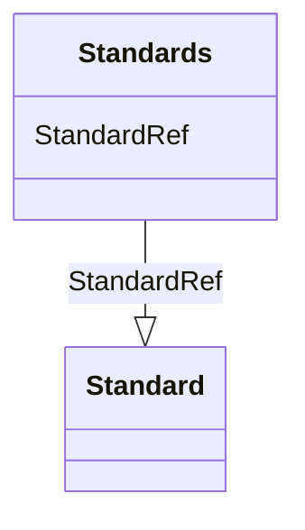

# Class: Standards


URI: [odm:Standards](http://www.cdisc.org/ns/odm/v2.0/Standards)





<!-- no inheritance hierarchy -->


## Slots

| Name | Cardinality and Range | Description | Inheritance |
| ---  | --- | --- | --- |
| [StandardRef](StandardRef.md) | 1..* <br/> [Standard](Standard.md) | Definition of a standard referenced in the Define-XML document | direct |


## Usages

| used by | used in | type | used |
| ---  | --- | --- | --- |
| [MetaDataVersion](MetaDataVersion.md) | [StandardsRef](StandardsRef.md) | range | [Standards](Standards.md) |


## Identifier and Mapping Information


### Schema Source


* from schema: http://www.cdisc.org/ns/odm/v2.0


## Mappings

| Mapping Type | Mapped Value |
| ---  | ---  |
| self | odm:Standards |
| native | odm:Standards |


## LinkML Source

<!-- TODO: investigate https://stackoverflow.com/questions/37606292/how-to-create-tabbed-code-blocks-in-mkdocs-or-sphinx -->

### Direct

<details>
```yaml
name: Standards
from_schema: http://www.cdisc.org/ns/odm/v2.0
slots:
- StandardRef
slot_usage:
  StandardRef:
    name: StandardRef
    description: Definition of a standard referenced in the Define-XML document.
    multivalued: true
    list_elements_unique: true
    domain_of:
    - Standards
    range: Standard
    required: true
    minimum_cardinality: 1
class_uri: odm:Standards

```
</details>

### Induced

<details>
```yaml
name: Standards
from_schema: http://www.cdisc.org/ns/odm/v2.0
slot_usage:
  StandardRef:
    name: StandardRef
    description: Definition of a standard referenced in the Define-XML document.
    multivalued: true
    list_elements_unique: true
    domain_of:
    - Standards
    range: Standard
    required: true
    minimum_cardinality: 1
attributes:
  StandardRef:
    name: StandardRef
    description: Definition of a standard referenced in the Define-XML document.
    from_schema: http://www.cdisc.org/ns/odm/v2.0
    rank: 1000
    multivalued: true
    list_elements_unique: true
    alias: StandardRef
    owner: Standards
    domain_of:
    - Standards
    range: Standard
    required: true
    minimum_cardinality: 1
class_uri: odm:Standards

```
</details>