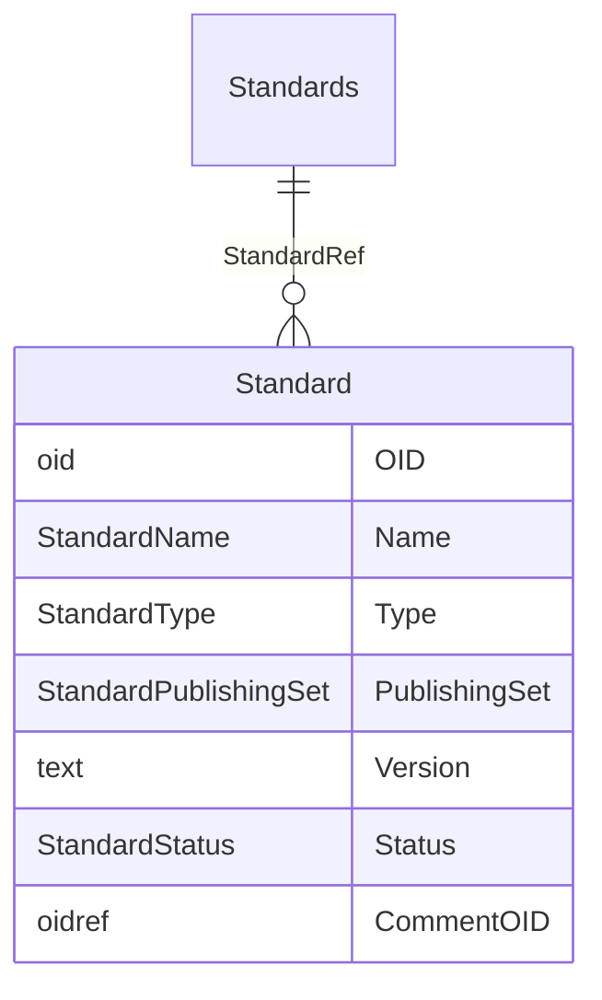

# Class: Standards

_The Standards element provides a container for the list of Standard elements referenced in the MetaDataVersion for the Study.._


URI: [odm:Standards](http://www.cdisc.org/ns/odm/v2.0/Standards)





<!-- no inheritance hierarchy -->


## Slots

| Name | Cardinality* and Range | Description | Inheritance |
| ---  | --- | --- | --- |
| [StandardRef](StandardRef.md) | 0..* <br/> [Standard](Standard.md) | Definition of a standard referenced in the Define-XML document. | direct |

_* See [LinkML documentation](https://linkml.io/linkml/schemas/slots.html#slot-cardinality) for cardinality definitions._


## Usages

| used by | used in | type | used |
| ---  | --- | --- | --- |
| [MetaDataVersion](MetaDataVersion.md) | [StandardsRef](StandardsRef.md) | range | [Standards](Standards.md) |


## See Also

* [https://wiki.cdisc.org/display/ODM2/Standards](https://wiki.cdisc.org/display/ODM2/Standards)

## Identifier and Mapping Information


### Schema Source


* from schema: http://www.cdisc.org/ns/odm/v2.0


## Mappings

| Mapping Type | Mapped Value |
| ---  | ---  |
| self | odm:Standards |
| native | odm:Standards |


## LinkML Source

<!-- TODO: investigate https://stackoverflow.com/questions/37606292/how-to-create-tabbed-code-blocks-in-mkdocs-or-sphinx -->

### Direct

<details>
```yaml
name: Standards
description: The Standards element provides a container for the list of Standard elements
  referenced in the MetaDataVersion for the Study..
from_schema: http://www.cdisc.org/ns/odm/v2.0
see_also:
- https://wiki.cdisc.org/display/ODM2/Standards
rank: 1000
slots:
- StandardRef
slot_usage:
  StandardRef:
    name: StandardRef
    description: Definition of a standard referenced in the Define-XML document.
    multivalued: true
    domain_of:
    - Standards
    range: Standard
    inlined: true
    inlined_as_list: true
class_uri: odm:Standards

```
</details>

### Induced

<details>
```yaml
name: Standards
description: The Standards element provides a container for the list of Standard elements
  referenced in the MetaDataVersion for the Study..
from_schema: http://www.cdisc.org/ns/odm/v2.0
see_also:
- https://wiki.cdisc.org/display/ODM2/Standards
rank: 1000
slot_usage:
  StandardRef:
    name: StandardRef
    description: Definition of a standard referenced in the Define-XML document.
    multivalued: true
    domain_of:
    - Standards
    range: Standard
    inlined: true
    inlined_as_list: true
attributes:
  StandardRef:
    name: StandardRef
    description: Definition of a standard referenced in the Define-XML document.
    from_schema: http://www.cdisc.org/ns/odm/v2.0
    rank: 1000
    multivalued: true
    identifier: false
    alias: StandardRef
    owner: Standards
    domain_of:
    - Standards
    range: Standard
    inlined: true
    inlined_as_list: true
class_uri: odm:Standards

```
</details>