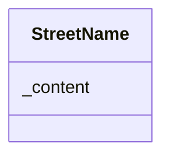

# Class: StreetName


URI: [odm:StreetName](http://www.cdisc.org/ns/odm/v2.0/StreetName)





<!-- no inheritance hierarchy -->


## Slots

| Name | Cardinality and Range | Description | Inheritance |
| ---  | --- | --- | --- |
| [_content](_content.md) | 0..1 <br/> [ContentType](ContentType.md) | multi-line text content from between XML tags | direct |


## Usages

| used by | used in | type | used |
| ---  | --- | --- | --- |
| [Address](Address.md) | [StreetNameRef](StreetNameRef.md) | range | [StreetName](StreetName.md) |


## Identifier and Mapping Information


### Schema Source


* from schema: http://www.cdisc.org/ns/odm/v2.0


## Mappings

| Mapping Type | Mapped Value |
| ---  | ---  |
| self | odm:StreetName |
| native | odm:StreetName |


## LinkML Source

<!-- TODO: investigate https://stackoverflow.com/questions/37606292/how-to-create-tabbed-code-blocks-in-mkdocs-or-sphinx -->

### Direct

<details>
```yaml
name: StreetName
from_schema: http://www.cdisc.org/ns/odm/v2.0
slots:
- _content
slot_usage:
  range:
    name: range
    id_prefixes:
    - text
class_uri: odm:StreetName

```
</details>

### Induced

<details>
```yaml
name: StreetName
from_schema: http://www.cdisc.org/ns/odm/v2.0
slot_usage:
  range:
    name: range
    id_prefixes:
    - text
attributes:
  name: _content
  description: multi-line text content from between XML tags
  from_schema: http://www.cdisc.org/ns/odm/v2.0
  rank: 1000
  alias: _content
  owner: StreetName
  domain_of:
  - CheckValue
  - Code
  - WorkflowEnd
  - UserName
  - Prefix
  - Suffix
  - FullName
  - GivenName
  - FamilyName
  - StreetName
  - HouseNumber
  - City
  - StateProv
  - Country
  - PostalCode
  - OtherText
  - Meaning
  - LegalReason
  - DateTimeStamp
  - ReasonForChange
  - SourceID
  - FlagValue
  - FlagType
  - Value
  - TranslatedText
  range: _contentType
class_uri: odm:StreetName

```
</details>