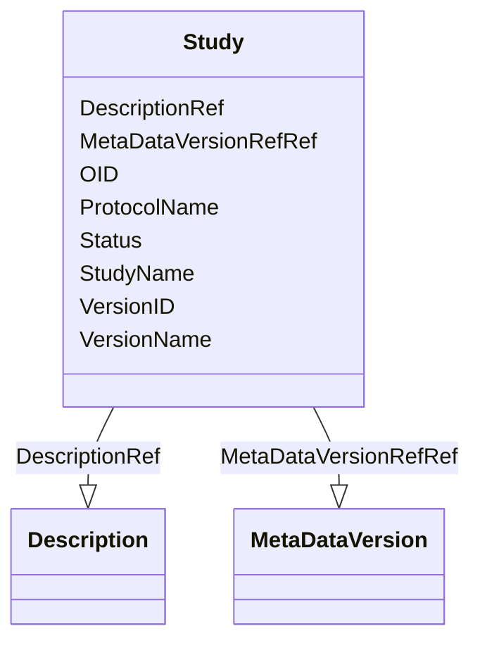

# Class: Study


URI: [odm:Study](http://www.cdisc.org/ns/odm/v2.0/Study)





<!-- no inheritance hierarchy -->


## Slots

| Name | Cardinality and Range | Description | Inheritance |
| ---  | --- | --- | --- |
| [OID](OID.md) | 1..1 <br/> [Oid](Oid.md) | Unique identifier of the version within the XML document | direct |
| [StudyName](StudyName.md) | 1..1 <br/> [Name](Name.md) |  | direct |
| [ProtocolName](ProtocolName.md) | 1..1 <br/> [Name](Name.md) |  | direct |
| [VersionID](VersionID.md) | 0..1 <br/> [Name](Name.md) |  | direct |
| [VersionName](VersionName.md) | 0..1 <br/> [Name](Name.md) |  | direct |
| [Status](Status.md) | 0..1 <br/> [Name](Name.md) | Status of Standard | direct |
| [DescriptionRef](DescriptionRef.md) | 0..1 <br/> [Description](Description.md) |  | direct |
| [MetaDataVersionRefRef](MetaDataVersionRefRef.md) | 1..* <br/> [MetaDataVersion](MetaDataVersion.md) |  | direct |


## Usages

| used by | used in | type | used |
| ---  | --- | --- | --- |
| [ODMFileMetadata](ODMFileMetadata.md) | [StudyRef](StudyRef.md) | range | [Study](Study.md) |


## See Also

* [https://wiki.cdisc.org/display/ODM2/Study](https://wiki.cdisc.org/display/ODM2/Study)

## Identifier and Mapping Information


### Schema Source


* from schema: http://www.cdisc.org/ns/odm/v2.0


## Mappings

| Mapping Type | Mapped Value |
| ---  | ---  |
| self | odm:Study |
| native | odm:Study |


## LinkML Source

<!-- TODO: investigate https://stackoverflow.com/questions/37606292/how-to-create-tabbed-code-blocks-in-mkdocs-or-sphinx -->

### Direct

<details>
```yaml
name: Study
from_schema: http://www.cdisc.org/ns/odm/v2.0
see_also:
- https://wiki.cdisc.org/display/ODM2/Study
slots:
- OID
- StudyName
- ProtocolName
- VersionID
- VersionName
- Status
- DescriptionRef
- MetaDataVersionRefRef
slot_usage:
  OID:
    name: OID
    domain_of:
    - Study
    - MetaDataVersion
    - Standard
    - ValueListDef
    - WhereClauseDef
    - StudyEventGroupDef
    - StudyEventDef
    - ItemGroupDef
    - ItemDef
    - CodeList
    - MethodDef
    - ConditionDef
    - CommentDef
    - StudyIndication
    - StudyIntervention
    - StudyObjective
    - StudyEndPoint
    - StudyTargetPopulation
    - StudyEstimand
    - Arm
    - Epoch
    - StudyParameter
    - StudyTiming
    - TransitionTimingConstraint
    - AbsoluteTimingConstraint
    - RelativeTimingConstraint
    - DurationTimingConstraint
    - WorkflowDef
    - Transition
    - Branching
    - Criterion
    - ExceptionEvent
    - User
    - Organization
    - Location
    - SignatureDef
    - Query
    range: oid
    required: true
  StudyName:
    name: StudyName
    domain_of:
    - Study
    range: name
    required: true
  ProtocolName:
    name: ProtocolName
    domain_of:
    - Study
    range: name
    required: true
  VersionID:
    name: VersionID
    domain_of:
    - Study
    range: name
  VersionName:
    name: VersionName
    domain_of:
    - Study
    range: name
  Status:
    name: Status
    domain_of:
    - Study
    - Standard
    range: name
  DescriptionRef:
    name: DescriptionRef
    domain_of:
    - Study
    - MetaDataVersion
    - ValueListDef
    - StudyEventGroupRef
    - StudyEventGroupDef
    - StudyEventDef
    - ItemGroupDef
    - Origin
    - ItemDef
    - CodeList
    - CodeListItem
    - MethodDef
    - ConditionDef
    - CommentDef
    - Protocol
    - StudyStructure
    - TrialPhase
    - StudyIndication
    - StudyIntervention
    - StudyObjective
    - StudyEndPoint
    - StudyTargetPopulation
    - StudyEstimand
    - IntercurrentEvent
    - SummaryMeasure
    - Arm
    - Epoch
    - TransitionTimingConstraint
    - AbsoluteTimingConstraint
    - RelativeTimingConstraint
    - DurationTimingConstraint
    - WorkflowDef
    - Criterion
    - ExceptionEvent
    - Organization
    - Location
    - ODMFileMetadata
    range: Description
    maximum_cardinality: 1
  MetaDataVersionRefRef:
    name: MetaDataVersionRefRef
    multivalued: true
    domain_of:
    - Study
    - Location
    range: MetaDataVersion
    required: true
    inlined: true
    inlined_as_list: true
    minimum_cardinality: 1
class_uri: odm:Study

```
</details>

### Induced

<details>
```yaml
name: Study
from_schema: http://www.cdisc.org/ns/odm/v2.0
see_also:
- https://wiki.cdisc.org/display/ODM2/Study
slot_usage:
  OID:
    name: OID
    domain_of:
    - Study
    - MetaDataVersion
    - Standard
    - ValueListDef
    - WhereClauseDef
    - StudyEventGroupDef
    - StudyEventDef
    - ItemGroupDef
    - ItemDef
    - CodeList
    - MethodDef
    - ConditionDef
    - CommentDef
    - StudyIndication
    - StudyIntervention
    - StudyObjective
    - StudyEndPoint
    - StudyTargetPopulation
    - StudyEstimand
    - Arm
    - Epoch
    - StudyParameter
    - StudyTiming
    - TransitionTimingConstraint
    - AbsoluteTimingConstraint
    - RelativeTimingConstraint
    - DurationTimingConstraint
    - WorkflowDef
    - Transition
    - Branching
    - Criterion
    - ExceptionEvent
    - User
    - Organization
    - Location
    - SignatureDef
    - Query
    range: oid
    required: true
  StudyName:
    name: StudyName
    domain_of:
    - Study
    range: name
    required: true
  ProtocolName:
    name: ProtocolName
    domain_of:
    - Study
    range: name
    required: true
  VersionID:
    name: VersionID
    domain_of:
    - Study
    range: name
  VersionName:
    name: VersionName
    domain_of:
    - Study
    range: name
  Status:
    name: Status
    domain_of:
    - Study
    - Standard
    range: name
  DescriptionRef:
    name: DescriptionRef
    domain_of:
    - Study
    - MetaDataVersion
    - ValueListDef
    - StudyEventGroupRef
    - StudyEventGroupDef
    - StudyEventDef
    - ItemGroupDef
    - Origin
    - ItemDef
    - CodeList
    - CodeListItem
    - MethodDef
    - ConditionDef
    - CommentDef
    - Protocol
    - StudyStructure
    - TrialPhase
    - StudyIndication
    - StudyIntervention
    - StudyObjective
    - StudyEndPoint
    - StudyTargetPopulation
    - StudyEstimand
    - IntercurrentEvent
    - SummaryMeasure
    - Arm
    - Epoch
    - TransitionTimingConstraint
    - AbsoluteTimingConstraint
    - RelativeTimingConstraint
    - DurationTimingConstraint
    - WorkflowDef
    - Criterion
    - ExceptionEvent
    - Organization
    - Location
    - ODMFileMetadata
    range: Description
    maximum_cardinality: 1
  MetaDataVersionRefRef:
    name: MetaDataVersionRefRef
    multivalued: true
    domain_of:
    - Study
    - Location
    range: MetaDataVersion
    required: true
    inlined: true
    inlined_as_list: true
    minimum_cardinality: 1
attributes:
  OID:
    name: OID
    description: Unique identifier of the version within the XML document.
    from_schema: http://www.cdisc.org/ns/odm/v2.0
    rank: 1000
    identifier: true
    alias: OID
    owner: Study
    domain_of:
    - Study
    - MetaDataVersion
    - Standard
    - ValueListDef
    - WhereClauseDef
    - StudyEventGroupDef
    - StudyEventDef
    - ItemGroupDef
    - ItemDef
    - CodeList
    - MethodDef
    - ConditionDef
    - CommentDef
    - StudyIndication
    - StudyIntervention
    - StudyObjective
    - StudyEndPoint
    - StudyTargetPopulation
    - StudyEstimand
    - Arm
    - Epoch
    - StudyParameter
    - StudyTiming
    - TransitionTimingConstraint
    - AbsoluteTimingConstraint
    - RelativeTimingConstraint
    - DurationTimingConstraint
    - WorkflowDef
    - Transition
    - Branching
    - Criterion
    - ExceptionEvent
    - User
    - Organization
    - Location
    - SignatureDef
    - Query
    range: oid
    required: true
  StudyName:
    name: StudyName
    from_schema: http://www.cdisc.org/ns/odm/v2.0
    rank: 1000
    alias: StudyName
    owner: Study
    domain_of:
    - Study
    range: name
    required: true
  ProtocolName:
    name: ProtocolName
    from_schema: http://www.cdisc.org/ns/odm/v2.0
    rank: 1000
    alias: ProtocolName
    owner: Study
    domain_of:
    - Study
    range: name
    required: true
  VersionID:
    name: VersionID
    from_schema: http://www.cdisc.org/ns/odm/v2.0
    rank: 1000
    alias: VersionID
    owner: Study
    domain_of:
    - Study
    range: name
  VersionName:
    name: VersionName
    from_schema: http://www.cdisc.org/ns/odm/v2.0
    rank: 1000
    alias: VersionName
    owner: Study
    domain_of:
    - Study
    range: name
  Status:
    name: Status
    description: Status of Standard.
    from_schema: http://www.cdisc.org/ns/odm/v2.0
    rank: 1000
    alias: Status
    owner: Study
    domain_of:
    - Study
    - Standard
    range: name
  DescriptionRef:
    name: DescriptionRef
    from_schema: http://www.cdisc.org/ns/odm/v2.0
    rank: 1000
    alias: DescriptionRef
    owner: Study
    domain_of:
    - Study
    - MetaDataVersion
    - ValueListDef
    - StudyEventGroupRef
    - StudyEventGroupDef
    - StudyEventDef
    - ItemGroupDef
    - Origin
    - ItemDef
    - CodeList
    - CodeListItem
    - MethodDef
    - ConditionDef
    - CommentDef
    - Protocol
    - StudyStructure
    - TrialPhase
    - StudyIndication
    - StudyIntervention
    - StudyObjective
    - StudyEndPoint
    - StudyTargetPopulation
    - StudyEstimand
    - IntercurrentEvent
    - SummaryMeasure
    - Arm
    - Epoch
    - TransitionTimingConstraint
    - AbsoluteTimingConstraint
    - RelativeTimingConstraint
    - DurationTimingConstraint
    - WorkflowDef
    - Criterion
    - ExceptionEvent
    - Organization
    - Location
    - ODMFileMetadata
    range: Description
    maximum_cardinality: 1
  MetaDataVersionRefRef:
    name: MetaDataVersionRefRef
    from_schema: http://www.cdisc.org/ns/odm/v2.0
    rank: 1000
    multivalued: true
    alias: MetaDataVersionRefRef
    owner: Study
    domain_of:
    - Study
    - Location
    range: MetaDataVersion
    required: true
    inlined: true
    inlined_as_list: true
    minimum_cardinality: 1
class_uri: odm:Study

```
</details>