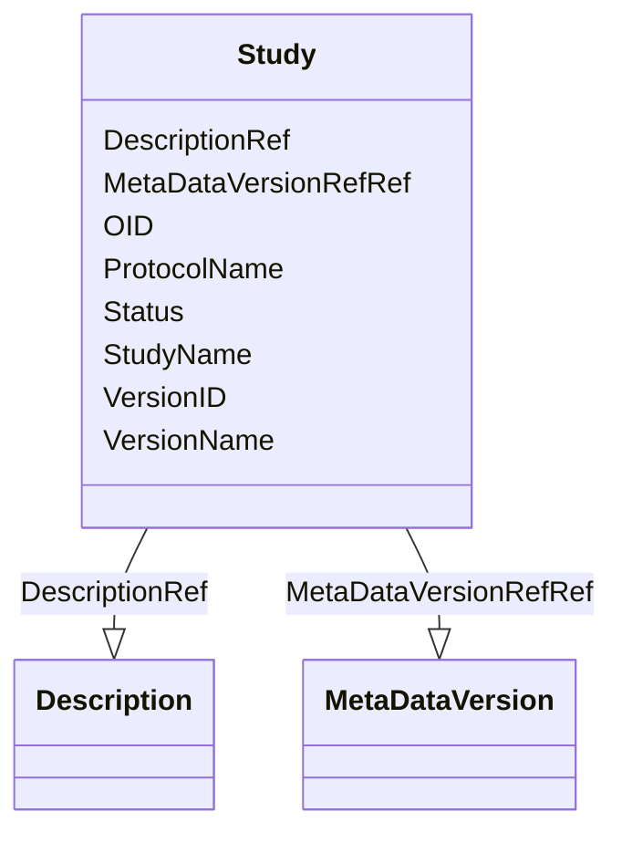

# Class: Study


_This element collects static structural information about an individual study._


URI: [odm:Study](http://www.cdisc.org/ns/odm/v2.0/Study)





<!-- no inheritance hierarchy -->


## Slots

| Name | Cardinality and Range | Description | Inheritance |
| ---  | --- | --- | --- |
| [OID](OID.md) | 1..1 <br/> [oid](oid.md) | Unique identifier for the study. | direct |
| [StudyName](StudyName.md) | 1..1 <br/> [name](name.md) | Sponsoring organization's internal name for the study. If no internal name is... | direct |
| [ProtocolName](ProtocolName.md) | 1..1 <br/> [name](name.md) | P rotocol identifier or protocol number assigned to the study . It is used by... | direct |
| [VersionID](VersionID.md) | 0..1 <br/> [name](name.md) | Identifier for the specific version of the study in the source system that th... | direct |
| [VersionName](VersionName.md) | 0..1 <br/> [name](name.md) | Short descriptive label for the version of the study, e.g. "Initial go live" ... | direct |
| [Status](Status.md) | 0..1 <br/> [name](name.md) | Represents the workflow status for the version of the study with content incl... | direct |
| [DescriptionRef](DescriptionRef.md) | 0..1 <br/> [Description](Description.md) | Description reference: A free-text description of the containing metadata com... | direct |
| [MetaDataVersionRefRef](MetaDataVersionRefRef.md) | 0..* <br/> [MetaDataVersion](MetaDataVersion.md) | MetaDataVersionRef reference: A reference to a MetaDataVersion used at the co... | direct |


## Usages

| used by | used in | type | used |
| ---  | --- | --- | --- |
| [ODMFileMetadata](ODMFileMetadata.md) | [StudyRef](StudyRef.md) | range | [Study](Study.md) |


## See Also

* [https://wiki.cdisc.org/display/ODM2/Study](https://wiki.cdisc.org/display/ODM2/Study)

## Identifier and Mapping Information


### Schema Source


* from schema: http://www.cdisc.org/ns/odm/v2.0


## Mappings

| Mapping Type | Mapped Value |
| ---  | ---  |
| self | odm:Study |
| native | odm:Study |


## LinkML Source

<!-- TODO: investigate https://stackoverflow.com/questions/37606292/how-to-create-tabbed-code-blocks-in-mkdocs-or-sphinx -->

### Direct

<details>
```yaml
name: Study
description: This element collects static structural information about an individual
  study.
from_schema: http://www.cdisc.org/ns/odm/v2.0
see_also:
- https://wiki.cdisc.org/display/ODM2/Study
slots:
- OID
- StudyName
- ProtocolName
- VersionID
- VersionName
- Status
- DescriptionRef
- MetaDataVersionRefRef
slot_usage:
  OID:
    name: OID
    description: Unique identifier for the study.
    comments:
    - 'Required

      range:oid'
    domain_of:
    - Study
    - MetaDataVersion
    - Standard
    - ValueListDef
    - WhereClauseDef
    - StudyEventGroupDef
    - StudyEventDef
    - ItemGroupDef
    - ItemDef
    - CodeList
    - MethodDef
    - ConditionDef
    - CommentDef
    - StudyIndication
    - StudyIntervention
    - StudyObjective
    - StudyEndPoint
    - StudyTargetPopulation
    - StudyEstimand
    - Arm
    - Epoch
    - StudyParameter
    - StudyTiming
    - TransitionTimingConstraint
    - AbsoluteTimingConstraint
    - RelativeTimingConstraint
    - DurationTimingConstraint
    - WorkflowDef
    - Transition
    - Branching
    - Criterion
    - ExceptionEvent
    - User
    - Organization
    - Location
    - SignatureDef
    - Query
    range: oid
    required: true
  StudyName:
    name: StudyName
    description: Sponsoring organization's internal name for the study. If no internal
      name is available, the value is expected to be the same value as ProtocolName.
    comments:
    - 'Required

      range:name'
    domain_of:
    - Study
    range: name
    required: true
  ProtocolName:
    name: ProtocolName
    description: P rotocol identifier or protocol number assigned to the study . It
      is used by the regulatory authority or clinical trial registry.
    comments:
    - 'Required

      range:name'
    domain_of:
    - Study
    range: name
    required: true
  VersionID:
    name: VersionID
    description: Identifier for the specific version of the study in the source system
      that the enclosed Study element metadata refers to.
    comments:
    - 'Optional

      range:name'
    domain_of:
    - Study
    range: name
  VersionName:
    name: VersionName
    description: Short descriptive label for the version of the study, e.g. "Initial
      go live" when VersionID = "<study version ID for Initial go live>". VersionName
      may be provided when a VersionID is provided.
    comments:
    - 'Optional

      range:name'
    domain_of:
    - Study
    range: name
  Status:
    name: Status
    description: Represents the workflow status for the version of the study with
      content included in the enclosed Study element metadata. Status values can be
      different in each system and may have specific meaning within each system, e.g.
      a "Production" version of a study in a particular source system may be non-editable
      and editable in a different source system. If no VersionID is provided, Status
      refers to the status of the Study as a whole.
    comments:
    - 'Optional

      range:name'
    domain_of:
    - Study
    - Standard
    range: name
  DescriptionRef:
    name: DescriptionRef
    domain_of:
    - Study
    - MetaDataVersion
    - ValueListDef
    - StudyEventGroupRef
    - StudyEventGroupDef
    - StudyEventDef
    - ItemGroupDef
    - Origin
    - ItemDef
    - CodeList
    - CodeListItem
    - MethodDef
    - ConditionDef
    - CommentDef
    - Protocol
    - StudyStructure
    - TrialPhase
    - StudyIndication
    - StudyIntervention
    - StudyObjective
    - StudyEndPoint
    - StudyTargetPopulation
    - StudyEstimand
    - IntercurrentEvent
    - SummaryMeasure
    - Arm
    - Epoch
    - TransitionTimingConstraint
    - AbsoluteTimingConstraint
    - RelativeTimingConstraint
    - DurationTimingConstraint
    - WorkflowDef
    - Criterion
    - ExceptionEvent
    - Organization
    - Location
    - ODMFileMetadata
    range: Description
    maximum_cardinality: 1
  MetaDataVersionRefRef:
    name: MetaDataVersionRefRef
    multivalued: true
    domain_of:
    - Study
    - Location
    range: MetaDataVersion
    inlined: true
    inlined_as_list: true
class_uri: odm:Study

```
</details>

### Induced

<details>
```yaml
name: Study
description: This element collects static structural information about an individual
  study.
from_schema: http://www.cdisc.org/ns/odm/v2.0
see_also:
- https://wiki.cdisc.org/display/ODM2/Study
slot_usage:
  OID:
    name: OID
    description: Unique identifier for the study.
    comments:
    - 'Required

      range:oid'
    domain_of:
    - Study
    - MetaDataVersion
    - Standard
    - ValueListDef
    - WhereClauseDef
    - StudyEventGroupDef
    - StudyEventDef
    - ItemGroupDef
    - ItemDef
    - CodeList
    - MethodDef
    - ConditionDef
    - CommentDef
    - StudyIndication
    - StudyIntervention
    - StudyObjective
    - StudyEndPoint
    - StudyTargetPopulation
    - StudyEstimand
    - Arm
    - Epoch
    - StudyParameter
    - StudyTiming
    - TransitionTimingConstraint
    - AbsoluteTimingConstraint
    - RelativeTimingConstraint
    - DurationTimingConstraint
    - WorkflowDef
    - Transition
    - Branching
    - Criterion
    - ExceptionEvent
    - User
    - Organization
    - Location
    - SignatureDef
    - Query
    range: oid
    required: true
  StudyName:
    name: StudyName
    description: Sponsoring organization's internal name for the study. If no internal
      name is available, the value is expected to be the same value as ProtocolName.
    comments:
    - 'Required

      range:name'
    domain_of:
    - Study
    range: name
    required: true
  ProtocolName:
    name: ProtocolName
    description: P rotocol identifier or protocol number assigned to the study . It
      is used by the regulatory authority or clinical trial registry.
    comments:
    - 'Required

      range:name'
    domain_of:
    - Study
    range: name
    required: true
  VersionID:
    name: VersionID
    description: Identifier for the specific version of the study in the source system
      that the enclosed Study element metadata refers to.
    comments:
    - 'Optional

      range:name'
    domain_of:
    - Study
    range: name
  VersionName:
    name: VersionName
    description: Short descriptive label for the version of the study, e.g. "Initial
      go live" when VersionID = "<study version ID for Initial go live>". VersionName
      may be provided when a VersionID is provided.
    comments:
    - 'Optional

      range:name'
    domain_of:
    - Study
    range: name
  Status:
    name: Status
    description: Represents the workflow status for the version of the study with
      content included in the enclosed Study element metadata. Status values can be
      different in each system and may have specific meaning within each system, e.g.
      a "Production" version of a study in a particular source system may be non-editable
      and editable in a different source system. If no VersionID is provided, Status
      refers to the status of the Study as a whole.
    comments:
    - 'Optional

      range:name'
    domain_of:
    - Study
    - Standard
    range: name
  DescriptionRef:
    name: DescriptionRef
    domain_of:
    - Study
    - MetaDataVersion
    - ValueListDef
    - StudyEventGroupRef
    - StudyEventGroupDef
    - StudyEventDef
    - ItemGroupDef
    - Origin
    - ItemDef
    - CodeList
    - CodeListItem
    - MethodDef
    - ConditionDef
    - CommentDef
    - Protocol
    - StudyStructure
    - TrialPhase
    - StudyIndication
    - StudyIntervention
    - StudyObjective
    - StudyEndPoint
    - StudyTargetPopulation
    - StudyEstimand
    - IntercurrentEvent
    - SummaryMeasure
    - Arm
    - Epoch
    - TransitionTimingConstraint
    - AbsoluteTimingConstraint
    - RelativeTimingConstraint
    - DurationTimingConstraint
    - WorkflowDef
    - Criterion
    - ExceptionEvent
    - Organization
    - Location
    - ODMFileMetadata
    range: Description
    maximum_cardinality: 1
  MetaDataVersionRefRef:
    name: MetaDataVersionRefRef
    multivalued: true
    domain_of:
    - Study
    - Location
    range: MetaDataVersion
    inlined: true
    inlined_as_list: true
attributes:
  OID:
    name: OID
    description: Unique identifier for the study.
    comments:
    - 'Required

      range:oid'
    from_schema: http://www.cdisc.org/ns/odm/v2.0
    rank: 1000
    identifier: true
    alias: OID
    owner: Study
    domain_of:
    - Study
    - MetaDataVersion
    - Standard
    - ValueListDef
    - WhereClauseDef
    - StudyEventGroupDef
    - StudyEventDef
    - ItemGroupDef
    - ItemDef
    - CodeList
    - MethodDef
    - ConditionDef
    - CommentDef
    - StudyIndication
    - StudyIntervention
    - StudyObjective
    - StudyEndPoint
    - StudyTargetPopulation
    - StudyEstimand
    - Arm
    - Epoch
    - StudyParameter
    - StudyTiming
    - TransitionTimingConstraint
    - AbsoluteTimingConstraint
    - RelativeTimingConstraint
    - DurationTimingConstraint
    - WorkflowDef
    - Transition
    - Branching
    - Criterion
    - ExceptionEvent
    - User
    - Organization
    - Location
    - SignatureDef
    - Query
    range: oid
    required: true
  StudyName:
    name: StudyName
    description: Sponsoring organization's internal name for the study. If no internal
      name is available, the value is expected to be the same value as ProtocolName.
    comments:
    - 'Required

      range:name'
    from_schema: http://www.cdisc.org/ns/odm/v2.0
    rank: 1000
    alias: StudyName
    owner: Study
    domain_of:
    - Study
    range: name
    required: true
  ProtocolName:
    name: ProtocolName
    description: P rotocol identifier or protocol number assigned to the study . It
      is used by the regulatory authority or clinical trial registry.
    comments:
    - 'Required

      range:name'
    from_schema: http://www.cdisc.org/ns/odm/v2.0
    rank: 1000
    alias: ProtocolName
    owner: Study
    domain_of:
    - Study
    range: name
    required: true
  VersionID:
    name: VersionID
    description: Identifier for the specific version of the study in the source system
      that the enclosed Study element metadata refers to.
    comments:
    - 'Optional

      range:name'
    from_schema: http://www.cdisc.org/ns/odm/v2.0
    rank: 1000
    alias: VersionID
    owner: Study
    domain_of:
    - Study
    range: name
  VersionName:
    name: VersionName
    description: Short descriptive label for the version of the study, e.g. "Initial
      go live" when VersionID = "<study version ID for Initial go live>". VersionName
      may be provided when a VersionID is provided.
    comments:
    - 'Optional

      range:name'
    from_schema: http://www.cdisc.org/ns/odm/v2.0
    rank: 1000
    alias: VersionName
    owner: Study
    domain_of:
    - Study
    range: name
  Status:
    name: Status
    description: Represents the workflow status for the version of the study with
      content included in the enclosed Study element metadata. Status values can be
      different in each system and may have specific meaning within each system, e.g.
      a "Production" version of a study in a particular source system may be non-editable
      and editable in a different source system. If no VersionID is provided, Status
      refers to the status of the Study as a whole.
    comments:
    - 'Optional

      range:name'
    from_schema: http://www.cdisc.org/ns/odm/v2.0
    rank: 1000
    alias: Status
    owner: Study
    domain_of:
    - Study
    - Standard
    range: name
  DescriptionRef:
    name: DescriptionRef
    description: 'Description reference: A free-text description of the containing
      metadata component, unless restricted by Business Rules.'
    from_schema: http://www.cdisc.org/ns/odm/v2.0
    rank: 1000
    identifier: false
    alias: DescriptionRef
    owner: Study
    domain_of:
    - Study
    - MetaDataVersion
    - ValueListDef
    - StudyEventGroupRef
    - StudyEventGroupDef
    - StudyEventDef
    - ItemGroupDef
    - Origin
    - ItemDef
    - CodeList
    - CodeListItem
    - MethodDef
    - ConditionDef
    - CommentDef
    - Protocol
    - StudyStructure
    - TrialPhase
    - StudyIndication
    - StudyIntervention
    - StudyObjective
    - StudyEndPoint
    - StudyTargetPopulation
    - StudyEstimand
    - IntercurrentEvent
    - SummaryMeasure
    - Arm
    - Epoch
    - TransitionTimingConstraint
    - AbsoluteTimingConstraint
    - RelativeTimingConstraint
    - DurationTimingConstraint
    - WorkflowDef
    - Criterion
    - ExceptionEvent
    - Organization
    - Location
    - ODMFileMetadata
    range: Description
    maximum_cardinality: 1
  MetaDataVersionRefRef:
    name: MetaDataVersionRefRef
    description: 'MetaDataVersionRef reference: A reference to a MetaDataVersion used
      at the containing Location. The EffectiveDate reflects the possibility that
      the metadata may change over the course of the study.'
    from_schema: http://www.cdisc.org/ns/odm/v2.0
    rank: 1000
    multivalued: true
    identifier: false
    alias: MetaDataVersionRefRef
    owner: Study
    domain_of:
    - Study
    - Location
    range: MetaDataVersion
    inlined: true
    inlined_as_list: true
class_uri: odm:Study

```
</details>