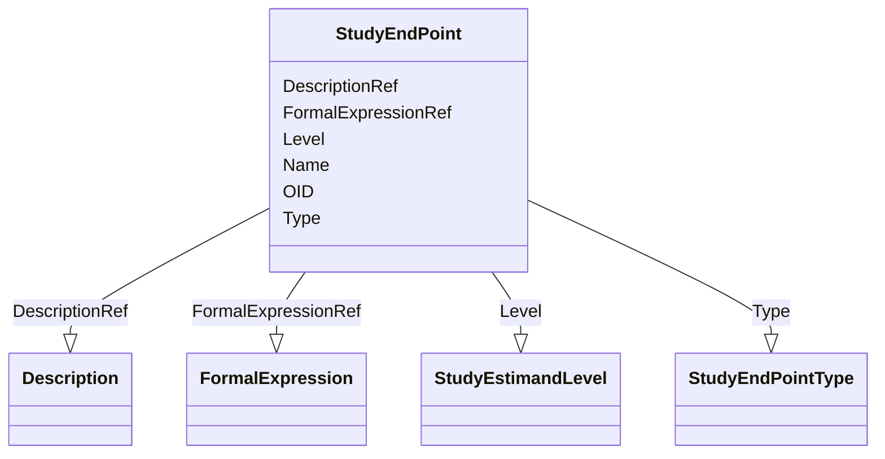

# Class: StudyEndPoint


_A study end point reflects an outcome measure of interest that is statistically analyzed to address a particular research question for the study. It typically specifies the type of assessments made; the timing of those assessments; the assessment tools used; and other details, as applicable, such as how multiple assessments within an individual are to be combined._


URI: [odm:StudyEndPoint](http://www.cdisc.org/ns/odm/v2.0/StudyEndPoint)





<!-- no inheritance hierarchy -->


## Slots

| Name | Cardinality and Range | Description | Inheritance |
| ---  | --- | --- | --- |
| [OID](OID.md) | 1..1 <br/> [oid](oid.md) | Unique identifier for the StudyEndPoint element | direct |
| [Name](Name.md) | 1..1 <br/> [name](name.md) | Human readable identifier for the StudyEndPoint element. | direct |
| [Type](Type.md) | 0..1 <br/> [StudyEndPointType](StudyEndPointType.md) | The type of end point. Simple: measures the change of a single outcome that i... | direct |
| [Level](Level.md) | 0..1 <br/> [StudyEstimandLevel](StudyEstimandLevel.md) | Level for the Study Endpoint. Primary endpoint(s) are typically efficacy meas... | direct |
| [DescriptionRef](DescriptionRef.md) | 0..1 <br/> [Description](Description.md) | Description reference: A free-text description of the containing metadata com... | direct |
| [FormalExpressionRef](FormalExpressionRef.md) | 0..* <br/> [FormalExpression](FormalExpression.md) | FormalExpression reference: A FormalExpression used within a ConditionDef or ... | direct |


## Usages

| used by | used in | type | used |
| ---  | --- | --- | --- |
| [StudyEndPoints](StudyEndPoints.md) | [StudyEndPointRefRef](StudyEndPointRefRef.md) | range | [StudyEndPoint](StudyEndPoint.md) |


## See Also

* [https://wiki.cdisc.org/display/ODM2/StudyEndPoint](https://wiki.cdisc.org/display/ODM2/StudyEndPoint)

## Identifier and Mapping Information


### Schema Source


* from schema: http://www.cdisc.org/ns/odm/v2.0


## Mappings

| Mapping Type | Mapped Value |
| ---  | ---  |
| self | odm:StudyEndPoint |
| native | odm:StudyEndPoint |


## LinkML Source

<!-- TODO: investigate https://stackoverflow.com/questions/37606292/how-to-create-tabbed-code-blocks-in-mkdocs-or-sphinx -->

### Direct

<details>
```yaml
name: StudyEndPoint
description: A study end point reflects an outcome measure of interest that is statistically
  analyzed to address a particular research question for the study. It typically specifies
  the type of assessments made; the timing of those assessments; the assessment tools
  used; and other details, as applicable, such as how multiple assessments within
  an individual are to be combined.
from_schema: http://www.cdisc.org/ns/odm/v2.0
see_also:
- https://wiki.cdisc.org/display/ODM2/StudyEndPoint
slots:
- OID
- Name
- Type
- Level
- DescriptionRef
- FormalExpressionRef
slot_usage:
  OID:
    name: OID
    description: Unique identifier for the StudyEndPoint element
    comments:
    - 'Required

      range:oid

      The OID attribute for the StudyEndPoint must be unique within the study.'
    domain_of:
    - Study
    - MetaDataVersion
    - Standard
    - ValueListDef
    - WhereClauseDef
    - StudyEventGroupDef
    - StudyEventDef
    - ItemGroupDef
    - ItemDef
    - CodeList
    - MethodDef
    - ConditionDef
    - CommentDef
    - StudyIndication
    - StudyIntervention
    - StudyObjective
    - StudyEndPoint
    - StudyTargetPopulation
    - StudyEstimand
    - Arm
    - Epoch
    - StudyParameter
    - StudyTiming
    - TransitionTimingConstraint
    - AbsoluteTimingConstraint
    - RelativeTimingConstraint
    - DurationTimingConstraint
    - WorkflowDef
    - Transition
    - Branching
    - Criterion
    - ExceptionEvent
    - User
    - Organization
    - Location
    - SignatureDef
    - Query
    range: oid
    required: true
  Name:
    name: Name
    description: Human readable identifier for the StudyEndPoint element.
    comments:
    - 'Required

      range:name

      The Name must be unique within the set of StudyEndPoints elements for the study.'
    domain_of:
    - Alias
    - MetaDataVersion
    - Standard
    - StudyEventGroupDef
    - StudyEventDef
    - ItemGroupDef
    - Class
    - SubClass
    - SourceItem
    - Resource
    - ItemDef
    - CodeList
    - MethodDef
    - Parameter
    - ReturnValue
    - ConditionDef
    - StudyObjective
    - StudyEndPoint
    - StudyTargetPopulation
    - StudyEstimand
    - Arm
    - Epoch
    - StudyTiming
    - TransitionTimingConstraint
    - AbsoluteTimingConstraint
    - RelativeTimingConstraint
    - DurationTimingConstraint
    - WorkflowDef
    - Transition
    - Branching
    - Criterion
    - ExceptionEvent
    - Organization
    - Location
    - Query
    range: name
    required: true
  Type:
    name: Type
    description: 'The type of end point. Simple: measures the change of a single outcome
      that is meaningful in the context of the disease being studied. Humane: the
      point at which pain and/or distress is terminated, minimized, or reduced. Surrogate:
      a measure of effect of a specific treatment that may correlate with a real clinical
      endpoint but does not necessarily have a guaranteed relationship (e.g., a biomarker).
      Combined: end point that is a combination of several measures. Example: A heart
      attack study may report the incidence of the combined endpoint of chest pain,
      myocardial infarction, or death.'
    comments:
    - 'Optional

      enum values:(Simple | Humane | Surrogate | Composite)'
    domain_of:
    - TranslatedText
    - PDFPageRef
    - Standard
    - StudyEventDef
    - ItemGroupDef
    - Origin
    - Resource
    - MethodDef
    - StudyEndPoint
    - TransitionTimingConstraint
    - RelativeTimingConstraint
    - Branching
    - Organization
    - Query
    range: StudyEndPointType
  Level:
    name: Level
    description: Level for the Study Endpoint. Primary endpoint(s) are typically efficacy
      measures that address the main research question [1] Secondary endpoints are
      generally not sufficient to influence decision-making alone, but may support
      the claim of efficacy by demonstrating additional effects or by supporting a
      causal mechanism. [2] Exploratory endpoints (where nominated) typically capture
      outcomes that occur less frequently or which may be useful for exploring novel
      hypotheses. [1]
    comments:
    - 'Optional

      enum values:(Primary | Secondary | Exploratory)

      These are defined in concordance with the ICH M11 Clinical electronic Structured
      Harmonised Protocol Specification'
    domain_of:
    - StudyObjective
    - StudyEndPoint
    - StudyEstimand
    range: StudyEstimandLevel
  DescriptionRef:
    name: DescriptionRef
    domain_of:
    - Study
    - MetaDataVersion
    - ValueListDef
    - StudyEventGroupRef
    - StudyEventGroupDef
    - StudyEventDef
    - ItemGroupDef
    - Origin
    - ItemDef
    - CodeList
    - CodeListItem
    - MethodDef
    - ConditionDef
    - CommentDef
    - Protocol
    - StudyStructure
    - TrialPhase
    - StudyIndication
    - StudyIntervention
    - StudyObjective
    - StudyEndPoint
    - StudyTargetPopulation
    - StudyEstimand
    - IntercurrentEvent
    - SummaryMeasure
    - Arm
    - Epoch
    - TransitionTimingConstraint
    - AbsoluteTimingConstraint
    - RelativeTimingConstraint
    - DurationTimingConstraint
    - WorkflowDef
    - Criterion
    - ExceptionEvent
    - Organization
    - Location
    - ODMFileMetadata
    range: Description
    maximum_cardinality: 1
  FormalExpressionRef:
    name: FormalExpressionRef
    multivalued: true
    domain_of:
    - RangeCheck
    - MethodDef
    - ConditionDef
    - StudyEndPoint
    - StudyTargetPopulation
    range: FormalExpression
    inlined: true
    inlined_as_list: true
class_uri: odm:StudyEndPoint

```
</details>

### Induced

<details>
```yaml
name: StudyEndPoint
description: A study end point reflects an outcome measure of interest that is statistically
  analyzed to address a particular research question for the study. It typically specifies
  the type of assessments made; the timing of those assessments; the assessment tools
  used; and other details, as applicable, such as how multiple assessments within
  an individual are to be combined.
from_schema: http://www.cdisc.org/ns/odm/v2.0
see_also:
- https://wiki.cdisc.org/display/ODM2/StudyEndPoint
slot_usage:
  OID:
    name: OID
    description: Unique identifier for the StudyEndPoint element
    comments:
    - 'Required

      range:oid

      The OID attribute for the StudyEndPoint must be unique within the study.'
    domain_of:
    - Study
    - MetaDataVersion
    - Standard
    - ValueListDef
    - WhereClauseDef
    - StudyEventGroupDef
    - StudyEventDef
    - ItemGroupDef
    - ItemDef
    - CodeList
    - MethodDef
    - ConditionDef
    - CommentDef
    - StudyIndication
    - StudyIntervention
    - StudyObjective
    - StudyEndPoint
    - StudyTargetPopulation
    - StudyEstimand
    - Arm
    - Epoch
    - StudyParameter
    - StudyTiming
    - TransitionTimingConstraint
    - AbsoluteTimingConstraint
    - RelativeTimingConstraint
    - DurationTimingConstraint
    - WorkflowDef
    - Transition
    - Branching
    - Criterion
    - ExceptionEvent
    - User
    - Organization
    - Location
    - SignatureDef
    - Query
    range: oid
    required: true
  Name:
    name: Name
    description: Human readable identifier for the StudyEndPoint element.
    comments:
    - 'Required

      range:name

      The Name must be unique within the set of StudyEndPoints elements for the study.'
    domain_of:
    - Alias
    - MetaDataVersion
    - Standard
    - StudyEventGroupDef
    - StudyEventDef
    - ItemGroupDef
    - Class
    - SubClass
    - SourceItem
    - Resource
    - ItemDef
    - CodeList
    - MethodDef
    - Parameter
    - ReturnValue
    - ConditionDef
    - StudyObjective
    - StudyEndPoint
    - StudyTargetPopulation
    - StudyEstimand
    - Arm
    - Epoch
    - StudyTiming
    - TransitionTimingConstraint
    - AbsoluteTimingConstraint
    - RelativeTimingConstraint
    - DurationTimingConstraint
    - WorkflowDef
    - Transition
    - Branching
    - Criterion
    - ExceptionEvent
    - Organization
    - Location
    - Query
    range: name
    required: true
  Type:
    name: Type
    description: 'The type of end point. Simple: measures the change of a single outcome
      that is meaningful in the context of the disease being studied. Humane: the
      point at which pain and/or distress is terminated, minimized, or reduced. Surrogate:
      a measure of effect of a specific treatment that may correlate with a real clinical
      endpoint but does not necessarily have a guaranteed relationship (e.g., a biomarker).
      Combined: end point that is a combination of several measures. Example: A heart
      attack study may report the incidence of the combined endpoint of chest pain,
      myocardial infarction, or death.'
    comments:
    - 'Optional

      enum values:(Simple | Humane | Surrogate | Composite)'
    domain_of:
    - TranslatedText
    - PDFPageRef
    - Standard
    - StudyEventDef
    - ItemGroupDef
    - Origin
    - Resource
    - MethodDef
    - StudyEndPoint
    - TransitionTimingConstraint
    - RelativeTimingConstraint
    - Branching
    - Organization
    - Query
    range: StudyEndPointType
  Level:
    name: Level
    description: Level for the Study Endpoint. Primary endpoint(s) are typically efficacy
      measures that address the main research question [1] Secondary endpoints are
      generally not sufficient to influence decision-making alone, but may support
      the claim of efficacy by demonstrating additional effects or by supporting a
      causal mechanism. [2] Exploratory endpoints (where nominated) typically capture
      outcomes that occur less frequently or which may be useful for exploring novel
      hypotheses. [1]
    comments:
    - 'Optional

      enum values:(Primary | Secondary | Exploratory)

      These are defined in concordance with the ICH M11 Clinical electronic Structured
      Harmonised Protocol Specification'
    domain_of:
    - StudyObjective
    - StudyEndPoint
    - StudyEstimand
    range: StudyEstimandLevel
  DescriptionRef:
    name: DescriptionRef
    domain_of:
    - Study
    - MetaDataVersion
    - ValueListDef
    - StudyEventGroupRef
    - StudyEventGroupDef
    - StudyEventDef
    - ItemGroupDef
    - Origin
    - ItemDef
    - CodeList
    - CodeListItem
    - MethodDef
    - ConditionDef
    - CommentDef
    - Protocol
    - StudyStructure
    - TrialPhase
    - StudyIndication
    - StudyIntervention
    - StudyObjective
    - StudyEndPoint
    - StudyTargetPopulation
    - StudyEstimand
    - IntercurrentEvent
    - SummaryMeasure
    - Arm
    - Epoch
    - TransitionTimingConstraint
    - AbsoluteTimingConstraint
    - RelativeTimingConstraint
    - DurationTimingConstraint
    - WorkflowDef
    - Criterion
    - ExceptionEvent
    - Organization
    - Location
    - ODMFileMetadata
    range: Description
    maximum_cardinality: 1
  FormalExpressionRef:
    name: FormalExpressionRef
    multivalued: true
    domain_of:
    - RangeCheck
    - MethodDef
    - ConditionDef
    - StudyEndPoint
    - StudyTargetPopulation
    range: FormalExpression
    inlined: true
    inlined_as_list: true
attributes:
  OID:
    name: OID
    description: Unique identifier for the StudyEndPoint element
    comments:
    - 'Required

      range:oid

      The OID attribute for the StudyEndPoint must be unique within the study.'
    from_schema: http://www.cdisc.org/ns/odm/v2.0
    rank: 1000
    identifier: true
    alias: OID
    owner: StudyEndPoint
    domain_of:
    - Study
    - MetaDataVersion
    - Standard
    - ValueListDef
    - WhereClauseDef
    - StudyEventGroupDef
    - StudyEventDef
    - ItemGroupDef
    - ItemDef
    - CodeList
    - MethodDef
    - ConditionDef
    - CommentDef
    - StudyIndication
    - StudyIntervention
    - StudyObjective
    - StudyEndPoint
    - StudyTargetPopulation
    - StudyEstimand
    - Arm
    - Epoch
    - StudyParameter
    - StudyTiming
    - TransitionTimingConstraint
    - AbsoluteTimingConstraint
    - RelativeTimingConstraint
    - DurationTimingConstraint
    - WorkflowDef
    - Transition
    - Branching
    - Criterion
    - ExceptionEvent
    - User
    - Organization
    - Location
    - SignatureDef
    - Query
    range: oid
    required: true
  Name:
    name: Name
    description: Human readable identifier for the StudyEndPoint element.
    comments:
    - 'Required

      range:name

      The Name must be unique within the set of StudyEndPoints elements for the study.'
    from_schema: http://www.cdisc.org/ns/odm/v2.0
    rank: 1000
    alias: Name
    owner: StudyEndPoint
    domain_of:
    - Alias
    - MetaDataVersion
    - Standard
    - StudyEventGroupDef
    - StudyEventDef
    - ItemGroupDef
    - Class
    - SubClass
    - SourceItem
    - Resource
    - ItemDef
    - CodeList
    - MethodDef
    - Parameter
    - ReturnValue
    - ConditionDef
    - StudyObjective
    - StudyEndPoint
    - StudyTargetPopulation
    - StudyEstimand
    - Arm
    - Epoch
    - StudyTiming
    - TransitionTimingConstraint
    - AbsoluteTimingConstraint
    - RelativeTimingConstraint
    - DurationTimingConstraint
    - WorkflowDef
    - Transition
    - Branching
    - Criterion
    - ExceptionEvent
    - Organization
    - Location
    - Query
    range: name
    required: true
  Type:
    name: Type
    description: 'The type of end point. Simple: measures the change of a single outcome
      that is meaningful in the context of the disease being studied. Humane: the
      point at which pain and/or distress is terminated, minimized, or reduced. Surrogate:
      a measure of effect of a specific treatment that may correlate with a real clinical
      endpoint but does not necessarily have a guaranteed relationship (e.g., a biomarker).
      Combined: end point that is a combination of several measures. Example: A heart
      attack study may report the incidence of the combined endpoint of chest pain,
      myocardial infarction, or death.'
    comments:
    - 'Optional

      enum values:(Simple | Humane | Surrogate | Composite)'
    from_schema: http://www.cdisc.org/ns/odm/v2.0
    rank: 1000
    alias: Type
    owner: StudyEndPoint
    domain_of:
    - TranslatedText
    - PDFPageRef
    - Standard
    - StudyEventDef
    - ItemGroupDef
    - Origin
    - Resource
    - MethodDef
    - StudyEndPoint
    - TransitionTimingConstraint
    - RelativeTimingConstraint
    - Branching
    - Organization
    - Query
    range: StudyEndPointType
  Level:
    name: Level
    description: Level for the Study Endpoint. Primary endpoint(s) are typically efficacy
      measures that address the main research question [1] Secondary endpoints are
      generally not sufficient to influence decision-making alone, but may support
      the claim of efficacy by demonstrating additional effects or by supporting a
      causal mechanism. [2] Exploratory endpoints (where nominated) typically capture
      outcomes that occur less frequently or which may be useful for exploring novel
      hypotheses. [1]
    comments:
    - 'Optional

      enum values:(Primary | Secondary | Exploratory)

      These are defined in concordance with the ICH M11 Clinical electronic Structured
      Harmonised Protocol Specification'
    from_schema: http://www.cdisc.org/ns/odm/v2.0
    rank: 1000
    alias: Level
    owner: StudyEndPoint
    domain_of:
    - StudyObjective
    - StudyEndPoint
    - StudyEstimand
    range: StudyEstimandLevel
  DescriptionRef:
    name: DescriptionRef
    description: 'Description reference: A free-text description of the containing
      metadata component, unless restricted by Business Rules.'
    from_schema: http://www.cdisc.org/ns/odm/v2.0
    rank: 1000
    identifier: false
    alias: DescriptionRef
    owner: StudyEndPoint
    domain_of:
    - Study
    - MetaDataVersion
    - ValueListDef
    - StudyEventGroupRef
    - StudyEventGroupDef
    - StudyEventDef
    - ItemGroupDef
    - Origin
    - ItemDef
    - CodeList
    - CodeListItem
    - MethodDef
    - ConditionDef
    - CommentDef
    - Protocol
    - StudyStructure
    - TrialPhase
    - StudyIndication
    - StudyIntervention
    - StudyObjective
    - StudyEndPoint
    - StudyTargetPopulation
    - StudyEstimand
    - IntercurrentEvent
    - SummaryMeasure
    - Arm
    - Epoch
    - TransitionTimingConstraint
    - AbsoluteTimingConstraint
    - RelativeTimingConstraint
    - DurationTimingConstraint
    - WorkflowDef
    - Criterion
    - ExceptionEvent
    - Organization
    - Location
    - ODMFileMetadata
    range: Description
    maximum_cardinality: 1
  FormalExpressionRef:
    name: FormalExpressionRef
    description: 'FormalExpression reference: A FormalExpression used within a ConditionDef
      or a RangeCheck must evaluate to True or False. A FormalExpression referenced
      within a MethodDef having Type Imputation, Computation, or Transpose must evaluate
      to the correct DataType for an Item that may be imputed or computed using the
      Method. A FormalExpression gets parameter and return value definitions from
      the MethodSignature element. The data types in the MethodSignature parameters
      and return values must match the corresponding data types in the FormalExpression.'
    from_schema: http://www.cdisc.org/ns/odm/v2.0
    rank: 1000
    multivalued: true
    identifier: false
    alias: FormalExpressionRef
    owner: StudyEndPoint
    domain_of:
    - RangeCheck
    - MethodDef
    - ConditionDef
    - StudyEndPoint
    - StudyTargetPopulation
    range: FormalExpression
    inlined: true
    inlined_as_list: true
class_uri: odm:StudyEndPoint

```
</details>