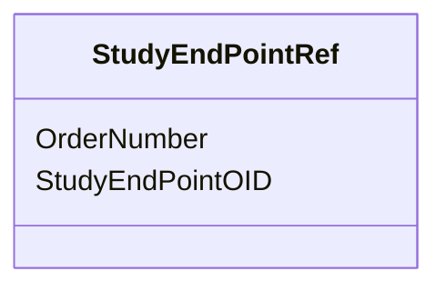

# Class: StudyEndPointRef


_Go to start of metadata_


URI: [odm:StudyEndPointRef](http://www.cdisc.org/ns/odm/v2.0/StudyEndPointRef)





<!-- no inheritance hierarchy -->


## Slots

| Name | Cardinality and Range | Description | Inheritance |
| ---  | --- | --- | --- |
| [StudyEndPointOID](StudyEndPointOID.md) | 1..1 <br/> [oidref](oidref.md) | Reference to the StudyEndPoint . | direct |
| [OrderNumber](OrderNumber.md) | 0..1 <br/> [positiveInteger](positiveInteger.md) | Indicates the order in which this StudyEndPointRef appears in Metadata displa... | direct |


## Usages

| used by | used in | type | used |
| ---  | --- | --- | --- |
| [StudyObjective](StudyObjective.md) | [StudyEndPointRefRef](StudyEndPointRefRef.md) | range | [StudyEndPointRef](StudyEndPointRef.md) |
| [StudyEstimand](StudyEstimand.md) | [StudyEndPointRefRef](StudyEndPointRefRef.md) | range | [StudyEndPointRef](StudyEndPointRef.md) |


## See Also

* [https://wiki.cdisc.org/display/ODM2/StudyEndPointRef](https://wiki.cdisc.org/display/ODM2/StudyEndPointRef)

## Identifier and Mapping Information


### Schema Source


* from schema: http://www.cdisc.org/ns/odm/v2.0


## Mappings

| Mapping Type | Mapped Value |
| ---  | ---  |
| self | odm:StudyEndPointRef |
| native | odm:StudyEndPointRef |


## LinkML Source

<!-- TODO: investigate https://stackoverflow.com/questions/37606292/how-to-create-tabbed-code-blocks-in-mkdocs-or-sphinx -->

### Direct

<details>
```yaml
name: StudyEndPointRef
description: Go to start of metadata
from_schema: http://www.cdisc.org/ns/odm/v2.0
see_also:
- https://wiki.cdisc.org/display/ODM2/StudyEndPointRef
slots:
- StudyEndPointOID
- OrderNumber
slot_usage:
  StudyEndPointOID:
    name: StudyEndPointOID
    description: Reference to the StudyEndPoint .
    comments:
    - 'Required

      Must match the OID atttribute for a StudyEndPoint in the Study/MetaDataVersion/Protocol.'
    domain_of:
    - StudyEndPointRef
    range: oidref
    required: true
  OrderNumber:
    name: OrderNumber
    description: Indicates the order in which this StudyEndPointRef appears in Metadata
      displays or data entry applications.
    comments:
    - 'Optional

      OrderNumber must be a positive integer. The StudyEndPointRefs within a StudyObjective
      must not have duplicate OrderNumber values'
    domain_of:
    - StudyEventGroupRef
    - StudyEventRef
    - ItemGroupRef
    - ItemRef
    - CodeListItem
    - Parameter
    - ReturnValue
    - StudyEndPointRef
    range: positiveInteger
class_uri: odm:StudyEndPointRef

```
</details>

### Induced

<details>
```yaml
name: StudyEndPointRef
description: Go to start of metadata
from_schema: http://www.cdisc.org/ns/odm/v2.0
see_also:
- https://wiki.cdisc.org/display/ODM2/StudyEndPointRef
slot_usage:
  StudyEndPointOID:
    name: StudyEndPointOID
    description: Reference to the StudyEndPoint .
    comments:
    - 'Required

      Must match the OID atttribute for a StudyEndPoint in the Study/MetaDataVersion/Protocol.'
    domain_of:
    - StudyEndPointRef
    range: oidref
    required: true
  OrderNumber:
    name: OrderNumber
    description: Indicates the order in which this StudyEndPointRef appears in Metadata
      displays or data entry applications.
    comments:
    - 'Optional

      OrderNumber must be a positive integer. The StudyEndPointRefs within a StudyObjective
      must not have duplicate OrderNumber values'
    domain_of:
    - StudyEventGroupRef
    - StudyEventRef
    - ItemGroupRef
    - ItemRef
    - CodeListItem
    - Parameter
    - ReturnValue
    - StudyEndPointRef
    range: positiveInteger
attributes:
  StudyEndPointOID:
    name: StudyEndPointOID
    description: Reference to the StudyEndPoint .
    comments:
    - 'Required

      Must match the OID atttribute for a StudyEndPoint in the Study/MetaDataVersion/Protocol.'
    from_schema: http://www.cdisc.org/ns/odm/v2.0
    rank: 1000
    alias: StudyEndPointOID
    owner: StudyEndPointRef
    domain_of:
    - StudyEndPointRef
    range: oidref
    required: true
  OrderNumber:
    name: OrderNumber
    description: Indicates the order in which this StudyEndPointRef appears in Metadata
      displays or data entry applications.
    comments:
    - 'Optional

      OrderNumber must be a positive integer. The StudyEndPointRefs within a StudyObjective
      must not have duplicate OrderNumber values'
    from_schema: http://www.cdisc.org/ns/odm/v2.0
    rank: 1000
    alias: OrderNumber
    owner: StudyEndPointRef
    domain_of:
    - StudyEventGroupRef
    - StudyEventRef
    - ItemGroupRef
    - ItemRef
    - CodeListItem
    - Parameter
    - ReturnValue
    - StudyEndPointRef
    range: positiveInteger
class_uri: odm:StudyEndPointRef

```
</details>