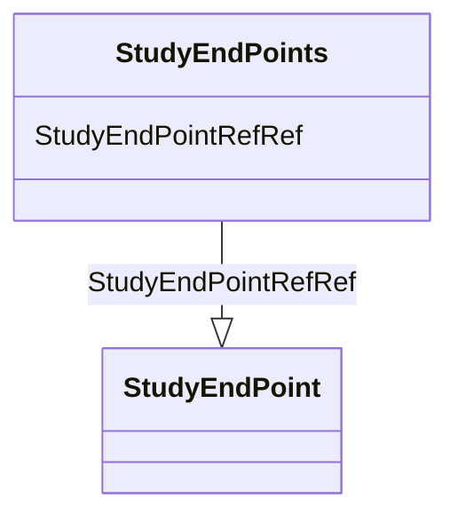

# Class: StudyEndPoints


_Go to start of metadata_


URI: [odm:StudyEndPoints](http://www.cdisc.org/ns/odm/v2.0/StudyEndPoints)





<!-- no inheritance hierarchy -->


## Slots

| Name | Cardinality and Range | Description | Inheritance |
| ---  | --- | --- | --- |
| [StudyEndPointRefRef](StudyEndPointRefRef.md) | 0..* <br/> [StudyEndPoint](StudyEndPoint.md) |  | direct |


## Usages

| used by | used in | type | used |
| ---  | --- | --- | --- |
| [Protocol](Protocol.md) | [StudyEndPointsRef](StudyEndPointsRef.md) | range | [StudyEndPoints](StudyEndPoints.md) |


## See Also

* [https://wiki.cdisc.org/display/ODM2/StudyEndPoints](https://wiki.cdisc.org/display/ODM2/StudyEndPoints)

## Identifier and Mapping Information


### Schema Source


* from schema: http://www.cdisc.org/ns/odm/v2.0


## Mappings

| Mapping Type | Mapped Value |
| ---  | ---  |
| self | odm:StudyEndPoints |
| native | odm:StudyEndPoints |


## LinkML Source

<!-- TODO: investigate https://stackoverflow.com/questions/37606292/how-to-create-tabbed-code-blocks-in-mkdocs-or-sphinx -->

### Direct

<details>
```yaml
name: StudyEndPoints
description: Go to start of metadata
from_schema: http://www.cdisc.org/ns/odm/v2.0
see_also:
- https://wiki.cdisc.org/display/ODM2/StudyEndPoints
slots:
- StudyEndPointRefRef
slot_usage:
  StudyEndPointRefRef:
    name: StudyEndPointRefRef
    multivalued: true
    domain_of:
    - StudyObjective
    - StudyEndPoints
    - StudyEstimand
    range: StudyEndPoint
    inlined: true
    inlined_as_list: true
class_uri: odm:StudyEndPoints

```
</details>

### Induced

<details>
```yaml
name: StudyEndPoints
description: Go to start of metadata
from_schema: http://www.cdisc.org/ns/odm/v2.0
see_also:
- https://wiki.cdisc.org/display/ODM2/StudyEndPoints
slot_usage:
  StudyEndPointRefRef:
    name: StudyEndPointRefRef
    multivalued: true
    domain_of:
    - StudyObjective
    - StudyEndPoints
    - StudyEstimand
    range: StudyEndPoint
    inlined: true
    inlined_as_list: true
attributes:
  StudyEndPointRefRef:
    name: StudyEndPointRefRef
    from_schema: http://www.cdisc.org/ns/odm/v2.0
    rank: 1000
    multivalued: true
    identifier: false
    alias: StudyEndPointRefRef
    owner: StudyEndPoints
    domain_of:
    - StudyObjective
    - StudyEndPoints
    - StudyEstimand
    range: StudyEndPoint
    inlined: true
    inlined_as_list: true
class_uri: odm:StudyEndPoints

```
</details>