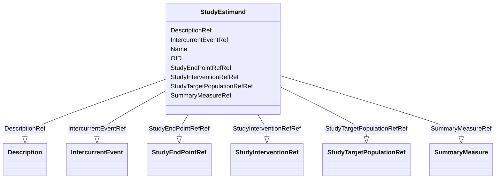

# Class: StudyEstimand


URI: [odm:StudyEstimand](http://www.cdisc.org/ns/odm/v2.0/StudyEstimand)





<!-- no inheritance hierarchy -->


## Slots

| Name | Cardinality and Range | Description | Inheritance |
| ---  | --- | --- | --- |
| [OID](OID.md) | 1..1 <br/> [Oid](Oid.md) | Unique identifier of the version within the XML document | direct |
| [Name](Name.md) | 1..1 <br/> [Name](Name.md) | General observation Sub Class | direct |
| [DescriptionRef](DescriptionRef.md) | 0..1 <br/> [Description](Description.md) |  | direct |
| [StudyTargetPopulationRefRef](StudyTargetPopulationRefRef.md) | 0..1 <br/> [StudyTargetPopulationRef](StudyTargetPopulationRef.md) |  | direct |
| [StudyInterventionRefRef](StudyInterventionRefRef.md) | 0..1 <br/> [StudyInterventionRef](StudyInterventionRef.md) |  | direct |
| [StudyEndPointRefRef](StudyEndPointRefRef.md) | 0..1 <br/> [StudyEndPointRef](StudyEndPointRef.md) |  | direct |
| [IntercurrentEventRef](IntercurrentEventRef.md) | 0..* <br/> [IntercurrentEvent](IntercurrentEvent.md) |  | direct |
| [SummaryMeasureRef](SummaryMeasureRef.md) | 0..1 <br/> [SummaryMeasure](SummaryMeasure.md) |  | direct |


## Usages

| used by | used in | type | used |
| ---  | --- | --- | --- |
| [StudyEstimands](StudyEstimands.md) | [StudyEstimandRef](StudyEstimandRef.md) | range | [StudyEstimand](StudyEstimand.md) |


## Identifier and Mapping Information


### Schema Source


* from schema: http://www.cdisc.org/ns/odm/v2.0


## Mappings

| Mapping Type | Mapped Value |
| ---  | ---  |
| self | odm:StudyEstimand |
| native | odm:StudyEstimand |


## LinkML Source

<!-- TODO: investigate https://stackoverflow.com/questions/37606292/how-to-create-tabbed-code-blocks-in-mkdocs-or-sphinx -->

### Direct

<details>
```yaml
name: StudyEstimand
from_schema: http://www.cdisc.org/ns/odm/v2.0
slots:
- OID
- Name
- DescriptionRef
- StudyTargetPopulationRefRef
- StudyInterventionRefRef
- StudyEndPointRefRef
- IntercurrentEventRef
- SummaryMeasureRef
slot_usage:
  OID:
    name: OID
    domain_of:
    - ValueListDef
    - WhereClauseDef
    - StudyEventGroupDef
    - CommentDef
    - StudyIndication
    - StudyIntervention
    - StudyObjective
    - StudyEndPoint
    - StudyTargetPopulation
    - StudyEstimand
    - Arm
    - Epoch
    - StudyParameter
    - StudyTiming
    - TransitionTimingConstraint
    - AbsoluteTimingConstraint
    - RelativeTimingConstraint
    - DurationTimingConstraint
    - WorkflowDef
    - Transition
    - Branching
    - Criterion
    - ExceptionEvent
    - Organization
    - Query
    - MetaDataVersion
    - StudyEventDef
    - ItemGroupDef
    - ItemDef
    - CodeList
    - ConditionDef
    - MethodDef
    - Standard
    - User
    - Location
    - SignatureDef
    - Study
    range: oid
    required: true
  Name:
    name: Name
    domain_of:
    - StudyEventGroupDef
    - Class
    - SubClass
    - SourceItem
    - Resource
    - Parameter
    - ReturnValue
    - StudyObjective
    - StudyEndPoint
    - StudyTargetPopulation
    - StudyEstimand
    - Arm
    - Epoch
    - StudyTiming
    - TransitionTimingConstraint
    - AbsoluteTimingConstraint
    - RelativeTimingConstraint
    - DurationTimingConstraint
    - WorkflowDef
    - Transition
    - Branching
    - Criterion
    - ExceptionEvent
    - Organization
    - Query
    - MetaDataVersion
    - StudyEventDef
    - ItemGroupDef
    - ItemDef
    - CodeList
    - ConditionDef
    - MethodDef
    - Standard
    - Alias
    - Location
    range: name
    required: true
  DescriptionRef:
    name: DescriptionRef
    domain_of:
    - ValueListDef
    - StudyEventGroupRef
    - StudyEventGroupDef
    - Origin
    - CommentDef
    - Protocol
    - StudyStructure
    - TrialPhase
    - StudyIndication
    - StudyIntervention
    - StudyObjective
    - StudyEndPoint
    - StudyTargetPopulation
    - StudyEstimand
    - IntercurrentEvent
    - SummaryMeasure
    - Arm
    - Epoch
    - TransitionTimingConstraint
    - AbsoluteTimingConstraint
    - RelativeTimingConstraint
    - DurationTimingConstraint
    - WorkflowDef
    - Criterion
    - ExceptionEvent
    - Organization
    - MetaDataVersion
    - StudyEventDef
    - ItemGroupDef
    - ItemDef
    - CodeList
    - ConditionDef
    - MethodDef
    - CodeListItem
    - EnumeratedItem
    - Location
    - Study
    - ODMFileMetadata
    range: Description
    required: false
    minimum_cardinality: 0
    maximum_cardinality: 1
  StudyTargetPopulationRefRef:
    name: StudyTargetPopulationRefRef
    domain_of:
    - StudyEstimand
    range: StudyTargetPopulationRef
    required: false
    minimum_cardinality: 0
    maximum_cardinality: 1
  StudyInterventionRefRef:
    name: StudyInterventionRefRef
    domain_of:
    - StudyEstimand
    range: StudyInterventionRef
    required: false
    minimum_cardinality: 0
    maximum_cardinality: 1
  StudyEndPointRefRef:
    name: StudyEndPointRefRef
    domain_of:
    - StudyObjective
    - StudyEstimand
    range: StudyEndPointRef
    required: false
    minimum_cardinality: 0
    maximum_cardinality: 1
  IntercurrentEventRef:
    name: IntercurrentEventRef
    multivalued: true
    domain_of:
    - StudyEstimand
    range: IntercurrentEvent
    required: false
    minimum_cardinality: 0
  SummaryMeasureRef:
    name: SummaryMeasureRef
    domain_of:
    - StudyEstimand
    range: SummaryMeasure
    required: false
    minimum_cardinality: 0
    maximum_cardinality: 1
class_uri: odm:StudyEstimand

```
</details>

### Induced

<details>
```yaml
name: StudyEstimand
from_schema: http://www.cdisc.org/ns/odm/v2.0
slot_usage:
  OID:
    name: OID
    domain_of:
    - ValueListDef
    - WhereClauseDef
    - StudyEventGroupDef
    - CommentDef
    - StudyIndication
    - StudyIntervention
    - StudyObjective
    - StudyEndPoint
    - StudyTargetPopulation
    - StudyEstimand
    - Arm
    - Epoch
    - StudyParameter
    - StudyTiming
    - TransitionTimingConstraint
    - AbsoluteTimingConstraint
    - RelativeTimingConstraint
    - DurationTimingConstraint
    - WorkflowDef
    - Transition
    - Branching
    - Criterion
    - ExceptionEvent
    - Organization
    - Query
    - MetaDataVersion
    - StudyEventDef
    - ItemGroupDef
    - ItemDef
    - CodeList
    - ConditionDef
    - MethodDef
    - Standard
    - User
    - Location
    - SignatureDef
    - Study
    range: oid
    required: true
  Name:
    name: Name
    domain_of:
    - StudyEventGroupDef
    - Class
    - SubClass
    - SourceItem
    - Resource
    - Parameter
    - ReturnValue
    - StudyObjective
    - StudyEndPoint
    - StudyTargetPopulation
    - StudyEstimand
    - Arm
    - Epoch
    - StudyTiming
    - TransitionTimingConstraint
    - AbsoluteTimingConstraint
    - RelativeTimingConstraint
    - DurationTimingConstraint
    - WorkflowDef
    - Transition
    - Branching
    - Criterion
    - ExceptionEvent
    - Organization
    - Query
    - MetaDataVersion
    - StudyEventDef
    - ItemGroupDef
    - ItemDef
    - CodeList
    - ConditionDef
    - MethodDef
    - Standard
    - Alias
    - Location
    range: name
    required: true
  DescriptionRef:
    name: DescriptionRef
    domain_of:
    - ValueListDef
    - StudyEventGroupRef
    - StudyEventGroupDef
    - Origin
    - CommentDef
    - Protocol
    - StudyStructure
    - TrialPhase
    - StudyIndication
    - StudyIntervention
    - StudyObjective
    - StudyEndPoint
    - StudyTargetPopulation
    - StudyEstimand
    - IntercurrentEvent
    - SummaryMeasure
    - Arm
    - Epoch
    - TransitionTimingConstraint
    - AbsoluteTimingConstraint
    - RelativeTimingConstraint
    - DurationTimingConstraint
    - WorkflowDef
    - Criterion
    - ExceptionEvent
    - Organization
    - MetaDataVersion
    - StudyEventDef
    - ItemGroupDef
    - ItemDef
    - CodeList
    - ConditionDef
    - MethodDef
    - CodeListItem
    - EnumeratedItem
    - Location
    - Study
    - ODMFileMetadata
    range: Description
    required: false
    minimum_cardinality: 0
    maximum_cardinality: 1
  StudyTargetPopulationRefRef:
    name: StudyTargetPopulationRefRef
    domain_of:
    - StudyEstimand
    range: StudyTargetPopulationRef
    required: false
    minimum_cardinality: 0
    maximum_cardinality: 1
  StudyInterventionRefRef:
    name: StudyInterventionRefRef
    domain_of:
    - StudyEstimand
    range: StudyInterventionRef
    required: false
    minimum_cardinality: 0
    maximum_cardinality: 1
  StudyEndPointRefRef:
    name: StudyEndPointRefRef
    domain_of:
    - StudyObjective
    - StudyEstimand
    range: StudyEndPointRef
    required: false
    minimum_cardinality: 0
    maximum_cardinality: 1
  IntercurrentEventRef:
    name: IntercurrentEventRef
    multivalued: true
    domain_of:
    - StudyEstimand
    range: IntercurrentEvent
    required: false
    minimum_cardinality: 0
  SummaryMeasureRef:
    name: SummaryMeasureRef
    domain_of:
    - StudyEstimand
    range: SummaryMeasure
    required: false
    minimum_cardinality: 0
    maximum_cardinality: 1
attributes:
  OID:
    name: OID
    description: Unique identifier of the version within the XML document.
    from_schema: http://www.cdisc.org/ns/odm/v2.0
    rank: 1000
    alias: OID
    owner: StudyEstimand
    domain_of:
    - ValueListDef
    - WhereClauseDef
    - StudyEventGroupDef
    - CommentDef
    - StudyIndication
    - StudyIntervention
    - StudyObjective
    - StudyEndPoint
    - StudyTargetPopulation
    - StudyEstimand
    - Arm
    - Epoch
    - StudyParameter
    - StudyTiming
    - TransitionTimingConstraint
    - AbsoluteTimingConstraint
    - RelativeTimingConstraint
    - DurationTimingConstraint
    - WorkflowDef
    - Transition
    - Branching
    - Criterion
    - ExceptionEvent
    - Organization
    - Query
    - MetaDataVersion
    - StudyEventDef
    - ItemGroupDef
    - ItemDef
    - CodeList
    - ConditionDef
    - MethodDef
    - Standard
    - User
    - Location
    - SignatureDef
    - Study
    range: oid
    required: true
  Name:
    name: Name
    description: General observation Sub Class.
    from_schema: http://www.cdisc.org/ns/odm/v2.0
    rank: 1000
    alias: Name
    owner: StudyEstimand
    domain_of:
    - StudyEventGroupDef
    - Class
    - SubClass
    - SourceItem
    - Resource
    - Parameter
    - ReturnValue
    - StudyObjective
    - StudyEndPoint
    - StudyTargetPopulation
    - StudyEstimand
    - Arm
    - Epoch
    - StudyTiming
    - TransitionTimingConstraint
    - AbsoluteTimingConstraint
    - RelativeTimingConstraint
    - DurationTimingConstraint
    - WorkflowDef
    - Transition
    - Branching
    - Criterion
    - ExceptionEvent
    - Organization
    - Query
    - MetaDataVersion
    - StudyEventDef
    - ItemGroupDef
    - ItemDef
    - CodeList
    - ConditionDef
    - MethodDef
    - Standard
    - Alias
    - Location
    range: name
    required: true
  DescriptionRef:
    name: DescriptionRef
    from_schema: http://www.cdisc.org/ns/odm/v2.0
    rank: 1000
    alias: DescriptionRef
    owner: StudyEstimand
    domain_of:
    - ValueListDef
    - StudyEventGroupRef
    - StudyEventGroupDef
    - Origin
    - CommentDef
    - Protocol
    - StudyStructure
    - TrialPhase
    - StudyIndication
    - StudyIntervention
    - StudyObjective
    - StudyEndPoint
    - StudyTargetPopulation
    - StudyEstimand
    - IntercurrentEvent
    - SummaryMeasure
    - Arm
    - Epoch
    - TransitionTimingConstraint
    - AbsoluteTimingConstraint
    - RelativeTimingConstraint
    - DurationTimingConstraint
    - WorkflowDef
    - Criterion
    - ExceptionEvent
    - Organization
    - MetaDataVersion
    - StudyEventDef
    - ItemGroupDef
    - ItemDef
    - CodeList
    - ConditionDef
    - MethodDef
    - CodeListItem
    - EnumeratedItem
    - Location
    - Study
    - ODMFileMetadata
    range: Description
    required: false
    minimum_cardinality: 0
    maximum_cardinality: 1
  StudyTargetPopulationRefRef:
    name: StudyTargetPopulationRefRef
    from_schema: http://www.cdisc.org/ns/odm/v2.0
    rank: 1000
    alias: StudyTargetPopulationRefRef
    owner: StudyEstimand
    domain_of:
    - StudyEstimand
    range: StudyTargetPopulationRef
    required: false
    minimum_cardinality: 0
    maximum_cardinality: 1
  StudyInterventionRefRef:
    name: StudyInterventionRefRef
    from_schema: http://www.cdisc.org/ns/odm/v2.0
    rank: 1000
    alias: StudyInterventionRefRef
    owner: StudyEstimand
    domain_of:
    - StudyEstimand
    range: StudyInterventionRef
    required: false
    minimum_cardinality: 0
    maximum_cardinality: 1
  StudyEndPointRefRef:
    name: StudyEndPointRefRef
    from_schema: http://www.cdisc.org/ns/odm/v2.0
    rank: 1000
    alias: StudyEndPointRefRef
    owner: StudyEstimand
    domain_of:
    - StudyObjective
    - StudyEstimand
    range: StudyEndPointRef
    required: false
    minimum_cardinality: 0
    maximum_cardinality: 1
  IntercurrentEventRef:
    name: IntercurrentEventRef
    from_schema: http://www.cdisc.org/ns/odm/v2.0
    rank: 1000
    multivalued: true
    alias: IntercurrentEventRef
    owner: StudyEstimand
    domain_of:
    - StudyEstimand
    range: IntercurrentEvent
    required: false
    minimum_cardinality: 0
  SummaryMeasureRef:
    name: SummaryMeasureRef
    from_schema: http://www.cdisc.org/ns/odm/v2.0
    rank: 1000
    alias: SummaryMeasureRef
    owner: StudyEstimand
    domain_of:
    - StudyEstimand
    range: SummaryMeasure
    required: false
    minimum_cardinality: 0
    maximum_cardinality: 1
class_uri: odm:StudyEstimand

```
</details>