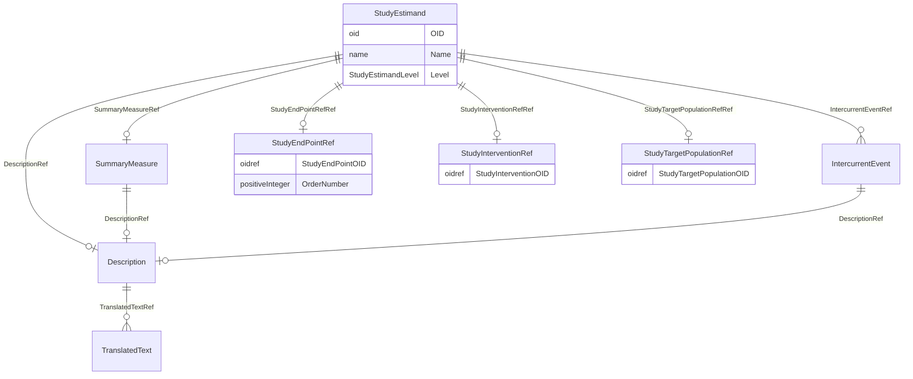

# Class: StudyEstimand

_A precise description of the treatment effect reflecting the clinical question posed by a given clinical trial objective. It summarises at a population level what the outcomes would be in the same patients under different treatment conditions being compared._


URI: [odm:StudyEstimand](http://www.cdisc.org/ns/odm/v2.0/StudyEstimand)





<!-- no inheritance hierarchy -->


## Slots

| Name | Cardinality* and Range | Description | Inheritance |
| ---  | --- | --- | --- |
| [OID](OID.md) | 1..1 <br/> [oid](oid.md) | Unique identifier for the StudyEstimand element. | direct |
| [Name](Name.md) | 1..1 <br/> [name](name.md) | Human readable name for the Study Estimand. | direct |
| [Level](Level.md) | 0..1 <br/> [StudyEstimandLevel](StudyEstimandLevel.md) | Defined Level for the Study Estimand | direct |
| [DescriptionRef](DescriptionRef.md) | 0..1 <br/> [Description](Description.md) | Description reference: A free-text description of the containing metadata com... | direct |
| [StudyTargetPopulationRefRef](StudyTargetPopulationRefRef.md) | 0..1 <br/> [StudyTargetPopulationRef](StudyTargetPopulationRef.md) | StudyTargetPopulationRef reference: The StudyTargetPopulationRef references a... | direct |
| [StudyInterventionRefRef](StudyInterventionRefRef.md) | 0..1 <br/> [StudyInterventionRef](StudyInterventionRef.md) | StudyInterventionRef reference: The StudyInterventionRef references an interv... | direct |
| [StudyEndPointRefRef](StudyEndPointRefRef.md) | 0..1 <br/> [StudyEndPointRef](StudyEndPointRef.md) | StudyEndPointRef reference: Go to start of metadata | direct |
| [IntercurrentEventRef](IntercurrentEventRef.md) | 0..* <br/> [IntercurrentEvent](IntercurrentEvent.md) | IntercurrentEvent reference: The IntercurrentEvent element describes an inter... | direct |
| [SummaryMeasureRef](SummaryMeasureRef.md) | 0..1 <br/> [SummaryMeasure](SummaryMeasure.md) | SummaryMeasure reference: The SummaryMeasure element describes a summary meas... | direct |

_* See [LinkML documentation](https://linkml.io/linkml/schemas/slots.html#slot-cardinality) for cardinality definitions._


## Usages

| used by | used in | type | used |
| ---  | --- | --- | --- |
| [StudyEstimands](StudyEstimands.md) | [StudyEstimandRef](StudyEstimandRef.md) | range | [StudyEstimand](StudyEstimand.md) |


## See Also

* [https://wiki.cdisc.org/display/PUB/StudyEstimand](https://wiki.cdisc.org/display/PUB/StudyEstimand)

## Identifier and Mapping Information


### Schema Source


* from schema: http://www.cdisc.org/ns/odm/v2.0


## Mappings

| Mapping Type | Mapped Value |
| ---  | ---  |
| self | odm:StudyEstimand |
| native | odm:StudyEstimand |


## LinkML Source

<!-- TODO: investigate https://stackoverflow.com/questions/37606292/how-to-create-tabbed-code-blocks-in-mkdocs-or-sphinx -->

### Direct

<details>
```yaml
name: StudyEstimand
description: A precise description of the treatment effect reflecting the clinical
  question posed by a given clinical trial objective. It summarises at a population
  level what the outcomes would be in the same patients under different treatment
  conditions being compared.
from_schema: http://www.cdisc.org/ns/odm/v2.0
see_also:
- https://wiki.cdisc.org/display/PUB/StudyEstimand
rank: 1000
slots:
- OID
- Name
- Level
- DescriptionRef
- StudyTargetPopulationRefRef
- StudyInterventionRefRef
- StudyEndPointRefRef
- IntercurrentEventRef
- SummaryMeasureRef
slot_usage:
  OID:
    name: OID
    description: Unique identifier for the StudyEstimand element.
    comments:
    - 'Required

      range: oid'
    domain_of:
    - Study
    - MetaDataVersion
    - Standard
    - ValueListDef
    - WhereClauseDef
    - StudyEventGroupDef
    - StudyEventDef
    - ItemGroupDef
    - ItemDef
    - CodeList
    - MethodDef
    - ConditionDef
    - CommentDef
    - StudyIndication
    - StudyIntervention
    - StudyObjective
    - StudyEndPoint
    - StudyTargetPopulation
    - StudyEstimand
    - Arm
    - Epoch
    - StudyParameter
    - StudyTiming
    - TransitionTimingConstraint
    - AbsoluteTimingConstraint
    - RelativeTimingConstraint
    - DurationTimingConstraint
    - WorkflowDef
    - Transition
    - Branching
    - Criterion
    - User
    - Organization
    - Location
    - SignatureDef
    - Query
    range: oid
    required: true
  Name:
    name: Name
    description: Human readable name for the Study Estimand.
    comments:
    - 'Required

      range: name'
    domain_of:
    - Alias
    - MetaDataVersion
    - Standard
    - StudyEventGroupDef
    - StudyEventDef
    - ItemGroupDef
    - Class
    - SubClass
    - SourceItem
    - Resource
    - ItemDef
    - CodeList
    - MethodDef
    - Parameter
    - ReturnValue
    - ConditionDef
    - StudyObjective
    - StudyEndPoint
    - StudyTargetPopulation
    - StudyEstimand
    - Arm
    - Epoch
    - StudyTiming
    - TransitionTimingConstraint
    - AbsoluteTimingConstraint
    - RelativeTimingConstraint
    - DurationTimingConstraint
    - WorkflowDef
    - Transition
    - Branching
    - Criterion
    - Organization
    - Location
    - Query
    range: name
    required: true
  Level:
    name: Level
    description: Defined Level for the Study Estimand
    comments:
    - 'Optional

      enum values: ( Primary | Secondary | Exploratory )'
    domain_of:
    - StudyObjective
    - StudyEndPoint
    - StudyEstimand
    range: StudyEstimandLevel
  DescriptionRef:
    name: DescriptionRef
    domain_of:
    - Study
    - MetaDataVersion
    - ValueListDef
    - StudyEventGroupRef
    - StudyEventGroupDef
    - StudyEventDef
    - ItemGroupDef
    - Origin
    - ItemDef
    - CodeList
    - CodeListItem
    - MethodDef
    - ConditionDef
    - CommentDef
    - Protocol
    - StudyStructure
    - TrialPhase
    - StudyIndication
    - StudyIntervention
    - StudyObjective
    - StudyEndPoint
    - StudyTargetPopulation
    - StudyEstimand
    - IntercurrentEvent
    - SummaryMeasure
    - Arm
    - Epoch
    - TransitionTimingConstraint
    - AbsoluteTimingConstraint
    - RelativeTimingConstraint
    - DurationTimingConstraint
    - WorkflowDef
    - Criterion
    - Organization
    - Location
    - ODMFileMetadata
    range: Description
    maximum_cardinality: 1
  StudyTargetPopulationRefRef:
    name: StudyTargetPopulationRefRef
    domain_of:
    - Protocol
    - StudyEstimand
    range: StudyTargetPopulationRef
    maximum_cardinality: 1
  StudyInterventionRefRef:
    name: StudyInterventionRefRef
    domain_of:
    - StudyInterventions
    - StudyEstimand
    range: StudyInterventionRef
    maximum_cardinality: 1
  StudyEndPointRefRef:
    name: StudyEndPointRefRef
    domain_of:
    - StudyObjective
    - StudyEndPoints
    - StudyEstimand
    range: StudyEndPointRef
    maximum_cardinality: 1
  IntercurrentEventRef:
    name: IntercurrentEventRef
    multivalued: true
    domain_of:
    - StudyEstimand
    range: IntercurrentEvent
    inlined: true
    inlined_as_list: true
  SummaryMeasureRef:
    name: SummaryMeasureRef
    domain_of:
    - StudyEstimand
    range: SummaryMeasure
    maximum_cardinality: 1
class_uri: odm:StudyEstimand

```
</details>

### Induced

<details>
```yaml
name: StudyEstimand
description: A precise description of the treatment effect reflecting the clinical
  question posed by a given clinical trial objective. It summarises at a population
  level what the outcomes would be in the same patients under different treatment
  conditions being compared.
from_schema: http://www.cdisc.org/ns/odm/v2.0
see_also:
- https://wiki.cdisc.org/display/PUB/StudyEstimand
rank: 1000
slot_usage:
  OID:
    name: OID
    description: Unique identifier for the StudyEstimand element.
    comments:
    - 'Required

      range: oid'
    domain_of:
    - Study
    - MetaDataVersion
    - Standard
    - ValueListDef
    - WhereClauseDef
    - StudyEventGroupDef
    - StudyEventDef
    - ItemGroupDef
    - ItemDef
    - CodeList
    - MethodDef
    - ConditionDef
    - CommentDef
    - StudyIndication
    - StudyIntervention
    - StudyObjective
    - StudyEndPoint
    - StudyTargetPopulation
    - StudyEstimand
    - Arm
    - Epoch
    - StudyParameter
    - StudyTiming
    - TransitionTimingConstraint
    - AbsoluteTimingConstraint
    - RelativeTimingConstraint
    - DurationTimingConstraint
    - WorkflowDef
    - Transition
    - Branching
    - Criterion
    - User
    - Organization
    - Location
    - SignatureDef
    - Query
    range: oid
    required: true
  Name:
    name: Name
    description: Human readable name for the Study Estimand.
    comments:
    - 'Required

      range: name'
    domain_of:
    - Alias
    - MetaDataVersion
    - Standard
    - StudyEventGroupDef
    - StudyEventDef
    - ItemGroupDef
    - Class
    - SubClass
    - SourceItem
    - Resource
    - ItemDef
    - CodeList
    - MethodDef
    - Parameter
    - ReturnValue
    - ConditionDef
    - StudyObjective
    - StudyEndPoint
    - StudyTargetPopulation
    - StudyEstimand
    - Arm
    - Epoch
    - StudyTiming
    - TransitionTimingConstraint
    - AbsoluteTimingConstraint
    - RelativeTimingConstraint
    - DurationTimingConstraint
    - WorkflowDef
    - Transition
    - Branching
    - Criterion
    - Organization
    - Location
    - Query
    range: name
    required: true
  Level:
    name: Level
    description: Defined Level for the Study Estimand
    comments:
    - 'Optional

      enum values: ( Primary | Secondary | Exploratory )'
    domain_of:
    - StudyObjective
    - StudyEndPoint
    - StudyEstimand
    range: StudyEstimandLevel
  DescriptionRef:
    name: DescriptionRef
    domain_of:
    - Study
    - MetaDataVersion
    - ValueListDef
    - StudyEventGroupRef
    - StudyEventGroupDef
    - StudyEventDef
    - ItemGroupDef
    - Origin
    - ItemDef
    - CodeList
    - CodeListItem
    - MethodDef
    - ConditionDef
    - CommentDef
    - Protocol
    - StudyStructure
    - TrialPhase
    - StudyIndication
    - StudyIntervention
    - StudyObjective
    - StudyEndPoint
    - StudyTargetPopulation
    - StudyEstimand
    - IntercurrentEvent
    - SummaryMeasure
    - Arm
    - Epoch
    - TransitionTimingConstraint
    - AbsoluteTimingConstraint
    - RelativeTimingConstraint
    - DurationTimingConstraint
    - WorkflowDef
    - Criterion
    - Organization
    - Location
    - ODMFileMetadata
    range: Description
    maximum_cardinality: 1
  StudyTargetPopulationRefRef:
    name: StudyTargetPopulationRefRef
    domain_of:
    - Protocol
    - StudyEstimand
    range: StudyTargetPopulationRef
    maximum_cardinality: 1
  StudyInterventionRefRef:
    name: StudyInterventionRefRef
    domain_of:
    - StudyInterventions
    - StudyEstimand
    range: StudyInterventionRef
    maximum_cardinality: 1
  StudyEndPointRefRef:
    name: StudyEndPointRefRef
    domain_of:
    - StudyObjective
    - StudyEndPoints
    - StudyEstimand
    range: StudyEndPointRef
    maximum_cardinality: 1
  IntercurrentEventRef:
    name: IntercurrentEventRef
    multivalued: true
    domain_of:
    - StudyEstimand
    range: IntercurrentEvent
    inlined: true
    inlined_as_list: true
  SummaryMeasureRef:
    name: SummaryMeasureRef
    domain_of:
    - StudyEstimand
    range: SummaryMeasure
    maximum_cardinality: 1
attributes:
  OID:
    name: OID
    description: Unique identifier for the StudyEstimand element.
    comments:
    - 'Required

      range: oid'
    from_schema: http://www.cdisc.org/ns/odm/v2.0
    rank: 1000
    identifier: true
    alias: OID
    owner: StudyEstimand
    domain_of:
    - Study
    - MetaDataVersion
    - Standard
    - ValueListDef
    - WhereClauseDef
    - StudyEventGroupDef
    - StudyEventDef
    - ItemGroupDef
    - ItemDef
    - CodeList
    - MethodDef
    - ConditionDef
    - CommentDef
    - StudyIndication
    - StudyIntervention
    - StudyObjective
    - StudyEndPoint
    - StudyTargetPopulation
    - StudyEstimand
    - Arm
    - Epoch
    - StudyParameter
    - StudyTiming
    - TransitionTimingConstraint
    - AbsoluteTimingConstraint
    - RelativeTimingConstraint
    - DurationTimingConstraint
    - WorkflowDef
    - Transition
    - Branching
    - Criterion
    - User
    - Organization
    - Location
    - SignatureDef
    - Query
    range: oid
    required: true
  Name:
    name: Name
    description: Human readable name for the Study Estimand.
    comments:
    - 'Required

      range: name'
    from_schema: http://www.cdisc.org/ns/odm/v2.0
    rank: 1000
    alias: Name
    owner: StudyEstimand
    domain_of:
    - Alias
    - MetaDataVersion
    - Standard
    - StudyEventGroupDef
    - StudyEventDef
    - ItemGroupDef
    - Class
    - SubClass
    - SourceItem
    - Resource
    - ItemDef
    - CodeList
    - MethodDef
    - Parameter
    - ReturnValue
    - ConditionDef
    - StudyObjective
    - StudyEndPoint
    - StudyTargetPopulation
    - StudyEstimand
    - Arm
    - Epoch
    - StudyTiming
    - TransitionTimingConstraint
    - AbsoluteTimingConstraint
    - RelativeTimingConstraint
    - DurationTimingConstraint
    - WorkflowDef
    - Transition
    - Branching
    - Criterion
    - Organization
    - Location
    - Query
    range: name
    required: true
  Level:
    name: Level
    description: Defined Level for the Study Estimand
    comments:
    - 'Optional

      enum values: ( Primary | Secondary | Exploratory )'
    from_schema: http://www.cdisc.org/ns/odm/v2.0
    rank: 1000
    alias: Level
    owner: StudyEstimand
    domain_of:
    - StudyObjective
    - StudyEndPoint
    - StudyEstimand
    range: StudyEstimandLevel
  DescriptionRef:
    name: DescriptionRef
    description: 'Description reference: A free-text description of the containing
      metadata component, unless restricted by Business Rules.'
    from_schema: http://www.cdisc.org/ns/odm/v2.0
    rank: 1000
    identifier: false
    alias: DescriptionRef
    owner: StudyEstimand
    domain_of:
    - Study
    - MetaDataVersion
    - ValueListDef
    - StudyEventGroupRef
    - StudyEventGroupDef
    - StudyEventDef
    - ItemGroupDef
    - Origin
    - ItemDef
    - CodeList
    - CodeListItem
    - MethodDef
    - ConditionDef
    - CommentDef
    - Protocol
    - StudyStructure
    - TrialPhase
    - StudyIndication
    - StudyIntervention
    - StudyObjective
    - StudyEndPoint
    - StudyTargetPopulation
    - StudyEstimand
    - IntercurrentEvent
    - SummaryMeasure
    - Arm
    - Epoch
    - TransitionTimingConstraint
    - AbsoluteTimingConstraint
    - RelativeTimingConstraint
    - DurationTimingConstraint
    - WorkflowDef
    - Criterion
    - Organization
    - Location
    - ODMFileMetadata
    range: Description
    maximum_cardinality: 1
  StudyTargetPopulationRefRef:
    name: StudyTargetPopulationRefRef
    description: 'StudyTargetPopulationRef reference: The StudyTargetPopulationRef
      references a StudyTargetPopulation to which the estimand applies.'
    from_schema: http://www.cdisc.org/ns/odm/v2.0
    rank: 1000
    identifier: false
    alias: StudyTargetPopulationRefRef
    owner: StudyEstimand
    domain_of:
    - Protocol
    - StudyEstimand
    range: StudyTargetPopulationRef
    maximum_cardinality: 1
  StudyInterventionRefRef:
    name: StudyInterventionRefRef
    description: 'StudyInterventionRef reference: The StudyInterventionRef references
      an intervention that is taken as the treatment for the estimand.'
    from_schema: http://www.cdisc.org/ns/odm/v2.0
    rank: 1000
    identifier: false
    alias: StudyInterventionRefRef
    owner: StudyEstimand
    domain_of:
    - StudyInterventions
    - StudyEstimand
    range: StudyInterventionRef
    maximum_cardinality: 1
  StudyEndPointRefRef:
    name: StudyEndPointRefRef
    description: 'StudyEndPointRef reference: Go to start of metadata'
    from_schema: http://www.cdisc.org/ns/odm/v2.0
    rank: 1000
    identifier: false
    alias: StudyEndPointRefRef
    owner: StudyEstimand
    domain_of:
    - StudyObjective
    - StudyEndPoints
    - StudyEstimand
    range: StudyEndPointRef
    maximum_cardinality: 1
  IntercurrentEventRef:
    name: IntercurrentEventRef
    description: 'IntercurrentEvent reference: The IntercurrentEvent element describes
      an intercurrent event for an estimand (e.g., treatment discontinuation).'
    from_schema: http://www.cdisc.org/ns/odm/v2.0
    rank: 1000
    multivalued: true
    identifier: false
    alias: IntercurrentEventRef
    owner: StudyEstimand
    domain_of:
    - StudyEstimand
    range: IntercurrentEvent
    inlined: true
    inlined_as_list: true
  SummaryMeasureRef:
    name: SummaryMeasureRef
    description: 'SummaryMeasure reference: The SummaryMeasure element describes a
      summary measure for an estimand (e.g., proportion of patients with an improvement).'
    from_schema: http://www.cdisc.org/ns/odm/v2.0
    rank: 1000
    identifier: false
    alias: SummaryMeasureRef
    owner: StudyEstimand
    domain_of:
    - StudyEstimand
    range: SummaryMeasure
    maximum_cardinality: 1
class_uri: odm:StudyEstimand

```
</details>