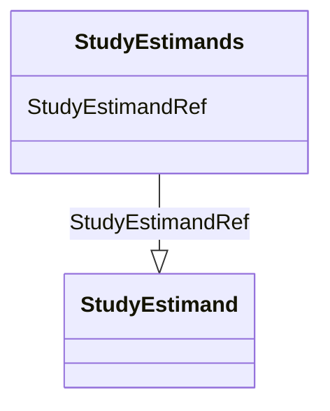

# Class: StudyEstimands


_Element NameStudyEstimandsParent ElementsProtocolElement XPath(s)/ODM/Study/MetaDataVersion/Protocol/StudyEstimandsElement Textual ValueNoneUsage/Business RulesAttributesTypeChild Elements(StudyEstimand*)_


URI: [odm:StudyEstimands](http://www.cdisc.org/ns/odm/v2.0/StudyEstimands)





<!-- no inheritance hierarchy -->


## Slots

| Name | Cardinality and Range | Description | Inheritance |
| ---  | --- | --- | --- |
| [StudyEstimandRef](StudyEstimandRef.md) | 0..* <br/> [StudyEstimand](StudyEstimand.md) |  | direct |


## Usages

| used by | used in | type | used |
| ---  | --- | --- | --- |
| [Protocol](Protocol.md) | [StudyEstimandsRef](StudyEstimandsRef.md) | range | [StudyEstimands](StudyEstimands.md) |


## See Also

* [https://wiki.cdisc.org/display/ODM2/StudyEstimands](https://wiki.cdisc.org/display/ODM2/StudyEstimands)

## Identifier and Mapping Information


### Schema Source


* from schema: http://www.cdisc.org/ns/odm/v2.0


## Mappings

| Mapping Type | Mapped Value |
| ---  | ---  |
| self | odm:StudyEstimands |
| native | odm:StudyEstimands |


## LinkML Source

<!-- TODO: investigate https://stackoverflow.com/questions/37606292/how-to-create-tabbed-code-blocks-in-mkdocs-or-sphinx -->

### Direct

<details>
```yaml
name: StudyEstimands
description: Element NameStudyEstimandsParent ElementsProtocolElement XPath(s)/ODM/Study/MetaDataVersion/Protocol/StudyEstimandsElement
  Textual ValueNoneUsage/Business RulesAttributesTypeChild Elements(StudyEstimand*)
from_schema: http://www.cdisc.org/ns/odm/v2.0
see_also:
- https://wiki.cdisc.org/display/ODM2/StudyEstimands
slots:
- StudyEstimandRef
slot_usage:
  StudyEstimandRef:
    name: StudyEstimandRef
    multivalued: true
    domain_of:
    - StudyEstimands
    range: StudyEstimand
    inlined: true
    inlined_as_list: true
class_uri: odm:StudyEstimands

```
</details>

### Induced

<details>
```yaml
name: StudyEstimands
description: Element NameStudyEstimandsParent ElementsProtocolElement XPath(s)/ODM/Study/MetaDataVersion/Protocol/StudyEstimandsElement
  Textual ValueNoneUsage/Business RulesAttributesTypeChild Elements(StudyEstimand*)
from_schema: http://www.cdisc.org/ns/odm/v2.0
see_also:
- https://wiki.cdisc.org/display/ODM2/StudyEstimands
slot_usage:
  StudyEstimandRef:
    name: StudyEstimandRef
    multivalued: true
    domain_of:
    - StudyEstimands
    range: StudyEstimand
    inlined: true
    inlined_as_list: true
attributes:
  StudyEstimandRef:
    name: StudyEstimandRef
    from_schema: http://www.cdisc.org/ns/odm/v2.0
    rank: 1000
    multivalued: true
    identifier: false
    alias: StudyEstimandRef
    owner: StudyEstimands
    domain_of:
    - StudyEstimands
    range: StudyEstimand
    inlined: true
    inlined_as_list: true
class_uri: odm:StudyEstimands

```
</details>