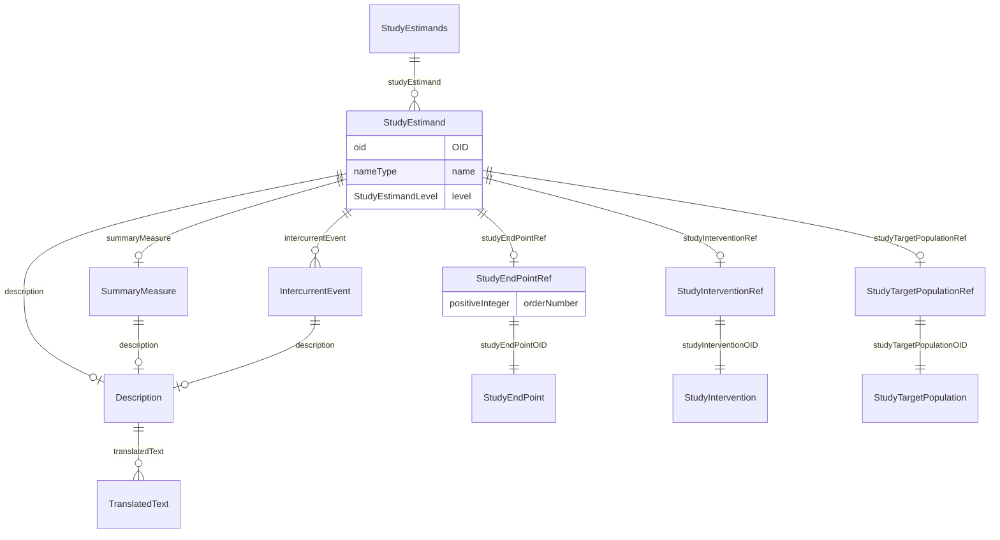

# Class: StudyEstimands

_StudyEstimands is a container element for individual StudyEstimand elements._


URI: [odm:StudyEstimands](http://www.cdisc.org/ns/odm/v2.0/StudyEstimands)





<!-- no inheritance hierarchy -->


## Slots

| Name | Cardinality* and Range | Description | Inheritance |
| ---  | --- | --- | --- |
| [studyEstimand](studyEstimand.md) | 0..* <br/> [StudyEstimand](StudyEstimand.md) | StudyEstimand reference: A precise description of the treatment effect reflec... | direct |

_* See [LinkML documentation](https://linkml.io/linkml/schemas/slots.html#slot-cardinality) for cardinality definitions._


## Usages

| used by | used in | type | used |
| ---  | --- | --- | --- |
| [Protocol](Protocol.md) | [studyEstimands](studyEstimands.md) | range | [StudyEstimands](StudyEstimands.md) |


## See Also

* [https://wiki.cdisc.org/display/PUB/StudyEstimands](https://wiki.cdisc.org/display/PUB/StudyEstimands)

## Identifier and Mapping Information


### Schema Source


* from schema: http://www.cdisc.org/ns/odm/v2.0


## Mappings

| Mapping Type | Mapped Value |
| ---  | ---  |
| self | odm:StudyEstimands |
| native | odm:StudyEstimands |


## LinkML Source

<!-- TODO: investigate https://stackoverflow.com/questions/37606292/how-to-create-tabbed-code-blocks-in-mkdocs-or-sphinx -->

### Direct

<details>
```yaml
name: StudyEstimands
description: StudyEstimands is a container element for individual StudyEstimand elements.
from_schema: http://www.cdisc.org/ns/odm/v2.0
see_also:
- https://wiki.cdisc.org/display/PUB/StudyEstimands
rank: 1000
slots:
- studyEstimand
slot_usage:
  studyEstimand:
    name: studyEstimand
    multivalued: true
    domain_of:
    - StudyEstimands
    range: StudyEstimand
    inlined: true
    inlined_as_list: true
class_uri: odm:StudyEstimands

```
</details>

### Induced

<details>
```yaml
name: StudyEstimands
description: StudyEstimands is a container element for individual StudyEstimand elements.
from_schema: http://www.cdisc.org/ns/odm/v2.0
see_also:
- https://wiki.cdisc.org/display/PUB/StudyEstimands
rank: 1000
slot_usage:
  studyEstimand:
    name: studyEstimand
    multivalued: true
    domain_of:
    - StudyEstimands
    range: StudyEstimand
    inlined: true
    inlined_as_list: true
attributes:
  studyEstimand:
    name: studyEstimand
    description: 'StudyEstimand reference: A precise description of the treatment
      effect reflecting the clinical question posed by a given clinical trial objective.
      It summarises at a population level what the outcomes would be in the same patients
      under different treatment conditions being compared.'
    from_schema: http://www.cdisc.org/ns/odm/v2.0
    rank: 1000
    multivalued: true
    alias: studyEstimand
    owner: StudyEstimands
    domain_of:
    - StudyEstimands
    range: StudyEstimand
    inlined: true
    inlined_as_list: true
class_uri: odm:StudyEstimands

```
</details>