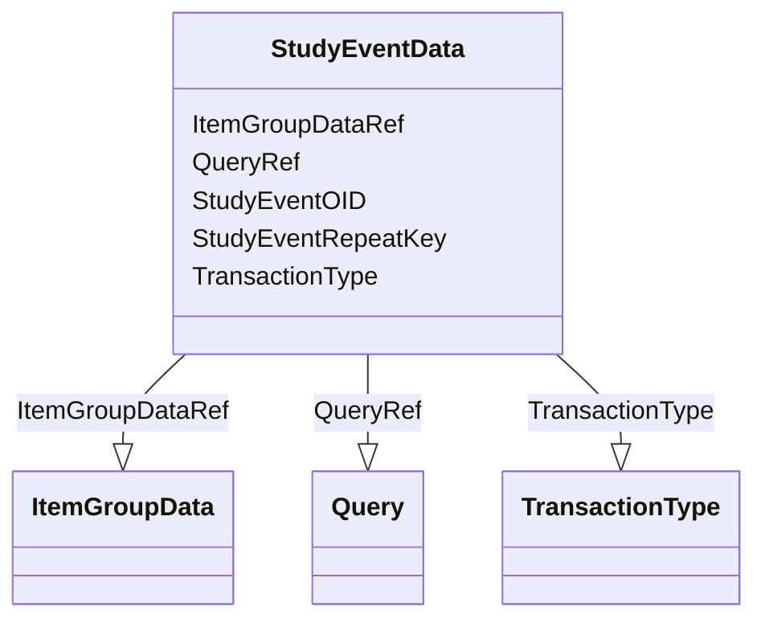

# Class: StudyEventData


URI: [odm:StudyEventData](http://www.cdisc.org/ns/odm/v2.0/StudyEventData)





<!-- no inheritance hierarchy -->


## Slots

| Name | Cardinality and Range | Description | Inheritance |
| ---  | --- | --- | --- |
| [StudyEventOID](StudyEventOID.md) | 1..1 <br/> [Oidref](Oidref.md) |  | direct |
| [StudyEventRepeatKey](StudyEventRepeatKey.md) | 0..1 <br/> [RepeatKey](RepeatKey.md) |  | direct |
| [TransactionType](TransactionType.md) | 0..1 <br/> [TransactionType](TransactionType.md) |  | direct |
| [ItemGroupDataRef](ItemGroupDataRef.md) | 0..* <br/> [ItemGroupData](ItemGroupData.md) |  | direct |
| [QueryRef](QueryRef.md) | 0..* <br/> [Query](Query.md) |  | direct |


## Usages

| used by | used in | type | used |
| ---  | --- | --- | --- |
| [SubjectData](SubjectData.md) | [StudyEventDataRef](StudyEventDataRef.md) | range | [StudyEventData](StudyEventData.md) |


## Identifier and Mapping Information


### Schema Source


* from schema: http://www.cdisc.org/ns/odm/v2.0


## Mappings

| Mapping Type | Mapped Value |
| ---  | ---  |
| self | odm:StudyEventData |
| native | odm:StudyEventData |


## LinkML Source

<!-- TODO: investigate https://stackoverflow.com/questions/37606292/how-to-create-tabbed-code-blocks-in-mkdocs-or-sphinx -->

### Direct

<details>
```yaml
name: StudyEventData
from_schema: http://www.cdisc.org/ns/odm/v2.0
slots:
- StudyEventOID
- StudyEventRepeatKey
- TransactionType
- ItemGroupDataRef
- QueryRef
slot_usage:
  StudyEventOID:
    name: StudyEventOID
    domain_of:
    - StudyEventRef
    - AbsoluteTimingConstraint
    - StudyEventData
    - KeySet
    range: oidref
    required: true
  StudyEventRepeatKey:
    name: StudyEventRepeatKey
    domain_of:
    - StudyEventData
    - KeySet
    range: repeatKey
    required: false
  TransactionType:
    name: TransactionType
    domain_of:
    - SubjectData
    - StudyEventData
    - ItemGroupData
    - ItemData
    - Annotation
    range: TransactionType
    required: false
  ItemGroupDataRef:
    name: ItemGroupDataRef
    multivalued: true
    domain_of:
    - ReferenceData
    - ClinicalData
    - StudyEventData
    range: ItemGroupData
    required: false
    minimum_cardinality: 0
  QueryRef:
    name: QueryRef
    multivalued: true
    domain_of:
    - ClinicalData
    - SubjectData
    - StudyEventData
    - ItemGroupData
    - ItemData
    - Location
    range: Query
    required: false
    minimum_cardinality: 0
class_uri: odm:StudyEventData

```
</details>

### Induced

<details>
```yaml
name: StudyEventData
from_schema: http://www.cdisc.org/ns/odm/v2.0
slot_usage:
  StudyEventOID:
    name: StudyEventOID
    domain_of:
    - StudyEventRef
    - AbsoluteTimingConstraint
    - StudyEventData
    - KeySet
    range: oidref
    required: true
  StudyEventRepeatKey:
    name: StudyEventRepeatKey
    domain_of:
    - StudyEventData
    - KeySet
    range: repeatKey
    required: false
  TransactionType:
    name: TransactionType
    domain_of:
    - SubjectData
    - StudyEventData
    - ItemGroupData
    - ItemData
    - Annotation
    range: TransactionType
    required: false
  ItemGroupDataRef:
    name: ItemGroupDataRef
    multivalued: true
    domain_of:
    - ReferenceData
    - ClinicalData
    - StudyEventData
    range: ItemGroupData
    required: false
    minimum_cardinality: 0
  QueryRef:
    name: QueryRef
    multivalued: true
    domain_of:
    - ClinicalData
    - SubjectData
    - StudyEventData
    - ItemGroupData
    - ItemData
    - Location
    range: Query
    required: false
    minimum_cardinality: 0
attributes:
  StudyEventOID:
    name: StudyEventOID
    from_schema: http://www.cdisc.org/ns/odm/v2.0
    rank: 1000
    alias: StudyEventOID
    owner: StudyEventData
    domain_of:
    - StudyEventRef
    - AbsoluteTimingConstraint
    - StudyEventData
    - KeySet
    range: oidref
    required: true
  StudyEventRepeatKey:
    name: StudyEventRepeatKey
    from_schema: http://www.cdisc.org/ns/odm/v2.0
    rank: 1000
    alias: StudyEventRepeatKey
    owner: StudyEventData
    domain_of:
    - StudyEventData
    - KeySet
    range: repeatKey
    required: false
  TransactionType:
    name: TransactionType
    from_schema: http://www.cdisc.org/ns/odm/v2.0
    rank: 1000
    alias: TransactionType
    owner: StudyEventData
    domain_of:
    - SubjectData
    - StudyEventData
    - ItemGroupData
    - ItemData
    - Annotation
    range: TransactionType
    required: false
  ItemGroupDataRef:
    name: ItemGroupDataRef
    from_schema: http://www.cdisc.org/ns/odm/v2.0
    rank: 1000
    multivalued: true
    alias: ItemGroupDataRef
    owner: StudyEventData
    domain_of:
    - ReferenceData
    - ClinicalData
    - StudyEventData
    range: ItemGroupData
    required: false
    minimum_cardinality: 0
  QueryRef:
    name: QueryRef
    from_schema: http://www.cdisc.org/ns/odm/v2.0
    rank: 1000
    multivalued: true
    alias: QueryRef
    owner: StudyEventData
    domain_of:
    - ClinicalData
    - SubjectData
    - StudyEventData
    - ItemGroupData
    - ItemData
    - Location
    range: Query
    required: false
    minimum_cardinality: 0
class_uri: odm:StudyEventData

```
</details>