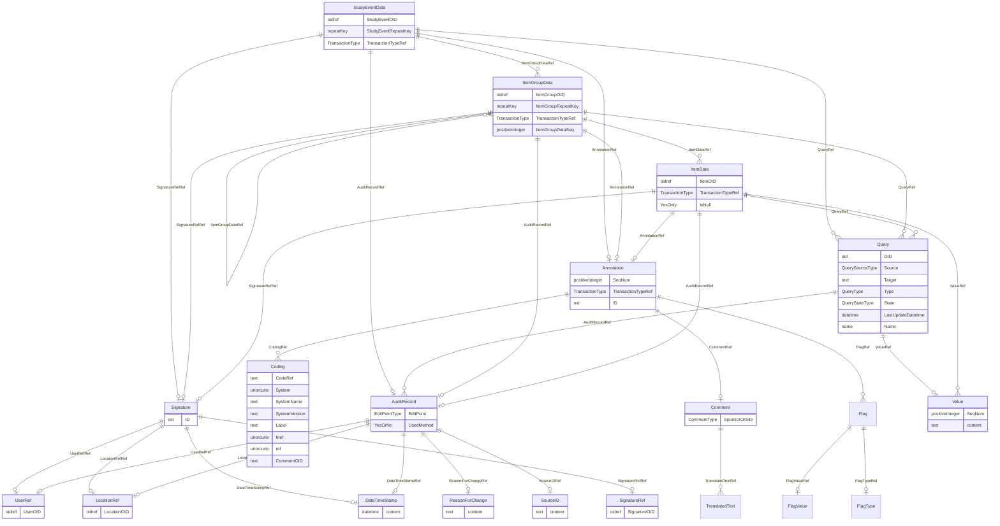

# Class: StudyEventData

_Clinical data for a study event (visit). The model supports repeating study events (e.g., when the same set of information is collected for a series of patient visits)._


URI: [odm:StudyEventData](http://www.cdisc.org/ns/odm/v2.0/StudyEventData)





<!-- no inheritance hierarchy -->


## Slots

| Name | Cardinality* and Range | Description | Inheritance |
| ---  | --- | --- | --- |
| [StudyEventOID](StudyEventOID.md) | 1..1 <br/> [oidref](oidref.md) | Reference to the StudyEventDef . The StudyEventOID and StudyEventRepeatKey ar... | direct |
| [StudyEventRepeatKey](StudyEventRepeatKey.md) | 0..1 <br/> [repeatKey](repeatKey.md) | A key used to distinguish between repeats of the same type of study event for... | direct |
| [TransactionTypeRef](TransactionTypeRef.md) | 0..1 <br/> [TransactionType](TransactionType.md) | Identifies the transaction type when /ODM/@FileType is Transactional and ther... | direct |
| [ItemGroupDataRef](ItemGroupDataRef.md) | 0..* <br/> [ItemGroupData](ItemGroupData.md) | ItemGroupData reference: Clinical data corresponding to an ItemGroupRef defin... | direct |
| [QueryRef](QueryRef.md) | 0..* <br/> [Query](Query.md) | Query reference: The Query element represents a request for clarification on ... | direct |
| [AuditRecordRef](AuditRecordRef.md) | 0..1 <br/> [AuditRecord](AuditRecord.md) | AuditRecord reference: An AuditRecord carries information pertaining to the c... | direct |
| [SignatureRefRef](SignatureRefRef.md) | 0..1 <br/> [Signature](Signature.md) | SignatureRef reference: A reference to the signature meaning. | direct |
| [AnnotationRef](AnnotationRef.md) | 0..1 <br/> [Annotation](Annotation.md) | Annotation reference: A general note about clinical data. If an annotation ha... | direct |

_* See [LinkML documentation](https://linkml.io/linkml/schemas/slots.html#slot-cardinality) for cardinality definitions._


## Usages

| used by | used in | type | used |
| ---  | --- | --- | --- |
| [SubjectData](SubjectData.md) | [StudyEventDataRef](StudyEventDataRef.md) | range | [StudyEventData](StudyEventData.md) |


## See Also

* [https://wiki.cdisc.org/display/ODM2/StudyEventData](https://wiki.cdisc.org/display/ODM2/StudyEventData)

## Identifier and Mapping Information


### Schema Source


* from schema: http://www.cdisc.org/ns/odm/v2.0


## Mappings

| Mapping Type | Mapped Value |
| ---  | ---  |
| self | odm:StudyEventData |
| native | odm:StudyEventData |


## LinkML Source

<!-- TODO: investigate https://stackoverflow.com/questions/37606292/how-to-create-tabbed-code-blocks-in-mkdocs-or-sphinx -->

### Direct

<details>
```yaml
name: StudyEventData
description: Clinical data for a study event (visit). The model supports repeating
  study events (e.g., when the same set of information is collected for a series of
  patient visits).
from_schema: http://www.cdisc.org/ns/odm/v2.0
see_also:
- https://wiki.cdisc.org/display/ODM2/StudyEventData
rank: 1000
slots:
- StudyEventOID
- StudyEventRepeatKey
- TransactionTypeRef
- ItemGroupDataRef
- QueryRef
- AuditRecordRef
- SignatureRefRef
- AnnotationRef
slot_usage:
  StudyEventOID:
    name: StudyEventOID
    description: Reference to the StudyEventDef . The StudyEventOID and StudyEventRepeatKey
      are used together to identify a particular study event. This pair of values
      uniquely identifies a StudyEvent within the containing subject. The StudyEventRepeatKey
      is present if and only if the StudyEventDef is repeating.
    comments:
    - 'Required

      Must match a StudyEventGroupDef/@OID or StudyEventDef/@OID for the MetaDataVersion
      /@OID value that matches the ClinicalData/@MetaDataVersionOID attribute.'
    domain_of:
    - StudyEventRef
    - AbsoluteTimingConstraint
    - StudyEventData
    - KeySet
    range: oidref
    required: true
  StudyEventRepeatKey:
    name: StudyEventRepeatKey
    description: A key used to distinguish between repeats of the same type of study
      event for a single subject.
    comments:
    - 'Conditional

      If the StudyEventDef/@Repeating attribute has the value "Yes" and there is more
      than one ClinicalData/SubjectData/StudyEventData/@OID element, the StudyEventRepeatKey
      attribute must be provided. Must be unique among the set of ClinicalData/SubjectData/StudyEventData/@OID
      elements. The StudyEventRepeatKey must be present only when the StudyEventDef/@Repeating
      attribute has the value "Yes".'
    domain_of:
    - StudyEventData
    - KeySet
    range: repeatKey
  TransactionTypeRef:
    name: TransactionTypeRef
    description: Identifies the transaction type when /ODM/@FileType is Transactional
      and there is no child element.
    comments:
    - 'Conditional Required when contained within an ODM Transactional file and the
      StudyEventData element has no child element content the TransactionType must
      be specified.

      When importing data from an ODM Snapshot file, the TransactionType attribute
      must not affect the processing of any of the StudyEvent child elements.'
    domain_of:
    - SubjectData
    - StudyEventData
    - ItemGroupData
    - ItemData
    - Annotation
    range: TransactionType
  ItemGroupDataRef:
    name: ItemGroupDataRef
    multivalued: true
    domain_of:
    - ReferenceData
    - ClinicalData
    - StudyEventData
    - ItemGroupData
    range: ItemGroupData
    inlined: true
    inlined_as_list: true
  QueryRef:
    name: QueryRef
    multivalued: true
    domain_of:
    - Location
    - ClinicalData
    - SubjectData
    - StudyEventData
    - ItemGroupData
    - ItemData
    range: Query
    inlined: true
    inlined_as_list: true
  AuditRecordRef:
    name: AuditRecordRef
    domain_of:
    - ReferenceData
    - ClinicalData
    - SubjectData
    - StudyEventData
    - ItemGroupData
    - ItemData
    - Query
    range: AuditRecord
    maximum_cardinality: 1
  SignatureRefRef:
    name: SignatureRefRef
    domain_of:
    - ReferenceData
    - ClinicalData
    - SubjectData
    - StudyEventData
    - ItemGroupData
    - ItemData
    - Signature
    range: Signature
    maximum_cardinality: 1
  AnnotationRef:
    name: AnnotationRef
    domain_of:
    - ReferenceData
    - ClinicalData
    - SubjectData
    - StudyEventData
    - ItemGroupData
    - ItemData
    - Association
    range: Annotation
    maximum_cardinality: 1
class_uri: odm:StudyEventData

```
</details>

### Induced

<details>
```yaml
name: StudyEventData
description: Clinical data for a study event (visit). The model supports repeating
  study events (e.g., when the same set of information is collected for a series of
  patient visits).
from_schema: http://www.cdisc.org/ns/odm/v2.0
see_also:
- https://wiki.cdisc.org/display/ODM2/StudyEventData
rank: 1000
slot_usage:
  StudyEventOID:
    name: StudyEventOID
    description: Reference to the StudyEventDef . The StudyEventOID and StudyEventRepeatKey
      are used together to identify a particular study event. This pair of values
      uniquely identifies a StudyEvent within the containing subject. The StudyEventRepeatKey
      is present if and only if the StudyEventDef is repeating.
    comments:
    - 'Required

      Must match a StudyEventGroupDef/@OID or StudyEventDef/@OID for the MetaDataVersion
      /@OID value that matches the ClinicalData/@MetaDataVersionOID attribute.'
    domain_of:
    - StudyEventRef
    - AbsoluteTimingConstraint
    - StudyEventData
    - KeySet
    range: oidref
    required: true
  StudyEventRepeatKey:
    name: StudyEventRepeatKey
    description: A key used to distinguish between repeats of the same type of study
      event for a single subject.
    comments:
    - 'Conditional

      If the StudyEventDef/@Repeating attribute has the value "Yes" and there is more
      than one ClinicalData/SubjectData/StudyEventData/@OID element, the StudyEventRepeatKey
      attribute must be provided. Must be unique among the set of ClinicalData/SubjectData/StudyEventData/@OID
      elements. The StudyEventRepeatKey must be present only when the StudyEventDef/@Repeating
      attribute has the value "Yes".'
    domain_of:
    - StudyEventData
    - KeySet
    range: repeatKey
  TransactionTypeRef:
    name: TransactionTypeRef
    description: Identifies the transaction type when /ODM/@FileType is Transactional
      and there is no child element.
    comments:
    - 'Conditional Required when contained within an ODM Transactional file and the
      StudyEventData element has no child element content the TransactionType must
      be specified.

      When importing data from an ODM Snapshot file, the TransactionType attribute
      must not affect the processing of any of the StudyEvent child elements.'
    domain_of:
    - SubjectData
    - StudyEventData
    - ItemGroupData
    - ItemData
    - Annotation
    range: TransactionType
  ItemGroupDataRef:
    name: ItemGroupDataRef
    multivalued: true
    domain_of:
    - ReferenceData
    - ClinicalData
    - StudyEventData
    - ItemGroupData
    range: ItemGroupData
    inlined: true
    inlined_as_list: true
  QueryRef:
    name: QueryRef
    multivalued: true
    domain_of:
    - Location
    - ClinicalData
    - SubjectData
    - StudyEventData
    - ItemGroupData
    - ItemData
    range: Query
    inlined: true
    inlined_as_list: true
  AuditRecordRef:
    name: AuditRecordRef
    domain_of:
    - ReferenceData
    - ClinicalData
    - SubjectData
    - StudyEventData
    - ItemGroupData
    - ItemData
    - Query
    range: AuditRecord
    maximum_cardinality: 1
  SignatureRefRef:
    name: SignatureRefRef
    domain_of:
    - ReferenceData
    - ClinicalData
    - SubjectData
    - StudyEventData
    - ItemGroupData
    - ItemData
    - Signature
    range: Signature
    maximum_cardinality: 1
  AnnotationRef:
    name: AnnotationRef
    domain_of:
    - ReferenceData
    - ClinicalData
    - SubjectData
    - StudyEventData
    - ItemGroupData
    - ItemData
    - Association
    range: Annotation
    maximum_cardinality: 1
attributes:
  StudyEventOID:
    name: StudyEventOID
    description: Reference to the StudyEventDef . The StudyEventOID and StudyEventRepeatKey
      are used together to identify a particular study event. This pair of values
      uniquely identifies a StudyEvent within the containing subject. The StudyEventRepeatKey
      is present if and only if the StudyEventDef is repeating.
    comments:
    - 'Required

      Must match a StudyEventGroupDef/@OID or StudyEventDef/@OID for the MetaDataVersion
      /@OID value that matches the ClinicalData/@MetaDataVersionOID attribute.'
    from_schema: http://www.cdisc.org/ns/odm/v2.0
    rank: 1000
    alias: StudyEventOID
    owner: StudyEventData
    domain_of:
    - StudyEventRef
    - AbsoluteTimingConstraint
    - StudyEventData
    - KeySet
    range: oidref
    required: true
  StudyEventRepeatKey:
    name: StudyEventRepeatKey
    description: A key used to distinguish between repeats of the same type of study
      event for a single subject.
    comments:
    - 'Conditional

      If the StudyEventDef/@Repeating attribute has the value "Yes" and there is more
      than one ClinicalData/SubjectData/StudyEventData/@OID element, the StudyEventRepeatKey
      attribute must be provided. Must be unique among the set of ClinicalData/SubjectData/StudyEventData/@OID
      elements. The StudyEventRepeatKey must be present only when the StudyEventDef/@Repeating
      attribute has the value "Yes".'
    from_schema: http://www.cdisc.org/ns/odm/v2.0
    rank: 1000
    alias: StudyEventRepeatKey
    owner: StudyEventData
    domain_of:
    - StudyEventData
    - KeySet
    range: repeatKey
  TransactionTypeRef:
    name: TransactionTypeRef
    description: Identifies the transaction type when /ODM/@FileType is Transactional
      and there is no child element.
    comments:
    - 'Conditional Required when contained within an ODM Transactional file and the
      StudyEventData element has no child element content the TransactionType must
      be specified.

      When importing data from an ODM Snapshot file, the TransactionType attribute
      must not affect the processing of any of the StudyEvent child elements.'
    from_schema: http://www.cdisc.org/ns/odm/v2.0
    rank: 1000
    alias: TransactionTypeRef
    owner: StudyEventData
    domain_of:
    - SubjectData
    - StudyEventData
    - ItemGroupData
    - ItemData
    - Annotation
    range: TransactionType
  ItemGroupDataRef:
    name: ItemGroupDataRef
    description: 'ItemGroupData reference: Clinical data corresponding to an ItemGroupRef
      defined in the active MetaDataVersion.'
    from_schema: http://www.cdisc.org/ns/odm/v2.0
    rank: 1000
    multivalued: true
    identifier: false
    alias: ItemGroupDataRef
    owner: StudyEventData
    domain_of:
    - ReferenceData
    - ClinicalData
    - StudyEventData
    - ItemGroupData
    range: ItemGroupData
    inlined: true
    inlined_as_list: true
  QueryRef:
    name: QueryRef
    description: 'Query reference: The Query element represents a request for clarification
      on a data item collected for a clinical trial, specifically a request from a
      sponsor or sponsor’s representative to an investigator to resolve an error or
      inconsistency discovered during data review. Queries can be created manually
      by individuals such as site monitors or data managers or automatically by systems.
      The full text of the Query exists in the Value child element. The optional Name
      attribute provide the means to provide a short identifier that can be included
      in listing or user interfaces.'
    from_schema: http://www.cdisc.org/ns/odm/v2.0
    rank: 1000
    multivalued: true
    identifier: false
    alias: QueryRef
    owner: StudyEventData
    domain_of:
    - Location
    - ClinicalData
    - SubjectData
    - StudyEventData
    - ItemGroupData
    - ItemData
    range: Query
    inlined: true
    inlined_as_list: true
  AuditRecordRef:
    name: AuditRecordRef
    description: 'AuditRecord reference: An AuditRecord carries information pertaining
      to the creation, deletion, or modification of clinical data. This information
      includes who performed that action, and where, when, and why that action was
      performed.AuditRecord information describes a change to clinical data, but is
      not itself clinical data. The value of some clinical data can always be changed
      by a subsequent transaction, but history cannot be changed, only added to.'
    from_schema: http://www.cdisc.org/ns/odm/v2.0
    rank: 1000
    identifier: false
    alias: AuditRecordRef
    owner: StudyEventData
    domain_of:
    - ReferenceData
    - ClinicalData
    - SubjectData
    - StudyEventData
    - ItemGroupData
    - ItemData
    - Query
    range: AuditRecord
    maximum_cardinality: 1
  SignatureRefRef:
    name: SignatureRefRef
    description: 'SignatureRef reference: A reference to the signature meaning.'
    from_schema: http://www.cdisc.org/ns/odm/v2.0
    rank: 1000
    identifier: false
    alias: SignatureRefRef
    owner: StudyEventData
    domain_of:
    - ReferenceData
    - ClinicalData
    - SubjectData
    - StudyEventData
    - ItemGroupData
    - ItemData
    - Signature
    range: Signature
    maximum_cardinality: 1
  AnnotationRef:
    name: AnnotationRef
    description: 'Annotation reference: A general note about clinical data. If an
      annotation has both a comment and flags, the flags should be related to the
      comment.'
    from_schema: http://www.cdisc.org/ns/odm/v2.0
    rank: 1000
    identifier: false
    alias: AnnotationRef
    owner: StudyEventData
    domain_of:
    - ReferenceData
    - ClinicalData
    - SubjectData
    - StudyEventData
    - ItemGroupData
    - ItemData
    - Association
    range: Annotation
    maximum_cardinality: 1
class_uri: odm:StudyEventData

```
</details>