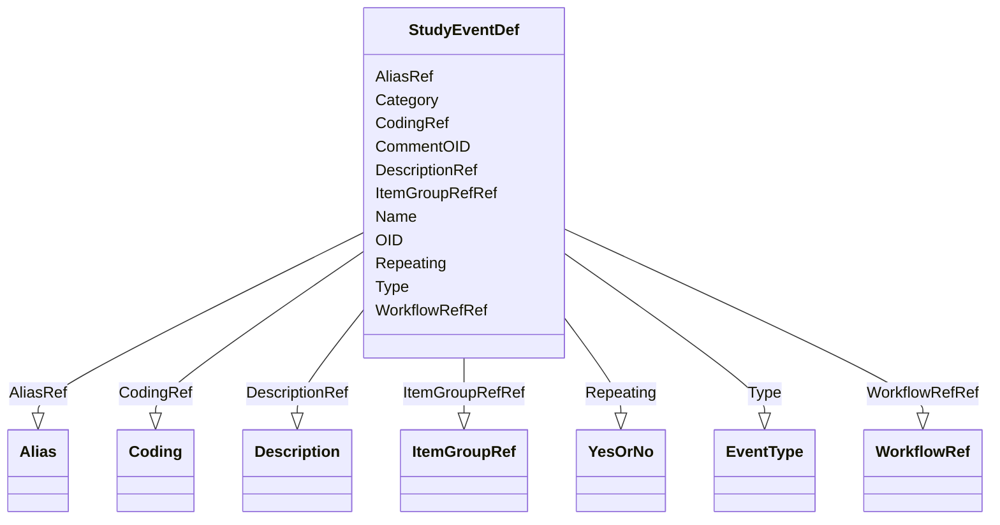

# Class: StudyEventDef


_StudyEventDef represents the definition of an activity in a study where data is collected. For example, a study event may represent a set of item groups that represent data collection instruments to be completed for a subject during a visit in a study. The visit occurs as part of a study workflow, and the workflow is referenced in the study event._


URI: [odm:StudyEventDef](http://www.cdisc.org/ns/odm/v2.0/StudyEventDef)





<!-- no inheritance hierarchy -->


## Slots

| Name | Cardinality and Range | Description | Inheritance |
| ---  | --- | --- | --- |
| [OID](OID.md) | 1..1 <br/> [oid](oid.md) | Unique identifier for the StudyEventDef element. | direct |
| [Name](Name.md) | 1..1 <br/> [name](name.md) | Human readable-name for the study event. | direct |
| [Repeating](Repeating.md) | 1..1 <br/> [YesOrNo](YesOrNo.md) | The Repeating flag indicates when this type of study event can occur repeated... | direct |
| [Type](Type.md) | 1..1 <br/> [EventType](EventType.md) | Specifies the StudyEvent Type. The study protocol document usually specifies ... | direct |
| [Category](Category.md) | 0..1 <br/> [text](text.md) | The Category attribute is typically used to indicate the study phase appropri... | direct |
| [CommentOID](CommentOID.md) | 0..1 <br/> [oidref](oidref.md) | Reference to a sponsor comment or external document relevant to this StudyEve... | direct |
| [DescriptionRef](DescriptionRef.md) | 0..1 <br/> [Description](Description.md) | Description reference: A free-text description of the containing metadata com... | direct |
| [ItemGroupRefRef](ItemGroupRefRef.md) | 0..* <br/> [ItemGroupRef](ItemGroupRef.md) | ItemGroupRef reference: ItemGroupRef references an ItemGroupDef as it occurs ... | direct |
| [WorkflowRefRef](WorkflowRefRef.md) | 0..1 <br/> [WorkflowRef](WorkflowRef.md) | WorkflowRef reference: The WorkflowRef references a workflow definition | direct |
| [CodingRef](CodingRef.md) | 0..* <br/> [Coding](Coding.md) | Coding reference: Coding references a symbol from a defined code system. It u... | direct |
| [AliasRef](AliasRef.md) | 0..* <br/> [Alias](Alias.md) | Alias reference: An Alias provides an additional name for an element. The Con... | direct |


## Usages

| used by | used in | type | used |
| ---  | --- | --- | --- |
| [MetaDataVersion](MetaDataVersion.md) | [StudyEventDefRef](StudyEventDefRef.md) | range | [StudyEventDef](StudyEventDef.md) |


## See Also

* [https://wiki.cdisc.org/display/ODM2/StudyEventDef](https://wiki.cdisc.org/display/ODM2/StudyEventDef)

## Identifier and Mapping Information


### Schema Source


* from schema: http://www.cdisc.org/ns/odm/v2.0


## Mappings

| Mapping Type | Mapped Value |
| ---  | ---  |
| self | odm:StudyEventDef |
| native | odm:StudyEventDef |


## LinkML Source

<!-- TODO: investigate https://stackoverflow.com/questions/37606292/how-to-create-tabbed-code-blocks-in-mkdocs-or-sphinx -->

### Direct

<details>
```yaml
name: StudyEventDef
description: StudyEventDef represents the definition of an activity in a study where
  data is collected. For example, a study event may represent a set of item groups
  that represent data collection instruments to be completed for a subject during
  a visit in a study. The visit occurs as part of a study workflow, and the workflow
  is referenced in the study event.
from_schema: http://www.cdisc.org/ns/odm/v2.0
see_also:
- https://wiki.cdisc.org/display/ODM2/StudyEventDef
slots:
- OID
- Name
- Repeating
- Type
- Category
- CommentOID
- DescriptionRef
- ItemGroupRefRef
- WorkflowRefRef
- CodingRef
- AliasRef
slot_usage:
  OID:
    name: OID
    description: Unique identifier for the StudyEventDef element.
    comments:
    - 'Required

      range:oid

      The OID attribute value must be unique within the Study/MetaDataVersion.'
    domain_of:
    - Study
    - MetaDataVersion
    - Standard
    - ValueListDef
    - WhereClauseDef
    - StudyEventGroupDef
    - StudyEventDef
    - ItemGroupDef
    - ItemDef
    - CodeList
    - MethodDef
    - ConditionDef
    - CommentDef
    - StudyIndication
    - StudyIntervention
    - StudyObjective
    - StudyEndPoint
    - StudyTargetPopulation
    - StudyEstimand
    - Arm
    - Epoch
    - StudyParameter
    - StudyTiming
    - TransitionTimingConstraint
    - AbsoluteTimingConstraint
    - RelativeTimingConstraint
    - DurationTimingConstraint
    - WorkflowDef
    - Transition
    - Branching
    - Criterion
    - ExceptionEvent
    - User
    - Organization
    - Location
    - SignatureDef
    - Query
    range: oid
    required: true
  Name:
    name: Name
    description: Human readable-name for the study event.
    comments:
    - 'Required

      range:name

      The Name attribute must be unique within StudyEventGroupDef and StudyEventDef
      elements within a Study/MetadataVersion.'
    domain_of:
    - Alias
    - MetaDataVersion
    - Standard
    - StudyEventGroupDef
    - StudyEventDef
    - ItemGroupDef
    - Class
    - SubClass
    - SourceItem
    - Resource
    - ItemDef
    - CodeList
    - MethodDef
    - Parameter
    - ReturnValue
    - ConditionDef
    - StudyObjective
    - StudyEndPoint
    - StudyTargetPopulation
    - StudyEstimand
    - Arm
    - Epoch
    - StudyTiming
    - TransitionTimingConstraint
    - AbsoluteTimingConstraint
    - RelativeTimingConstraint
    - DurationTimingConstraint
    - WorkflowDef
    - Transition
    - Branching
    - Criterion
    - ExceptionEvent
    - Organization
    - Location
    - Query
    range: name
    required: true
  Repeating:
    name: Repeating
    description: The Repeating flag indicates when this type of study event can occur
      repeatedly within any given subject. When Repeating is "Yes" multiple instances
      of StudyEventData for this StudyEventDef may be collected for a study subject.
    comments:
    - 'Required

      range:(Yes,No)'
    domain_of:
    - StudyEventDef
    - ItemGroupDef
    range: YesOrNo
    required: true
  Type:
    name: Type
    description: 'Specifies the StudyEvent Type. The study protocol document usually
      specifies the planned set of study subject encounters, as follows: Scheduled
      - StudyEvent is a planned study event Unscheduled - Unplanned study event (for
      example an unexpected adverse event that occurs between planned visits. Common
      - A set of study activities that occur for as part of all subject encounters
      within a study.'
    comments:
    - 'Required

      range:(Scheduled,Unscheduled,Common)'
    domain_of:
    - TranslatedText
    - PDFPageRef
    - Standard
    - StudyEventDef
    - ItemGroupDef
    - Origin
    - Resource
    - MethodDef
    - StudyEndPoint
    - TransitionTimingConstraint
    - RelativeTimingConstraint
    - Branching
    - Organization
    - Query
    range: EventType
    required: true
  Category:
    name: Category
    description: The Category attribute is typically used to indicate the study phase
      appropriate to this type of study event. Examples might include screening, pretreatment,
      treatment, and follow-up.
    comments:
    - 'Optional

      range:text'
    domain_of:
    - StudyEventDef
    range: text
  CommentOID:
    name: CommentOID
    description: Reference to a sponsor comment or external document relevant to this
      StudyEvent definition.
    comments:
    - 'Optional

      range:oidref'
    domain_of:
    - MetaDataVersion
    - Standard
    - WhereClauseDef
    - StudyEventGroupDef
    - StudyEventDef
    - ItemGroupDef
    - ItemDef
    - CodeList
    - CodeListItem
    - MethodDef
    - ConditionDef
    - Coding
    range: oidref
  DescriptionRef:
    name: DescriptionRef
    domain_of:
    - Study
    - MetaDataVersion
    - ValueListDef
    - StudyEventGroupRef
    - StudyEventGroupDef
    - StudyEventDef
    - ItemGroupDef
    - Origin
    - ItemDef
    - CodeList
    - CodeListItem
    - MethodDef
    - ConditionDef
    - CommentDef
    - Protocol
    - StudyStructure
    - TrialPhase
    - StudyIndication
    - StudyIntervention
    - StudyObjective
    - StudyEndPoint
    - StudyTargetPopulation
    - StudyEstimand
    - IntercurrentEvent
    - SummaryMeasure
    - Arm
    - Epoch
    - TransitionTimingConstraint
    - AbsoluteTimingConstraint
    - RelativeTimingConstraint
    - DurationTimingConstraint
    - WorkflowDef
    - Criterion
    - ExceptionEvent
    - Organization
    - Location
    - ODMFileMetadata
    range: Description
    maximum_cardinality: 1
  ItemGroupRefRef:
    name: ItemGroupRefRef
    multivalued: true
    domain_of:
    - StudyEventDef
    - ItemGroupDef
    range: ItemGroupRef
    inlined: true
    inlined_as_list: true
  WorkflowRefRef:
    name: WorkflowRefRef
    domain_of:
    - StudyEventGroupDef
    - StudyEventDef
    - ItemGroupDef
    - Protocol
    - StudyStructure
    - Arm
    - ExceptionEvent
    range: WorkflowRef
    maximum_cardinality: 1
  CodingRef:
    name: CodingRef
    multivalued: true
    domain_of:
    - StudyEventGroupDef
    - StudyEventDef
    - ItemGroupDef
    - Origin
    - SourceItems
    - SourceItem
    - ItemDef
    - CodeList
    - CodeListItem
    - StudyIndication
    - StudyIntervention
    - StudyTargetPopulation
    - StudyParameter
    - ParameterValue
    - Criterion
    - Annotation
    range: Coding
    inlined: true
    inlined_as_list: true
  AliasRef:
    name: AliasRef
    multivalued: true
    domain_of:
    - StudyEventDef
    - ItemGroupDef
    - ItemDef
    - CodeList
    - CodeListItem
    - MethodDef
    - ConditionDef
    - Protocol
    range: Alias
    inlined: true
    inlined_as_list: true
class_uri: odm:StudyEventDef

```
</details>

### Induced

<details>
```yaml
name: StudyEventDef
description: StudyEventDef represents the definition of an activity in a study where
  data is collected. For example, a study event may represent a set of item groups
  that represent data collection instruments to be completed for a subject during
  a visit in a study. The visit occurs as part of a study workflow, and the workflow
  is referenced in the study event.
from_schema: http://www.cdisc.org/ns/odm/v2.0
see_also:
- https://wiki.cdisc.org/display/ODM2/StudyEventDef
slot_usage:
  OID:
    name: OID
    description: Unique identifier for the StudyEventDef element.
    comments:
    - 'Required

      range:oid

      The OID attribute value must be unique within the Study/MetaDataVersion.'
    domain_of:
    - Study
    - MetaDataVersion
    - Standard
    - ValueListDef
    - WhereClauseDef
    - StudyEventGroupDef
    - StudyEventDef
    - ItemGroupDef
    - ItemDef
    - CodeList
    - MethodDef
    - ConditionDef
    - CommentDef
    - StudyIndication
    - StudyIntervention
    - StudyObjective
    - StudyEndPoint
    - StudyTargetPopulation
    - StudyEstimand
    - Arm
    - Epoch
    - StudyParameter
    - StudyTiming
    - TransitionTimingConstraint
    - AbsoluteTimingConstraint
    - RelativeTimingConstraint
    - DurationTimingConstraint
    - WorkflowDef
    - Transition
    - Branching
    - Criterion
    - ExceptionEvent
    - User
    - Organization
    - Location
    - SignatureDef
    - Query
    range: oid
    required: true
  Name:
    name: Name
    description: Human readable-name for the study event.
    comments:
    - 'Required

      range:name

      The Name attribute must be unique within StudyEventGroupDef and StudyEventDef
      elements within a Study/MetadataVersion.'
    domain_of:
    - Alias
    - MetaDataVersion
    - Standard
    - StudyEventGroupDef
    - StudyEventDef
    - ItemGroupDef
    - Class
    - SubClass
    - SourceItem
    - Resource
    - ItemDef
    - CodeList
    - MethodDef
    - Parameter
    - ReturnValue
    - ConditionDef
    - StudyObjective
    - StudyEndPoint
    - StudyTargetPopulation
    - StudyEstimand
    - Arm
    - Epoch
    - StudyTiming
    - TransitionTimingConstraint
    - AbsoluteTimingConstraint
    - RelativeTimingConstraint
    - DurationTimingConstraint
    - WorkflowDef
    - Transition
    - Branching
    - Criterion
    - ExceptionEvent
    - Organization
    - Location
    - Query
    range: name
    required: true
  Repeating:
    name: Repeating
    description: The Repeating flag indicates when this type of study event can occur
      repeatedly within any given subject. When Repeating is "Yes" multiple instances
      of StudyEventData for this StudyEventDef may be collected for a study subject.
    comments:
    - 'Required

      range:(Yes,No)'
    domain_of:
    - StudyEventDef
    - ItemGroupDef
    range: YesOrNo
    required: true
  Type:
    name: Type
    description: 'Specifies the StudyEvent Type. The study protocol document usually
      specifies the planned set of study subject encounters, as follows: Scheduled
      - StudyEvent is a planned study event Unscheduled - Unplanned study event (for
      example an unexpected adverse event that occurs between planned visits. Common
      - A set of study activities that occur for as part of all subject encounters
      within a study.'
    comments:
    - 'Required

      range:(Scheduled,Unscheduled,Common)'
    domain_of:
    - TranslatedText
    - PDFPageRef
    - Standard
    - StudyEventDef
    - ItemGroupDef
    - Origin
    - Resource
    - MethodDef
    - StudyEndPoint
    - TransitionTimingConstraint
    - RelativeTimingConstraint
    - Branching
    - Organization
    - Query
    range: EventType
    required: true
  Category:
    name: Category
    description: The Category attribute is typically used to indicate the study phase
      appropriate to this type of study event. Examples might include screening, pretreatment,
      treatment, and follow-up.
    comments:
    - 'Optional

      range:text'
    domain_of:
    - StudyEventDef
    range: text
  CommentOID:
    name: CommentOID
    description: Reference to a sponsor comment or external document relevant to this
      StudyEvent definition.
    comments:
    - 'Optional

      range:oidref'
    domain_of:
    - MetaDataVersion
    - Standard
    - WhereClauseDef
    - StudyEventGroupDef
    - StudyEventDef
    - ItemGroupDef
    - ItemDef
    - CodeList
    - CodeListItem
    - MethodDef
    - ConditionDef
    - Coding
    range: oidref
  DescriptionRef:
    name: DescriptionRef
    domain_of:
    - Study
    - MetaDataVersion
    - ValueListDef
    - StudyEventGroupRef
    - StudyEventGroupDef
    - StudyEventDef
    - ItemGroupDef
    - Origin
    - ItemDef
    - CodeList
    - CodeListItem
    - MethodDef
    - ConditionDef
    - CommentDef
    - Protocol
    - StudyStructure
    - TrialPhase
    - StudyIndication
    - StudyIntervention
    - StudyObjective
    - StudyEndPoint
    - StudyTargetPopulation
    - StudyEstimand
    - IntercurrentEvent
    - SummaryMeasure
    - Arm
    - Epoch
    - TransitionTimingConstraint
    - AbsoluteTimingConstraint
    - RelativeTimingConstraint
    - DurationTimingConstraint
    - WorkflowDef
    - Criterion
    - ExceptionEvent
    - Organization
    - Location
    - ODMFileMetadata
    range: Description
    maximum_cardinality: 1
  ItemGroupRefRef:
    name: ItemGroupRefRef
    multivalued: true
    domain_of:
    - StudyEventDef
    - ItemGroupDef
    range: ItemGroupRef
    inlined: true
    inlined_as_list: true
  WorkflowRefRef:
    name: WorkflowRefRef
    domain_of:
    - StudyEventGroupDef
    - StudyEventDef
    - ItemGroupDef
    - Protocol
    - StudyStructure
    - Arm
    - ExceptionEvent
    range: WorkflowRef
    maximum_cardinality: 1
  CodingRef:
    name: CodingRef
    multivalued: true
    domain_of:
    - StudyEventGroupDef
    - StudyEventDef
    - ItemGroupDef
    - Origin
    - SourceItems
    - SourceItem
    - ItemDef
    - CodeList
    - CodeListItem
    - StudyIndication
    - StudyIntervention
    - StudyTargetPopulation
    - StudyParameter
    - ParameterValue
    - Criterion
    - Annotation
    range: Coding
    inlined: true
    inlined_as_list: true
  AliasRef:
    name: AliasRef
    multivalued: true
    domain_of:
    - StudyEventDef
    - ItemGroupDef
    - ItemDef
    - CodeList
    - CodeListItem
    - MethodDef
    - ConditionDef
    - Protocol
    range: Alias
    inlined: true
    inlined_as_list: true
attributes:
  OID:
    name: OID
    description: Unique identifier for the StudyEventDef element.
    comments:
    - 'Required

      range:oid

      The OID attribute value must be unique within the Study/MetaDataVersion.'
    from_schema: http://www.cdisc.org/ns/odm/v2.0
    rank: 1000
    identifier: true
    alias: OID
    owner: StudyEventDef
    domain_of:
    - Study
    - MetaDataVersion
    - Standard
    - ValueListDef
    - WhereClauseDef
    - StudyEventGroupDef
    - StudyEventDef
    - ItemGroupDef
    - ItemDef
    - CodeList
    - MethodDef
    - ConditionDef
    - CommentDef
    - StudyIndication
    - StudyIntervention
    - StudyObjective
    - StudyEndPoint
    - StudyTargetPopulation
    - StudyEstimand
    - Arm
    - Epoch
    - StudyParameter
    - StudyTiming
    - TransitionTimingConstraint
    - AbsoluteTimingConstraint
    - RelativeTimingConstraint
    - DurationTimingConstraint
    - WorkflowDef
    - Transition
    - Branching
    - Criterion
    - ExceptionEvent
    - User
    - Organization
    - Location
    - SignatureDef
    - Query
    range: oid
    required: true
  Name:
    name: Name
    description: Human readable-name for the study event.
    comments:
    - 'Required

      range:name

      The Name attribute must be unique within StudyEventGroupDef and StudyEventDef
      elements within a Study/MetadataVersion.'
    from_schema: http://www.cdisc.org/ns/odm/v2.0
    rank: 1000
    alias: Name
    owner: StudyEventDef
    domain_of:
    - Alias
    - MetaDataVersion
    - Standard
    - StudyEventGroupDef
    - StudyEventDef
    - ItemGroupDef
    - Class
    - SubClass
    - SourceItem
    - Resource
    - ItemDef
    - CodeList
    - MethodDef
    - Parameter
    - ReturnValue
    - ConditionDef
    - StudyObjective
    - StudyEndPoint
    - StudyTargetPopulation
    - StudyEstimand
    - Arm
    - Epoch
    - StudyTiming
    - TransitionTimingConstraint
    - AbsoluteTimingConstraint
    - RelativeTimingConstraint
    - DurationTimingConstraint
    - WorkflowDef
    - Transition
    - Branching
    - Criterion
    - ExceptionEvent
    - Organization
    - Location
    - Query
    range: name
    required: true
  Repeating:
    name: Repeating
    description: The Repeating flag indicates when this type of study event can occur
      repeatedly within any given subject. When Repeating is "Yes" multiple instances
      of StudyEventData for this StudyEventDef may be collected for a study subject.
    comments:
    - 'Required

      range:(Yes,No)'
    from_schema: http://www.cdisc.org/ns/odm/v2.0
    rank: 1000
    alias: Repeating
    owner: StudyEventDef
    domain_of:
    - StudyEventDef
    - ItemGroupDef
    range: YesOrNo
    required: true
  Type:
    name: Type
    description: 'Specifies the StudyEvent Type. The study protocol document usually
      specifies the planned set of study subject encounters, as follows: Scheduled
      - StudyEvent is a planned study event Unscheduled - Unplanned study event (for
      example an unexpected adverse event that occurs between planned visits. Common
      - A set of study activities that occur for as part of all subject encounters
      within a study.'
    comments:
    - 'Required

      range:(Scheduled,Unscheduled,Common)'
    from_schema: http://www.cdisc.org/ns/odm/v2.0
    rank: 1000
    alias: Type
    owner: StudyEventDef
    domain_of:
    - TranslatedText
    - PDFPageRef
    - Standard
    - StudyEventDef
    - ItemGroupDef
    - Origin
    - Resource
    - MethodDef
    - StudyEndPoint
    - TransitionTimingConstraint
    - RelativeTimingConstraint
    - Branching
    - Organization
    - Query
    range: EventType
    required: true
  Category:
    name: Category
    description: The Category attribute is typically used to indicate the study phase
      appropriate to this type of study event. Examples might include screening, pretreatment,
      treatment, and follow-up.
    comments:
    - 'Optional

      range:text'
    from_schema: http://www.cdisc.org/ns/odm/v2.0
    rank: 1000
    alias: Category
    owner: StudyEventDef
    domain_of:
    - StudyEventDef
    range: text
  CommentOID:
    name: CommentOID
    description: Reference to a sponsor comment or external document relevant to this
      StudyEvent definition.
    comments:
    - 'Optional

      range:oidref'
    from_schema: http://www.cdisc.org/ns/odm/v2.0
    rank: 1000
    alias: CommentOID
    owner: StudyEventDef
    domain_of:
    - MetaDataVersion
    - Standard
    - WhereClauseDef
    - StudyEventGroupDef
    - StudyEventDef
    - ItemGroupDef
    - ItemDef
    - CodeList
    - CodeListItem
    - MethodDef
    - ConditionDef
    - Coding
    range: oidref
  DescriptionRef:
    name: DescriptionRef
    description: 'Description reference: A free-text description of the containing
      metadata component, unless restricted by Business Rules.'
    from_schema: http://www.cdisc.org/ns/odm/v2.0
    rank: 1000
    identifier: false
    alias: DescriptionRef
    owner: StudyEventDef
    domain_of:
    - Study
    - MetaDataVersion
    - ValueListDef
    - StudyEventGroupRef
    - StudyEventGroupDef
    - StudyEventDef
    - ItemGroupDef
    - Origin
    - ItemDef
    - CodeList
    - CodeListItem
    - MethodDef
    - ConditionDef
    - CommentDef
    - Protocol
    - StudyStructure
    - TrialPhase
    - StudyIndication
    - StudyIntervention
    - StudyObjective
    - StudyEndPoint
    - StudyTargetPopulation
    - StudyEstimand
    - IntercurrentEvent
    - SummaryMeasure
    - Arm
    - Epoch
    - TransitionTimingConstraint
    - AbsoluteTimingConstraint
    - RelativeTimingConstraint
    - DurationTimingConstraint
    - WorkflowDef
    - Criterion
    - ExceptionEvent
    - Organization
    - Location
    - ODMFileMetadata
    range: Description
    maximum_cardinality: 1
  ItemGroupRefRef:
    name: ItemGroupRefRef
    description: 'ItemGroupRef reference: ItemGroupRef references an ItemGroupDef
      as it occurs within a specific StudyEventDef or ItemGroupDef. The list of ItemGroupRefs
      identifies the types of item groups that are allowed to occur within this type
      of studyevent or (nested) item group. The ItemGroupRefs within a single StudyEventDef
      or ItemGroupDef must not have duplicate ItemGroupOID or OrderNumber attribute
      values.'
    from_schema: http://www.cdisc.org/ns/odm/v2.0
    rank: 1000
    multivalued: true
    identifier: false
    alias: ItemGroupRefRef
    owner: StudyEventDef
    domain_of:
    - StudyEventDef
    - ItemGroupDef
    range: ItemGroupRef
    inlined: true
    inlined_as_list: true
  WorkflowRefRef:
    name: WorkflowRefRef
    description: 'WorkflowRef reference: The WorkflowRef references a workflow definition'
    from_schema: http://www.cdisc.org/ns/odm/v2.0
    rank: 1000
    identifier: false
    alias: WorkflowRefRef
    owner: StudyEventDef
    domain_of:
    - StudyEventGroupDef
    - StudyEventDef
    - ItemGroupDef
    - Protocol
    - StudyStructure
    - Arm
    - ExceptionEvent
    range: WorkflowRef
    maximum_cardinality: 1
  CodingRef:
    name: CodingRef
    description: 'Coding reference: Coding references a symbol from a defined code
      system. It uses a code defined in a terminology system to associate semantics
      with a given term, codelist, variable, or group of variables. The presence of
      a Coding element associates a meaning to its parent element. Including multiple
      Coding elements for a given parent indicates synonymous meanings provided by
      different code systems or code system versions.'
    from_schema: http://www.cdisc.org/ns/odm/v2.0
    rank: 1000
    multivalued: true
    identifier: false
    alias: CodingRef
    owner: StudyEventDef
    domain_of:
    - StudyEventGroupDef
    - StudyEventDef
    - ItemGroupDef
    - Origin
    - SourceItems
    - SourceItem
    - ItemDef
    - CodeList
    - CodeListItem
    - StudyIndication
    - StudyIntervention
    - StudyTargetPopulation
    - StudyParameter
    - ParameterValue
    - Criterion
    - Annotation
    range: Coding
    inlined: true
    inlined_as_list: true
  AliasRef:
    name: AliasRef
    description: 'Alias reference: An Alias provides an additional name for an element.
      The Context attribute specifies the application domain in which this additional
      name is relevant.'
    from_schema: http://www.cdisc.org/ns/odm/v2.0
    rank: 1000
    multivalued: true
    identifier: false
    alias: AliasRef
    owner: StudyEventDef
    domain_of:
    - StudyEventDef
    - ItemGroupDef
    - ItemDef
    - CodeList
    - CodeListItem
    - MethodDef
    - ConditionDef
    - Protocol
    range: Alias
    inlined: true
    inlined_as_list: true
class_uri: odm:StudyEventDef

```
</details>