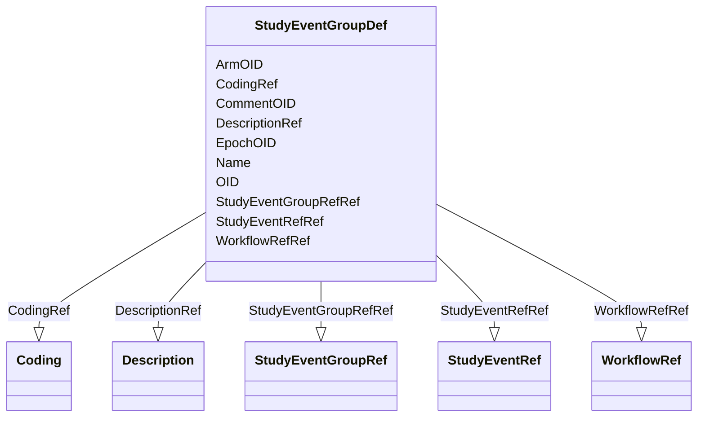

# Class: StudyEventGroupDef


_StudyEventGroupDef is a study building block that groups a number of smaller building blocks, which can themselves be StudyEventGroups or StudyEvents. It thus allows nesting of building blocks._


URI: [odm:StudyEventGroupDef](http://www.cdisc.org/ns/odm/v2.0/StudyEventGroupDef)





<!-- no inheritance hierarchy -->


## Slots

| Name | Cardinality and Range | Description | Inheritance |
| ---  | --- | --- | --- |
| [OID](OID.md) | 1..1 <br/> [Oid](Oid.md) | Unique identifier for the StudyEventGroupDef element | direct |
| [Name](Name.md) | 1..1 <br/> [Name](Name.md) | Human readable identifier for the StudyEventGroupDef element | direct |
| [ArmOID](ArmOID.md) | 0..1 <br/> [Oidref](Oidref.md) | Reference to an Arm element defined in the study | direct |
| [EpochOID](EpochOID.md) | 0..1 <br/> [Oidref](Oidref.md) | Reference to an Epoch element defined in the study | direct |
| [CommentOID](CommentOID.md) | 0..1 <br/> [Oidref](Oidref.md) | Reference to a CommentDef element defined in the study | direct |
| [DescriptionRef](DescriptionRef.md) | 0..1 <br/> [Description](Description.md) |  | direct |
| [WorkflowRefRef](WorkflowRefRef.md) | 0..1 <br/> [WorkflowRef](WorkflowRef.md) |  | direct |
| [CodingRef](CodingRef.md) | 0..* <br/> [Coding](Coding.md) |  | direct |
| [StudyEventGroupRefRef](StudyEventGroupRefRef.md) | 0..* <br/> [StudyEventGroupRef](StudyEventGroupRef.md) |  | direct |
| [StudyEventRefRef](StudyEventRefRef.md) | 0..* <br/> [StudyEventRef](StudyEventRef.md) |  | direct |


## Usages

| used by | used in | type | used |
| ---  | --- | --- | --- |
| [MetaDataVersion](MetaDataVersion.md) | [StudyEventGroupDefRef](StudyEventGroupDefRef.md) | range | [StudyEventGroupDef](StudyEventGroupDef.md) |


## See Also

* [https://wiki.cdisc.org/display/ODM2/StudyEventGroupDef](https://wiki.cdisc.org/display/ODM2/StudyEventGroupDef)

## Identifier and Mapping Information


### Schema Source


* from schema: http://www.cdisc.org/ns/odm/v2.0


## Mappings

| Mapping Type | Mapped Value |
| ---  | ---  |
| self | odm:StudyEventGroupDef |
| native | odm:StudyEventGroupDef |


## LinkML Source

<!-- TODO: investigate https://stackoverflow.com/questions/37606292/how-to-create-tabbed-code-blocks-in-mkdocs-or-sphinx -->

### Direct

<details>
```yaml
name: StudyEventGroupDef
description: StudyEventGroupDef is a study building block that groups a number of
  smaller building blocks, which can themselves be StudyEventGroups or StudyEvents.
  It thus allows nesting of building blocks.
from_schema: http://www.cdisc.org/ns/odm/v2.0
see_also:
- https://wiki.cdisc.org/display/ODM2/StudyEventGroupDef
slots:
- OID
- Name
- ArmOID
- EpochOID
- CommentOID
- DescriptionRef
- WorkflowRefRef
- CodingRef
- StudyEventGroupRefRef
- StudyEventRefRef
slot_usage:
  OID:
    name: OID
    description: Unique identifier for the StudyEventGroupDef element.
    comments:
    - 'Required

      range:oid

      The OID attribute for the StudyEventGroupDef must be unique within the study.'
    domain_of:
    - Study
    - MetaDataVersion
    - Standard
    - ValueListDef
    - WhereClauseDef
    - StudyEventGroupDef
    - StudyEventDef
    - ItemGroupDef
    - ItemDef
    - CodeList
    - MethodDef
    - ConditionDef
    - CommentDef
    - StudyIndication
    - StudyIntervention
    - StudyObjective
    - StudyEndPoint
    - StudyTargetPopulation
    - StudyEstimand
    - Arm
    - Epoch
    - StudyParameter
    - StudyTiming
    - TransitionTimingConstraint
    - AbsoluteTimingConstraint
    - RelativeTimingConstraint
    - DurationTimingConstraint
    - WorkflowDef
    - Transition
    - Branching
    - Criterion
    - ExceptionEvent
    - User
    - Organization
    - Location
    - SignatureDef
    - Query
    range: oid
    required: true
  Name:
    name: Name
    description: Human readable identifier for the StudyEventGroupDef element.
    comments:
    - 'Required

      range:name

      The Name must be unique within the set of StudyEventGroupDef elements for the
      study.'
    domain_of:
    - Alias
    - MetaDataVersion
    - Standard
    - StudyEventGroupDef
    - StudyEventDef
    - ItemGroupDef
    - Class
    - SubClass
    - SourceItem
    - Resource
    - ItemDef
    - CodeList
    - MethodDef
    - Parameter
    - ReturnValue
    - ConditionDef
    - StudyObjective
    - StudyEndPoint
    - StudyTargetPopulation
    - StudyEstimand
    - Arm
    - Epoch
    - StudyTiming
    - TransitionTimingConstraint
    - AbsoluteTimingConstraint
    - RelativeTimingConstraint
    - DurationTimingConstraint
    - WorkflowDef
    - Transition
    - Branching
    - Criterion
    - ExceptionEvent
    - Organization
    - Location
    - Query
    range: name
    required: true
  ArmOID:
    name: ArmOID
    description: Reference to an Arm element defined in the study.
    comments:
    - 'Optional

      range:oidref

      The ArmOID must match the OID attribute for an Arm element contained in the
      Study/MetaDataVersion.'
    domain_of:
    - StudyEventGroupDef
    range: oidref
  EpochOID:
    name: EpochOID
    description: Reference to an Epoch element defined in the study.
    comments:
    - 'Optional

      range:oidref

      The EpochOID must match the OID attribute for an Epoch element contained in
      the Study/MetaDataVersion.'
    domain_of:
    - StudyEventGroupDef
    range: oidref
  CommentOID:
    name: CommentOID
    description: Reference to a CommentDef element defined in the study.
    comments:
    - 'Optional

      range:oidref

      The CommentOID must match the OID attribute for a CommentDef element contained
      in the Study/MetaDataVersion.'
    domain_of:
    - MetaDataVersion
    - Standard
    - WhereClauseDef
    - StudyEventGroupDef
    - StudyEventDef
    - ItemGroupDef
    - ItemDef
    - CodeList
    - CodeListItem
    - MethodDef
    - ConditionDef
    - Coding
    range: oidref
  DescriptionRef:
    name: DescriptionRef
    domain_of:
    - Study
    - MetaDataVersion
    - ValueListDef
    - StudyEventGroupRef
    - StudyEventGroupDef
    - StudyEventDef
    - ItemGroupDef
    - Origin
    - ItemDef
    - CodeList
    - CodeListItem
    - MethodDef
    - ConditionDef
    - CommentDef
    - Protocol
    - StudyStructure
    - TrialPhase
    - StudyIndication
    - StudyIntervention
    - StudyObjective
    - StudyEndPoint
    - StudyTargetPopulation
    - StudyEstimand
    - IntercurrentEvent
    - SummaryMeasure
    - Arm
    - Epoch
    - TransitionTimingConstraint
    - AbsoluteTimingConstraint
    - RelativeTimingConstraint
    - DurationTimingConstraint
    - WorkflowDef
    - Criterion
    - ExceptionEvent
    - Organization
    - Location
    - ODMFileMetadata
    range: Description
    maximum_cardinality: 1
  WorkflowRefRef:
    name: WorkflowRefRef
    domain_of:
    - StudyEventGroupDef
    - StudyEventDef
    - ItemGroupDef
    - Protocol
    - StudyStructure
    - Arm
    - ExceptionEvent
    range: WorkflowRef
    maximum_cardinality: 1
  CodingRef:
    name: CodingRef
    multivalued: true
    domain_of:
    - StudyEventGroupDef
    - StudyEventDef
    - ItemGroupDef
    - Origin
    - SourceItems
    - SourceItem
    - ItemDef
    - CodeList
    - CodeListItem
    - StudyIndication
    - StudyIntervention
    - StudyTargetPopulation
    - StudyParameter
    - ParameterValue
    - Criterion
    - Annotation
    range: Coding
    inlined: true
    inlined_as_list: true
  StudyEventGroupRefRef:
    name: StudyEventGroupRefRef
    multivalued: true
    domain_of:
    - StudyEventGroupDef
    - Protocol
    - ExceptionEvent
    range: StudyEventGroupRef
    inlined: true
    inlined_as_list: true
  StudyEventRefRef:
    name: StudyEventRefRef
    multivalued: true
    domain_of:
    - StudyEventGroupDef
    - ExceptionEvent
    range: StudyEventRef
    inlined: true
    inlined_as_list: true
class_uri: odm:StudyEventGroupDef

```
</details>

### Induced

<details>
```yaml
name: StudyEventGroupDef
description: StudyEventGroupDef is a study building block that groups a number of
  smaller building blocks, which can themselves be StudyEventGroups or StudyEvents.
  It thus allows nesting of building blocks.
from_schema: http://www.cdisc.org/ns/odm/v2.0
see_also:
- https://wiki.cdisc.org/display/ODM2/StudyEventGroupDef
slot_usage:
  OID:
    name: OID
    description: Unique identifier for the StudyEventGroupDef element.
    comments:
    - 'Required

      range:oid

      The OID attribute for the StudyEventGroupDef must be unique within the study.'
    domain_of:
    - Study
    - MetaDataVersion
    - Standard
    - ValueListDef
    - WhereClauseDef
    - StudyEventGroupDef
    - StudyEventDef
    - ItemGroupDef
    - ItemDef
    - CodeList
    - MethodDef
    - ConditionDef
    - CommentDef
    - StudyIndication
    - StudyIntervention
    - StudyObjective
    - StudyEndPoint
    - StudyTargetPopulation
    - StudyEstimand
    - Arm
    - Epoch
    - StudyParameter
    - StudyTiming
    - TransitionTimingConstraint
    - AbsoluteTimingConstraint
    - RelativeTimingConstraint
    - DurationTimingConstraint
    - WorkflowDef
    - Transition
    - Branching
    - Criterion
    - ExceptionEvent
    - User
    - Organization
    - Location
    - SignatureDef
    - Query
    range: oid
    required: true
  Name:
    name: Name
    description: Human readable identifier for the StudyEventGroupDef element.
    comments:
    - 'Required

      range:name

      The Name must be unique within the set of StudyEventGroupDef elements for the
      study.'
    domain_of:
    - Alias
    - MetaDataVersion
    - Standard
    - StudyEventGroupDef
    - StudyEventDef
    - ItemGroupDef
    - Class
    - SubClass
    - SourceItem
    - Resource
    - ItemDef
    - CodeList
    - MethodDef
    - Parameter
    - ReturnValue
    - ConditionDef
    - StudyObjective
    - StudyEndPoint
    - StudyTargetPopulation
    - StudyEstimand
    - Arm
    - Epoch
    - StudyTiming
    - TransitionTimingConstraint
    - AbsoluteTimingConstraint
    - RelativeTimingConstraint
    - DurationTimingConstraint
    - WorkflowDef
    - Transition
    - Branching
    - Criterion
    - ExceptionEvent
    - Organization
    - Location
    - Query
    range: name
    required: true
  ArmOID:
    name: ArmOID
    description: Reference to an Arm element defined in the study.
    comments:
    - 'Optional

      range:oidref

      The ArmOID must match the OID attribute for an Arm element contained in the
      Study/MetaDataVersion.'
    domain_of:
    - StudyEventGroupDef
    range: oidref
  EpochOID:
    name: EpochOID
    description: Reference to an Epoch element defined in the study.
    comments:
    - 'Optional

      range:oidref

      The EpochOID must match the OID attribute for an Epoch element contained in
      the Study/MetaDataVersion.'
    domain_of:
    - StudyEventGroupDef
    range: oidref
  CommentOID:
    name: CommentOID
    description: Reference to a CommentDef element defined in the study.
    comments:
    - 'Optional

      range:oidref

      The CommentOID must match the OID attribute for a CommentDef element contained
      in the Study/MetaDataVersion.'
    domain_of:
    - MetaDataVersion
    - Standard
    - WhereClauseDef
    - StudyEventGroupDef
    - StudyEventDef
    - ItemGroupDef
    - ItemDef
    - CodeList
    - CodeListItem
    - MethodDef
    - ConditionDef
    - Coding
    range: oidref
  DescriptionRef:
    name: DescriptionRef
    domain_of:
    - Study
    - MetaDataVersion
    - ValueListDef
    - StudyEventGroupRef
    - StudyEventGroupDef
    - StudyEventDef
    - ItemGroupDef
    - Origin
    - ItemDef
    - CodeList
    - CodeListItem
    - MethodDef
    - ConditionDef
    - CommentDef
    - Protocol
    - StudyStructure
    - TrialPhase
    - StudyIndication
    - StudyIntervention
    - StudyObjective
    - StudyEndPoint
    - StudyTargetPopulation
    - StudyEstimand
    - IntercurrentEvent
    - SummaryMeasure
    - Arm
    - Epoch
    - TransitionTimingConstraint
    - AbsoluteTimingConstraint
    - RelativeTimingConstraint
    - DurationTimingConstraint
    - WorkflowDef
    - Criterion
    - ExceptionEvent
    - Organization
    - Location
    - ODMFileMetadata
    range: Description
    maximum_cardinality: 1
  WorkflowRefRef:
    name: WorkflowRefRef
    domain_of:
    - StudyEventGroupDef
    - StudyEventDef
    - ItemGroupDef
    - Protocol
    - StudyStructure
    - Arm
    - ExceptionEvent
    range: WorkflowRef
    maximum_cardinality: 1
  CodingRef:
    name: CodingRef
    multivalued: true
    domain_of:
    - StudyEventGroupDef
    - StudyEventDef
    - ItemGroupDef
    - Origin
    - SourceItems
    - SourceItem
    - ItemDef
    - CodeList
    - CodeListItem
    - StudyIndication
    - StudyIntervention
    - StudyTargetPopulation
    - StudyParameter
    - ParameterValue
    - Criterion
    - Annotation
    range: Coding
    inlined: true
    inlined_as_list: true
  StudyEventGroupRefRef:
    name: StudyEventGroupRefRef
    multivalued: true
    domain_of:
    - StudyEventGroupDef
    - Protocol
    - ExceptionEvent
    range: StudyEventGroupRef
    inlined: true
    inlined_as_list: true
  StudyEventRefRef:
    name: StudyEventRefRef
    multivalued: true
    domain_of:
    - StudyEventGroupDef
    - ExceptionEvent
    range: StudyEventRef
    inlined: true
    inlined_as_list: true
attributes:
  OID:
    name: OID
    description: Unique identifier for the StudyEventGroupDef element.
    comments:
    - 'Required

      range:oid

      The OID attribute for the StudyEventGroupDef must be unique within the study.'
    from_schema: http://www.cdisc.org/ns/odm/v2.0
    rank: 1000
    identifier: true
    alias: OID
    owner: StudyEventGroupDef
    domain_of:
    - Study
    - MetaDataVersion
    - Standard
    - ValueListDef
    - WhereClauseDef
    - StudyEventGroupDef
    - StudyEventDef
    - ItemGroupDef
    - ItemDef
    - CodeList
    - MethodDef
    - ConditionDef
    - CommentDef
    - StudyIndication
    - StudyIntervention
    - StudyObjective
    - StudyEndPoint
    - StudyTargetPopulation
    - StudyEstimand
    - Arm
    - Epoch
    - StudyParameter
    - StudyTiming
    - TransitionTimingConstraint
    - AbsoluteTimingConstraint
    - RelativeTimingConstraint
    - DurationTimingConstraint
    - WorkflowDef
    - Transition
    - Branching
    - Criterion
    - ExceptionEvent
    - User
    - Organization
    - Location
    - SignatureDef
    - Query
    range: oid
    required: true
  Name:
    name: Name
    description: Human readable identifier for the StudyEventGroupDef element.
    comments:
    - 'Required

      range:name

      The Name must be unique within the set of StudyEventGroupDef elements for the
      study.'
    from_schema: http://www.cdisc.org/ns/odm/v2.0
    rank: 1000
    alias: Name
    owner: StudyEventGroupDef
    domain_of:
    - Alias
    - MetaDataVersion
    - Standard
    - StudyEventGroupDef
    - StudyEventDef
    - ItemGroupDef
    - Class
    - SubClass
    - SourceItem
    - Resource
    - ItemDef
    - CodeList
    - MethodDef
    - Parameter
    - ReturnValue
    - ConditionDef
    - StudyObjective
    - StudyEndPoint
    - StudyTargetPopulation
    - StudyEstimand
    - Arm
    - Epoch
    - StudyTiming
    - TransitionTimingConstraint
    - AbsoluteTimingConstraint
    - RelativeTimingConstraint
    - DurationTimingConstraint
    - WorkflowDef
    - Transition
    - Branching
    - Criterion
    - ExceptionEvent
    - Organization
    - Location
    - Query
    range: name
    required: true
  ArmOID:
    name: ArmOID
    description: Reference to an Arm element defined in the study.
    comments:
    - 'Optional

      range:oidref

      The ArmOID must match the OID attribute for an Arm element contained in the
      Study/MetaDataVersion.'
    from_schema: http://www.cdisc.org/ns/odm/v2.0
    rank: 1000
    alias: ArmOID
    owner: StudyEventGroupDef
    domain_of:
    - StudyEventGroupDef
    range: oidref
  EpochOID:
    name: EpochOID
    description: Reference to an Epoch element defined in the study.
    comments:
    - 'Optional

      range:oidref

      The EpochOID must match the OID attribute for an Epoch element contained in
      the Study/MetaDataVersion.'
    from_schema: http://www.cdisc.org/ns/odm/v2.0
    rank: 1000
    alias: EpochOID
    owner: StudyEventGroupDef
    domain_of:
    - StudyEventGroupDef
    range: oidref
  CommentOID:
    name: CommentOID
    description: Reference to a CommentDef element defined in the study.
    comments:
    - 'Optional

      range:oidref

      The CommentOID must match the OID attribute for a CommentDef element contained
      in the Study/MetaDataVersion.'
    from_schema: http://www.cdisc.org/ns/odm/v2.0
    rank: 1000
    alias: CommentOID
    owner: StudyEventGroupDef
    domain_of:
    - MetaDataVersion
    - Standard
    - WhereClauseDef
    - StudyEventGroupDef
    - StudyEventDef
    - ItemGroupDef
    - ItemDef
    - CodeList
    - CodeListItem
    - MethodDef
    - ConditionDef
    - Coding
    range: oidref
  DescriptionRef:
    name: DescriptionRef
    from_schema: http://www.cdisc.org/ns/odm/v2.0
    rank: 1000
    identifier: false
    alias: DescriptionRef
    owner: StudyEventGroupDef
    domain_of:
    - Study
    - MetaDataVersion
    - ValueListDef
    - StudyEventGroupRef
    - StudyEventGroupDef
    - StudyEventDef
    - ItemGroupDef
    - Origin
    - ItemDef
    - CodeList
    - CodeListItem
    - MethodDef
    - ConditionDef
    - CommentDef
    - Protocol
    - StudyStructure
    - TrialPhase
    - StudyIndication
    - StudyIntervention
    - StudyObjective
    - StudyEndPoint
    - StudyTargetPopulation
    - StudyEstimand
    - IntercurrentEvent
    - SummaryMeasure
    - Arm
    - Epoch
    - TransitionTimingConstraint
    - AbsoluteTimingConstraint
    - RelativeTimingConstraint
    - DurationTimingConstraint
    - WorkflowDef
    - Criterion
    - ExceptionEvent
    - Organization
    - Location
    - ODMFileMetadata
    range: Description
    maximum_cardinality: 1
  WorkflowRefRef:
    name: WorkflowRefRef
    from_schema: http://www.cdisc.org/ns/odm/v2.0
    rank: 1000
    identifier: false
    alias: WorkflowRefRef
    owner: StudyEventGroupDef
    domain_of:
    - StudyEventGroupDef
    - StudyEventDef
    - ItemGroupDef
    - Protocol
    - StudyStructure
    - Arm
    - ExceptionEvent
    range: WorkflowRef
    maximum_cardinality: 1
  CodingRef:
    name: CodingRef
    from_schema: http://www.cdisc.org/ns/odm/v2.0
    rank: 1000
    multivalued: true
    identifier: false
    alias: CodingRef
    owner: StudyEventGroupDef
    domain_of:
    - StudyEventGroupDef
    - StudyEventDef
    - ItemGroupDef
    - Origin
    - SourceItems
    - SourceItem
    - ItemDef
    - CodeList
    - CodeListItem
    - StudyIndication
    - StudyIntervention
    - StudyTargetPopulation
    - StudyParameter
    - ParameterValue
    - Criterion
    - Annotation
    range: Coding
    inlined: true
    inlined_as_list: true
  StudyEventGroupRefRef:
    name: StudyEventGroupRefRef
    from_schema: http://www.cdisc.org/ns/odm/v2.0
    rank: 1000
    multivalued: true
    identifier: false
    alias: StudyEventGroupRefRef
    owner: StudyEventGroupDef
    domain_of:
    - StudyEventGroupDef
    - Protocol
    - ExceptionEvent
    range: StudyEventGroupRef
    inlined: true
    inlined_as_list: true
  StudyEventRefRef:
    name: StudyEventRefRef
    from_schema: http://www.cdisc.org/ns/odm/v2.0
    rank: 1000
    multivalued: true
    identifier: false
    alias: StudyEventRefRef
    owner: StudyEventGroupDef
    domain_of:
    - StudyEventGroupDef
    - ExceptionEvent
    range: StudyEventRef
    inlined: true
    inlined_as_list: true
class_uri: odm:StudyEventGroupDef

```
</details>