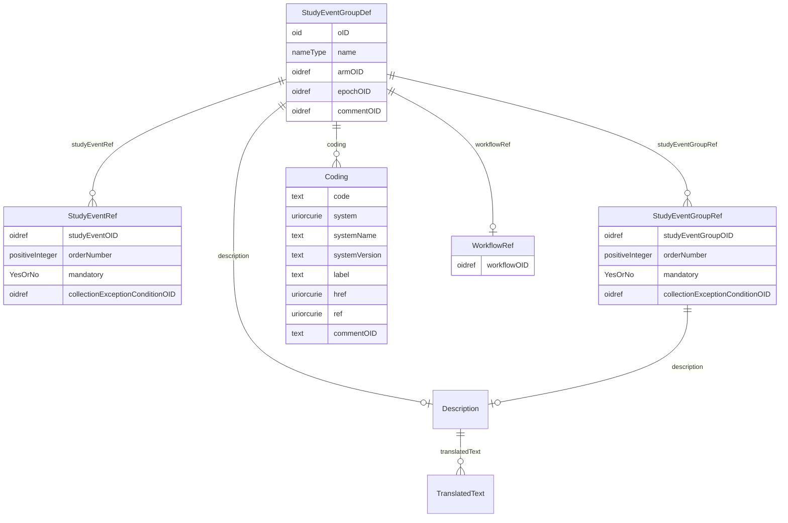

# Class: StudyEventGroupDef

_StudyEventGroupDef is a study building block that groups a number of smaller building blocks, which can themselves be StudyEventGroups or StudyEvents. It thus allows nesting of building blocks._


URI: [odm:StudyEventGroupDef](http://www.cdisc.org/ns/odm/v2.0/StudyEventGroupDef)





<!-- no inheritance hierarchy -->


## Slots

| Name | Cardinality* and Range | Description | Inheritance |
| ---  | --- | --- | --- |
| [oID](oID.md) | 1..1 <br/> [oid](oid.md) | Unique identifier for the StudyEventGroupDef element. | direct |
| [name](name.md) | 1..1 <br/> [nameType](nameType.md) | Human readable identifier for the StudyEventGroupDef element. | direct |
| [armOID](armOID.md) | 0..1 <br/> [oidref](oidref.md) | Reference to an Arm element defined in the study. | direct |
| [epochOID](epochOID.md) | 0..1 <br/> [oidref](oidref.md) | Reference to an Epoch element defined in the study. | direct |
| [commentOID](commentOID.md) | 0..1 <br/> [oidref](oidref.md) | Reference to a CommentDef element defined in the study. | direct |
| [description](description.md) | 0..1 <br/> [Description](Description.md) | Description reference: A free-text description of the containing metadata com... | direct |
| [workflowRef](workflowRef.md) | 0..1 <br/> [WorkflowRef](WorkflowRef.md) | WorkflowRef reference: The WorkflowRef references a workflow definition | direct |
| [coding](coding.md) | 0..* <br/> [Coding](Coding.md) | Coding reference: Coding references a symbol from a defined code system. It u... | direct |
| [studyEventGroupRef](studyEventGroupRef.md) | 0..* <br/> [StudyEventGroupRef](StudyEventGroupRef.md) | StudyEventGroupRef reference: This element references a StudyEventGroupDef as... | direct |
| [studyEventRef](studyEventRef.md) | 0..* <br/> [StudyEventRef](StudyEventRef.md) | StudyEventRef reference: This element references a StudyEventDef as it occurs... | direct |

_* See [LinkML documentation](https://linkml.io/linkml/schemas/slots.html#slot-cardinality) for cardinality definitions._


## Usages

| used by | used in | type | used |
| ---  | --- | --- | --- |
| [MetaDataVersion](MetaDataVersion.md) | [studyEventGroupDef](studyEventGroupDef.md) | range | [StudyEventGroupDef](StudyEventGroupDef.md) |


## See Also

* [https://wiki.cdisc.org/display/PUB/StudyEventGroupDef](https://wiki.cdisc.org/display/PUB/StudyEventGroupDef)

## Identifier and Mapping Information


### Schema Source


* from schema: http://www.cdisc.org/ns/odm/v2.0


## Mappings

| Mapping Type | Mapped Value |
| ---  | ---  |
| self | odm:StudyEventGroupDef |
| native | odm:StudyEventGroupDef |


## LinkML Source

<!-- TODO: investigate https://stackoverflow.com/questions/37606292/how-to-create-tabbed-code-blocks-in-mkdocs-or-sphinx -->

### Direct

<details>
```yaml
name: StudyEventGroupDef
description: StudyEventGroupDef is a study building block that groups a number of
  smaller building blocks, which can themselves be StudyEventGroups or StudyEvents.
  It thus allows nesting of building blocks.
from_schema: http://www.cdisc.org/ns/odm/v2.0
see_also:
- https://wiki.cdisc.org/display/PUB/StudyEventGroupDef
rank: 1000
slots:
- oID
- name
- armOID
- epochOID
- commentOID
- description
- workflowRef
- coding
- studyEventGroupRef
- studyEventRef
slot_usage:
  oID:
    name: oID
    description: Unique identifier for the StudyEventGroupDef element.
    comments:
    - 'Required

      range: oid

      The OID attribute for the StudyEventGroupDef must be unique within the study.'
    domain_of:
    - Study
    - MetaDataVersion
    - Standard
    - ValueListDef
    - WhereClauseDef
    - StudyEventGroupDef
    - StudyEventDef
    - ItemGroupDef
    - ItemDef
    - CodeList
    - MethodDef
    - ConditionDef
    - CommentDef
    - StudyIndication
    - StudyIntervention
    - StudyObjective
    - StudyEndPoint
    - StudyTargetPopulation
    - StudyEstimand
    - Arm
    - Epoch
    - StudyParameter
    - StudyTiming
    - TransitionTimingConstraint
    - AbsoluteTimingConstraint
    - RelativeTimingConstraint
    - DurationTimingConstraint
    - WorkflowDef
    - Transition
    - Branching
    - Criterion
    - User
    - Organization
    - Location
    - SignatureDef
    - Query
    range: oid
    required: true
  name:
    name: name
    description: Human readable identifier for the StudyEventGroupDef element.
    comments:
    - 'Required

      range: name

      The Name must be unique within the set of StudyEventGroupDef elements for the
      study.'
    domain_of:
    - Alias
    - MetaDataVersion
    - Standard
    - StudyEventGroupDef
    - StudyEventDef
    - ItemGroupDef
    - Class
    - SubClass
    - SourceItem
    - Resource
    - ItemDef
    - CodeList
    - MethodDef
    - Parameter
    - ReturnValue
    - ConditionDef
    - StudyObjective
    - StudyEndPoint
    - StudyTargetPopulation
    - StudyEstimand
    - Arm
    - Epoch
    - StudyTiming
    - TransitionTimingConstraint
    - AbsoluteTimingConstraint
    - RelativeTimingConstraint
    - DurationTimingConstraint
    - WorkflowDef
    - Transition
    - Branching
    - Criterion
    - Organization
    - Location
    - Query
    range: nameType
    required: true
  armOID:
    name: armOID
    description: Reference to an Arm element defined in the study.
    comments:
    - 'Optional

      range: oidref

      The ArmOID must match the OID attribute for an Arm element contained in the
      Study/MetaDataVersion.'
    domain_of:
    - StudyEventGroupDef
    range: oidref
  epochOID:
    name: epochOID
    description: Reference to an Epoch element defined in the study.
    comments:
    - 'Optional

      range: oidref

      The EpochOID must match the OID attribute for an Epoch element contained in
      the Study/MetaDataVersion.'
    domain_of:
    - StudyEventGroupDef
    range: oidref
  commentOID:
    name: commentOID
    description: Reference to a CommentDef element defined in the study.
    comments:
    - 'Optional

      range: oidref

      The CommentOID must match the OID attribute for a CommentDef element contained
      in the Study/MetaDataVersion.'
    domain_of:
    - MetaDataVersion
    - Standard
    - WhereClauseDef
    - StudyEventGroupDef
    - StudyEventDef
    - ItemGroupDef
    - ItemDef
    - CodeList
    - CodeListItem
    - MethodDef
    - ConditionDef
    - Coding
    range: oidref
  description:
    name: description
    domain_of:
    - Study
    - MetaDataVersion
    - ValueListDef
    - StudyEventGroupRef
    - StudyEventGroupDef
    - StudyEventDef
    - ItemGroupDef
    - Origin
    - ItemDef
    - CodeList
    - CodeListItem
    - MethodDef
    - ConditionDef
    - CommentDef
    - Protocol
    - StudyStructure
    - TrialPhase
    - StudyIndication
    - StudyIntervention
    - StudyObjective
    - StudyEndPoint
    - StudyTargetPopulation
    - StudyEstimand
    - IntercurrentEvent
    - SummaryMeasure
    - Arm
    - Epoch
    - TransitionTimingConstraint
    - AbsoluteTimingConstraint
    - RelativeTimingConstraint
    - DurationTimingConstraint
    - WorkflowDef
    - Criterion
    - Organization
    - Location
    - ODMFileMetadata
    range: Description
    maximum_cardinality: 1
  workflowRef:
    name: workflowRef
    domain_of:
    - StudyEventGroupDef
    - StudyEventDef
    - ItemGroupDef
    - Protocol
    - StudyStructure
    - Arm
    range: WorkflowRef
    maximum_cardinality: 1
  coding:
    name: coding
    multivalued: true
    domain_of:
    - StudyEventGroupDef
    - StudyEventDef
    - ItemGroupDef
    - Origin
    - SourceItems
    - SourceItem
    - ItemDef
    - CodeList
    - CodeListItem
    - StudyIndication
    - StudyIntervention
    - StudyTargetPopulation
    - StudyParameter
    - ParameterValue
    - Criterion
    - Annotation
    range: Coding
    inlined: true
    inlined_as_list: true
  studyEventGroupRef:
    name: studyEventGroupRef
    multivalued: true
    domain_of:
    - StudyEventGroupDef
    - Protocol
    range: StudyEventGroupRef
    inlined: true
    inlined_as_list: true
  studyEventRef:
    name: studyEventRef
    multivalued: true
    domain_of:
    - StudyEventGroupDef
    range: StudyEventRef
    inlined: true
    inlined_as_list: true
class_uri: odm:StudyEventGroupDef

```
</details>

### Induced

<details>
```yaml
name: StudyEventGroupDef
description: StudyEventGroupDef is a study building block that groups a number of
  smaller building blocks, which can themselves be StudyEventGroups or StudyEvents.
  It thus allows nesting of building blocks.
from_schema: http://www.cdisc.org/ns/odm/v2.0
see_also:
- https://wiki.cdisc.org/display/PUB/StudyEventGroupDef
rank: 1000
slot_usage:
  oID:
    name: oID
    description: Unique identifier for the StudyEventGroupDef element.
    comments:
    - 'Required

      range: oid

      The OID attribute for the StudyEventGroupDef must be unique within the study.'
    domain_of:
    - Study
    - MetaDataVersion
    - Standard
    - ValueListDef
    - WhereClauseDef
    - StudyEventGroupDef
    - StudyEventDef
    - ItemGroupDef
    - ItemDef
    - CodeList
    - MethodDef
    - ConditionDef
    - CommentDef
    - StudyIndication
    - StudyIntervention
    - StudyObjective
    - StudyEndPoint
    - StudyTargetPopulation
    - StudyEstimand
    - Arm
    - Epoch
    - StudyParameter
    - StudyTiming
    - TransitionTimingConstraint
    - AbsoluteTimingConstraint
    - RelativeTimingConstraint
    - DurationTimingConstraint
    - WorkflowDef
    - Transition
    - Branching
    - Criterion
    - User
    - Organization
    - Location
    - SignatureDef
    - Query
    range: oid
    required: true
  name:
    name: name
    description: Human readable identifier for the StudyEventGroupDef element.
    comments:
    - 'Required

      range: name

      The Name must be unique within the set of StudyEventGroupDef elements for the
      study.'
    domain_of:
    - Alias
    - MetaDataVersion
    - Standard
    - StudyEventGroupDef
    - StudyEventDef
    - ItemGroupDef
    - Class
    - SubClass
    - SourceItem
    - Resource
    - ItemDef
    - CodeList
    - MethodDef
    - Parameter
    - ReturnValue
    - ConditionDef
    - StudyObjective
    - StudyEndPoint
    - StudyTargetPopulation
    - StudyEstimand
    - Arm
    - Epoch
    - StudyTiming
    - TransitionTimingConstraint
    - AbsoluteTimingConstraint
    - RelativeTimingConstraint
    - DurationTimingConstraint
    - WorkflowDef
    - Transition
    - Branching
    - Criterion
    - Organization
    - Location
    - Query
    range: nameType
    required: true
  armOID:
    name: armOID
    description: Reference to an Arm element defined in the study.
    comments:
    - 'Optional

      range: oidref

      The ArmOID must match the OID attribute for an Arm element contained in the
      Study/MetaDataVersion.'
    domain_of:
    - StudyEventGroupDef
    range: oidref
  epochOID:
    name: epochOID
    description: Reference to an Epoch element defined in the study.
    comments:
    - 'Optional

      range: oidref

      The EpochOID must match the OID attribute for an Epoch element contained in
      the Study/MetaDataVersion.'
    domain_of:
    - StudyEventGroupDef
    range: oidref
  commentOID:
    name: commentOID
    description: Reference to a CommentDef element defined in the study.
    comments:
    - 'Optional

      range: oidref

      The CommentOID must match the OID attribute for a CommentDef element contained
      in the Study/MetaDataVersion.'
    domain_of:
    - MetaDataVersion
    - Standard
    - WhereClauseDef
    - StudyEventGroupDef
    - StudyEventDef
    - ItemGroupDef
    - ItemDef
    - CodeList
    - CodeListItem
    - MethodDef
    - ConditionDef
    - Coding
    range: oidref
  description:
    name: description
    domain_of:
    - Study
    - MetaDataVersion
    - ValueListDef
    - StudyEventGroupRef
    - StudyEventGroupDef
    - StudyEventDef
    - ItemGroupDef
    - Origin
    - ItemDef
    - CodeList
    - CodeListItem
    - MethodDef
    - ConditionDef
    - CommentDef
    - Protocol
    - StudyStructure
    - TrialPhase
    - StudyIndication
    - StudyIntervention
    - StudyObjective
    - StudyEndPoint
    - StudyTargetPopulation
    - StudyEstimand
    - IntercurrentEvent
    - SummaryMeasure
    - Arm
    - Epoch
    - TransitionTimingConstraint
    - AbsoluteTimingConstraint
    - RelativeTimingConstraint
    - DurationTimingConstraint
    - WorkflowDef
    - Criterion
    - Organization
    - Location
    - ODMFileMetadata
    range: Description
    maximum_cardinality: 1
  workflowRef:
    name: workflowRef
    domain_of:
    - StudyEventGroupDef
    - StudyEventDef
    - ItemGroupDef
    - Protocol
    - StudyStructure
    - Arm
    range: WorkflowRef
    maximum_cardinality: 1
  coding:
    name: coding
    multivalued: true
    domain_of:
    - StudyEventGroupDef
    - StudyEventDef
    - ItemGroupDef
    - Origin
    - SourceItems
    - SourceItem
    - ItemDef
    - CodeList
    - CodeListItem
    - StudyIndication
    - StudyIntervention
    - StudyTargetPopulation
    - StudyParameter
    - ParameterValue
    - Criterion
    - Annotation
    range: Coding
    inlined: true
    inlined_as_list: true
  studyEventGroupRef:
    name: studyEventGroupRef
    multivalued: true
    domain_of:
    - StudyEventGroupDef
    - Protocol
    range: StudyEventGroupRef
    inlined: true
    inlined_as_list: true
  studyEventRef:
    name: studyEventRef
    multivalued: true
    domain_of:
    - StudyEventGroupDef
    range: StudyEventRef
    inlined: true
    inlined_as_list: true
attributes:
  oID:
    name: oID
    description: Unique identifier for the StudyEventGroupDef element.
    comments:
    - 'Required

      range: oid

      The OID attribute for the StudyEventGroupDef must be unique within the study.'
    from_schema: http://www.cdisc.org/ns/odm/v2.0
    rank: 1000
    identifier: true
    alias: oID
    owner: StudyEventGroupDef
    domain_of:
    - Study
    - MetaDataVersion
    - Standard
    - ValueListDef
    - WhereClauseDef
    - StudyEventGroupDef
    - StudyEventDef
    - ItemGroupDef
    - ItemDef
    - CodeList
    - MethodDef
    - ConditionDef
    - CommentDef
    - StudyIndication
    - StudyIntervention
    - StudyObjective
    - StudyEndPoint
    - StudyTargetPopulation
    - StudyEstimand
    - Arm
    - Epoch
    - StudyParameter
    - StudyTiming
    - TransitionTimingConstraint
    - AbsoluteTimingConstraint
    - RelativeTimingConstraint
    - DurationTimingConstraint
    - WorkflowDef
    - Transition
    - Branching
    - Criterion
    - User
    - Organization
    - Location
    - SignatureDef
    - Query
    range: oid
    required: true
  name:
    name: name
    description: Human readable identifier for the StudyEventGroupDef element.
    comments:
    - 'Required

      range: name

      The Name must be unique within the set of StudyEventGroupDef elements for the
      study.'
    from_schema: http://www.cdisc.org/ns/odm/v2.0
    rank: 1000
    alias: name
    owner: StudyEventGroupDef
    domain_of:
    - Alias
    - MetaDataVersion
    - Standard
    - StudyEventGroupDef
    - StudyEventDef
    - ItemGroupDef
    - Class
    - SubClass
    - SourceItem
    - Resource
    - ItemDef
    - CodeList
    - MethodDef
    - Parameter
    - ReturnValue
    - ConditionDef
    - StudyObjective
    - StudyEndPoint
    - StudyTargetPopulation
    - StudyEstimand
    - Arm
    - Epoch
    - StudyTiming
    - TransitionTimingConstraint
    - AbsoluteTimingConstraint
    - RelativeTimingConstraint
    - DurationTimingConstraint
    - WorkflowDef
    - Transition
    - Branching
    - Criterion
    - Organization
    - Location
    - Query
    range: nameType
    required: true
  armOID:
    name: armOID
    description: Reference to an Arm element defined in the study.
    comments:
    - 'Optional

      range: oidref

      The ArmOID must match the OID attribute for an Arm element contained in the
      Study/MetaDataVersion.'
    from_schema: http://www.cdisc.org/ns/odm/v2.0
    rank: 1000
    alias: armOID
    owner: StudyEventGroupDef
    domain_of:
    - StudyEventGroupDef
    range: oidref
  epochOID:
    name: epochOID
    description: Reference to an Epoch element defined in the study.
    comments:
    - 'Optional

      range: oidref

      The EpochOID must match the OID attribute for an Epoch element contained in
      the Study/MetaDataVersion.'
    from_schema: http://www.cdisc.org/ns/odm/v2.0
    rank: 1000
    alias: epochOID
    owner: StudyEventGroupDef
    domain_of:
    - StudyEventGroupDef
    range: oidref
  commentOID:
    name: commentOID
    description: Reference to a CommentDef element defined in the study.
    comments:
    - 'Optional

      range: oidref

      The CommentOID must match the OID attribute for a CommentDef element contained
      in the Study/MetaDataVersion.'
    from_schema: http://www.cdisc.org/ns/odm/v2.0
    rank: 1000
    alias: commentOID
    owner: StudyEventGroupDef
    domain_of:
    - MetaDataVersion
    - Standard
    - WhereClauseDef
    - StudyEventGroupDef
    - StudyEventDef
    - ItemGroupDef
    - ItemDef
    - CodeList
    - CodeListItem
    - MethodDef
    - ConditionDef
    - Coding
    range: oidref
  description:
    name: description
    description: 'Description reference: A free-text description of the containing
      metadata component, unless restricted by Business Rules.'
    from_schema: http://www.cdisc.org/ns/odm/v2.0
    rank: 1000
    identifier: false
    alias: description
    owner: StudyEventGroupDef
    domain_of:
    - Study
    - MetaDataVersion
    - ValueListDef
    - StudyEventGroupRef
    - StudyEventGroupDef
    - StudyEventDef
    - ItemGroupDef
    - Origin
    - ItemDef
    - CodeList
    - CodeListItem
    - MethodDef
    - ConditionDef
    - CommentDef
    - Protocol
    - StudyStructure
    - TrialPhase
    - StudyIndication
    - StudyIntervention
    - StudyObjective
    - StudyEndPoint
    - StudyTargetPopulation
    - StudyEstimand
    - IntercurrentEvent
    - SummaryMeasure
    - Arm
    - Epoch
    - TransitionTimingConstraint
    - AbsoluteTimingConstraint
    - RelativeTimingConstraint
    - DurationTimingConstraint
    - WorkflowDef
    - Criterion
    - Organization
    - Location
    - ODMFileMetadata
    range: Description
    maximum_cardinality: 1
  workflowRef:
    name: workflowRef
    description: 'WorkflowRef reference: The WorkflowRef references a workflow definition'
    from_schema: http://www.cdisc.org/ns/odm/v2.0
    rank: 1000
    identifier: false
    alias: workflowRef
    owner: StudyEventGroupDef
    domain_of:
    - StudyEventGroupDef
    - StudyEventDef
    - ItemGroupDef
    - Protocol
    - StudyStructure
    - Arm
    range: WorkflowRef
    maximum_cardinality: 1
  coding:
    name: coding
    description: 'Coding reference: Coding references a symbol from a defined code
      system. It uses a code defined in a terminology system to associate semantics
      with a given term, codelist, variable, or group of variables. The presence of
      a Coding element associates a meaning to its parent element. Including multiple
      Coding elements for a given parent indicates synonymous meanings provided by
      different code systems or code system versions.'
    from_schema: http://www.cdisc.org/ns/odm/v2.0
    rank: 1000
    multivalued: true
    identifier: false
    alias: coding
    owner: StudyEventGroupDef
    domain_of:
    - StudyEventGroupDef
    - StudyEventDef
    - ItemGroupDef
    - Origin
    - SourceItems
    - SourceItem
    - ItemDef
    - CodeList
    - CodeListItem
    - StudyIndication
    - StudyIntervention
    - StudyTargetPopulation
    - StudyParameter
    - ParameterValue
    - Criterion
    - Annotation
    range: Coding
    inlined: true
    inlined_as_list: true
  studyEventGroupRef:
    name: studyEventGroupRef
    description: 'StudyEventGroupRef reference: This element references a StudyEventGroupDef
      as it occurs within a specific version of a study. The list of StudyEventGroupRefs
      identifies the types of study group events that are allowed to occur within
      the study.'
    from_schema: http://www.cdisc.org/ns/odm/v2.0
    rank: 1000
    multivalued: true
    identifier: false
    alias: studyEventGroupRef
    owner: StudyEventGroupDef
    domain_of:
    - StudyEventGroupDef
    - Protocol
    range: StudyEventGroupRef
    inlined: true
    inlined_as_list: true
  studyEventRef:
    name: studyEventRef
    description: 'StudyEventRef reference: This element references a StudyEventDef
      as it occurs within a specific version of a study. The list of StudyEventRefs
      identifies the types of study events that are allowed to occur within the study.'
    from_schema: http://www.cdisc.org/ns/odm/v2.0
    rank: 1000
    multivalued: true
    identifier: false
    alias: studyEventRef
    owner: StudyEventGroupDef
    domain_of:
    - StudyEventGroupDef
    range: StudyEventRef
    inlined: true
    inlined_as_list: true
class_uri: odm:StudyEventGroupDef

```
</details>