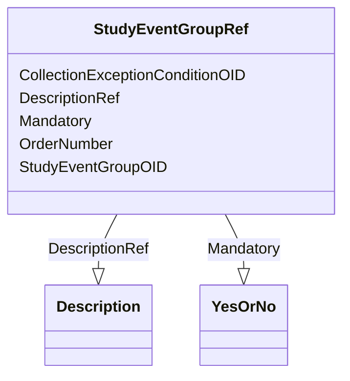

# Class: StudyEventGroupRef


_This element references a StudyEventGroupDef as it occurs within a specific version of a study. The list of StudyEventGroupRefs identifies the types of study group events that are allowed to occur within the study._


URI: [odm:StudyEventGroupRef](http://www.cdisc.org/ns/odm/v2.0/StudyEventGroupRef)





<!-- no inheritance hierarchy -->


## Slots

| Name | Cardinality and Range | Description | Inheritance |
| ---  | --- | --- | --- |
| [StudyEventGroupOID](StudyEventGroupOID.md) | 1..1 <br/> [Oidref](Oidref.md) | Reference to the StudyEventGroupDef  | direct |
| [OrderNumber](OrderNumber.md) | 0..1 <br/> [PositiveInteger](PositiveInteger.md) | Indicates the order in which this StudyEventGroup appears in Metadata display... | direct |
| [Mandatory](Mandatory.md) | 1..1 <br/> [YesOrNo](YesOrNo.md) | Indicator of whether this StudyEventGroup must appear in the study clinical d... | direct |
| [CollectionExceptionConditionOID](CollectionExceptionConditionOID.md) | 0..1 <br/> [Oidref](Oidref.md) | Reference to a ConditionDef | direct |
| [DescriptionRef](DescriptionRef.md) | 0..1 <br/> [Description](Description.md) |  | direct |


## Usages

| used by | used in | type | used |
| ---  | --- | --- | --- |
| [StudyEventGroupDef](StudyEventGroupDef.md) | [StudyEventGroupRefRef](StudyEventGroupRefRef.md) | range | [StudyEventGroupRef](StudyEventGroupRef.md) |
| [Protocol](Protocol.md) | [StudyEventGroupRefRef](StudyEventGroupRefRef.md) | range | [StudyEventGroupRef](StudyEventGroupRef.md) |
| [ExceptionEvent](ExceptionEvent.md) | [StudyEventGroupRefRef](StudyEventGroupRefRef.md) | range | [StudyEventGroupRef](StudyEventGroupRef.md) |


## See Also

* [https://wiki.cdisc.org/display/ODM2/StudyEventGroupRef](https://wiki.cdisc.org/display/ODM2/StudyEventGroupRef)

## Identifier and Mapping Information


### Schema Source


* from schema: http://www.cdisc.org/ns/odm/v2.0


## Mappings

| Mapping Type | Mapped Value |
| ---  | ---  |
| self | odm:StudyEventGroupRef |
| native | odm:StudyEventGroupRef |


## LinkML Source

<!-- TODO: investigate https://stackoverflow.com/questions/37606292/how-to-create-tabbed-code-blocks-in-mkdocs-or-sphinx -->

### Direct

<details>
```yaml
name: StudyEventGroupRef
description: This element references a StudyEventGroupDef as it occurs within a specific
  version of a study. The list of StudyEventGroupRefs identifies the types of study
  group events that are allowed to occur within the study.
from_schema: http://www.cdisc.org/ns/odm/v2.0
see_also:
- https://wiki.cdisc.org/display/ODM2/StudyEventGroupRef
slots:
- StudyEventGroupOID
- OrderNumber
- Mandatory
- CollectionExceptionConditionOID
- DescriptionRef
slot_usage:
  StudyEventGroupOID:
    name: StudyEventGroupOID
    description: Reference to the StudyEventGroupDef .
    comments:
    - 'Required

      range:oidref

      The StudyEventGroupOID value must match the OID attribute for a StudyEventGroupDef
      in this Study/MetaDataVersion. The StudyEventGroupRefs within a Protocol must
      not have duplicate StudyEventGroupOID values.'
    domain_of:
    - StudyEventGroupRef
    - AbsoluteTimingConstraint
    range: oidref
    required: true
  OrderNumber:
    name: OrderNumber
    description: Indicates the order in which this StudyEventGroup appears in Metadata
      displays or data entry applications.
    comments:
    - 'Optional

      range:positiveInteger

      The StudyEventGroupRefs within a Protocol must not have duplicate OrderNumber
      values.'
    domain_of:
    - StudyEventGroupRef
    - StudyEventRef
    - ItemGroupRef
    - ItemRef
    - CodeListItem
    - Parameter
    - ReturnValue
    - StudyEndPointRef
    range: positiveInteger
  Mandatory:
    name: Mandatory
    description: Indicator of whether this StudyEventGroup must appear in the study
      clinical data for each subject per the study protocol.
    comments:
    - 'Required

      enum values:(Yes | No)

      When the value is Yes, the data for each subject in the study must include a
      StudyEventData element with this StudyEventGroupOID.'
    domain_of:
    - StudyEventGroupRef
    - StudyEventRef
    - ItemGroupRef
    - ItemRef
    range: YesOrNo
    required: true
  CollectionExceptionConditionOID:
    name: CollectionExceptionConditionOID
    description: Reference to a ConditionDef
    comments:
    - 'Optional

      range:oidref

      The CollectionExceptionConditionOID value must match the OID attribute for a
      ConditionDef in this Study/MetaDataVersion.'
    domain_of:
    - StudyEventGroupRef
    - StudyEventRef
    - ItemGroupRef
    - ItemRef
    range: oidref
  DescriptionRef:
    name: DescriptionRef
    domain_of:
    - Study
    - MetaDataVersion
    - ValueListDef
    - StudyEventGroupRef
    - StudyEventGroupDef
    - StudyEventDef
    - ItemGroupDef
    - Origin
    - ItemDef
    - CodeList
    - CodeListItem
    - MethodDef
    - ConditionDef
    - CommentDef
    - Protocol
    - StudyStructure
    - TrialPhase
    - StudyIndication
    - StudyIntervention
    - StudyObjective
    - StudyEndPoint
    - StudyTargetPopulation
    - StudyEstimand
    - IntercurrentEvent
    - SummaryMeasure
    - Arm
    - Epoch
    - TransitionTimingConstraint
    - AbsoluteTimingConstraint
    - RelativeTimingConstraint
    - DurationTimingConstraint
    - WorkflowDef
    - Criterion
    - ExceptionEvent
    - Organization
    - Location
    - ODMFileMetadata
    range: Description
    maximum_cardinality: 1
class_uri: odm:StudyEventGroupRef

```
</details>

### Induced

<details>
```yaml
name: StudyEventGroupRef
description: This element references a StudyEventGroupDef as it occurs within a specific
  version of a study. The list of StudyEventGroupRefs identifies the types of study
  group events that are allowed to occur within the study.
from_schema: http://www.cdisc.org/ns/odm/v2.0
see_also:
- https://wiki.cdisc.org/display/ODM2/StudyEventGroupRef
slot_usage:
  StudyEventGroupOID:
    name: StudyEventGroupOID
    description: Reference to the StudyEventGroupDef .
    comments:
    - 'Required

      range:oidref

      The StudyEventGroupOID value must match the OID attribute for a StudyEventGroupDef
      in this Study/MetaDataVersion. The StudyEventGroupRefs within a Protocol must
      not have duplicate StudyEventGroupOID values.'
    domain_of:
    - StudyEventGroupRef
    - AbsoluteTimingConstraint
    range: oidref
    required: true
  OrderNumber:
    name: OrderNumber
    description: Indicates the order in which this StudyEventGroup appears in Metadata
      displays or data entry applications.
    comments:
    - 'Optional

      range:positiveInteger

      The StudyEventGroupRefs within a Protocol must not have duplicate OrderNumber
      values.'
    domain_of:
    - StudyEventGroupRef
    - StudyEventRef
    - ItemGroupRef
    - ItemRef
    - CodeListItem
    - Parameter
    - ReturnValue
    - StudyEndPointRef
    range: positiveInteger
  Mandatory:
    name: Mandatory
    description: Indicator of whether this StudyEventGroup must appear in the study
      clinical data for each subject per the study protocol.
    comments:
    - 'Required

      enum values:(Yes | No)

      When the value is Yes, the data for each subject in the study must include a
      StudyEventData element with this StudyEventGroupOID.'
    domain_of:
    - StudyEventGroupRef
    - StudyEventRef
    - ItemGroupRef
    - ItemRef
    range: YesOrNo
    required: true
  CollectionExceptionConditionOID:
    name: CollectionExceptionConditionOID
    description: Reference to a ConditionDef
    comments:
    - 'Optional

      range:oidref

      The CollectionExceptionConditionOID value must match the OID attribute for a
      ConditionDef in this Study/MetaDataVersion.'
    domain_of:
    - StudyEventGroupRef
    - StudyEventRef
    - ItemGroupRef
    - ItemRef
    range: oidref
  DescriptionRef:
    name: DescriptionRef
    domain_of:
    - Study
    - MetaDataVersion
    - ValueListDef
    - StudyEventGroupRef
    - StudyEventGroupDef
    - StudyEventDef
    - ItemGroupDef
    - Origin
    - ItemDef
    - CodeList
    - CodeListItem
    - MethodDef
    - ConditionDef
    - CommentDef
    - Protocol
    - StudyStructure
    - TrialPhase
    - StudyIndication
    - StudyIntervention
    - StudyObjective
    - StudyEndPoint
    - StudyTargetPopulation
    - StudyEstimand
    - IntercurrentEvent
    - SummaryMeasure
    - Arm
    - Epoch
    - TransitionTimingConstraint
    - AbsoluteTimingConstraint
    - RelativeTimingConstraint
    - DurationTimingConstraint
    - WorkflowDef
    - Criterion
    - ExceptionEvent
    - Organization
    - Location
    - ODMFileMetadata
    range: Description
    maximum_cardinality: 1
attributes:
  StudyEventGroupOID:
    name: StudyEventGroupOID
    description: Reference to the StudyEventGroupDef .
    comments:
    - 'Required

      range:oidref

      The StudyEventGroupOID value must match the OID attribute for a StudyEventGroupDef
      in this Study/MetaDataVersion. The StudyEventGroupRefs within a Protocol must
      not have duplicate StudyEventGroupOID values.'
    from_schema: http://www.cdisc.org/ns/odm/v2.0
    rank: 1000
    alias: StudyEventGroupOID
    owner: StudyEventGroupRef
    domain_of:
    - StudyEventGroupRef
    - AbsoluteTimingConstraint
    range: oidref
    required: true
  OrderNumber:
    name: OrderNumber
    description: Indicates the order in which this StudyEventGroup appears in Metadata
      displays or data entry applications.
    comments:
    - 'Optional

      range:positiveInteger

      The StudyEventGroupRefs within a Protocol must not have duplicate OrderNumber
      values.'
    from_schema: http://www.cdisc.org/ns/odm/v2.0
    rank: 1000
    alias: OrderNumber
    owner: StudyEventGroupRef
    domain_of:
    - StudyEventGroupRef
    - StudyEventRef
    - ItemGroupRef
    - ItemRef
    - CodeListItem
    - Parameter
    - ReturnValue
    - StudyEndPointRef
    range: positiveInteger
  Mandatory:
    name: Mandatory
    description: Indicator of whether this StudyEventGroup must appear in the study
      clinical data for each subject per the study protocol.
    comments:
    - 'Required

      enum values:(Yes | No)

      When the value is Yes, the data for each subject in the study must include a
      StudyEventData element with this StudyEventGroupOID.'
    from_schema: http://www.cdisc.org/ns/odm/v2.0
    rank: 1000
    alias: Mandatory
    owner: StudyEventGroupRef
    domain_of:
    - StudyEventGroupRef
    - StudyEventRef
    - ItemGroupRef
    - ItemRef
    range: YesOrNo
    required: true
  CollectionExceptionConditionOID:
    name: CollectionExceptionConditionOID
    description: Reference to a ConditionDef
    comments:
    - 'Optional

      range:oidref

      The CollectionExceptionConditionOID value must match the OID attribute for a
      ConditionDef in this Study/MetaDataVersion.'
    from_schema: http://www.cdisc.org/ns/odm/v2.0
    rank: 1000
    alias: CollectionExceptionConditionOID
    owner: StudyEventGroupRef
    domain_of:
    - StudyEventGroupRef
    - StudyEventRef
    - ItemGroupRef
    - ItemRef
    range: oidref
  DescriptionRef:
    name: DescriptionRef
    from_schema: http://www.cdisc.org/ns/odm/v2.0
    rank: 1000
    identifier: false
    alias: DescriptionRef
    owner: StudyEventGroupRef
    domain_of:
    - Study
    - MetaDataVersion
    - ValueListDef
    - StudyEventGroupRef
    - StudyEventGroupDef
    - StudyEventDef
    - ItemGroupDef
    - Origin
    - ItemDef
    - CodeList
    - CodeListItem
    - MethodDef
    - ConditionDef
    - CommentDef
    - Protocol
    - StudyStructure
    - TrialPhase
    - StudyIndication
    - StudyIntervention
    - StudyObjective
    - StudyEndPoint
    - StudyTargetPopulation
    - StudyEstimand
    - IntercurrentEvent
    - SummaryMeasure
    - Arm
    - Epoch
    - TransitionTimingConstraint
    - AbsoluteTimingConstraint
    - RelativeTimingConstraint
    - DurationTimingConstraint
    - WorkflowDef
    - Criterion
    - ExceptionEvent
    - Organization
    - Location
    - ODMFileMetadata
    range: Description
    maximum_cardinality: 1
class_uri: odm:StudyEventGroupRef

```
</details>