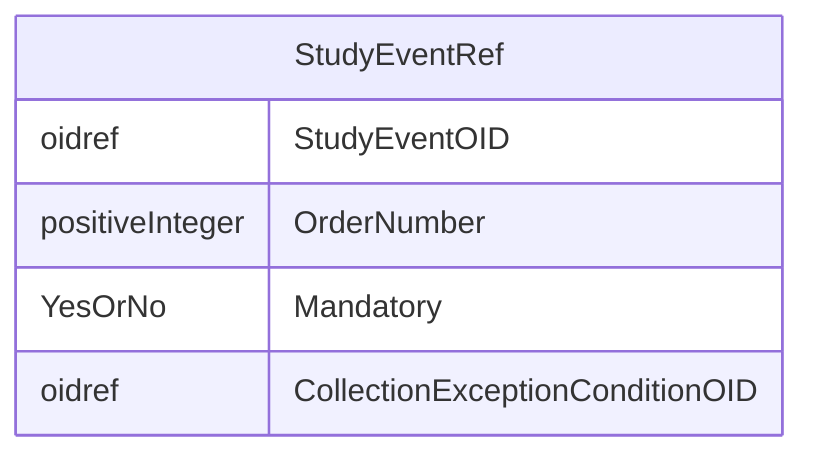

# Class: StudyEventRef

_This element references a StudyEventDef as it occurs within a specific version of a study. The list of StudyEventRefs identifies the types of study events that are allowed to occur within the study._


URI: [odm:StudyEventRef](http://www.cdisc.org/ns/odm/v2.0/StudyEventRef)





<!-- no inheritance hierarchy -->


## Slots

| Name | Cardinality* and Range | Description | Inheritance |
| ---  | --- | --- | --- |
| [StudyEventOID](StudyEventOID.md) | 1..1 <br/> [oidref](oidref.md) | Reference to the StudyEventDef . | direct |
| [OrderNumber](OrderNumber.md) | 0..1 <br/> [positiveInteger](positiveInteger.md) | Indicates the order in which this StudyEventDef appears in Metadata displays ... | direct |
| [Mandatory](Mandatory.md) | 1..1 <br/> [YesOrNo](YesOrNo.md) | The Mandatory flag indicates that the clinical data for the containing MetaDa... | direct |
| [CollectionExceptionConditionOID](CollectionExceptionConditionOID.md) | 0..1 <br/> [oidref](oidref.md) | Reference to a ConditionDef If the CollectionExceptionConditionOID attribute ... | direct |

_* See [LinkML documentation](https://linkml.io/linkml/schemas/slots.html#slot-cardinality) for cardinality definitions._


## Usages

| used by | used in | type | used |
| ---  | --- | --- | --- |
| [StudyEventGroupDef](StudyEventGroupDef.md) | [StudyEventRefRef](StudyEventRefRef.md) | range | [StudyEventRef](StudyEventRef.md) |


## See Also

* [https://wiki.cdisc.org/display/ODM2/StudyEventRef](https://wiki.cdisc.org/display/ODM2/StudyEventRef)

## Identifier and Mapping Information


### Schema Source


* from schema: http://www.cdisc.org/ns/odm/v2.0


## Mappings

| Mapping Type | Mapped Value |
| ---  | ---  |
| self | odm:StudyEventRef |
| native | odm:StudyEventRef |


## LinkML Source

<!-- TODO: investigate https://stackoverflow.com/questions/37606292/how-to-create-tabbed-code-blocks-in-mkdocs-or-sphinx -->

### Direct

<details>
```yaml
name: StudyEventRef
description: This element references a StudyEventDef as it occurs within a specific
  version of a study. The list of StudyEventRefs identifies the types of study events
  that are allowed to occur within the study.
from_schema: http://www.cdisc.org/ns/odm/v2.0
see_also:
- https://wiki.cdisc.org/display/ODM2/StudyEventRef
rank: 1000
slots:
- StudyEventOID
- OrderNumber
- Mandatory
- CollectionExceptionConditionOID
slot_usage:
  StudyEventOID:
    name: StudyEventOID
    description: Reference to the StudyEventDef .
    comments:
    - 'Required

      range: oidref

      Must match the OID attribute for a StudyEventDef in the Study/MetaDataVersion.'
    domain_of:
    - StudyEventRef
    - AbsoluteTimingConstraint
    - StudyEventData
    - KeySet
    range: oidref
    required: true
  OrderNumber:
    name: OrderNumber
    description: Indicates the order in which this StudyEventDef appears in Metadata
      displays or data entry applications. OrderNumbers provide an ordering on the
      StudyEventDefs for use whenever a list of StudyEventDefs is presented to a user.
      They do not imply anything about event scheduling, time ordering, or data correctness.
      Order of execution and timing between study events and groups of study events
      must be defined in WorkflowDef elements. Scheduling will be realized in StudyTiming
      and its child elements that reference StudyEventGroups.
    comments:
    - 'Optional

      range: positiveInteger

      The StudyEventRefs within a StudyEventGroup must not have duplicate OrderNumber
      values.'
    domain_of:
    - StudyEventGroupRef
    - StudyEventRef
    - ItemGroupRef
    - ItemRef
    - CodeListItem
    - Parameter
    - ReturnValue
    - StudyEndPointRef
    range: positiveInteger
  Mandatory:
    name: Mandatory
    description: The Mandatory flag indicates that the clinical data for the containing
      MetaDataVersion would be incomplete without an instance of this type of Study
      Event for each subject per the study protocol. ODM clinical data files that
      are incomplete in this sense may be considered incomplete for study review and
      analysis purposes.
    comments:
    - 'Required

      enum values: (Yes | No)

      The data for each subject in the study must include a StudyEventData element
      with this StudyEventOID, when the value is "Yes".'
    domain_of:
    - StudyEventGroupRef
    - StudyEventRef
    - ItemGroupRef
    - ItemRef
    range: YesOrNo
    required: true
  CollectionExceptionConditionOID:
    name: CollectionExceptionConditionOID
    description: Reference to a ConditionDef If the CollectionExceptionConditionOID
      attribute is provided, it references a ConditionDef that describes the circumstances
      under which data for this study event should not be collected.
    comments:
    - 'Optional

      range: oidref

      The CollectionExceptionConditionOID value must match the OID attribute for a
      ConditionDef in this Study/MetaDataVersion.'
    domain_of:
    - StudyEventGroupRef
    - StudyEventRef
    - ItemGroupRef
    - ItemRef
    range: oidref
class_uri: odm:StudyEventRef

```
</details>

### Induced

<details>
```yaml
name: StudyEventRef
description: This element references a StudyEventDef as it occurs within a specific
  version of a study. The list of StudyEventRefs identifies the types of study events
  that are allowed to occur within the study.
from_schema: http://www.cdisc.org/ns/odm/v2.0
see_also:
- https://wiki.cdisc.org/display/ODM2/StudyEventRef
rank: 1000
slot_usage:
  StudyEventOID:
    name: StudyEventOID
    description: Reference to the StudyEventDef .
    comments:
    - 'Required

      range: oidref

      Must match the OID attribute for a StudyEventDef in the Study/MetaDataVersion.'
    domain_of:
    - StudyEventRef
    - AbsoluteTimingConstraint
    - StudyEventData
    - KeySet
    range: oidref
    required: true
  OrderNumber:
    name: OrderNumber
    description: Indicates the order in which this StudyEventDef appears in Metadata
      displays or data entry applications. OrderNumbers provide an ordering on the
      StudyEventDefs for use whenever a list of StudyEventDefs is presented to a user.
      They do not imply anything about event scheduling, time ordering, or data correctness.
      Order of execution and timing between study events and groups of study events
      must be defined in WorkflowDef elements. Scheduling will be realized in StudyTiming
      and its child elements that reference StudyEventGroups.
    comments:
    - 'Optional

      range: positiveInteger

      The StudyEventRefs within a StudyEventGroup must not have duplicate OrderNumber
      values.'
    domain_of:
    - StudyEventGroupRef
    - StudyEventRef
    - ItemGroupRef
    - ItemRef
    - CodeListItem
    - Parameter
    - ReturnValue
    - StudyEndPointRef
    range: positiveInteger
  Mandatory:
    name: Mandatory
    description: The Mandatory flag indicates that the clinical data for the containing
      MetaDataVersion would be incomplete without an instance of this type of Study
      Event for each subject per the study protocol. ODM clinical data files that
      are incomplete in this sense may be considered incomplete for study review and
      analysis purposes.
    comments:
    - 'Required

      enum values: (Yes | No)

      The data for each subject in the study must include a StudyEventData element
      with this StudyEventOID, when the value is "Yes".'
    domain_of:
    - StudyEventGroupRef
    - StudyEventRef
    - ItemGroupRef
    - ItemRef
    range: YesOrNo
    required: true
  CollectionExceptionConditionOID:
    name: CollectionExceptionConditionOID
    description: Reference to a ConditionDef If the CollectionExceptionConditionOID
      attribute is provided, it references a ConditionDef that describes the circumstances
      under which data for this study event should not be collected.
    comments:
    - 'Optional

      range: oidref

      The CollectionExceptionConditionOID value must match the OID attribute for a
      ConditionDef in this Study/MetaDataVersion.'
    domain_of:
    - StudyEventGroupRef
    - StudyEventRef
    - ItemGroupRef
    - ItemRef
    range: oidref
attributes:
  StudyEventOID:
    name: StudyEventOID
    description: Reference to the StudyEventDef .
    comments:
    - 'Required

      range: oidref

      Must match the OID attribute for a StudyEventDef in the Study/MetaDataVersion.'
    from_schema: http://www.cdisc.org/ns/odm/v2.0
    rank: 1000
    alias: StudyEventOID
    owner: StudyEventRef
    domain_of:
    - StudyEventRef
    - AbsoluteTimingConstraint
    - StudyEventData
    - KeySet
    range: oidref
    required: true
  OrderNumber:
    name: OrderNumber
    description: Indicates the order in which this StudyEventDef appears in Metadata
      displays or data entry applications. OrderNumbers provide an ordering on the
      StudyEventDefs for use whenever a list of StudyEventDefs is presented to a user.
      They do not imply anything about event scheduling, time ordering, or data correctness.
      Order of execution and timing between study events and groups of study events
      must be defined in WorkflowDef elements. Scheduling will be realized in StudyTiming
      and its child elements that reference StudyEventGroups.
    comments:
    - 'Optional

      range: positiveInteger

      The StudyEventRefs within a StudyEventGroup must not have duplicate OrderNumber
      values.'
    from_schema: http://www.cdisc.org/ns/odm/v2.0
    rank: 1000
    alias: OrderNumber
    owner: StudyEventRef
    domain_of:
    - StudyEventGroupRef
    - StudyEventRef
    - ItemGroupRef
    - ItemRef
    - CodeListItem
    - Parameter
    - ReturnValue
    - StudyEndPointRef
    range: positiveInteger
  Mandatory:
    name: Mandatory
    description: The Mandatory flag indicates that the clinical data for the containing
      MetaDataVersion would be incomplete without an instance of this type of Study
      Event for each subject per the study protocol. ODM clinical data files that
      are incomplete in this sense may be considered incomplete for study review and
      analysis purposes.
    comments:
    - 'Required

      enum values: (Yes | No)

      The data for each subject in the study must include a StudyEventData element
      with this StudyEventOID, when the value is "Yes".'
    from_schema: http://www.cdisc.org/ns/odm/v2.0
    rank: 1000
    alias: Mandatory
    owner: StudyEventRef
    domain_of:
    - StudyEventGroupRef
    - StudyEventRef
    - ItemGroupRef
    - ItemRef
    range: YesOrNo
    required: true
  CollectionExceptionConditionOID:
    name: CollectionExceptionConditionOID
    description: Reference to a ConditionDef If the CollectionExceptionConditionOID
      attribute is provided, it references a ConditionDef that describes the circumstances
      under which data for this study event should not be collected.
    comments:
    - 'Optional

      range: oidref

      The CollectionExceptionConditionOID value must match the OID attribute for a
      ConditionDef in this Study/MetaDataVersion.'
    from_schema: http://www.cdisc.org/ns/odm/v2.0
    rank: 1000
    alias: CollectionExceptionConditionOID
    owner: StudyEventRef
    domain_of:
    - StudyEventGroupRef
    - StudyEventRef
    - ItemGroupRef
    - ItemRef
    range: oidref
class_uri: odm:StudyEventRef

```
</details>