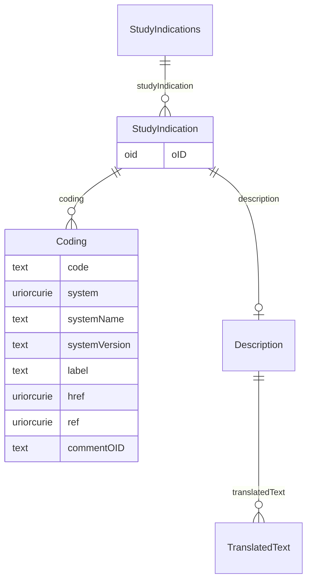

# Class: StudyIndications

_StudyIndications is a container element for individual StudyIndication elements._


URI: [odm:StudyIndications](http://www.cdisc.org/ns/odm/v2.0/StudyIndications)





<!-- no inheritance hierarchy -->


## Slots

| Name | Cardinality* and Range | Description | Inheritance |
| ---  | --- | --- | --- |
| [studyIndication](studyIndication.md) | 0..* <br/> [StudyIndication](StudyIndication.md) | StudyIndication reference: This element describes a study indication (e.g., c... | direct |

_* See [LinkML documentation](https://linkml.io/linkml/schemas/slots.html#slot-cardinality) for cardinality definitions._


## Usages

| used by | used in | type | used |
| ---  | --- | --- | --- |
| [Protocol](Protocol.md) | [studyIndications](studyIndications.md) | range | [StudyIndications](StudyIndications.md) |


## See Also

* [https://wiki.cdisc.org/display/PUB/StudyIndications](https://wiki.cdisc.org/display/PUB/StudyIndications)

## Identifier and Mapping Information


### Schema Source


* from schema: http://www.cdisc.org/ns/odm/v2.0


## Mappings

| Mapping Type | Mapped Value |
| ---  | ---  |
| self | odm:StudyIndications |
| native | odm:StudyIndications |


## LinkML Source

<!-- TODO: investigate https://stackoverflow.com/questions/37606292/how-to-create-tabbed-code-blocks-in-mkdocs-or-sphinx -->

### Direct

<details>
```yaml
name: StudyIndications
description: StudyIndications is a container element for individual StudyIndication
  elements.
from_schema: http://www.cdisc.org/ns/odm/v2.0
see_also:
- https://wiki.cdisc.org/display/PUB/StudyIndications
rank: 1000
slots:
- studyIndication
slot_usage:
  studyIndication:
    name: studyIndication
    multivalued: true
    domain_of:
    - StudyIndications
    range: StudyIndication
    inlined: true
    inlined_as_list: true
class_uri: odm:StudyIndications

```
</details>

### Induced

<details>
```yaml
name: StudyIndications
description: StudyIndications is a container element for individual StudyIndication
  elements.
from_schema: http://www.cdisc.org/ns/odm/v2.0
see_also:
- https://wiki.cdisc.org/display/PUB/StudyIndications
rank: 1000
slot_usage:
  studyIndication:
    name: studyIndication
    multivalued: true
    domain_of:
    - StudyIndications
    range: StudyIndication
    inlined: true
    inlined_as_list: true
attributes:
  studyIndication:
    name: studyIndication
    description: 'StudyIndication reference: This element describes a study indication
      (e.g., condition, disease) for the clinical study. The human-readable description
      is provided in the Description element. The Coding element can be used to provide
      a machine-readable code for the indication (e.g., SNOMED-CT code 26929004 for
      "Alzheimer''s disease").'
    from_schema: http://www.cdisc.org/ns/odm/v2.0
    rank: 1000
    multivalued: true
    identifier: false
    alias: studyIndication
    owner: StudyIndications
    domain_of:
    - StudyIndications
    range: StudyIndication
    inlined: true
    inlined_as_list: true
class_uri: odm:StudyIndications

```
</details>