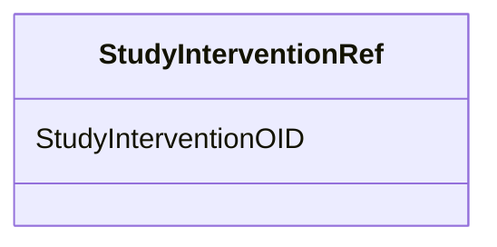

# Class: StudyInterventionRef


URI: [odm:StudyInterventionRef](http://www.cdisc.org/ns/odm/v2.0/StudyInterventionRef)





<!-- no inheritance hierarchy -->


## Slots

| Name | Cardinality and Range | Description | Inheritance |
| ---  | --- | --- | --- |
| [StudyInterventionOID](StudyInterventionOID.md) | 1..1 <br/> [oidref](oidref.md) | Reference to a StudyIntervention | direct |


## Usages

| used by | used in | type | used |
| ---  | --- | --- | --- |
| [StudyEstimand](StudyEstimand.md) | [StudyInterventionRefRef](StudyInterventionRefRef.md) | range | [StudyInterventionRef](StudyInterventionRef.md) |


## See Also

* [https://wiki.cdisc.org/display/ODM2/StudyInterventionRef](https://wiki.cdisc.org/display/ODM2/StudyInterventionRef)

## Identifier and Mapping Information


### Schema Source


* from schema: http://www.cdisc.org/ns/odm/v2.0


## Mappings

| Mapping Type | Mapped Value |
| ---  | ---  |
| self | odm:StudyInterventionRef |
| native | odm:StudyInterventionRef |


## LinkML Source

<!-- TODO: investigate https://stackoverflow.com/questions/37606292/how-to-create-tabbed-code-blocks-in-mkdocs-or-sphinx -->

### Direct

<details>
```yaml
name: StudyInterventionRef
from_schema: http://www.cdisc.org/ns/odm/v2.0
see_also:
- https://wiki.cdisc.org/display/ODM2/StudyInterventionRef
slots:
- StudyInterventionOID
slot_usage:
  StudyInterventionOID:
    name: StudyInterventionOID
    description: Reference to a StudyIntervention
    comments:
    - 'Required

      range:oidref'
    domain_of:
    - StudyInterventionRef
    range: oidref
    required: true
class_uri: odm:StudyInterventionRef

```
</details>

### Induced

<details>
```yaml
name: StudyInterventionRef
from_schema: http://www.cdisc.org/ns/odm/v2.0
see_also:
- https://wiki.cdisc.org/display/ODM2/StudyInterventionRef
slot_usage:
  StudyInterventionOID:
    name: StudyInterventionOID
    description: Reference to a StudyIntervention
    comments:
    - 'Required

      range:oidref'
    domain_of:
    - StudyInterventionRef
    range: oidref
    required: true
attributes:
  StudyInterventionOID:
    name: StudyInterventionOID
    description: Reference to a StudyIntervention
    comments:
    - 'Required

      range:oidref'
    from_schema: http://www.cdisc.org/ns/odm/v2.0
    rank: 1000
    alias: StudyInterventionOID
    owner: StudyInterventionRef
    domain_of:
    - StudyInterventionRef
    range: oidref
    required: true
class_uri: odm:StudyInterventionRef

```
</details>