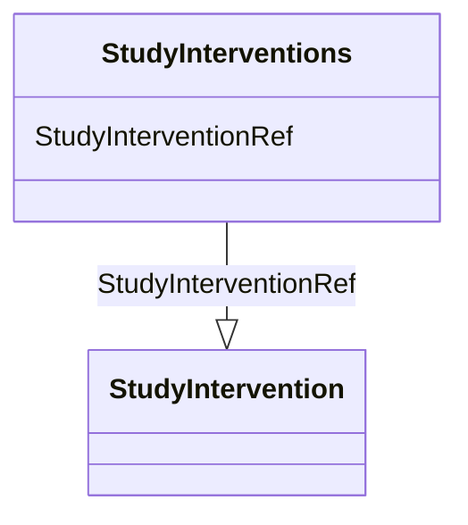

# Class: StudyInterventions


URI: [odm:StudyInterventions](http://www.cdisc.org/ns/odm/v2.0/StudyInterventions)





<!-- no inheritance hierarchy -->


## Slots

| Name | Cardinality and Range | Description | Inheritance |
| ---  | --- | --- | --- |
| [StudyInterventionRef](StudyInterventionRef.md) | 1..* <br/> [StudyIntervention](StudyIntervention.md) |  | direct |


## Usages

| used by | used in | type | used |
| ---  | --- | --- | --- |
| [Protocol](Protocol.md) | [StudyInterventionsRef](StudyInterventionsRef.md) | range | [StudyInterventions](StudyInterventions.md) |


## Identifier and Mapping Information


### Schema Source


* from schema: http://www.cdisc.org/ns/odm/v2.0


## Mappings

| Mapping Type | Mapped Value |
| ---  | ---  |
| self | odm:StudyInterventions |
| native | odm:StudyInterventions |


## LinkML Source

<!-- TODO: investigate https://stackoverflow.com/questions/37606292/how-to-create-tabbed-code-blocks-in-mkdocs-or-sphinx -->

### Direct

<details>
```yaml
name: StudyInterventions
from_schema: http://www.cdisc.org/ns/odm/v2.0
slots:
- StudyInterventionRef
slot_usage:
  StudyInterventionRef:
    name: StudyInterventionRef
    multivalued: true
    domain_of:
    - StudyInterventions
    range: StudyIntervention
    required: true
    minimum_cardinality: 1
class_uri: odm:StudyInterventions

```
</details>

### Induced

<details>
```yaml
name: StudyInterventions
from_schema: http://www.cdisc.org/ns/odm/v2.0
slot_usage:
  StudyInterventionRef:
    name: StudyInterventionRef
    multivalued: true
    domain_of:
    - StudyInterventions
    range: StudyIntervention
    required: true
    minimum_cardinality: 1
attributes:
  StudyInterventionRef:
    name: StudyInterventionRef
    from_schema: http://www.cdisc.org/ns/odm/v2.0
    rank: 1000
    multivalued: true
    alias: StudyInterventionRef
    owner: StudyInterventions
    domain_of:
    - StudyInterventions
    range: StudyIntervention
    required: true
    minimum_cardinality: 1
class_uri: odm:StudyInterventions

```
</details>