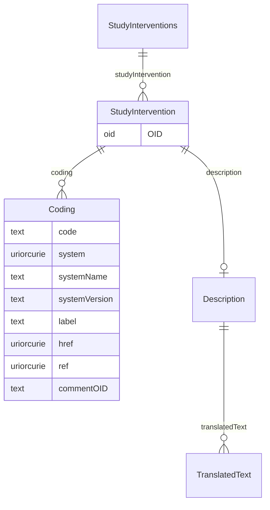

# Class: StudyInterventions

_The StudyInterventions element is a container element for individual StudyIntervention elements._


URI: [odm:StudyInterventions](http://www.cdisc.org/ns/odm/v2.0/StudyInterventions)





<!-- no inheritance hierarchy -->


## Slots

| Name | Cardinality* and Range | Description | Inheritance |
| ---  | --- | --- | --- |
| [studyIntervention](studyIntervention.md) | 0..* <br/> [StudyIntervention](StudyIntervention.md) | StudyIntervention reference: This element describes a study intervention (e.g... | direct |

_* See [LinkML documentation](https://linkml.io/linkml/schemas/slots.html#slot-cardinality) for cardinality definitions._


## Usages

| used by | used in | type | used |
| ---  | --- | --- | --- |
| [Protocol](Protocol.md) | [studyInterventions](studyInterventions.md) | range | [StudyInterventions](StudyInterventions.md) |


## See Also

* [https://wiki.cdisc.org/display/PUB/StudyInterventions](https://wiki.cdisc.org/display/PUB/StudyInterventions)

## Identifier and Mapping Information


### Schema Source


* from schema: http://www.cdisc.org/ns/odm/v2.0


## Mappings

| Mapping Type | Mapped Value |
| ---  | ---  |
| self | odm:StudyInterventions |
| native | odm:StudyInterventions |


## LinkML Source

<!-- TODO: investigate https://stackoverflow.com/questions/37606292/how-to-create-tabbed-code-blocks-in-mkdocs-or-sphinx -->

### Direct

<details>
```yaml
name: StudyInterventions
description: The StudyInterventions element is a container element for individual
  StudyIntervention elements.
from_schema: http://www.cdisc.org/ns/odm/v2.0
see_also:
- https://wiki.cdisc.org/display/PUB/StudyInterventions
rank: 1000
slots:
- studyIntervention
slot_usage:
  studyIntervention:
    name: studyIntervention
    multivalued: true
    domain_of:
    - StudyInterventions
    range: StudyIntervention
    inlined: true
    inlined_as_list: true
class_uri: odm:StudyInterventions

```
</details>

### Induced

<details>
```yaml
name: StudyInterventions
description: The StudyInterventions element is a container element for individual
  StudyIntervention elements.
from_schema: http://www.cdisc.org/ns/odm/v2.0
see_also:
- https://wiki.cdisc.org/display/PUB/StudyInterventions
rank: 1000
slot_usage:
  studyIntervention:
    name: studyIntervention
    multivalued: true
    domain_of:
    - StudyInterventions
    range: StudyIntervention
    inlined: true
    inlined_as_list: true
attributes:
  studyIntervention:
    name: studyIntervention
    description: 'StudyIntervention reference: This element describes a study intervention
      (e.g., medication, treatment, therapy) for the clinical study. The human-readable
      description is provided in the Description element. The Coding element can be
      used to provide a machine-readable code for the indication (e.g., ATC M01AE01
      code for "Ibuprofen" when used as a nonsteroidal anti-inflammatory drug).'
    from_schema: http://www.cdisc.org/ns/odm/v2.0
    rank: 1000
    multivalued: true
    alias: studyIntervention
    owner: StudyInterventions
    domain_of:
    - StudyInterventions
    range: StudyIntervention
    inlined: true
    inlined_as_list: true
class_uri: odm:StudyInterventions

```
</details>