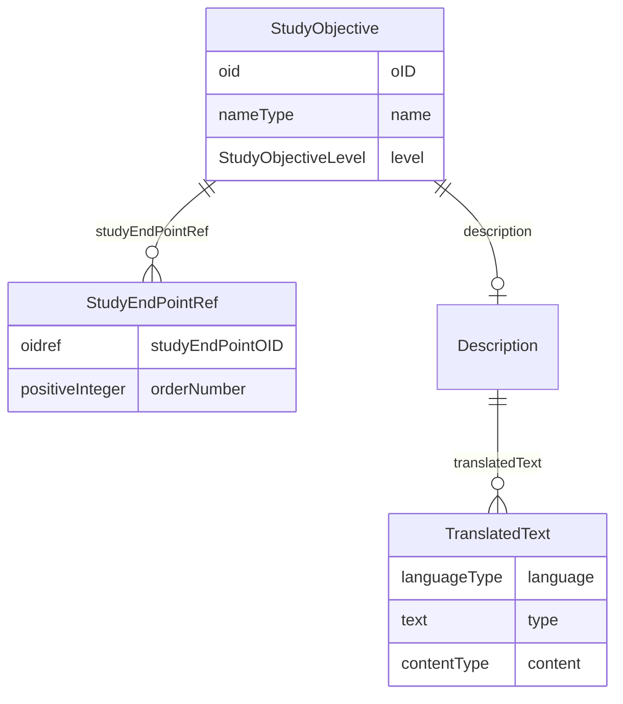

# Class: StudyObjective

_The reason for performing a study in terms of the scientific questions to be answered by the analysis of data collected during the study._


URI: [odm:StudyObjective](http://www.cdisc.org/ns/odm/v2.0/StudyObjective)





<!-- no inheritance hierarchy -->


## Slots

| Name | Cardinality* and Range | Description | Inheritance |
| ---  | --- | --- | --- |
| [oID](oID.md) | 1..1 <br/> [oid](oid.md) | Unique identifier for the StudyObjective element. | direct |
| [name](name.md) | 1..1 <br/> [nameType](nameType.md) | Name of the study objective | direct |
| [level](level.md) | 0..1 <br/> [StudyObjectiveLevel](StudyObjectiveLevel.md) | Defined level for the Study Objective | direct |
| [description](description.md) | 0..1 <br/> [Description](Description.md) | Description reference: A free-text description of the containing metadata com... | direct |
| [studyEndPointRef](studyEndPointRef.md) | 0..* <br/> [StudyEndPointRef](StudyEndPointRef.md) | StudyEndPointRef reference: A reference to a StudyEndPoint as it occurs withi... | direct |

_* See [LinkML documentation](https://linkml.io/linkml/schemas/slots.html#slot-cardinality) for cardinality definitions._


## Usages

| used by | used in | type | used |
| ---  | --- | --- | --- |
| [StudyObjectives](StudyObjectives.md) | [studyObjective](studyObjective.md) | range | [StudyObjective](StudyObjective.md) |


## See Also

* [https://wiki.cdisc.org/display/PUB/StudyObjective](https://wiki.cdisc.org/display/PUB/StudyObjective)

## Identifier and Mapping Information


### Schema Source


* from schema: http://www.cdisc.org/ns/odm/v2.0


## Mappings

| Mapping Type | Mapped Value |
| ---  | ---  |
| self | odm:StudyObjective |
| native | odm:StudyObjective |


## LinkML Source

<!-- TODO: investigate https://stackoverflow.com/questions/37606292/how-to-create-tabbed-code-blocks-in-mkdocs-or-sphinx -->

### Direct

<details>
```yaml
name: StudyObjective
description: The reason for performing a study in terms of the scientific questions
  to be answered by the analysis of data collected during the study.
from_schema: http://www.cdisc.org/ns/odm/v2.0
see_also:
- https://wiki.cdisc.org/display/PUB/StudyObjective
rank: 1000
slots:
- oID
- name
- level
- description
- studyEndPointRef
slot_usage:
  oID:
    name: oID
    description: Unique identifier for the StudyObjective element.
    comments:
    - 'Required

      range: oid

      The OID attribute value must be unique within the Study/MetaDataVersion.'
    domain_of:
    - Study
    - MetaDataVersion
    - Standard
    - ValueListDef
    - WhereClauseDef
    - StudyEventGroupDef
    - StudyEventDef
    - ItemGroupDef
    - ItemDef
    - CodeList
    - MethodDef
    - ConditionDef
    - CommentDef
    - StudyIndication
    - StudyIntervention
    - StudyObjective
    - StudyEndPoint
    - StudyTargetPopulation
    - StudyEstimand
    - Arm
    - Epoch
    - StudyParameter
    - StudyTiming
    - TransitionTimingConstraint
    - AbsoluteTimingConstraint
    - RelativeTimingConstraint
    - DurationTimingConstraint
    - WorkflowDef
    - Transition
    - Branching
    - Criterion
    - User
    - Organization
    - Location
    - SignatureDef
    - Query
    range: oid
    required: true
  name:
    name: name
    description: Name of the study objective
    comments:
    - 'Required

      range: name

      The Name attribute must be unique within the StudyObjectives elements within
      a Study/MetadataVersion.'
    domain_of:
    - Alias
    - MetaDataVersion
    - Standard
    - StudyEventGroupDef
    - StudyEventDef
    - ItemGroupDef
    - Class
    - SubClass
    - SourceItem
    - Resource
    - ItemDef
    - CodeList
    - MethodDef
    - Parameter
    - ReturnValue
    - ConditionDef
    - StudyObjective
    - StudyEndPoint
    - StudyTargetPopulation
    - StudyEstimand
    - Arm
    - Epoch
    - StudyTiming
    - TransitionTimingConstraint
    - AbsoluteTimingConstraint
    - RelativeTimingConstraint
    - DurationTimingConstraint
    - WorkflowDef
    - Transition
    - Branching
    - Criterion
    - Organization
    - Location
    - Query
    range: nameType
    required: true
  level:
    name: level
    description: Defined level for the Study Objective
    comments:
    - 'Optional

      enum values: (Primary | Secondary | Exploratory )

      These are defined in concordance with the ICH M11 Clinical electronic Structured
      Harmonised Protocol Specification'
    domain_of:
    - StudyObjective
    - StudyEndPoint
    - StudyEstimand
    range: StudyObjectiveLevel
  description:
    name: description
    domain_of:
    - Study
    - MetaDataVersion
    - ValueListDef
    - StudyEventGroupRef
    - StudyEventGroupDef
    - StudyEventDef
    - ItemGroupDef
    - Origin
    - ItemDef
    - CodeList
    - CodeListItem
    - MethodDef
    - ConditionDef
    - CommentDef
    - Protocol
    - StudyStructure
    - TrialPhase
    - StudyIndication
    - StudyIntervention
    - StudyObjective
    - StudyEndPoint
    - StudyTargetPopulation
    - StudyEstimand
    - IntercurrentEvent
    - SummaryMeasure
    - Arm
    - Epoch
    - TransitionTimingConstraint
    - AbsoluteTimingConstraint
    - RelativeTimingConstraint
    - DurationTimingConstraint
    - WorkflowDef
    - Criterion
    - Organization
    - Location
    - ODMFileMetadata
    range: Description
    maximum_cardinality: 1
  studyEndPointRef:
    name: studyEndPointRef
    multivalued: true
    domain_of:
    - StudyObjective
    - StudyEstimand
    range: StudyEndPointRef
    inlined: true
    inlined_as_list: true
class_uri: odm:StudyObjective

```
</details>

### Induced

<details>
```yaml
name: StudyObjective
description: The reason for performing a study in terms of the scientific questions
  to be answered by the analysis of data collected during the study.
from_schema: http://www.cdisc.org/ns/odm/v2.0
see_also:
- https://wiki.cdisc.org/display/PUB/StudyObjective
rank: 1000
slot_usage:
  oID:
    name: oID
    description: Unique identifier for the StudyObjective element.
    comments:
    - 'Required

      range: oid

      The OID attribute value must be unique within the Study/MetaDataVersion.'
    domain_of:
    - Study
    - MetaDataVersion
    - Standard
    - ValueListDef
    - WhereClauseDef
    - StudyEventGroupDef
    - StudyEventDef
    - ItemGroupDef
    - ItemDef
    - CodeList
    - MethodDef
    - ConditionDef
    - CommentDef
    - StudyIndication
    - StudyIntervention
    - StudyObjective
    - StudyEndPoint
    - StudyTargetPopulation
    - StudyEstimand
    - Arm
    - Epoch
    - StudyParameter
    - StudyTiming
    - TransitionTimingConstraint
    - AbsoluteTimingConstraint
    - RelativeTimingConstraint
    - DurationTimingConstraint
    - WorkflowDef
    - Transition
    - Branching
    - Criterion
    - User
    - Organization
    - Location
    - SignatureDef
    - Query
    range: oid
    required: true
  name:
    name: name
    description: Name of the study objective
    comments:
    - 'Required

      range: name

      The Name attribute must be unique within the StudyObjectives elements within
      a Study/MetadataVersion.'
    domain_of:
    - Alias
    - MetaDataVersion
    - Standard
    - StudyEventGroupDef
    - StudyEventDef
    - ItemGroupDef
    - Class
    - SubClass
    - SourceItem
    - Resource
    - ItemDef
    - CodeList
    - MethodDef
    - Parameter
    - ReturnValue
    - ConditionDef
    - StudyObjective
    - StudyEndPoint
    - StudyTargetPopulation
    - StudyEstimand
    - Arm
    - Epoch
    - StudyTiming
    - TransitionTimingConstraint
    - AbsoluteTimingConstraint
    - RelativeTimingConstraint
    - DurationTimingConstraint
    - WorkflowDef
    - Transition
    - Branching
    - Criterion
    - Organization
    - Location
    - Query
    range: nameType
    required: true
  level:
    name: level
    description: Defined level for the Study Objective
    comments:
    - 'Optional

      enum values: (Primary | Secondary | Exploratory )

      These are defined in concordance with the ICH M11 Clinical electronic Structured
      Harmonised Protocol Specification'
    domain_of:
    - StudyObjective
    - StudyEndPoint
    - StudyEstimand
    range: StudyObjectiveLevel
  description:
    name: description
    domain_of:
    - Study
    - MetaDataVersion
    - ValueListDef
    - StudyEventGroupRef
    - StudyEventGroupDef
    - StudyEventDef
    - ItemGroupDef
    - Origin
    - ItemDef
    - CodeList
    - CodeListItem
    - MethodDef
    - ConditionDef
    - CommentDef
    - Protocol
    - StudyStructure
    - TrialPhase
    - StudyIndication
    - StudyIntervention
    - StudyObjective
    - StudyEndPoint
    - StudyTargetPopulation
    - StudyEstimand
    - IntercurrentEvent
    - SummaryMeasure
    - Arm
    - Epoch
    - TransitionTimingConstraint
    - AbsoluteTimingConstraint
    - RelativeTimingConstraint
    - DurationTimingConstraint
    - WorkflowDef
    - Criterion
    - Organization
    - Location
    - ODMFileMetadata
    range: Description
    maximum_cardinality: 1
  studyEndPointRef:
    name: studyEndPointRef
    multivalued: true
    domain_of:
    - StudyObjective
    - StudyEstimand
    range: StudyEndPointRef
    inlined: true
    inlined_as_list: true
attributes:
  oID:
    name: oID
    description: Unique identifier for the StudyObjective element.
    comments:
    - 'Required

      range: oid

      The OID attribute value must be unique within the Study/MetaDataVersion.'
    from_schema: http://www.cdisc.org/ns/odm/v2.0
    rank: 1000
    identifier: true
    alias: oID
    owner: StudyObjective
    domain_of:
    - Study
    - MetaDataVersion
    - Standard
    - ValueListDef
    - WhereClauseDef
    - StudyEventGroupDef
    - StudyEventDef
    - ItemGroupDef
    - ItemDef
    - CodeList
    - MethodDef
    - ConditionDef
    - CommentDef
    - StudyIndication
    - StudyIntervention
    - StudyObjective
    - StudyEndPoint
    - StudyTargetPopulation
    - StudyEstimand
    - Arm
    - Epoch
    - StudyParameter
    - StudyTiming
    - TransitionTimingConstraint
    - AbsoluteTimingConstraint
    - RelativeTimingConstraint
    - DurationTimingConstraint
    - WorkflowDef
    - Transition
    - Branching
    - Criterion
    - User
    - Organization
    - Location
    - SignatureDef
    - Query
    range: oid
    required: true
  name:
    name: name
    description: Name of the study objective
    comments:
    - 'Required

      range: name

      The Name attribute must be unique within the StudyObjectives elements within
      a Study/MetadataVersion.'
    from_schema: http://www.cdisc.org/ns/odm/v2.0
    rank: 1000
    alias: name
    owner: StudyObjective
    domain_of:
    - Alias
    - MetaDataVersion
    - Standard
    - StudyEventGroupDef
    - StudyEventDef
    - ItemGroupDef
    - Class
    - SubClass
    - SourceItem
    - Resource
    - ItemDef
    - CodeList
    - MethodDef
    - Parameter
    - ReturnValue
    - ConditionDef
    - StudyObjective
    - StudyEndPoint
    - StudyTargetPopulation
    - StudyEstimand
    - Arm
    - Epoch
    - StudyTiming
    - TransitionTimingConstraint
    - AbsoluteTimingConstraint
    - RelativeTimingConstraint
    - DurationTimingConstraint
    - WorkflowDef
    - Transition
    - Branching
    - Criterion
    - Organization
    - Location
    - Query
    range: nameType
    required: true
  level:
    name: level
    description: Defined level for the Study Objective
    comments:
    - 'Optional

      enum values: (Primary | Secondary | Exploratory )

      These are defined in concordance with the ICH M11 Clinical electronic Structured
      Harmonised Protocol Specification'
    from_schema: http://www.cdisc.org/ns/odm/v2.0
    rank: 1000
    alias: level
    owner: StudyObjective
    domain_of:
    - StudyObjective
    - StudyEndPoint
    - StudyEstimand
    range: StudyObjectiveLevel
  description:
    name: description
    description: 'Description reference: A free-text description of the containing
      metadata component, unless restricted by Business Rules.'
    from_schema: http://www.cdisc.org/ns/odm/v2.0
    rank: 1000
    identifier: false
    alias: description
    owner: StudyObjective
    domain_of:
    - Study
    - MetaDataVersion
    - ValueListDef
    - StudyEventGroupRef
    - StudyEventGroupDef
    - StudyEventDef
    - ItemGroupDef
    - Origin
    - ItemDef
    - CodeList
    - CodeListItem
    - MethodDef
    - ConditionDef
    - CommentDef
    - Protocol
    - StudyStructure
    - TrialPhase
    - StudyIndication
    - StudyIntervention
    - StudyObjective
    - StudyEndPoint
    - StudyTargetPopulation
    - StudyEstimand
    - IntercurrentEvent
    - SummaryMeasure
    - Arm
    - Epoch
    - TransitionTimingConstraint
    - AbsoluteTimingConstraint
    - RelativeTimingConstraint
    - DurationTimingConstraint
    - WorkflowDef
    - Criterion
    - Organization
    - Location
    - ODMFileMetadata
    range: Description
    maximum_cardinality: 1
  studyEndPointRef:
    name: studyEndPointRef
    description: 'StudyEndPointRef reference: A reference to a StudyEndPoint as it
      occurs within a specific StudyObjective.'
    from_schema: http://www.cdisc.org/ns/odm/v2.0
    rank: 1000
    multivalued: true
    identifier: false
    alias: studyEndPointRef
    owner: StudyObjective
    domain_of:
    - StudyObjective
    - StudyEstimand
    range: StudyEndPointRef
    inlined: true
    inlined_as_list: true
class_uri: odm:StudyObjective

```
</details>