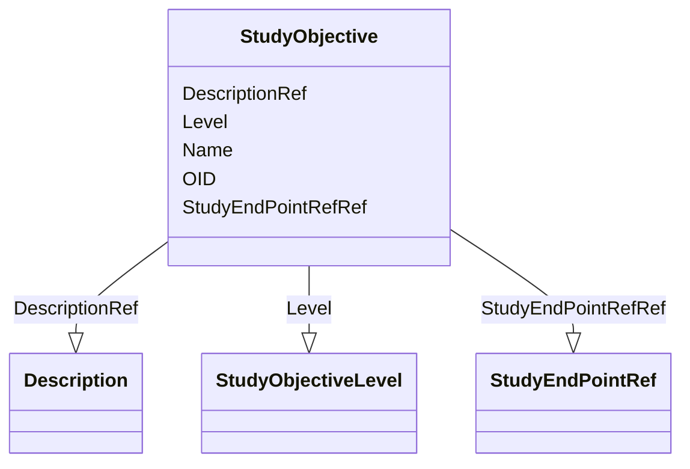

# Class: StudyObjective


_Element NameStudyObjectiveParent ElementStudyObjectivesElement XPath(s)/ODM/Study/MetaDataVersion/Protocol/StudyObjectives/StudyObjectiveElement Textual ValueNoneAttributesOID, Name, LevelChild Elements (Description?, StudyEndPointRef*)Usage/Business Rules_


URI: [odm:StudyObjective](http://www.cdisc.org/ns/odm/v2.0/StudyObjective)





<!-- no inheritance hierarchy -->


## Slots

| Name | Cardinality and Range | Description | Inheritance |
| ---  | --- | --- | --- |
| [OID](OID.md) | 1..1 <br/> [Oid](Oid.md) | Unique identifier for the StudyObjective element | direct |
| [Name](Name.md) | 1..1 <br/> [Name](Name.md) | Name of the study objective | direct |
| [Level](Level.md) | 0..1 <br/> [StudyObjectiveLevel](StudyObjectiveLevel.md) | Defined level for the Study Objective | direct |
| [DescriptionRef](DescriptionRef.md) | 0..1 <br/> [Description](Description.md) |  | direct |
| [StudyEndPointRefRef](StudyEndPointRefRef.md) | 0..* <br/> [StudyEndPointRef](StudyEndPointRef.md) |  | direct |


## Usages

| used by | used in | type | used |
| ---  | --- | --- | --- |
| [StudyObjectives](StudyObjectives.md) | [StudyObjectiveRef](StudyObjectiveRef.md) | range | [StudyObjective](StudyObjective.md) |


## See Also

* [https://wiki.cdisc.org/display/ODM2/StudyObjective](https://wiki.cdisc.org/display/ODM2/StudyObjective)

## Identifier and Mapping Information


### Schema Source


* from schema: http://www.cdisc.org/ns/odm/v2.0


## Mappings

| Mapping Type | Mapped Value |
| ---  | ---  |
| self | odm:StudyObjective |
| native | odm:StudyObjective |


## LinkML Source

<!-- TODO: investigate https://stackoverflow.com/questions/37606292/how-to-create-tabbed-code-blocks-in-mkdocs-or-sphinx -->

### Direct

<details>
```yaml
name: StudyObjective
description: Element NameStudyObjectiveParent ElementStudyObjectivesElement XPath(s)/ODM/Study/MetaDataVersion/Protocol/StudyObjectives/StudyObjectiveElement
  Textual ValueNoneAttributesOID, Name, LevelChild Elements (Description?, StudyEndPointRef*)Usage/Business
  Rules
from_schema: http://www.cdisc.org/ns/odm/v2.0
see_also:
- https://wiki.cdisc.org/display/ODM2/StudyObjective
slots:
- OID
- Name
- Level
- DescriptionRef
- StudyEndPointRefRef
slot_usage:
  OID:
    name: OID
    description: Unique identifier for the StudyObjective element.
    comments:
    - 'Required

      range:oid

      The OID attribute value must be unique within the Study/MetaDataVersion.'
    domain_of:
    - Study
    - MetaDataVersion
    - Standard
    - ValueListDef
    - WhereClauseDef
    - StudyEventGroupDef
    - StudyEventDef
    - ItemGroupDef
    - ItemDef
    - CodeList
    - MethodDef
    - ConditionDef
    - CommentDef
    - StudyIndication
    - StudyIntervention
    - StudyObjective
    - StudyEndPoint
    - StudyTargetPopulation
    - StudyEstimand
    - Arm
    - Epoch
    - StudyParameter
    - StudyTiming
    - TransitionTimingConstraint
    - AbsoluteTimingConstraint
    - RelativeTimingConstraint
    - DurationTimingConstraint
    - WorkflowDef
    - Transition
    - Branching
    - Criterion
    - ExceptionEvent
    - User
    - Organization
    - Location
    - SignatureDef
    - Query
    range: oid
    required: true
  Name:
    name: Name
    description: Name of the study objective
    comments:
    - 'Required

      range:name

      The Name attribute must be unique within the StudyObjectives elements within
      a Study/MetadataVersion.'
    domain_of:
    - Alias
    - MetaDataVersion
    - Standard
    - StudyEventGroupDef
    - StudyEventDef
    - ItemGroupDef
    - Class
    - SubClass
    - SourceItem
    - Resource
    - ItemDef
    - CodeList
    - MethodDef
    - Parameter
    - ReturnValue
    - ConditionDef
    - StudyObjective
    - StudyEndPoint
    - StudyTargetPopulation
    - StudyEstimand
    - Arm
    - Epoch
    - StudyTiming
    - TransitionTimingConstraint
    - AbsoluteTimingConstraint
    - RelativeTimingConstraint
    - DurationTimingConstraint
    - WorkflowDef
    - Transition
    - Branching
    - Criterion
    - ExceptionEvent
    - Organization
    - Location
    - Query
    range: name
    required: true
  Level:
    name: Level
    description: Defined level for the Study Objective
    comments:
    - 'Optional

      enum values:(Primary | Secondary | Exploratory )

      These are defined in concordance with the ICH M11 Clinical electronic Structured
      Harmonised Protocol Specification'
    domain_of:
    - StudyObjective
    - StudyEndPoint
    - StudyEstimand
    range: StudyObjectiveLevel
  DescriptionRef:
    name: DescriptionRef
    domain_of:
    - Study
    - MetaDataVersion
    - ValueListDef
    - StudyEventGroupRef
    - StudyEventGroupDef
    - StudyEventDef
    - ItemGroupDef
    - Origin
    - ItemDef
    - CodeList
    - CodeListItem
    - MethodDef
    - ConditionDef
    - CommentDef
    - Protocol
    - StudyStructure
    - TrialPhase
    - StudyIndication
    - StudyIntervention
    - StudyObjective
    - StudyEndPoint
    - StudyTargetPopulation
    - StudyEstimand
    - IntercurrentEvent
    - SummaryMeasure
    - Arm
    - Epoch
    - TransitionTimingConstraint
    - AbsoluteTimingConstraint
    - RelativeTimingConstraint
    - DurationTimingConstraint
    - WorkflowDef
    - Criterion
    - ExceptionEvent
    - Organization
    - Location
    - ODMFileMetadata
    range: Description
    maximum_cardinality: 1
  StudyEndPointRefRef:
    name: StudyEndPointRefRef
    multivalued: true
    domain_of:
    - StudyObjective
    - StudyEndPoints
    - StudyEstimand
    range: StudyEndPointRef
    inlined: true
    inlined_as_list: true
class_uri: odm:StudyObjective

```
</details>

### Induced

<details>
```yaml
name: StudyObjective
description: Element NameStudyObjectiveParent ElementStudyObjectivesElement XPath(s)/ODM/Study/MetaDataVersion/Protocol/StudyObjectives/StudyObjectiveElement
  Textual ValueNoneAttributesOID, Name, LevelChild Elements (Description?, StudyEndPointRef*)Usage/Business
  Rules
from_schema: http://www.cdisc.org/ns/odm/v2.0
see_also:
- https://wiki.cdisc.org/display/ODM2/StudyObjective
slot_usage:
  OID:
    name: OID
    description: Unique identifier for the StudyObjective element.
    comments:
    - 'Required

      range:oid

      The OID attribute value must be unique within the Study/MetaDataVersion.'
    domain_of:
    - Study
    - MetaDataVersion
    - Standard
    - ValueListDef
    - WhereClauseDef
    - StudyEventGroupDef
    - StudyEventDef
    - ItemGroupDef
    - ItemDef
    - CodeList
    - MethodDef
    - ConditionDef
    - CommentDef
    - StudyIndication
    - StudyIntervention
    - StudyObjective
    - StudyEndPoint
    - StudyTargetPopulation
    - StudyEstimand
    - Arm
    - Epoch
    - StudyParameter
    - StudyTiming
    - TransitionTimingConstraint
    - AbsoluteTimingConstraint
    - RelativeTimingConstraint
    - DurationTimingConstraint
    - WorkflowDef
    - Transition
    - Branching
    - Criterion
    - ExceptionEvent
    - User
    - Organization
    - Location
    - SignatureDef
    - Query
    range: oid
    required: true
  Name:
    name: Name
    description: Name of the study objective
    comments:
    - 'Required

      range:name

      The Name attribute must be unique within the StudyObjectives elements within
      a Study/MetadataVersion.'
    domain_of:
    - Alias
    - MetaDataVersion
    - Standard
    - StudyEventGroupDef
    - StudyEventDef
    - ItemGroupDef
    - Class
    - SubClass
    - SourceItem
    - Resource
    - ItemDef
    - CodeList
    - MethodDef
    - Parameter
    - ReturnValue
    - ConditionDef
    - StudyObjective
    - StudyEndPoint
    - StudyTargetPopulation
    - StudyEstimand
    - Arm
    - Epoch
    - StudyTiming
    - TransitionTimingConstraint
    - AbsoluteTimingConstraint
    - RelativeTimingConstraint
    - DurationTimingConstraint
    - WorkflowDef
    - Transition
    - Branching
    - Criterion
    - ExceptionEvent
    - Organization
    - Location
    - Query
    range: name
    required: true
  Level:
    name: Level
    description: Defined level for the Study Objective
    comments:
    - 'Optional

      enum values:(Primary | Secondary | Exploratory )

      These are defined in concordance with the ICH M11 Clinical electronic Structured
      Harmonised Protocol Specification'
    domain_of:
    - StudyObjective
    - StudyEndPoint
    - StudyEstimand
    range: StudyObjectiveLevel
  DescriptionRef:
    name: DescriptionRef
    domain_of:
    - Study
    - MetaDataVersion
    - ValueListDef
    - StudyEventGroupRef
    - StudyEventGroupDef
    - StudyEventDef
    - ItemGroupDef
    - Origin
    - ItemDef
    - CodeList
    - CodeListItem
    - MethodDef
    - ConditionDef
    - CommentDef
    - Protocol
    - StudyStructure
    - TrialPhase
    - StudyIndication
    - StudyIntervention
    - StudyObjective
    - StudyEndPoint
    - StudyTargetPopulation
    - StudyEstimand
    - IntercurrentEvent
    - SummaryMeasure
    - Arm
    - Epoch
    - TransitionTimingConstraint
    - AbsoluteTimingConstraint
    - RelativeTimingConstraint
    - DurationTimingConstraint
    - WorkflowDef
    - Criterion
    - ExceptionEvent
    - Organization
    - Location
    - ODMFileMetadata
    range: Description
    maximum_cardinality: 1
  StudyEndPointRefRef:
    name: StudyEndPointRefRef
    multivalued: true
    domain_of:
    - StudyObjective
    - StudyEndPoints
    - StudyEstimand
    range: StudyEndPointRef
    inlined: true
    inlined_as_list: true
attributes:
  OID:
    name: OID
    description: Unique identifier for the StudyObjective element.
    comments:
    - 'Required

      range:oid

      The OID attribute value must be unique within the Study/MetaDataVersion.'
    from_schema: http://www.cdisc.org/ns/odm/v2.0
    rank: 1000
    identifier: true
    alias: OID
    owner: StudyObjective
    domain_of:
    - Study
    - MetaDataVersion
    - Standard
    - ValueListDef
    - WhereClauseDef
    - StudyEventGroupDef
    - StudyEventDef
    - ItemGroupDef
    - ItemDef
    - CodeList
    - MethodDef
    - ConditionDef
    - CommentDef
    - StudyIndication
    - StudyIntervention
    - StudyObjective
    - StudyEndPoint
    - StudyTargetPopulation
    - StudyEstimand
    - Arm
    - Epoch
    - StudyParameter
    - StudyTiming
    - TransitionTimingConstraint
    - AbsoluteTimingConstraint
    - RelativeTimingConstraint
    - DurationTimingConstraint
    - WorkflowDef
    - Transition
    - Branching
    - Criterion
    - ExceptionEvent
    - User
    - Organization
    - Location
    - SignatureDef
    - Query
    range: oid
    required: true
  Name:
    name: Name
    description: Name of the study objective
    comments:
    - 'Required

      range:name

      The Name attribute must be unique within the StudyObjectives elements within
      a Study/MetadataVersion.'
    from_schema: http://www.cdisc.org/ns/odm/v2.0
    rank: 1000
    alias: Name
    owner: StudyObjective
    domain_of:
    - Alias
    - MetaDataVersion
    - Standard
    - StudyEventGroupDef
    - StudyEventDef
    - ItemGroupDef
    - Class
    - SubClass
    - SourceItem
    - Resource
    - ItemDef
    - CodeList
    - MethodDef
    - Parameter
    - ReturnValue
    - ConditionDef
    - StudyObjective
    - StudyEndPoint
    - StudyTargetPopulation
    - StudyEstimand
    - Arm
    - Epoch
    - StudyTiming
    - TransitionTimingConstraint
    - AbsoluteTimingConstraint
    - RelativeTimingConstraint
    - DurationTimingConstraint
    - WorkflowDef
    - Transition
    - Branching
    - Criterion
    - ExceptionEvent
    - Organization
    - Location
    - Query
    range: name
    required: true
  Level:
    name: Level
    description: Defined level for the Study Objective
    comments:
    - 'Optional

      enum values:(Primary | Secondary | Exploratory )

      These are defined in concordance with the ICH M11 Clinical electronic Structured
      Harmonised Protocol Specification'
    from_schema: http://www.cdisc.org/ns/odm/v2.0
    rank: 1000
    alias: Level
    owner: StudyObjective
    domain_of:
    - StudyObjective
    - StudyEndPoint
    - StudyEstimand
    range: StudyObjectiveLevel
  DescriptionRef:
    name: DescriptionRef
    from_schema: http://www.cdisc.org/ns/odm/v2.0
    rank: 1000
    identifier: false
    alias: DescriptionRef
    owner: StudyObjective
    domain_of:
    - Study
    - MetaDataVersion
    - ValueListDef
    - StudyEventGroupRef
    - StudyEventGroupDef
    - StudyEventDef
    - ItemGroupDef
    - Origin
    - ItemDef
    - CodeList
    - CodeListItem
    - MethodDef
    - ConditionDef
    - CommentDef
    - Protocol
    - StudyStructure
    - TrialPhase
    - StudyIndication
    - StudyIntervention
    - StudyObjective
    - StudyEndPoint
    - StudyTargetPopulation
    - StudyEstimand
    - IntercurrentEvent
    - SummaryMeasure
    - Arm
    - Epoch
    - TransitionTimingConstraint
    - AbsoluteTimingConstraint
    - RelativeTimingConstraint
    - DurationTimingConstraint
    - WorkflowDef
    - Criterion
    - ExceptionEvent
    - Organization
    - Location
    - ODMFileMetadata
    range: Description
    maximum_cardinality: 1
  StudyEndPointRefRef:
    name: StudyEndPointRefRef
    from_schema: http://www.cdisc.org/ns/odm/v2.0
    rank: 1000
    multivalued: true
    identifier: false
    alias: StudyEndPointRefRef
    owner: StudyObjective
    domain_of:
    - StudyObjective
    - StudyEndPoints
    - StudyEstimand
    range: StudyEndPointRef
    inlined: true
    inlined_as_list: true
class_uri: odm:StudyObjective

```
</details>