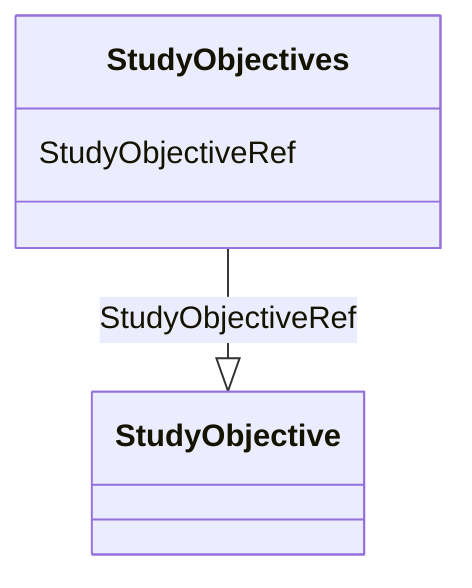

# Class: StudyObjectives


URI: [odm:StudyObjectives](http://www.cdisc.org/ns/odm/v2.0/StudyObjectives)





<!-- no inheritance hierarchy -->


## Slots

| Name | Cardinality and Range | Description | Inheritance |
| ---  | --- | --- | --- |
| [StudyObjectiveRef](StudyObjectiveRef.md) | 1..* <br/> [StudyObjective](StudyObjective.md) |  | direct |


## Usages

| used by | used in | type | used |
| ---  | --- | --- | --- |
| [Protocol](Protocol.md) | [StudyObjectivesRef](StudyObjectivesRef.md) | range | [StudyObjectives](StudyObjectives.md) |


## See Also

* [https://wiki.cdisc.org/display/ODM2/StudyObjectives](https://wiki.cdisc.org/display/ODM2/StudyObjectives)

## Identifier and Mapping Information


### Schema Source


* from schema: http://www.cdisc.org/ns/odm/v2.0


## Mappings

| Mapping Type | Mapped Value |
| ---  | ---  |
| self | odm:StudyObjectives |
| native | odm:StudyObjectives |


## LinkML Source

<!-- TODO: investigate https://stackoverflow.com/questions/37606292/how-to-create-tabbed-code-blocks-in-mkdocs-or-sphinx -->

### Direct

<details>
```yaml
name: StudyObjectives
from_schema: http://www.cdisc.org/ns/odm/v2.0
see_also:
- https://wiki.cdisc.org/display/ODM2/StudyObjectives
slots:
- StudyObjectiveRef
slot_usage:
  StudyObjectiveRef:
    name: StudyObjectiveRef
    multivalued: true
    domain_of:
    - StudyObjectives
    range: StudyObjective
    required: true
    inlined: true
    inlined_as_list: true
    minimum_cardinality: 1
class_uri: odm:StudyObjectives

```
</details>

### Induced

<details>
```yaml
name: StudyObjectives
from_schema: http://www.cdisc.org/ns/odm/v2.0
see_also:
- https://wiki.cdisc.org/display/ODM2/StudyObjectives
slot_usage:
  StudyObjectiveRef:
    name: StudyObjectiveRef
    multivalued: true
    domain_of:
    - StudyObjectives
    range: StudyObjective
    required: true
    inlined: true
    inlined_as_list: true
    minimum_cardinality: 1
attributes:
  StudyObjectiveRef:
    name: StudyObjectiveRef
    from_schema: http://www.cdisc.org/ns/odm/v2.0
    rank: 1000
    multivalued: true
    alias: StudyObjectiveRef
    owner: StudyObjectives
    domain_of:
    - StudyObjectives
    range: StudyObjective
    required: true
    inlined: true
    inlined_as_list: true
    minimum_cardinality: 1
class_uri: odm:StudyObjectives

```
</details>