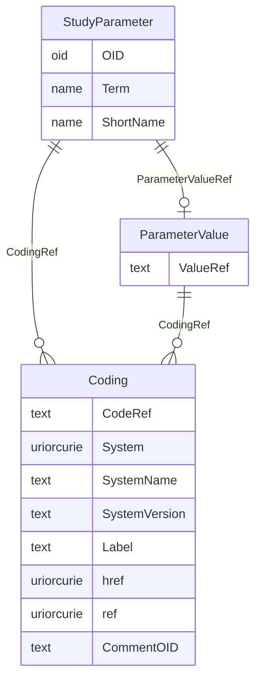

# Class: StudyParameter

_A StudyParameter defines a study design parameter for which the value or values are delivered in the ParameterValue child element or elements._


URI: [odm:StudyParameter](http://www.cdisc.org/ns/odm/v2.0/StudyParameter)





<!-- no inheritance hierarchy -->


## Slots

| Name | Cardinality* and Range | Description | Inheritance |
| ---  | --- | --- | --- |
| [OID](OID.md) | 1..1 <br/> [oid](oid.md) | Unique identifier for StudyParameter. Note a StudyParameter can be referenced... | direct |
| [Term](Term.md) | 1..1 <br/> [name](name.md) | Longer name. Provides the full name of the parameter. | direct |
| [ShortName](ShortName.md) | 0..1 <br/> [name](name.md) | Short name or code for the parameter. | direct |
| [ParameterValueRef](ParameterValueRef.md) | 0..1 <br/> [ParameterValue](ParameterValue.md) | ParameterValue reference: This element contains the value of the study parame... | direct |
| [CodingRef](CodingRef.md) | 0..* <br/> [Coding](Coding.md) | Coding reference: Coding references a symbol from a defined code system. It u... | direct |

_* See [LinkML documentation](https://linkml.io/linkml/schemas/slots.html#slot-cardinality) for cardinality definitions._


## Usages

| used by | used in | type | used |
| ---  | --- | --- | --- |
| [StudySummary](StudySummary.md) | [StudyParameterRef](StudyParameterRef.md) | range | [StudyParameter](StudyParameter.md) |


## See Also

* [https://wiki.cdisc.org/display/ODM2/StudyParameter](https://wiki.cdisc.org/display/ODM2/StudyParameter)

## Identifier and Mapping Information


### Schema Source


* from schema: http://www.cdisc.org/ns/odm/v2.0


## Mappings

| Mapping Type | Mapped Value |
| ---  | ---  |
| self | odm:StudyParameter |
| native | odm:StudyParameter |


## LinkML Source

<!-- TODO: investigate https://stackoverflow.com/questions/37606292/how-to-create-tabbed-code-blocks-in-mkdocs-or-sphinx -->

### Direct

<details>
```yaml
name: StudyParameter
description: A StudyParameter defines a study design parameter for which the value
  or values are delivered in the ParameterValue child element or elements.
from_schema: http://www.cdisc.org/ns/odm/v2.0
see_also:
- https://wiki.cdisc.org/display/ODM2/StudyParameter
rank: 1000
slots:
- OID
- Term
- ShortName
- ParameterValueRef
- CodingRef
slot_usage:
  OID:
    name: OID
    description: Unique identifier for StudyParameter. Note a StudyParameter can be
      referenced from other elements.
    comments:
    - 'Required

      range: oid

      Must be unique within the Protocol.'
    domain_of:
    - Study
    - MetaDataVersion
    - Standard
    - ValueListDef
    - WhereClauseDef
    - StudyEventGroupDef
    - StudyEventDef
    - ItemGroupDef
    - ItemDef
    - CodeList
    - MethodDef
    - ConditionDef
    - CommentDef
    - StudyIndication
    - StudyIntervention
    - StudyObjective
    - StudyEndPoint
    - StudyTargetPopulation
    - StudyEstimand
    - Arm
    - Epoch
    - StudyParameter
    - StudyTiming
    - TransitionTimingConstraint
    - AbsoluteTimingConstraint
    - RelativeTimingConstraint
    - DurationTimingConstraint
    - WorkflowDef
    - Transition
    - Branching
    - Criterion
    - User
    - Organization
    - Location
    - SignatureDef
    - Query
    range: oid
    required: true
  Term:
    name: Term
    description: Longer name. Provides the full name of the parameter.
    comments:
    - 'Required

      range: name

      For the CDISC end-to-end use case, when the study parameter will be included
      in the SDTM Trial Summary (TS) domain dataset, the Term will be taken from the
      CDISC Controlled Terminology "TSPARM" (C67152) codelist Note the term may include
      white space.'
    domain_of:
    - StudyParameter
    range: name
    required: true
  ShortName:
    name: ShortName
    description: Short name or code for the parameter.
    comments:
    - 'Required

      range: name

      Must not include white space. For the CDISC end-to-end use case, when the study
      parameter will be included in the SDTM TS domain dataset, the ShortName will
      be taken from the CDISC Controlled Terminology "TSPARMCD" (C66738) codelist
      and the value of ShortName will be limited to 8 characters.'
    domain_of:
    - StudyParameter
    range: name
  ParameterValueRef:
    name: ParameterValueRef
    domain_of:
    - StudyParameter
    range: ParameterValue
    maximum_cardinality: 1
  CodingRef:
    name: CodingRef
    multivalued: true
    domain_of:
    - StudyEventGroupDef
    - StudyEventDef
    - ItemGroupDef
    - Origin
    - SourceItems
    - SourceItem
    - ItemDef
    - CodeList
    - CodeListItem
    - StudyIndication
    - StudyIntervention
    - StudyTargetPopulation
    - StudyParameter
    - ParameterValue
    - Criterion
    - Annotation
    range: Coding
    inlined: true
    inlined_as_list: true
class_uri: odm:StudyParameter

```
</details>

### Induced

<details>
```yaml
name: StudyParameter
description: A StudyParameter defines a study design parameter for which the value
  or values are delivered in the ParameterValue child element or elements.
from_schema: http://www.cdisc.org/ns/odm/v2.0
see_also:
- https://wiki.cdisc.org/display/ODM2/StudyParameter
rank: 1000
slot_usage:
  OID:
    name: OID
    description: Unique identifier for StudyParameter. Note a StudyParameter can be
      referenced from other elements.
    comments:
    - 'Required

      range: oid

      Must be unique within the Protocol.'
    domain_of:
    - Study
    - MetaDataVersion
    - Standard
    - ValueListDef
    - WhereClauseDef
    - StudyEventGroupDef
    - StudyEventDef
    - ItemGroupDef
    - ItemDef
    - CodeList
    - MethodDef
    - ConditionDef
    - CommentDef
    - StudyIndication
    - StudyIntervention
    - StudyObjective
    - StudyEndPoint
    - StudyTargetPopulation
    - StudyEstimand
    - Arm
    - Epoch
    - StudyParameter
    - StudyTiming
    - TransitionTimingConstraint
    - AbsoluteTimingConstraint
    - RelativeTimingConstraint
    - DurationTimingConstraint
    - WorkflowDef
    - Transition
    - Branching
    - Criterion
    - User
    - Organization
    - Location
    - SignatureDef
    - Query
    range: oid
    required: true
  Term:
    name: Term
    description: Longer name. Provides the full name of the parameter.
    comments:
    - 'Required

      range: name

      For the CDISC end-to-end use case, when the study parameter will be included
      in the SDTM Trial Summary (TS) domain dataset, the Term will be taken from the
      CDISC Controlled Terminology "TSPARM" (C67152) codelist Note the term may include
      white space.'
    domain_of:
    - StudyParameter
    range: name
    required: true
  ShortName:
    name: ShortName
    description: Short name or code for the parameter.
    comments:
    - 'Required

      range: name

      Must not include white space. For the CDISC end-to-end use case, when the study
      parameter will be included in the SDTM TS domain dataset, the ShortName will
      be taken from the CDISC Controlled Terminology "TSPARMCD" (C66738) codelist
      and the value of ShortName will be limited to 8 characters.'
    domain_of:
    - StudyParameter
    range: name
  ParameterValueRef:
    name: ParameterValueRef
    domain_of:
    - StudyParameter
    range: ParameterValue
    maximum_cardinality: 1
  CodingRef:
    name: CodingRef
    multivalued: true
    domain_of:
    - StudyEventGroupDef
    - StudyEventDef
    - ItemGroupDef
    - Origin
    - SourceItems
    - SourceItem
    - ItemDef
    - CodeList
    - CodeListItem
    - StudyIndication
    - StudyIntervention
    - StudyTargetPopulation
    - StudyParameter
    - ParameterValue
    - Criterion
    - Annotation
    range: Coding
    inlined: true
    inlined_as_list: true
attributes:
  OID:
    name: OID
    description: Unique identifier for StudyParameter. Note a StudyParameter can be
      referenced from other elements.
    comments:
    - 'Required

      range: oid

      Must be unique within the Protocol.'
    from_schema: http://www.cdisc.org/ns/odm/v2.0
    rank: 1000
    identifier: true
    alias: OID
    owner: StudyParameter
    domain_of:
    - Study
    - MetaDataVersion
    - Standard
    - ValueListDef
    - WhereClauseDef
    - StudyEventGroupDef
    - StudyEventDef
    - ItemGroupDef
    - ItemDef
    - CodeList
    - MethodDef
    - ConditionDef
    - CommentDef
    - StudyIndication
    - StudyIntervention
    - StudyObjective
    - StudyEndPoint
    - StudyTargetPopulation
    - StudyEstimand
    - Arm
    - Epoch
    - StudyParameter
    - StudyTiming
    - TransitionTimingConstraint
    - AbsoluteTimingConstraint
    - RelativeTimingConstraint
    - DurationTimingConstraint
    - WorkflowDef
    - Transition
    - Branching
    - Criterion
    - User
    - Organization
    - Location
    - SignatureDef
    - Query
    range: oid
    required: true
  Term:
    name: Term
    description: Longer name. Provides the full name of the parameter.
    comments:
    - 'Required

      range: name

      For the CDISC end-to-end use case, when the study parameter will be included
      in the SDTM Trial Summary (TS) domain dataset, the Term will be taken from the
      CDISC Controlled Terminology "TSPARM" (C67152) codelist Note the term may include
      white space.'
    from_schema: http://www.cdisc.org/ns/odm/v2.0
    rank: 1000
    alias: Term
    owner: StudyParameter
    domain_of:
    - StudyParameter
    range: name
    required: true
  ShortName:
    name: ShortName
    description: Short name or code for the parameter.
    comments:
    - 'Required

      range: name

      Must not include white space. For the CDISC end-to-end use case, when the study
      parameter will be included in the SDTM TS domain dataset, the ShortName will
      be taken from the CDISC Controlled Terminology "TSPARMCD" (C66738) codelist
      and the value of ShortName will be limited to 8 characters.'
    from_schema: http://www.cdisc.org/ns/odm/v2.0
    rank: 1000
    alias: ShortName
    owner: StudyParameter
    domain_of:
    - StudyParameter
    range: name
  ParameterValueRef:
    name: ParameterValueRef
    description: 'ParameterValue reference: This element contains the value of the
      study parameter as text content.'
    from_schema: http://www.cdisc.org/ns/odm/v2.0
    rank: 1000
    identifier: false
    alias: ParameterValueRef
    owner: StudyParameter
    domain_of:
    - StudyParameter
    range: ParameterValue
    maximum_cardinality: 1
  CodingRef:
    name: CodingRef
    description: 'Coding reference: Coding references a symbol from a defined code
      system. It uses a code defined in a terminology system to associate semantics
      with a given term, codelist, variable, or group of variables. The presence of
      a Coding element associates a meaning to its parent element. Including multiple
      Coding elements for a given parent indicates synonymous meanings provided by
      different code systems or code system versions.'
    from_schema: http://www.cdisc.org/ns/odm/v2.0
    rank: 1000
    multivalued: true
    identifier: false
    alias: CodingRef
    owner: StudyParameter
    domain_of:
    - StudyEventGroupDef
    - StudyEventDef
    - ItemGroupDef
    - Origin
    - SourceItems
    - SourceItem
    - ItemDef
    - CodeList
    - CodeListItem
    - StudyIndication
    - StudyIntervention
    - StudyTargetPopulation
    - StudyParameter
    - ParameterValue
    - Criterion
    - Annotation
    range: Coding
    inlined: true
    inlined_as_list: true
class_uri: odm:StudyParameter

```
</details>