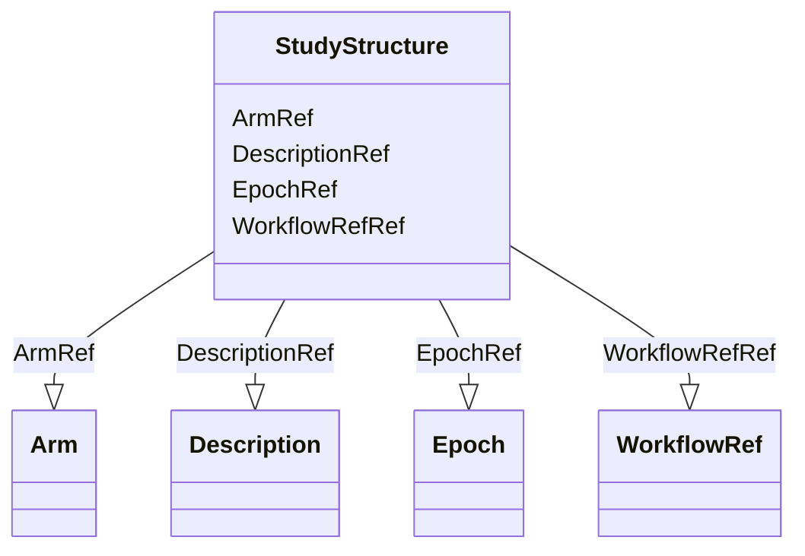

# Class: StudyStructure


_The StudyStructure element describes the general structure of a clinical study with arms, epochs, and workflows._


URI: [odm:StudyStructure](http://www.cdisc.org/ns/odm/v2.0/StudyStructure)





<!-- no inheritance hierarchy -->


## Slots

| Name | Cardinality and Range | Description | Inheritance |
| ---  | --- | --- | --- |
| [DescriptionRef](DescriptionRef.md) | 0..1 <br/> [Description](Description.md) | Description reference: A free-text description of the containing metadata com... | direct |
| [ArmRef](ArmRef.md) | 0..* <br/> [Arm](Arm.md) | Arm reference: An Arm element provides the declaration of a study arm. Arms d... | direct |
| [EpochRef](EpochRef.md) | 0..* <br/> [Epoch](Epoch.md) | Epoch reference: The planned period of subjects' participation in the trial i... | direct |
| [WorkflowRefRef](WorkflowRefRef.md) | 0..1 <br/> [WorkflowRef](WorkflowRef.md) | WorkflowRef reference: The WorkflowRef references a workflow definition | direct |


## Usages

| used by | used in | type | used |
| ---  | --- | --- | --- |
| [Protocol](Protocol.md) | [StudyStructureRef](StudyStructureRef.md) | range | [StudyStructure](StudyStructure.md) |


## See Also

* [https://wiki.cdisc.org/display/ODM2/StudyStructure](https://wiki.cdisc.org/display/ODM2/StudyStructure)

## Identifier and Mapping Information


### Schema Source


* from schema: http://www.cdisc.org/ns/odm/v2.0


## Mappings

| Mapping Type | Mapped Value |
| ---  | ---  |
| self | odm:StudyStructure |
| native | odm:StudyStructure |


## LinkML Source

<!-- TODO: investigate https://stackoverflow.com/questions/37606292/how-to-create-tabbed-code-blocks-in-mkdocs-or-sphinx -->

### Direct

<details>
```yaml
name: StudyStructure
description: The StudyStructure element describes the general structure of a clinical
  study with arms, epochs, and workflows.
from_schema: http://www.cdisc.org/ns/odm/v2.0
see_also:
- https://wiki.cdisc.org/display/ODM2/StudyStructure
slots:
- DescriptionRef
- ArmRef
- EpochRef
- WorkflowRefRef
slot_usage:
  DescriptionRef:
    name: DescriptionRef
    domain_of:
    - Study
    - MetaDataVersion
    - ValueListDef
    - StudyEventGroupRef
    - StudyEventGroupDef
    - StudyEventDef
    - ItemGroupDef
    - Origin
    - ItemDef
    - CodeList
    - CodeListItem
    - MethodDef
    - ConditionDef
    - CommentDef
    - Protocol
    - StudyStructure
    - TrialPhase
    - StudyIndication
    - StudyIntervention
    - StudyObjective
    - StudyEndPoint
    - StudyTargetPopulation
    - StudyEstimand
    - IntercurrentEvent
    - SummaryMeasure
    - Arm
    - Epoch
    - TransitionTimingConstraint
    - AbsoluteTimingConstraint
    - RelativeTimingConstraint
    - DurationTimingConstraint
    - WorkflowDef
    - Criterion
    - Organization
    - Location
    - ODMFileMetadata
    range: Description
    maximum_cardinality: 1
  ArmRef:
    name: ArmRef
    multivalued: true
    domain_of:
    - StudyStructure
    range: Arm
    inlined: true
    inlined_as_list: true
  EpochRef:
    name: EpochRef
    multivalued: true
    domain_of:
    - StudyStructure
    range: Epoch
    inlined: true
    inlined_as_list: true
  WorkflowRefRef:
    name: WorkflowRefRef
    domain_of:
    - StudyEventGroupDef
    - StudyEventDef
    - ItemGroupDef
    - Protocol
    - StudyStructure
    - Arm
    range: WorkflowRef
    maximum_cardinality: 1
class_uri: odm:StudyStructure

```
</details>

### Induced

<details>
```yaml
name: StudyStructure
description: The StudyStructure element describes the general structure of a clinical
  study with arms, epochs, and workflows.
from_schema: http://www.cdisc.org/ns/odm/v2.0
see_also:
- https://wiki.cdisc.org/display/ODM2/StudyStructure
slot_usage:
  DescriptionRef:
    name: DescriptionRef
    domain_of:
    - Study
    - MetaDataVersion
    - ValueListDef
    - StudyEventGroupRef
    - StudyEventGroupDef
    - StudyEventDef
    - ItemGroupDef
    - Origin
    - ItemDef
    - CodeList
    - CodeListItem
    - MethodDef
    - ConditionDef
    - CommentDef
    - Protocol
    - StudyStructure
    - TrialPhase
    - StudyIndication
    - StudyIntervention
    - StudyObjective
    - StudyEndPoint
    - StudyTargetPopulation
    - StudyEstimand
    - IntercurrentEvent
    - SummaryMeasure
    - Arm
    - Epoch
    - TransitionTimingConstraint
    - AbsoluteTimingConstraint
    - RelativeTimingConstraint
    - DurationTimingConstraint
    - WorkflowDef
    - Criterion
    - Organization
    - Location
    - ODMFileMetadata
    range: Description
    maximum_cardinality: 1
  ArmRef:
    name: ArmRef
    multivalued: true
    domain_of:
    - StudyStructure
    range: Arm
    inlined: true
    inlined_as_list: true
  EpochRef:
    name: EpochRef
    multivalued: true
    domain_of:
    - StudyStructure
    range: Epoch
    inlined: true
    inlined_as_list: true
  WorkflowRefRef:
    name: WorkflowRefRef
    domain_of:
    - StudyEventGroupDef
    - StudyEventDef
    - ItemGroupDef
    - Protocol
    - StudyStructure
    - Arm
    range: WorkflowRef
    maximum_cardinality: 1
attributes:
  DescriptionRef:
    name: DescriptionRef
    description: 'Description reference: A free-text description of the containing
      metadata component, unless restricted by Business Rules.'
    from_schema: http://www.cdisc.org/ns/odm/v2.0
    rank: 1000
    identifier: false
    alias: DescriptionRef
    owner: StudyStructure
    domain_of:
    - Study
    - MetaDataVersion
    - ValueListDef
    - StudyEventGroupRef
    - StudyEventGroupDef
    - StudyEventDef
    - ItemGroupDef
    - Origin
    - ItemDef
    - CodeList
    - CodeListItem
    - MethodDef
    - ConditionDef
    - CommentDef
    - Protocol
    - StudyStructure
    - TrialPhase
    - StudyIndication
    - StudyIntervention
    - StudyObjective
    - StudyEndPoint
    - StudyTargetPopulation
    - StudyEstimand
    - IntercurrentEvent
    - SummaryMeasure
    - Arm
    - Epoch
    - TransitionTimingConstraint
    - AbsoluteTimingConstraint
    - RelativeTimingConstraint
    - DurationTimingConstraint
    - WorkflowDef
    - Criterion
    - Organization
    - Location
    - ODMFileMetadata
    range: Description
    maximum_cardinality: 1
  ArmRef:
    name: ArmRef
    description: 'Arm reference: An Arm element provides the declaration of a study
      arm. Arms do not have any ordering relative to one another.'
    from_schema: http://www.cdisc.org/ns/odm/v2.0
    rank: 1000
    multivalued: true
    identifier: false
    alias: ArmRef
    owner: StudyStructure
    domain_of:
    - StudyStructure
    range: Arm
    inlined: true
    inlined_as_list: true
  EpochRef:
    name: EpochRef
    description: 'Epoch reference: The planned period of subjects'' participation
      in the trial is divided into sequential epochs. Each epoch is a period of time
      that serves a purpose in the trial as a whole. Epochs cannot overlap. The sequence
      of the epoch in the study is provided by the SequenceNumber attribute, the first
      epoch in the study being assigned the sequence number 1. Sequence numbers are
      subsequent.'
    from_schema: http://www.cdisc.org/ns/odm/v2.0
    rank: 1000
    multivalued: true
    identifier: false
    alias: EpochRef
    owner: StudyStructure
    domain_of:
    - StudyStructure
    range: Epoch
    inlined: true
    inlined_as_list: true
  WorkflowRefRef:
    name: WorkflowRefRef
    description: 'WorkflowRef reference: The WorkflowRef references a workflow definition'
    from_schema: http://www.cdisc.org/ns/odm/v2.0
    rank: 1000
    identifier: false
    alias: WorkflowRefRef
    owner: StudyStructure
    domain_of:
    - StudyEventGroupDef
    - StudyEventDef
    - ItemGroupDef
    - Protocol
    - StudyStructure
    - Arm
    range: WorkflowRef
    maximum_cardinality: 1
class_uri: odm:StudyStructure

```
</details>