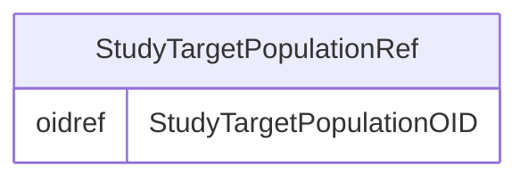

# Class: StudyTargetPopulationRef

_The StudyTargetPopulationRef references a StudyTargetPopulation to which the estimand applies._


URI: [odm:StudyTargetPopulationRef](http://www.cdisc.org/ns/odm/v2.0/StudyTargetPopulationRef)





<!-- no inheritance hierarchy -->


## Slots

| Name | Cardinality* and Range | Description | Inheritance |
| ---  | --- | --- | --- |
| [StudyTargetPopulationOID](StudyTargetPopulationOID.md) | 1..1 <br/> [oidref](oidref.md) |  | direct |

_* See [LinkML documentation](https://linkml.io/linkml/schemas/slots.html#slot-cardinality) for cardinality definitions._


## Usages

| used by | used in | type | used |
| ---  | --- | --- | --- |
| [StudyEstimand](StudyEstimand.md) | [StudyTargetPopulationRefRef](StudyTargetPopulationRefRef.md) | range | [StudyTargetPopulationRef](StudyTargetPopulationRef.md) |


## See Also

* [https://wiki.cdisc.org/display/PUB/StudyTargetPopulationRef](https://wiki.cdisc.org/display/PUB/StudyTargetPopulationRef)

## Identifier and Mapping Information


### Schema Source


* from schema: http://www.cdisc.org/ns/odm/v2.0


## Mappings

| Mapping Type | Mapped Value |
| ---  | ---  |
| self | odm:StudyTargetPopulationRef |
| native | odm:StudyTargetPopulationRef |


## LinkML Source

<!-- TODO: investigate https://stackoverflow.com/questions/37606292/how-to-create-tabbed-code-blocks-in-mkdocs-or-sphinx -->

### Direct

<details>
```yaml
name: StudyTargetPopulationRef
description: The StudyTargetPopulationRef references a StudyTargetPopulation to which
  the estimand applies.
from_schema: http://www.cdisc.org/ns/odm/v2.0
see_also:
- https://wiki.cdisc.org/display/PUB/StudyTargetPopulationRef
rank: 1000
slots:
- StudyTargetPopulationOID
slot_usage:
  StudyTargetPopulationOID:
    name: StudyTargetPopulationOID
    domain_of:
    - StudyTargetPopulationRef
    range: oidref
    required: true
class_uri: odm:StudyTargetPopulationRef

```
</details>

### Induced

<details>
```yaml
name: StudyTargetPopulationRef
description: The StudyTargetPopulationRef references a StudyTargetPopulation to which
  the estimand applies.
from_schema: http://www.cdisc.org/ns/odm/v2.0
see_also:
- https://wiki.cdisc.org/display/PUB/StudyTargetPopulationRef
rank: 1000
slot_usage:
  StudyTargetPopulationOID:
    name: StudyTargetPopulationOID
    domain_of:
    - StudyTargetPopulationRef
    range: oidref
    required: true
attributes:
  StudyTargetPopulationOID:
    name: StudyTargetPopulationOID
    from_schema: http://www.cdisc.org/ns/odm/v2.0
    rank: 1000
    alias: StudyTargetPopulationOID
    owner: StudyTargetPopulationRef
    domain_of:
    - StudyTargetPopulationRef
    range: oidref
    required: true
class_uri: odm:StudyTargetPopulationRef

```
</details>