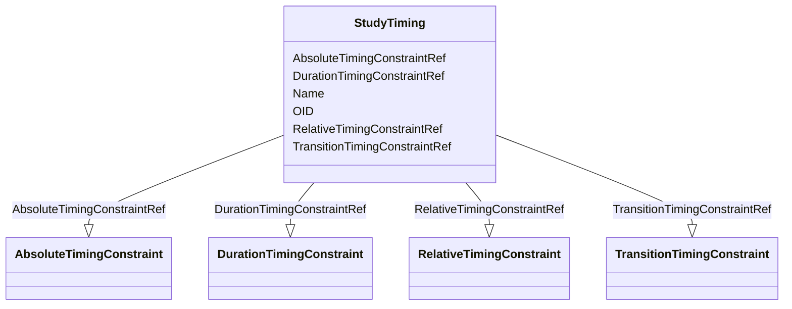

# Class: StudyTiming


URI: [odm:StudyTiming](http://www.cdisc.org/ns/odm/v2.0/StudyTiming)





<!-- no inheritance hierarchy -->


## Slots

| Name | Cardinality and Range | Description | Inheritance |
| ---  | --- | --- | --- |
| [OID](OID.md) | 1..1 <br/> [Oid](Oid.md) | Unique identifier of the version within the XML document | direct |
| [Name](Name.md) | 1..1 <br/> [Name](Name.md) | General observation Sub Class | direct |
| [AbsoluteTimingConstraintRef](AbsoluteTimingConstraintRef.md) | 0..* <br/> [AbsoluteTimingConstraint](AbsoluteTimingConstraint.md) |  | direct |
| [RelativeTimingConstraintRef](RelativeTimingConstraintRef.md) | 0..* <br/> [RelativeTimingConstraint](RelativeTimingConstraint.md) |  | direct |
| [TransitionTimingConstraintRef](TransitionTimingConstraintRef.md) | 0..* <br/> [TransitionTimingConstraint](TransitionTimingConstraint.md) |  | direct |
| [DurationTimingConstraintRef](DurationTimingConstraintRef.md) | 0..* <br/> [DurationTimingConstraint](DurationTimingConstraint.md) |  | direct |


## Usages

| used by | used in | type | used |
| ---  | --- | --- | --- |
| [StudyTimings](StudyTimings.md) | [StudyTimingRef](StudyTimingRef.md) | range | [StudyTiming](StudyTiming.md) |


## Identifier and Mapping Information


### Schema Source


* from schema: http://www.cdisc.org/ns/odm/v2.0


## Mappings

| Mapping Type | Mapped Value |
| ---  | ---  |
| self | odm:StudyTiming |
| native | odm:StudyTiming |


## LinkML Source

<!-- TODO: investigate https://stackoverflow.com/questions/37606292/how-to-create-tabbed-code-blocks-in-mkdocs-or-sphinx -->

### Direct

<details>
```yaml
name: StudyTiming
from_schema: http://www.cdisc.org/ns/odm/v2.0
slots:
- OID
- Name
- AbsoluteTimingConstraintRef
- RelativeTimingConstraintRef
- TransitionTimingConstraintRef
- DurationTimingConstraintRef
slot_usage:
  OID:
    name: OID
    domain_of:
    - ValueListDef
    - WhereClauseDef
    - StudyEventGroupDef
    - CommentDef
    - StudyIndication
    - StudyIntervention
    - StudyObjective
    - StudyEndPoint
    - StudyTargetPopulation
    - StudyEstimand
    - Arm
    - Epoch
    - StudyParameter
    - StudyTiming
    - TransitionTimingConstraint
    - AbsoluteTimingConstraint
    - RelativeTimingConstraint
    - DurationTimingConstraint
    - WorkflowDef
    - Transition
    - Branching
    - Criterion
    - ExceptionEvent
    - Organization
    - Query
    - MetaDataVersion
    - StudyEventDef
    - ItemGroupDef
    - ItemDef
    - CodeList
    - ConditionDef
    - MethodDef
    - Standard
    - User
    - Location
    - SignatureDef
    - Study
    range: oid
    required: true
  Name:
    name: Name
    domain_of:
    - StudyEventGroupDef
    - Class
    - SubClass
    - SourceItem
    - Resource
    - Parameter
    - ReturnValue
    - StudyObjective
    - StudyEndPoint
    - StudyTargetPopulation
    - StudyEstimand
    - Arm
    - Epoch
    - StudyTiming
    - TransitionTimingConstraint
    - AbsoluteTimingConstraint
    - RelativeTimingConstraint
    - DurationTimingConstraint
    - WorkflowDef
    - Transition
    - Branching
    - Criterion
    - ExceptionEvent
    - Organization
    - Query
    - MetaDataVersion
    - StudyEventDef
    - ItemGroupDef
    - ItemDef
    - CodeList
    - ConditionDef
    - MethodDef
    - Standard
    - Alias
    - Location
    range: name
    required: true
  AbsoluteTimingConstraintRef:
    name: AbsoluteTimingConstraintRef
    multivalued: true
    domain_of:
    - StudyTiming
    range: AbsoluteTimingConstraint
    required: false
    minimum_cardinality: 0
  RelativeTimingConstraintRef:
    name: RelativeTimingConstraintRef
    multivalued: true
    domain_of:
    - StudyTiming
    range: RelativeTimingConstraint
    required: false
    minimum_cardinality: 0
  TransitionTimingConstraintRef:
    name: TransitionTimingConstraintRef
    multivalued: true
    domain_of:
    - StudyTiming
    range: TransitionTimingConstraint
    required: false
    minimum_cardinality: 0
  DurationTimingConstraintRef:
    name: DurationTimingConstraintRef
    multivalued: true
    domain_of:
    - StudyTiming
    range: DurationTimingConstraint
    required: false
    minimum_cardinality: 0
class_uri: odm:StudyTiming

```
</details>

### Induced

<details>
```yaml
name: StudyTiming
from_schema: http://www.cdisc.org/ns/odm/v2.0
slot_usage:
  OID:
    name: OID
    domain_of:
    - ValueListDef
    - WhereClauseDef
    - StudyEventGroupDef
    - CommentDef
    - StudyIndication
    - StudyIntervention
    - StudyObjective
    - StudyEndPoint
    - StudyTargetPopulation
    - StudyEstimand
    - Arm
    - Epoch
    - StudyParameter
    - StudyTiming
    - TransitionTimingConstraint
    - AbsoluteTimingConstraint
    - RelativeTimingConstraint
    - DurationTimingConstraint
    - WorkflowDef
    - Transition
    - Branching
    - Criterion
    - ExceptionEvent
    - Organization
    - Query
    - MetaDataVersion
    - StudyEventDef
    - ItemGroupDef
    - ItemDef
    - CodeList
    - ConditionDef
    - MethodDef
    - Standard
    - User
    - Location
    - SignatureDef
    - Study
    range: oid
    required: true
  Name:
    name: Name
    domain_of:
    - StudyEventGroupDef
    - Class
    - SubClass
    - SourceItem
    - Resource
    - Parameter
    - ReturnValue
    - StudyObjective
    - StudyEndPoint
    - StudyTargetPopulation
    - StudyEstimand
    - Arm
    - Epoch
    - StudyTiming
    - TransitionTimingConstraint
    - AbsoluteTimingConstraint
    - RelativeTimingConstraint
    - DurationTimingConstraint
    - WorkflowDef
    - Transition
    - Branching
    - Criterion
    - ExceptionEvent
    - Organization
    - Query
    - MetaDataVersion
    - StudyEventDef
    - ItemGroupDef
    - ItemDef
    - CodeList
    - ConditionDef
    - MethodDef
    - Standard
    - Alias
    - Location
    range: name
    required: true
  AbsoluteTimingConstraintRef:
    name: AbsoluteTimingConstraintRef
    multivalued: true
    domain_of:
    - StudyTiming
    range: AbsoluteTimingConstraint
    required: false
    minimum_cardinality: 0
  RelativeTimingConstraintRef:
    name: RelativeTimingConstraintRef
    multivalued: true
    domain_of:
    - StudyTiming
    range: RelativeTimingConstraint
    required: false
    minimum_cardinality: 0
  TransitionTimingConstraintRef:
    name: TransitionTimingConstraintRef
    multivalued: true
    domain_of:
    - StudyTiming
    range: TransitionTimingConstraint
    required: false
    minimum_cardinality: 0
  DurationTimingConstraintRef:
    name: DurationTimingConstraintRef
    multivalued: true
    domain_of:
    - StudyTiming
    range: DurationTimingConstraint
    required: false
    minimum_cardinality: 0
attributes:
  OID:
    name: OID
    description: Unique identifier of the version within the XML document.
    from_schema: http://www.cdisc.org/ns/odm/v2.0
    rank: 1000
    alias: OID
    owner: StudyTiming
    domain_of:
    - ValueListDef
    - WhereClauseDef
    - StudyEventGroupDef
    - CommentDef
    - StudyIndication
    - StudyIntervention
    - StudyObjective
    - StudyEndPoint
    - StudyTargetPopulation
    - StudyEstimand
    - Arm
    - Epoch
    - StudyParameter
    - StudyTiming
    - TransitionTimingConstraint
    - AbsoluteTimingConstraint
    - RelativeTimingConstraint
    - DurationTimingConstraint
    - WorkflowDef
    - Transition
    - Branching
    - Criterion
    - ExceptionEvent
    - Organization
    - Query
    - MetaDataVersion
    - StudyEventDef
    - ItemGroupDef
    - ItemDef
    - CodeList
    - ConditionDef
    - MethodDef
    - Standard
    - User
    - Location
    - SignatureDef
    - Study
    range: oid
    required: true
  Name:
    name: Name
    description: General observation Sub Class.
    from_schema: http://www.cdisc.org/ns/odm/v2.0
    rank: 1000
    alias: Name
    owner: StudyTiming
    domain_of:
    - StudyEventGroupDef
    - Class
    - SubClass
    - SourceItem
    - Resource
    - Parameter
    - ReturnValue
    - StudyObjective
    - StudyEndPoint
    - StudyTargetPopulation
    - StudyEstimand
    - Arm
    - Epoch
    - StudyTiming
    - TransitionTimingConstraint
    - AbsoluteTimingConstraint
    - RelativeTimingConstraint
    - DurationTimingConstraint
    - WorkflowDef
    - Transition
    - Branching
    - Criterion
    - ExceptionEvent
    - Organization
    - Query
    - MetaDataVersion
    - StudyEventDef
    - ItemGroupDef
    - ItemDef
    - CodeList
    - ConditionDef
    - MethodDef
    - Standard
    - Alias
    - Location
    range: name
    required: true
  AbsoluteTimingConstraintRef:
    name: AbsoluteTimingConstraintRef
    from_schema: http://www.cdisc.org/ns/odm/v2.0
    rank: 1000
    multivalued: true
    alias: AbsoluteTimingConstraintRef
    owner: StudyTiming
    domain_of:
    - StudyTiming
    range: AbsoluteTimingConstraint
    required: false
    minimum_cardinality: 0
  RelativeTimingConstraintRef:
    name: RelativeTimingConstraintRef
    from_schema: http://www.cdisc.org/ns/odm/v2.0
    rank: 1000
    multivalued: true
    alias: RelativeTimingConstraintRef
    owner: StudyTiming
    domain_of:
    - StudyTiming
    range: RelativeTimingConstraint
    required: false
    minimum_cardinality: 0
  TransitionTimingConstraintRef:
    name: TransitionTimingConstraintRef
    from_schema: http://www.cdisc.org/ns/odm/v2.0
    rank: 1000
    multivalued: true
    alias: TransitionTimingConstraintRef
    owner: StudyTiming
    domain_of:
    - StudyTiming
    range: TransitionTimingConstraint
    required: false
    minimum_cardinality: 0
  DurationTimingConstraintRef:
    name: DurationTimingConstraintRef
    from_schema: http://www.cdisc.org/ns/odm/v2.0
    rank: 1000
    multivalued: true
    alias: DurationTimingConstraintRef
    owner: StudyTiming
    domain_of:
    - StudyTiming
    range: DurationTimingConstraint
    required: false
    minimum_cardinality: 0
class_uri: odm:StudyTiming

```
</details>