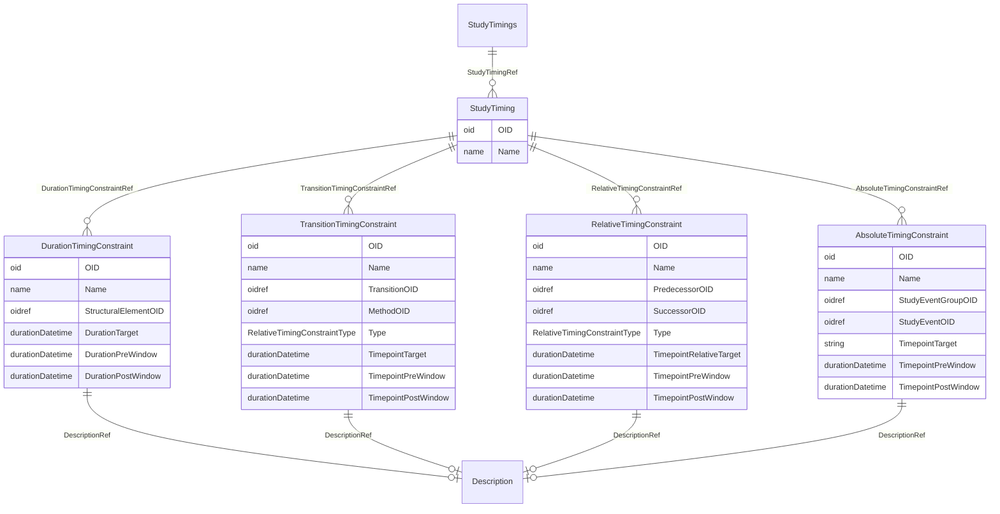

# Class: StudyTimings

_The StudyTimings element is a container element for individual StudyTiming elements._


URI: [odm:StudyTimings](http://www.cdisc.org/ns/odm/v2.0/StudyTimings)





<!-- no inheritance hierarchy -->


## Slots

| Name | Cardinality* and Range | Description | Inheritance |
| ---  | --- | --- | --- |
| [StudyTimingRef](StudyTimingRef.md) | 0..* <br/> [StudyTiming](StudyTiming.md) | StudyTiming reference: The StudyTiming element defines a timing constraint wi... | direct |

_* See [LinkML documentation](https://linkml.io/linkml/schemas/slots.html#slot-cardinality) for cardinality definitions._


## Usages

| used by | used in | type | used |
| ---  | --- | --- | --- |
| [Protocol](Protocol.md) | [StudyTimingsRef](StudyTimingsRef.md) | range | [StudyTimings](StudyTimings.md) |


## See Also

* [https://wiki.cdisc.org/display/PUB/StudyTimings](https://wiki.cdisc.org/display/PUB/StudyTimings)

## Identifier and Mapping Information


### Schema Source


* from schema: http://www.cdisc.org/ns/odm/v2.0


## Mappings

| Mapping Type | Mapped Value |
| ---  | ---  |
| self | odm:StudyTimings |
| native | odm:StudyTimings |


## LinkML Source

<!-- TODO: investigate https://stackoverflow.com/questions/37606292/how-to-create-tabbed-code-blocks-in-mkdocs-or-sphinx -->

### Direct

<details>
```yaml
name: StudyTimings
description: The StudyTimings element is a container element for individual StudyTiming
  elements.
from_schema: http://www.cdisc.org/ns/odm/v2.0
see_also:
- https://wiki.cdisc.org/display/PUB/StudyTimings
rank: 1000
slots:
- StudyTimingRef
slot_usage:
  StudyTimingRef:
    name: StudyTimingRef
    multivalued: true
    domain_of:
    - StudyTimings
    range: StudyTiming
    inlined: true
    inlined_as_list: true
class_uri: odm:StudyTimings

```
</details>

### Induced

<details>
```yaml
name: StudyTimings
description: The StudyTimings element is a container element for individual StudyTiming
  elements.
from_schema: http://www.cdisc.org/ns/odm/v2.0
see_also:
- https://wiki.cdisc.org/display/PUB/StudyTimings
rank: 1000
slot_usage:
  StudyTimingRef:
    name: StudyTimingRef
    multivalued: true
    domain_of:
    - StudyTimings
    range: StudyTiming
    inlined: true
    inlined_as_list: true
attributes:
  StudyTimingRef:
    name: StudyTimingRef
    description: 'StudyTiming reference: The StudyTiming element defines a timing
      constraint within the study, which can be an absolute timing constraint (e.g.,
      start of the screening visit must be between 1 January 2022 and 31 December
      2022), a relative timing constraint (e.g., visit 2 must be within 30 days after
      visit 1 with a window of +/- 1 week), a transition timing constraint (i.e.,
      timing constraint on a transition within a defined workflow), or a duration
      timing constraint (e.g., the duration of visit 2 is planned to take hours with
      a window of 30 minutes).'
    from_schema: http://www.cdisc.org/ns/odm/v2.0
    rank: 1000
    multivalued: true
    identifier: false
    alias: StudyTimingRef
    owner: StudyTimings
    domain_of:
    - StudyTimings
    range: StudyTiming
    inlined: true
    inlined_as_list: true
class_uri: odm:StudyTimings

```
</details>