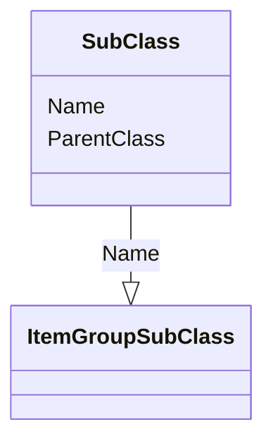

# Class: SubClass


_This element contains SubClass definitions._


URI: [odm:SubClass](http://www.cdisc.org/ns/odm/v2.0/SubClass)





<!-- no inheritance hierarchy -->


## Slots

| Name | Cardinality and Range | Description | Inheritance |
| ---  | --- | --- | --- |
| [Name](Name.md) | 1..1 <br/> [ItemGroupSubClass](ItemGroupSubClass.md) | General observation Sub Class | direct |
| [ParentClass](ParentClass.md) | 0..1 <br/> [ItemGroupClassSubClass](ItemGroupClassSubClass.md) | Parent class of the Sub Class | direct |


## Usages

| used by | used in | type | used |
| ---  | --- | --- | --- |
| [Class](Class.md) | [SubClassRef](SubClassRef.md) | range | [SubClass](SubClass.md) |


## See Also

* [https://wiki.cdisc.org/display/ODM2/SubClass](https://wiki.cdisc.org/display/ODM2/SubClass)

## Identifier and Mapping Information


### Schema Source


* from schema: http://www.cdisc.org/ns/odm/v2.0


## Mappings

| Mapping Type | Mapped Value |
| ---  | ---  |
| self | odm:SubClass |
| native | odm:SubClass |


## LinkML Source

<!-- TODO: investigate https://stackoverflow.com/questions/37606292/how-to-create-tabbed-code-blocks-in-mkdocs-or-sphinx -->

### Direct

<details>
```yaml
name: SubClass
description: This element contains SubClass definitions.
from_schema: http://www.cdisc.org/ns/odm/v2.0
see_also:
- https://wiki.cdisc.org/display/ODM2/SubClass
slots:
- Name
- ParentClass
slot_usage:
  Name:
    name: Name
    domain_of:
    - Alias
    - MetaDataVersion
    - Standard
    - StudyEventGroupDef
    - StudyEventDef
    - ItemGroupDef
    - Class
    - SubClass
    - SourceItem
    - Resource
    - ItemDef
    - CodeList
    - MethodDef
    - Parameter
    - ReturnValue
    - ConditionDef
    - StudyObjective
    - StudyEndPoint
    - StudyTargetPopulation
    - StudyEstimand
    - Arm
    - Epoch
    - StudyTiming
    - TransitionTimingConstraint
    - AbsoluteTimingConstraint
    - RelativeTimingConstraint
    - DurationTimingConstraint
    - WorkflowDef
    - Transition
    - Branching
    - Criterion
    - ExceptionEvent
    - Organization
    - Location
    - Query
    range: ItemGroupSubClass
    required: true
  ParentClass:
    name: ParentClass
    domain_of:
    - SubClass
    range: ItemGroupClassSubClass
class_uri: odm:SubClass

```
</details>

### Induced

<details>
```yaml
name: SubClass
description: This element contains SubClass definitions.
from_schema: http://www.cdisc.org/ns/odm/v2.0
see_also:
- https://wiki.cdisc.org/display/ODM2/SubClass
slot_usage:
  Name:
    name: Name
    domain_of:
    - Alias
    - MetaDataVersion
    - Standard
    - StudyEventGroupDef
    - StudyEventDef
    - ItemGroupDef
    - Class
    - SubClass
    - SourceItem
    - Resource
    - ItemDef
    - CodeList
    - MethodDef
    - Parameter
    - ReturnValue
    - ConditionDef
    - StudyObjective
    - StudyEndPoint
    - StudyTargetPopulation
    - StudyEstimand
    - Arm
    - Epoch
    - StudyTiming
    - TransitionTimingConstraint
    - AbsoluteTimingConstraint
    - RelativeTimingConstraint
    - DurationTimingConstraint
    - WorkflowDef
    - Transition
    - Branching
    - Criterion
    - ExceptionEvent
    - Organization
    - Location
    - Query
    range: ItemGroupSubClass
    required: true
  ParentClass:
    name: ParentClass
    domain_of:
    - SubClass
    range: ItemGroupClassSubClass
attributes:
  Name:
    name: Name
    description: General observation Sub Class.
    from_schema: http://www.cdisc.org/ns/odm/v2.0
    rank: 1000
    alias: Name
    owner: SubClass
    domain_of:
    - Alias
    - MetaDataVersion
    - Standard
    - StudyEventGroupDef
    - StudyEventDef
    - ItemGroupDef
    - Class
    - SubClass
    - SourceItem
    - Resource
    - ItemDef
    - CodeList
    - MethodDef
    - Parameter
    - ReturnValue
    - ConditionDef
    - StudyObjective
    - StudyEndPoint
    - StudyTargetPopulation
    - StudyEstimand
    - Arm
    - Epoch
    - StudyTiming
    - TransitionTimingConstraint
    - AbsoluteTimingConstraint
    - RelativeTimingConstraint
    - DurationTimingConstraint
    - WorkflowDef
    - Transition
    - Branching
    - Criterion
    - ExceptionEvent
    - Organization
    - Location
    - Query
    range: ItemGroupSubClass
    required: true
  ParentClass:
    name: ParentClass
    description: Parent class of the Sub Class
    from_schema: http://www.cdisc.org/ns/odm/v2.0
    rank: 1000
    alias: ParentClass
    owner: SubClass
    domain_of:
    - SubClass
    range: ItemGroupClassSubClass
class_uri: odm:SubClass

```
</details>