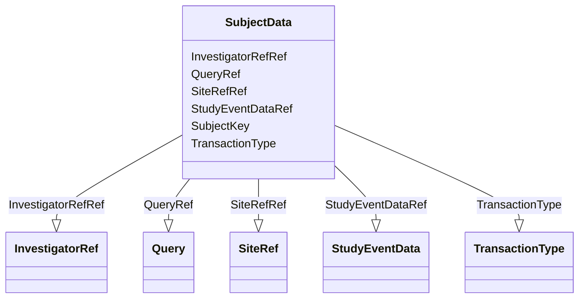

# Class: SubjectData


URI: [odm:SubjectData](http://www.cdisc.org/ns/odm/v2.0/SubjectData)





<!-- no inheritance hierarchy -->


## Slots

| Name | Cardinality and Range | Description | Inheritance |
| ---  | --- | --- | --- |
| [SubjectKey](SubjectKey.md) | 1..1 <br/> [SubjectKey](SubjectKey.md) |  | direct |
| [TransactionType](TransactionType.md) | 0..1 <br/> [TransactionType](TransactionType.md) |  | direct |
| [InvestigatorRefRef](InvestigatorRefRef.md) | 0..1 <br/> [InvestigatorRef](InvestigatorRef.md) |  | direct |
| [SiteRefRef](SiteRefRef.md) | 0..1 <br/> [SiteRef](SiteRef.md) |  | direct |
| [StudyEventDataRef](StudyEventDataRef.md) | 0..* <br/> [StudyEventData](StudyEventData.md) |  | direct |
| [QueryRef](QueryRef.md) | 0..* <br/> [Query](Query.md) |  | direct |


## Usages

| used by | used in | type | used |
| ---  | --- | --- | --- |
| [ClinicalData](ClinicalData.md) | [SubjectDataRef](SubjectDataRef.md) | range | [SubjectData](SubjectData.md) |


## Identifier and Mapping Information


### Schema Source


* from schema: http://www.cdisc.org/ns/odm/v2.0


## Mappings

| Mapping Type | Mapped Value |
| ---  | ---  |
| self | odm:SubjectData |
| native | odm:SubjectData |


## LinkML Source

<!-- TODO: investigate https://stackoverflow.com/questions/37606292/how-to-create-tabbed-code-blocks-in-mkdocs-or-sphinx -->

### Direct

<details>
```yaml
name: SubjectData
from_schema: http://www.cdisc.org/ns/odm/v2.0
slots:
- SubjectKey
- TransactionType
- InvestigatorRefRef
- SiteRefRef
- StudyEventDataRef
- QueryRef
slot_usage:
  SubjectKey:
    name: SubjectKey
    domain_of:
    - SubjectData
    - KeySet
    range: subjectKey
    required: true
  TransactionType:
    name: TransactionType
    domain_of:
    - SubjectData
    - StudyEventData
    - ItemGroupData
    - ItemData
    - Annotation
    range: TransactionType
    required: false
  InvestigatorRefRef:
    name: InvestigatorRefRef
    domain_of:
    - SubjectData
    range: InvestigatorRef
    required: false
    minimum_cardinality: 0
    maximum_cardinality: 1
  SiteRefRef:
    name: SiteRefRef
    domain_of:
    - SubjectData
    range: SiteRef
    required: false
    minimum_cardinality: 0
    maximum_cardinality: 1
  StudyEventDataRef:
    name: StudyEventDataRef
    multivalued: true
    domain_of:
    - SubjectData
    range: StudyEventData
    required: false
    minimum_cardinality: 0
  QueryRef:
    name: QueryRef
    multivalued: true
    domain_of:
    - ClinicalData
    - SubjectData
    - StudyEventData
    - ItemGroupData
    - ItemData
    - Location
    range: Query
    required: false
    minimum_cardinality: 0
class_uri: odm:SubjectData

```
</details>

### Induced

<details>
```yaml
name: SubjectData
from_schema: http://www.cdisc.org/ns/odm/v2.0
slot_usage:
  SubjectKey:
    name: SubjectKey
    domain_of:
    - SubjectData
    - KeySet
    range: subjectKey
    required: true
  TransactionType:
    name: TransactionType
    domain_of:
    - SubjectData
    - StudyEventData
    - ItemGroupData
    - ItemData
    - Annotation
    range: TransactionType
    required: false
  InvestigatorRefRef:
    name: InvestigatorRefRef
    domain_of:
    - SubjectData
    range: InvestigatorRef
    required: false
    minimum_cardinality: 0
    maximum_cardinality: 1
  SiteRefRef:
    name: SiteRefRef
    domain_of:
    - SubjectData
    range: SiteRef
    required: false
    minimum_cardinality: 0
    maximum_cardinality: 1
  StudyEventDataRef:
    name: StudyEventDataRef
    multivalued: true
    domain_of:
    - SubjectData
    range: StudyEventData
    required: false
    minimum_cardinality: 0
  QueryRef:
    name: QueryRef
    multivalued: true
    domain_of:
    - ClinicalData
    - SubjectData
    - StudyEventData
    - ItemGroupData
    - ItemData
    - Location
    range: Query
    required: false
    minimum_cardinality: 0
attributes:
  SubjectKey:
    name: SubjectKey
    from_schema: http://www.cdisc.org/ns/odm/v2.0
    rank: 1000
    alias: SubjectKey
    owner: SubjectData
    domain_of:
    - SubjectData
    - KeySet
    range: subjectKey
    required: true
  TransactionType:
    name: TransactionType
    from_schema: http://www.cdisc.org/ns/odm/v2.0
    rank: 1000
    alias: TransactionType
    owner: SubjectData
    domain_of:
    - SubjectData
    - StudyEventData
    - ItemGroupData
    - ItemData
    - Annotation
    range: TransactionType
    required: false
  InvestigatorRefRef:
    name: InvestigatorRefRef
    from_schema: http://www.cdisc.org/ns/odm/v2.0
    rank: 1000
    alias: InvestigatorRefRef
    owner: SubjectData
    domain_of:
    - SubjectData
    range: InvestigatorRef
    required: false
    minimum_cardinality: 0
    maximum_cardinality: 1
  SiteRefRef:
    name: SiteRefRef
    from_schema: http://www.cdisc.org/ns/odm/v2.0
    rank: 1000
    alias: SiteRefRef
    owner: SubjectData
    domain_of:
    - SubjectData
    range: SiteRef
    required: false
    minimum_cardinality: 0
    maximum_cardinality: 1
  StudyEventDataRef:
    name: StudyEventDataRef
    from_schema: http://www.cdisc.org/ns/odm/v2.0
    rank: 1000
    multivalued: true
    alias: StudyEventDataRef
    owner: SubjectData
    domain_of:
    - SubjectData
    range: StudyEventData
    required: false
    minimum_cardinality: 0
  QueryRef:
    name: QueryRef
    from_schema: http://www.cdisc.org/ns/odm/v2.0
    rank: 1000
    multivalued: true
    alias: QueryRef
    owner: SubjectData
    domain_of:
    - ClinicalData
    - SubjectData
    - StudyEventData
    - ItemGroupData
    - ItemData
    - Location
    range: Query
    required: false
    minimum_cardinality: 0
class_uri: odm:SubjectData

```
</details>